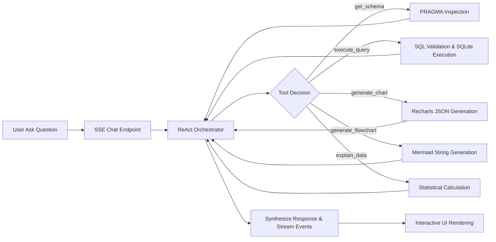
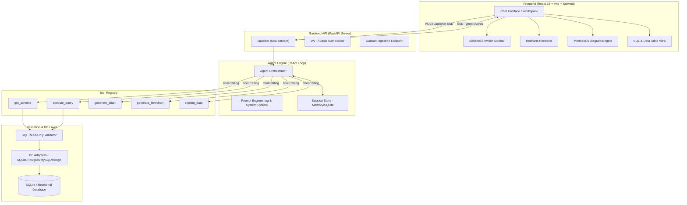
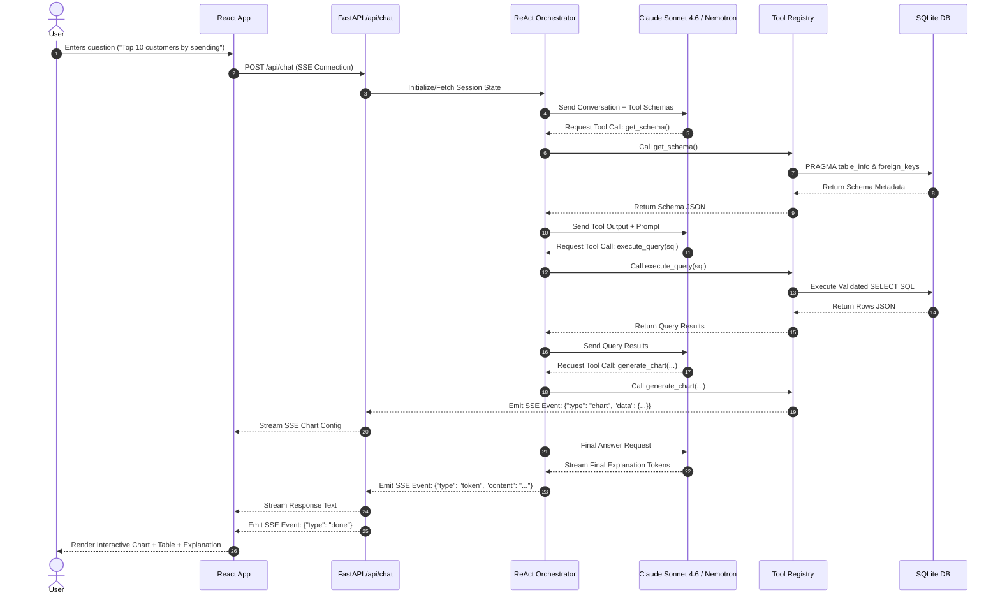
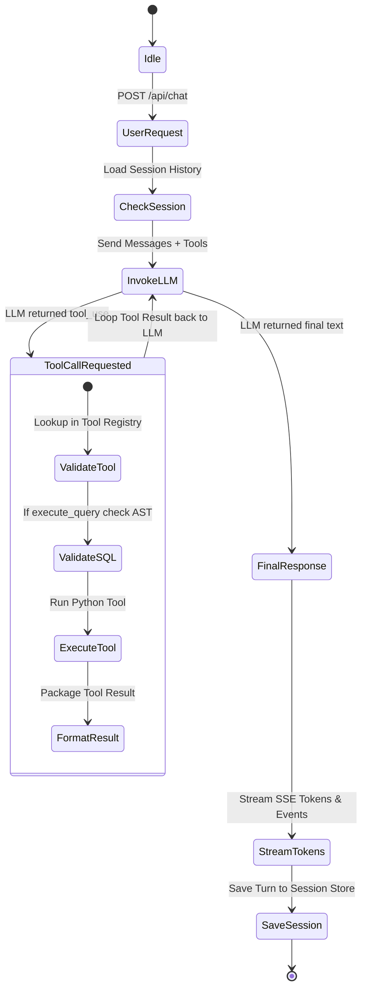

# 🧠 QueryMind 💬 — Conversational Database Intelligence Platform 📊⚡

> **Sairam Hackathon 2026 Submission** | Team Name : **VibeSync Macros** | Team Lead: **Vishal L.** | Team Members: **Sneha C.**, **Meenakshi A.P.**

[](https://fastapi.tiangolo.com/)
[](https://react.dev/)
[](https://www.anthropic.com/)
[](https://www.sqlite.org/)
[](https://www.docker.com/)

---

### 🌐 Live Deployment Links

| Service | Environment | Live URL | Hosting Platform |
|---|---|---|---|
| 🎨 **Frontend Workspace** | Production | [https://query-mind-ai-seven.vercel.app](https://query-mind-ai-seven.vercel.app) | **Vercel** |
| ⚡ **Backend API Service** | Production | [https://query-mind-82zr.onrender.com](https://query-mind-82zr.onrender.com) | **Render** |
| 🩺 **Backend Health Check** | Production | [https://query-mind-82zr.onrender.com/api/health](https://query-mind-82zr.onrender.com/api/health) | **Render** |
| 📚 **Swagger API Docs** | Production | [https://query-mind-82zr.onrender.com/docs](https://query-mind-82zr.onrender.com/docs) | **FastAPI** |

---

### 🏷️ Tech Stack & Keywords


**QueryMind** is an enterprise-grade, conversational database analytics and intelligence platform. It converts natural-language business questions into validated, safe, read-only SQL queries, streams step-by-step reasoning via Server-Sent Events (SSE), dynamically generates 12+ interactive chart types, auto-renders Mermaid ER diagrams and flowcharts, and provides grounded dataset statistical explanations.

---

## 📋 Table of Contents

- [The Problem](#-the-problem)
- [The Idea](#-the-idea)
- [Why QueryMind?](#-why-querymind)
- [Datasets Used in Project](#-datasets-used-in-project)
- [How QueryMind Works](#-how-querymind-works)
- [Key Features](#-key-features)
- [Conversational Database Agent](#-conversational-database-agent)
- [Agent Tools](#-agent-tools)
- [Database Intelligence & Safety](#-database-intelligence--safety)
- [Interactive Visualizations & Light/Dark Mode](#-interactive-visualizations--lightdark-mode)
- [Automated Diagrams](#-automated-diagrams)
- [SQL Transparency](#-sql-transparency)
- [Agent Execution & Tool Progress](#-agent-execution--tool-progress)
- [Architecture](#-architecture)
- [Data Flow](#-data-flow)
- [Agent Workflow](#-agent-workflow)
- [Technical Architecture & Stack](#-technical-architecture--stack)
- [AI Models & Provider Failover](#-ai-models--provider-failover)
- [Prompts & AI Techniques](#-prompts--ai-techniques)
- [Example Queries & Capabilities](#-example-queries--capabilities)
- [User Journey](#-user-journey)
- [UI/UX Design Philosophy & Stitch Design System](#-uiux-design-philosophy--stitch-design-system)
- [Project Structure](#-project-structure)
- [Installation & Quick Start](#-installation--quick-start)
- [Environment Variables](#-environment-variables)
- [Database Setup & Ingestion](#-database-setup--ingestion)
- [Running QueryMind](#-running-querymind)
- [Testing Suite](#-testing-suite)
- [Deployment Guide](#-deployment-guide)
- [Team & Acknowledgments](#-team--acknowledgments)

---

## ❓ The Problem

In modern data-driven organizations, accessing relational databases requires specialized SQL skills. Non-technical stakeholders, product managers, and executives rely heavily on data engineering teams to execute queries, build dashboards, or interpret schemas. This creates severe bottlenecks:

1. **Slow Insights Cycle**: Writing, testing, and formatting custom SQL reports often takes hours or days.
2. **Brittle Text-to-SQL Tools**: Primitive Text-to-SQL models generate invalid, hallucinated, or unoptimized queries that crash or return misleading results.
3. **Security & Mutation Risks**: Direct AI interaction with production databases can inadvertently perform destructive `DROP`, `UPDATE`, or `DELETE` operations.
4. **Lack of Transparency**: Users are presented with static numbers without seeing the underlying query, building zero trust in AI-generated findings.
5. **Static Visualizations**: Standard reporting tools render static charts that cannot be dynamically morphed into alternative formats (e.g. from bar to donut, treemap, or scatter plot) on the fly.

---

## 💡 The Idea

**QueryMind** bridges the gap between plain human curiosity and complex relational databases. By combining a multi-tool **ReAct (Reason + Act)** autonomous agent loop with strict read-only database validators, QueryMind allows users to simply converse with their database in plain natural language.

Instead of outputting raw SQL text alone, QueryMind orchestrates an end-to-end data pipeline:
- **Discovers schema topology** dynamically via PRAGMA introspection.
- **Generates & validates safe SQL** before execution.
- **Executes queries asynchronously** and streams execution events in real time.
- **Transforms tabular output into rich Recharts visual configs** and **Mermaid diagrams**.
- **Generates grounded natural-language explanations** derived from actual statistical metrics.

---

## 🚀 Why QueryMind?

| **Feature** | **Legacy Text-to-SQL** | **QueryMind** |
|---|---|---|
| **Architecture** | Single-prompt completion | Autonomous ReAct Multi-Tool Agent |
| **Streaming** | Raw text streaming | Real-Time Typed SSE Event Stream (`token`, `sql`, `chart`, `diagram`, `tool_start`, `tool_end`) |
| **SQL Safety** | None / basic regex | Multi-layer AST validator, SELECT-only enforcement, auto row caps (`LIMIT 100`) |
| **Visualizations** | None or static tables | 12+ dynamic Recharts formats + instant toolbar visualization morphing |
| **Diagramming** | Not supported | Automatic Mermaid ER diagram & process flowchart generation |
| **Database Support** | Single DB | Multi-Database Engine (SQLite, PostgreSQL, MySQL, MongoDB adapters) |
| **Provider Resilience** | Single API dependency | Dual-provider support (Anthropic Claude + NVIDIA Nemotron / OpenAI failover + keyless demo mode) |

---

## 💾 Datasets Used in Project

QueryMind comes pre-seeded with rich, real-world multi-domain datasets sourced from Kaggle (`database/seed_kaggle_data.py`), enabling complex join queries, multi-table aggregations, and deep statistical analysis:

1. **Retail Orders ETL Pipeline Dataset** ([`ajmalkhann/retail-orders-dataset-etl-pipeline`](https://www.kaggle.com/datasets/ajmalkhann/retail-orders-dataset-etl-pipeline))
   - **`customers`**: Customer profiles, demographics, cities, signup dates, and contact references.
   - **`products`**: Product catalog detailing brand names, categories, sub-categories, and MRP.
   - **`orders`**: Historical customer order transactions, timestamps, payment methods, order statuses, and total order amounts.
   - **`order_items`**: Granular line-item breakdown of individual products per order, unit prices, quantities, and net amounts.

2. **Online Retail II Multi-Nation Dataset** ([`lakshmi25npathi/online-retail-dataset`](https://www.kaggle.com/datasets/lakshmi25npathi/online-retail-dataset))
   - **`online_retail_transactions`**: 50,000+ real-world international e-commerce invoice transactions capturing quantity, unit price, stock codes, country distributions, and timestamps.

3. **Walmart / Retail Chain Dataset** ([`manjeetsingh/retaildataset`](https://www.kaggle.com/datasets/manjeetsingh/retaildataset))
   - **`retail_stores`**: Department store structural metadata, store types, and physical size metrics.
   - **`retail_sales`**: Weekly department sales figures across multi-region retail stores.
   - **`retail_features`**: Regional economic and environmental indicators (Temperature, Fuel Price, Consumer Price Index - CPI, Unemployment Rate, and Markdown events).

---

## 🔄 How QueryMind Works

The end-to-end user journey follows a deterministic, agentic workflow:



---

## ✨ Key Features

- **Natural Language to SQL**: Converts complex multi-table analytical questions into optimal SQL.
- **Real-Time SSE Event Streaming**: Transparent step-by-step agent trace output with immediate token streaming.
- **12+ Interactive Visualization Types**: Instant morphing between Bar, Horizontal Bar, Line, Area, Pie/Donut, Scatter, Treemap, Box Plot, Heatmap, and more.
- **Automated Diagram Rendering**: Direct generation of system entity-relationship (ER) diagrams and business process flowcharts.
- **Live Schema Inspector**: Collapsible interactive sidebar for browsing database tables, columns, data types, primary keys, and foreign keys.
- **Dataset Ingestion Engine**: Built-in support for uploading custom ZIP/CSV files and Kaggle datasets.
- **SQL Transparency Badge**: Copyable, syntax-highlighted SQL query display for complete auditability.
- **Export & Report Generation**: 1-click CSV export and visualization PNG screenshot downloads.

---

## 🤖 Conversational Database Agent

QueryMind's core intelligence is driven by an autonomous **ReAct Agent** implemented in `backend/agent/orchestrator.py`. The agent maintains conversational state, inspects tools, decides execution paths, handles errors gracefully, and iterates up to a configurable maximum tool limit (`MAX_TOOL_ITERATIONS = 8`).

### Core Agent Capabilities:
1. **Multi-Turn Context**: Preserves query history and session context using an extensible session store (In-Memory or SQLite-backed).
2. **Schema-Aware Reasoning**: Always checks schema definitions via `get_schema` prior to generating SQL queries to avoid column name hallucinations.
3. **Self-Correction & Error Recovery**: If SQLite returns a syntax error, the agent catches the exception, analyzes the error message, adjusts the SQL syntax, and re-executes.

---

## 🛠 Agent Tools

QueryMind equips the agent with 5 specialized, single-responsibility tools registered in `backend/tools/`:

### 1. `get_schema` (`backend/tools/get_schema.py`)
- **Purpose**: Dynamically inspects database structure and schema metadata.
- **Input**: Optional list of specific table names.
- **Processing**: Executes PRAGMA table information, foreign key lists, and row count queries.
- **Output**: Returns JSON containing table names, columns, data types, primary keys, foreign keys, and total row counts.

### 2. `execute_query` (`backend/tools/execute_query.py`)
- **Purpose**: Executes validated SQL queries safely against the database.
- **Input**: `sql` (string query).
- **Processing**: Passes SQL through `backend/db/validator.py` to enforce SELECT-only rules, prevent destructive keywords (`DROP`, `DELETE`, `INSERT`, `UPDATE`), and enforce `LIMIT 100` caps.
- **Output**: Returns JSON with column headers, row data tuples, total row count, and execution time.

### 3. `generate_chart` (`backend/tools/generate_chart.py`)
- **Purpose**: Transforms structured query result sets into frontend visualization configs.
- **Input**: `chart_type` (`bar`, `line`, `pie`, `scatter`, `area`, `treemap`, `boxplot`, `heatmap`), `title`, `x_key`, `y_keys`, `data`.
- **Processing**: Validates data structure, formats color palettes, and structures Recharts JSON payloads.
- **Output**: Returns a complete Recharts specification object emitted via SSE `chart` event.

### 4. `generate_flowchart` (`backend/tools/generate_flowchart.py`)
- **Purpose**: Auto-generates diagrammatic representations of schema relationships or process workflows.
- **Input**: `diagram_type` (`erDiagram`, `flowchart`), `title`, `definition`.
- **Processing**: Formats valid Mermaid syntax string.
- **Output**: Emits SSE `diagram` event for live client-side Mermaid.js rendering.

### 5. `explain_data` (`backend/tools/explain_data.py`)
- **Purpose**: Performs statistical analysis over result sets to ground narrative explanations.
- **Input**: Dataset arrays and target numerical columns.
- **Processing**: Computes sum, mean, median, min, max, variance, and top percentile distributions.
- **Output**: Returns exact numerical metrics ensuring the LLM explanation matches ground-truth data.

---

## 🛡 Database Intelligence & Safety

Security and safety are built directly into QueryMind's database layer (`backend/db/`):

- **Read-Only Enforcement**: Query validator (`backend/db/validator.py`) parses SQL queries and blocks any non-SELECT statements.
- **Destructive Keyword Blacklist**: Rejects statements containing `ALTER`, `CREATE`, `DROP`, `DELETE`, `INSERT`, `UPDATE`, `TRUNCATE`, `EXEC`, `GRANT`, `PRAGMA`.
- **Automatic Row Capping**: Automatically appends `LIMIT 100` if no `LIMIT` clause is specified by the LLM, preventing buffer overflows and high latency.
- **Multi-Database Abstraction**: Built on an adapter pattern (`backend/db/adapters/`) supporting **SQLite**, **PostgreSQL** (`asyncpg`), **MySQL** (`aiomysql`), and **MongoDB** (`motor`).

---

## 📊 Interactive Visualizations & Light/Dark Mode

QueryMind provides a high-performance visualization workspace where users can inspect data visually and seamlessly switch between different chart formats using the dynamic chart toolbar. 

### ☀️ Light Mode & 🌙 Dark Mode Support
The frontend was designed and prototyped using **Google Stitch Design System** (located in `frontend-ref/stitch_flux_database_intelligence/`) with full dual-theme support (**Light Mode** ☀️ and **Dark Mode** 🌙). Users can toggle themes on the fly for optimal readability across any ambient lighting condition.


*QueryMind Workspace Landing Page: Designed in Google Stitch with seamless Light Mode ☀️ and Dark Mode 🌙 theme toggling, interactive chat interface, live Schema Browser sidebar, and query history panel.*


*Dataset Ingestion Modal: Upload local CSV/ZIP files or import directly via Kaggle code/URL.*

---

### 📈 Comprehensive Visualization Gallery

All chart formats below were generated from a single natural-language query (*"Top 10 Customers by Total Spending"*) and demonstrate QueryMind's real-time chart morphing capabilities:

| Visualization Format | Screenshot Demonstration | Description & Purpose |
|---|---|---|
| **Bar Chart** |  | Vertical bar comparison of discrete customer spending metrics. |
| **Horizontal Bar Chart** |  | Ideal for reading long customer names and comparing ranking values. |
| **Line Chart** |  | Line plot displaying customer spending trends and inflection points. |
| **Pie / Donut Chart** |  | Highlighting proportional percentage share of top spenders. |
| **Pie Chart with Legend** |  | Detailed legend breaking down color-coded customer distributions. |
| **Pie Chart + Data Table** |  | Side-by-side view combining visual distribution with raw SQL row results. |
| **Scatter Plot** |  | Correlation analysis mapping customer distribution points. |
| **Area Chart (Gradient Blue)** |  | Filled gradient area plot emphasizing cumulative volume. |
| **Area Chart (Warm Tan)** |  | Warm color scheme variant for customized visual presentation. |
| **Treemap Chart** |  | Hierarchical rectangular tiles scaled proportionally by revenue contribution. |
| **Box Plot Chart** |  | Statistical distribution showing spending minimum, median, and maximum values. |
| **Heatmap / Grid Chart** |  | Matrix grid view color-coding value intensity across records. |

---

## 🧩 Automated Diagrams

QueryMind natively generates and renders Mermaid.js diagrams directly within the chat interface:

- **Entity-Relationship (ER) Diagrams**: Derived automatically via database schema foreign key inspection.
- **Business Process Flowcharts**: Auto-generated when users ask procedural or architectural questions.

---

## 🔍 SQL Transparency

QueryMind promotes trust through complete query auditability:
- **Collapsible SQL Panel**: Every answer powered by data includes a copyable SQL badge.
- **SQL Inspection**: Users can inspect the exact `SELECT` query produced by the LLM.
- **One-Click Copy**: Copies the generated SQL query directly to the clipboard for execution in external DB tools.

---

## ⚙️ Agent Execution & Tool Progress

During query execution, QueryMind streams real-time agent status badges (`tool_start`, `tool_end`) to give users complete visibility into the AI's reasoning steps:
1. `⚙️ Calling tool: get_schema`
2. `⚙️ Calling tool: execute_query`
3. `⚙️ Calling tool: generate_chart`
4. `Done` — Response finalization

---

## 🏗 Architecture



---

## 🌊 Data Flow



---

## 🧬 Agent Workflow



---

## 💻 Technical Architecture & Stack

### Frontend Stack
- **Framework**: React 18, TypeScript, Vite
- **Styling**: Tailwind CSS, Container Queries, Forms Plugin
- **Charts**: Recharts (`^3.10.1`)
- **Diagrams**: Mermaid.js (`^11.16.1`)
- **Icons & Markdown**: Lucide React, `react-markdown`, `remark-gfm`
- **Exporting**: `html2canvas`, `jspdf`

### Backend Stack
- **Framework**: FastAPI (`>=0.100.0`), Uvicorn
- **Language**: Python 3.11
- **Async DB Engine**: `aiosqlite`
- **Validation & Schemas**: Pydantic v2
- **Multi-DB Drivers**: `asyncpg`, `aiomysql`, `motor`
- **Session Storage**: In-Memory or Redis / SQLite persistent session store

---

## 🧠 AI Models & Provider Failover

QueryMind features flexible multi-provider LLM orchestration (`backend/agent/orchestrator.py`):

1. **Primary Model**: **Anthropic Claude Sonnet 4.6** (`claude-sonnet-4-6`) via `anthropic.AsyncAnthropic` using native Messages API tool calling.
2. **Failover / Open Model**: **NVIDIA Nemotron 70B Instruct** (`nvidia/llama-3.1-nemotron-70b-instruct`) via `openai.AsyncOpenAI` API compatibility layer.
3. **Offline Keyless Demo Mode**: Enabled via `OFFLINE_DEMO_MODE=true` in `.env`. Generates deterministic mock responses and tool calls for instant evaluation without an API key.

---

## 🎯 Prompts & AI Techniques

QueryMind incorporates advanced prompt engineering and agentic patterns (`backend/agent/prompt.py`):

- **System Prompt Grounding**: Forces the LLM to inspect schema before crafting SQL.
- **ReAct Function Calling**: Autonomous loop separating reasoning from tool execution.
- **Structured JSON Output**: Guarantees chart configurations strictly adhere to frontend contracts.
- **Deterministic Few-Shot Examples**: Instructs the LLM on handling complex SQLite join conditions and date manipulations.

---

## 💡 Example Queries & Capabilities

| User Query | Agent Execution Path | Generated Output |
|---|---|---|
| *"What tables exist in this database?"* | `get_schema()` | Live schema overview listing all tables, columns, and foreign keys. |
| *"Show top 10 customers by total spending"* | `get_schema` → `execute_query` → `generate_chart` | SELECT query join, Bar/Pie chart visual, and top spenders data table. |
| *"Show customer spending distribution"* | `execute_query` → `generate_chart` (`boxplot`) | Box Plot chart displaying spending min, median, max, and quantiles. |
| *"Draw an ER diagram of the database"* | `get_schema` → `generate_flowchart` | Rendered Mermaid.js entity-relationship diagram with foreign key links. |
| *"Explain sales summary statistically"* | `execute_query` → `explain_data` | Statistical metrics breakdown (mean, variance, percentiles) + grounded explanation. |

---

## 👤 User Journey

1. **Landing & Schema Discovery**: User opens QueryMind workspace (`http://localhost:3000`). The left sidebar populates with database tables via auto-triggered `get_schema`.
2. **Dataset Import (Optional)**: User clicks "Add Dataset" to upload a custom CSV/ZIP file or Kaggle dataset URL.
3. **Conversational Querying**: User types a natural-language question into the chat console.
4. **Transparent Agent Execution**: Agent status badges show tools executing in real time.
5. **Multi-Modal Response**: The UI renders formatted text, copyable SQL badge, interactive Recharts visualization, and raw data table.
6. **Chart Morphing**: User selects different chart types from the toolbar (e.g. converting a Bar chart to a Treemap or Heatmap) instantly.
7. **Exporting**: User exports visual charts as PNG images or raw datasets as CSV files.

---

## 🎨 UI/UX Design Philosophy & Stitch Design System

QueryMind's UI/UX was custom designed and prototyped using **Google Stitch** (`frontend-ref/stitch_flux_database_intelligence/`) — a high-fidelity design framework for database intelligence and AI applications.

- **Dual-Theme Support (Light & Dark Mode)**: Built with class-based Tailwind CSS theme switching (`light` ☀️ / `dark` 🌙), enabling crisp contrast in both dark obsidian work environments and clean light editorial environments.
- **Theme Palette**: Deep dark Slate/Zinc background (`#0B0F17`) in dark mode, paired with clean slate neutrals (`#F8FAFC`) in light mode, accented with vibrant Indigo, Cyan, and Amber highlights.
- **Glassmorphism & Cards**: Translucent glass-card styling for chat bubbles and tool execution traces.
- **Density & Responsiveness**: Flexible grid layouts adjusting seamlessly across desktop and container query viewports.
- **Micro-Interactions**: Hover states, smooth transition animations, and loading skeletons during SSE token streaming.

---

## 📁 Project Structure

```
sairam-hackathon-2026/
├── AGENTS.md                   # Hackathon guidelines & project architecture reference
├── README.md                   # Production documentation
├── docker-compose.yml          # Multi-container orchestrator
├── .env.example                # Environment variable template
├── backend/                    # FastAPI Backend Application
│   ├── main.py                 # Application entrypoint & CORS config
│   ├── requirements.txt        # Python dependency manifest
│   ├── Dockerfile              # Backend container build instructions
│   ├── agent/                  # Agent Core Engine
│   │   ├── orchestrator.py     # ReAct loop & LLM provider failover
│   │   ├── prompt.py           # System prompts & tool grounding
│   │   ├── session.py          # Session context manager
│   │   └── tool_registry.py    # Tool schemas & execution dispatch
│   ├── api/                    # REST & SSE API Routes
│   │   ├── auth.py             # JWT / Basic authentication
│   │   ├── router.py           # API endpoints (/api/chat, /api/schema, etc.)
│   │   └── schemas.py          # Pydantic data models
│   ├── db/                     # Database Access Layer
│   │   ├── connection.py       # SQLite connection manager
│   │   ├── validator.py        # Read-only SQL validator & parser
│   │   └── adapters/           # DB Adapters (SQLite, Postgres, MySQL, Mongo)
│   ├── tools/                  # Registered Agent Tools
│   │   ├── execute_query.py    # Safe SQL query execution
│   │   ├── explain_data.py     # Statistical dataset analyzer
│   │   ├── generate_chart.py   # Recharts JSON generator
│   │   ├── generate_flowchart.py # Mermaid diagram generator
│   │   ├── get_schema.py       # PRAGMA schema inspector
│   │   └── ingest_dataset.py   # Dataset uploader
│   └── tests/                  # Backend Pytest Suite
├── frontend/                   # React 18 TypeScript Frontend Application
│   ├── index.html              # HTML entrypoint
│   ├── package.json            # Node dependencies & build scripts
│   ├── vite.config.ts          # Vite build & proxy configuration
│   ├── tailwind.config.js      # Tailwind CSS theme configuration
│   └── src/                    # React Source Code
│       ├── App.tsx             # Main layout & view manager
│       ├── components/         # Modular UI Components (Charts, Chat, Schema)
│       └── services/           # SSE Stream & API Service Clients
├── database/                   # SQLite Database & Seeding Scripts
│   ├── ecommerce.sqlite        # Pre-seeded E-commerce SQLite database
│   └── schema.sql              # Database schema definitions
├── screenshots/                # Application Screenshots & Visual Proofs
└── k8s/                        # Kubernetes Deployment Manifests
```

---

## ⚡ Installation & Quick Start

### Prerequisites
- **Python**: 3.11 or higher
- **Node.js**: 18.0 or higher
- **Docker & Docker Compose** (Optional, for containerized run)

---

## 🔑 Environment Variables

Copy `.env.example` to `.env` in the root directory:

```bash
cp .env.example .env
```

| Variable | Required | Default Value | Purpose |
|---|---|---|---|
| `ANTHROPIC_API_KEY` | Optional* | `your_anthropic_api_key_here` | Key for Anthropic Claude Sonnet 4.6 (*not needed if `OFFLINE_DEMO_MODE=true`). |
| `ANTHROPIC_MODEL` | No | `claude-sonnet-4-6` | Model identifier for Anthropic API. |
| `OFFLINE_DEMO_MODE` | No | `false` | Set to `true` for deterministic keyless execution. |
| `DB_TYPE` | No | `sqlite` | Primary database driver (`sqlite`, `postgresql`, `mysql`, `mongodb`). |
| `DATABASE_PATH` | No | `/app/database/ecommerce.sqlite` | Absolute or relative path to SQLite database file. |
| `SESSION_BACKEND` | No | `memory` | Session storage engine (`memory` or `sqlite`). |
| `CORS_ORIGIN` | No | `http://localhost:3000,http://localhost:5173` | Allowed CORS origins for API requests. |
| `AUTH_ENABLED` | No | `false` | Set `true` to require JWT / Basic auth. |

---

## 🗄 Database Setup & Ingestion

QueryMind ships with a pre-seeded SQLite database at `database/ecommerce.sqlite`.

To re-seed or reset the database:
```bash
python database/seed_kaggle_data.py
```

To inspect table structures manually:
```bash
python database/inspect_db.py
```

---

## 🏃 Running QueryMind

### Option 1: Docker Compose (Recommended)

Start the entire application (Backend + Frontend) in one command:

```bash
docker-compose up --build
```
- **Frontend Workspace**: `http://localhost:3000`
- **Backend Health Check**: `http://localhost:8000/api/health`

---

### Option 2: Local Development Setup

#### 1. Start Backend Server
```bash
cd backend
python -m venv venv

# Windows:
venv\Scripts\activate
# Linux/macOS:
source venv/bin/activate

pip install -r requirements.txt
uvicorn main:app --reload --port 8000
```

#### 2. Start Frontend Server (In a new terminal)
```bash
cd frontend
npm install
npm run dev
```
Open your browser and navigate to `http://localhost:5173`.

---

## 🧪 Testing Suite

QueryMind includes test suites for both backend and frontend components.

### Backend Tests (Pytest)
```bash
cd backend
python -m pytest
```

### Frontend Tests (Vitest)
```bash
cd frontend
npm run test
```

---

## ☁️ Deployment Guide

### Kubernetes Deployment

Kubernetes manifests are provided in `k8s/`:

```bash
# 1. Build Docker images
docker-compose -f docker-compose.yml build

# 2. Apply Kubernetes manifests
kubectl apply -k k8s/

# 3. Port forward services for local verification
kubectl port-forward -n dataflow svc/dataflow-frontend 3000:80
kubectl port-forward -n dataflow svc/dataflow-backend 8000:8000
```

---

## 👥 Team & Acknowledgments

**QueryMind** was designed, built, and submitted for the **Sairam Hackathon 2026** by:

- **Vishal L.** — Team Lead / Systems Architect & Agent Orchestration
- **Sneha C.** — Full-Stack Developer / React Frontend & Visualization Engineering
- **Meenakshi A.P.** — Database Architect / Multi-DB Adapters & SQL Validation

---
*QueryMind — Conversational Database Intelligence Platform*
