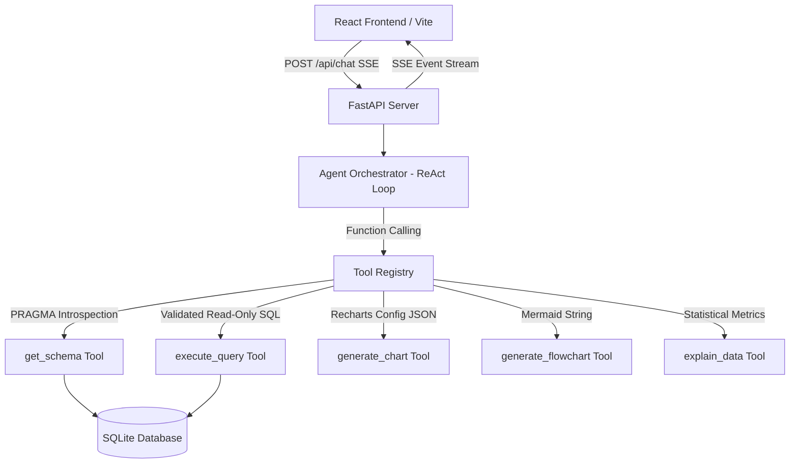

# DataFlow AI — Conversational Database Analytics

> iTech AI Innovation Hackathon 2026 Submission

DataFlow AI is a production-grade, conversational database analytics application that turns natural language questions into validated SQL, real-time insights, interactive charts, and Mermaid diagrams over SQLite database tables.

---

## 🌟 Key Features

- **Natural Language to SQL:** Conversational query interface with built-in read-only SQL validation and automatic row limits.
- **Real-Time SSE Streaming:** Token-by-token text streaming with typed events (`token`, `sql`, `chart`, `diagram`, `tool_start`, `tool_end`, `done`, `error`).
- **Interactive Data Visualizations:** Recharts integration supporting **Bar**, **Line**, **Pie**, and **Scatter** chart types rendered directly in chat bubbles.
- **Automated Diagram Generation:** Auto-generates Mermaid ER diagrams directly from PRAGMA schema introspection alongside custom process flowcharts.
- **SQL Transparency Badge:** Collapsible SQL inspection panel with 1-click SQL copy for complete query transparency.
- **Export & Persistence:** Export visualizations as PNG images and datasets as CSV files. Query history persisted in `localStorage`.
- **Live Database Inspector:** Real-time schema preview panel with dynamic table, column, and foreign key inspection.

---

## 🛠 Tech Stack

- **Backend:** FastAPI, Python 3.11, Anthropic Claude SDK (`claude-3-5-sonnet-20241022`), `aiosqlite`, `pydantic`
- **Frontend:** React 18, TypeScript, Vite, Tailwind CSS, Recharts, Mermaid.js, `react-markdown`, `html2canvas`
- **Database:** SQLite (`database/ecommerce.sqlite`)
- **Containerization:** Docker, Docker Compose, Nginx

---

## 🏗 Architecture Overview



---

## 🔌 Registered Tool Specifications

1. `get_schema`: Inspects database structure via PRAGMA commands, returning table names, columns, types, primary keys, foreign keys, and row counts.
2. `execute_query`: Validates SELECT-only SQL queries, enforces safety keywords, applies row caps (`LIMIT 100`), and executes read queries asynchronously against SQLite.
3. `generate_chart`: Constructs structured JSON configurations for frontend Recharts rendering (`bar`, `line`, `pie`, `scatter`).
4. `generate_flowchart`: Auto-generates Mermaid code for ER diagrams from schema data or user-specified process flowcharts.
5. `explain_data`: Calculates local statistical metrics (totals, averages, ranges) to ground narrative explanations in exact dataset numbers.

---

## 🚀 Quick Start Instructions

### Prerequisites
- Python 3.11+
- Node.js 18+
- Docker & Docker Compose (Optional)

### Option A: Docker Compose (Recommended)

```bash
# 1. Clone repository
git clone https://github.com/your-team/dataflow-ai.git
cd sairam-hackathon-2026

# 2. Copy environment file and configure API Key
cp backend/.env.example backend/.env
# Add your ANTHROPIC_API_KEY to backend/.env

# 3. Start full stack with Docker Compose
docker-compose up --build
```
Access the application at:
- **Frontend UI:** `http://localhost:80` or `http://localhost:5173`
- **Backend API:** `http://localhost:8000/api/health`

---

### Option B: Local Development Setup

#### Backend Setup:
```bash
cd backend
python -m venv venv
# On Windows:
venv\Scripts\activate
# On Linux/macOS:
source venv/bin/activate

pip install -r requirements.txt
cp .env.example .env
# Edit .env to supply your ANTHROPIC_API_KEY

uvicorn main:app --reload --port 8000
```

#### Frontend Setup:
```bash
cd frontend
npm install
npm run dev
```
Open `http://localhost:5173` in your browser.

---

## 🧪 Running Automated Unit Tests

```bash
cd backend
python -m pytest
```

---

## 📜 Demo Use Case Scenarios

1. **Revenue & Category Comparison:**
   - Query: *"Show me top 5 products by price as a bar chart"*
   - Result: Agent executes `get_schema` → `execute_query` → `generate_chart` and streams an interactive bar chart with business summary.

2. **Schema & Entity Relationship Exploration:**
   - Query: *"Draw an ER diagram for the database tables"*
   - Result: Agent runs `get_schema` → `generate_flowchart` and streams a rendered Mermaid ER diagram showing table structures and foreign key relationships.

3. **Order & Inventory Analysis:**
   - Query: *"Show customer order distribution as a pie chart"*
   - Result: Agent retrieves order aggregations, generates a pie chart visualization, and provides statistical summaries.

---

## 👥 Authors & License

Created for **iTech AI Innovation Hackathon 2026**.
License: MIT
