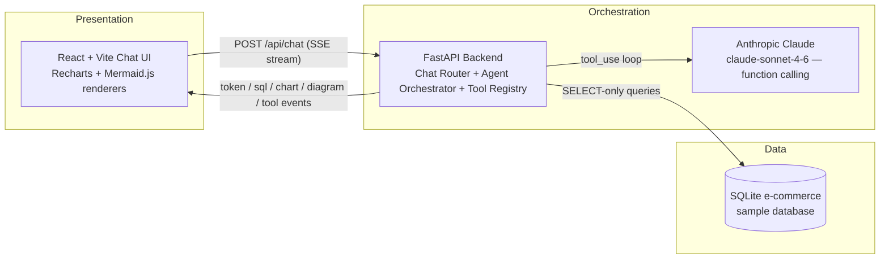

# 00 — Project Overview: DataFlow AI

**Document Class**: Architecture Repository — Foundation Document
**Project**: DataFlow AI — Conversational Database Analytics
**Event**: iTech AI Innovation Hackathon 2026 (Sairam Hackathon 2026)
**Competition Window**: 1 August 2026 – 7 August 2026
**Team Size (this team)**: 2 Developers
**Status**: Authoritative master context — all other documents in this repository derive from this overview.

---

## Purpose

This document is the single entry point into the DataFlow AI architecture repository. It establishes the project identity, the problem being solved, the scope of the build, the success criteria against the official judging rubric, and the overall strategy for a 2-developer team that must reach production-grade quality within a 2-day sprint. Every later document (`01_RequirementsAnalysis` through `39_MasterProjectBlueprint`) elaborates one facet of what is stated here. If a reader reads only one file besides the Master Blueprint, this is it.

---

## Overview

### 1. Event Context

The **iTech AI Innovation Hackathon 2026** (theme: *Building Intelligent LLM Agents for Database Interaction & Visualization*) challenges teams of 3–5 members (this team fields 2) to build a ChatGPT-like conversational application in which an LLM-powered agent:

1. **Understands** natural-language questions about a database.
2. **Connects to and queries** SQL/NoSQL databases through custom-designed tools.
3. **Generates dynamic visualizations** — charts, graphs, and flowcharts — from query results.
4. **Explains** the data conversationally, keeping context across multiple turns.

The core engineering challenge is the **design of custom tools/functions** for database connectivity, query execution, and visualization generation — a function-calling architecture that the official brief explicitly foregrounds.

### 2. Product Definition

**DataFlow AI** is a conversational analytics product: a non-technical user asks a plain-language data question and, in a single workflow, receives four things:

| # | Deliverable | Mechanism |
|---|-------------|-----------|
| 1 | An intelligible interpretation of the request | Intent parsing + clarification when ambiguous |
| 2 | A validated database action | Schema discovery → NL-to-SQL → safe execution |
| 3 | An appropriate visual representation | Chart (bar/line/pie/scatter) or diagram (ER/flowchart) |
| 4 | A concise explanation of the insight | `explain_data`-grounded narrative in chat |

### 3. Official Evaluation Criteria (the score we are optimizing)

| Criterion | Weight | Our Target |
|-----------|--------|------------|
| Functionality (all required tools working, accurate query generation) | 30% | 27–30 |
| Tool Design & Architecture (clean schemas, modular, extensible) | 25% | 22–25 |
| Visualization Quality (clarity, appropriate choices, aesthetics) | 20% | 18–20 |
| User Experience (chat interface, responsiveness, error-handling UX) | 15% | 13–15 |
| Innovation & Creativity (novel features, bonus challenges) | 10% | 8–10 |
| **Total** | **100%** | **88–100 / 100** |

### 4. Deliverables (mandatory, from the official brief)

1. Complete codebase in a Git repository (clean, well-commented, modular).
2. `README.md` with setup, architecture overview, and tool documentation.
3. Demo video, 3–5 minutes, walking through the solution.
4. Live demo (deployment or local run) during judging.

### 5. Time Constraint (team decision)

The competition window is Aug 1–7, 2026. The team commits to reaching **production-grade completeness in a 2-day build sprint (Aug 4–5)**, with Aug 6–7 reserved strictly for verification, demo video production, and submission. All timeline documents (15, 16, 17, 19, 39) are calibrated to this 2-day sprint.

---

## Architecture (Level 0 View)

**Key architectural commitments** (detailed in `02_SystemArchitecture.md`):

- **3-tier separation**: Presentation (browser) / Orchestration (FastAPI + agent) / Data (SQLite).
- **Custom agent loop**: ReAct-style reasoning with Anthropic's native `tool_use` function calling — deliberately **no LangChain**, maximizing control and minimizing dependency risk within 2 days.
- **5-tool registry**: `get_schema`, `execute_query`, `generate_chart`, `generate_flowchart`, `explain_data` — each a narrow, well-specified function with a JSON schema.
- **SSE as the single integration contract** between frontend and backend (event types: `token`, `sql`, `chart`, `diagram`, `tool_start`, `tool_end`, `done`, `error`).
- **SELECT-only SQL enforcement**: a validation layer guarantees the agent can never mutate data.
- **Stateless backend + session-scoped memory**: in-memory sessions with a 10-turn sliding window; no user data persisted beyond the session.

---

## Modules (Top-Level Responsibilities)

| Module | Responsibility | Primary Owner |
|--------|----------------|---------------|
| Backend API (`api/`) | HTTP/SSE endpoints, request validation, error mapping | Dev A |
| Agent Core (`agent/`) | Orchestrator loop, system prompt, sessions, tool registry | Dev A |
| Tools (`tools/`) | The 5 required function-calling tools | Dev A |
| Data Layer (`db/`) | aiosqlite connection manager, SELECT-only validator | Dev A |
| Frontend (`frontend/src/`) | Chat UI, SSE consumption, chart/diagram renderers | Dev B |
| DevOps | Dockerfiles, docker-compose, healthchecks, README | Dev A (B reviews) |

---

## Scope

### In Scope (must ship)

- Single-database mode against the **provided SQLite e-commerce sample** (customers, products, orders, order_items, inventory).
- Chat interface: real-time streaming, session message history, processing indicators, embedded visualizations.
- All 5 required tools with function-calling schemas.
- Charts: **bar, line, pie** (mandatory minimum 3) + **scatter** (bonus).
- Diagrams: **ER** and **process flowchart** (mandatory minimum 2) + decision tree (bonus).
- Multi-turn context retention (10-turn sliding window).
- Graceful error handling with LLM-driven recovery.
- SQL transparency (show generated SQL before execution — also a bonus feature).
- Export: chart as PNG, query result as CSV (bonus).
- Query history & favorites in localStorage (bonus).
- Docker + docker-compose deployment; `.env` configuration; unit tests for critical tools.

### Out of Scope (explicitly excluded for the 2-day sprint)

- Authentication / multi-user accounts.
- Production database hosting (PostgreSQL/MySQL deployment).
- Mobile-native applications.
- Voice input, collaborative sharing, custom dashboard builder (documented as future scope).

---

## Success Criteria

### Functional Success

- All 3 official sample use cases pass end-to-end:
  - **UC1 Sales Analysis**: *"Show me the top 5 products by revenue this quarter"* → bar chart + insight; follow-up *"Now show me the trend for these products over the last year"* → line chart.
  - **UC2 Database Understanding**: *"Draw me the ER diagram for this database"* → rendered ER diagram; follow-up *"Which tables are related to customers?"* → accurate textual answer.
  - **UC3 Process Visualization**: *"Create a flowchart showing how orders flow through our system"* → rendered process flowchart.
- The 6 reference demo queries (defined in `07_DatabaseDesign.md`) execute correctly via natural language.

### Non-Functional Success

- First response token streamed in **< 2 seconds**; chart render **< 500 ms**.
- Graceful fallback on DB error, LLM timeout, or visualization failure — conversation never hard-crashes.
- No hardcoded API keys (`.env` only); Docker + local run in fewer than 5 commands.
- Well-commented, modular code; README present.

### Score Success

- Total target **88–100/100** per the point-mapping strategy in `36_JudgingOptimization.md`.

---

## Design Decisions (Summary — full rationale in `03_HighLevelDesign.md`)

| Decision | Choice | Primary Why |
|----------|--------|-------------|
| LLM | Anthropic Claude `claude-sonnet-4-6` | Approved provider; best-in-class `tool_use` function calling; 200K context; native streaming |
| Agent framework | Custom ReAct loop (no LangChain) | Full control, fewer moving parts, faster to production in 2 days |
| Backend | Python FastAPI | Native async (SSE + concurrent tools), auto OpenAPI docs |
| Frontend | React 18 + Vite + Tailwind | Gold-standard chat UX; fastest polished UI |
| Charts | Recharts | React-native, all 4 required types, responsive by default |
| Diagrams | Mermaid.js | LLM can emit Mermaid text natively; ER/flowchart out of the box |
| Database | SQLite + aiosqlite | Provided sample; zero setup; demo reliability |
| Streaming | SSE | Native to FastAPI and browser EventSource; one-way push is sufficient |
| Deployment | Docker + docker-compose | Judge-friendly reproducibility; healthcheck-gated startup |

---

## Responsibilities (Team-Level)

- **Dev A — Backend Engineer / Agent Architect**: entire Python backend (API, agent, tools, DB layer), SSE contract implementation, Docker, README.
- **Dev B — Frontend Engineer / UI**: entire React frontend (chat UI, SSE consumption hook, chart/diagram renderers, history, export).
- **Shared**: `types/index.ts` integration contract; both must approve changes to the SSE event contract (`18_IntegrationPlan.md`).

---

## Dependencies

| Dependence | On | Reason |
|------------|-----|--------|
| Documentation repository | This overview + all sources | All 39 subsequent docs derive facts, scope, and targets from here |
| Backend tools | Database layer (`db/`) | Every tool queries schema or data |
| Agent orchestrator | All 5 tools + session store | Orchestrator dispatches through the registry |
| SSE endpoint | Orchestrator + tools | Streams events to the frontend |
| Frontend SSE hook | SSE endpoint contract | Must parse exactly the 8 event types |
| Renderers | Chart/diagram tools | Consume `chart` and `diagram` event payloads |

---

## Advantages

- **Judging-aligned design**: every architectural choice maps to a rubric criterion (see `36_JudgingOptimization.md`).
- **Deterministic demo path**: the provided SQLite sample and 6 reference queries make the live demo scriptable and repeatable.
- **Parallelizable build**: Dev A / Dev B split with a single, frozen SSE contract removes integration risk.
- **Graceful degradation**: error recovery is designed into the agent loop, not bolted on.
- **Low-dependency footprint**: custom agent loop and SQLite remove infrastructure risk.

---

## Limitations

- Single-database scope limits breadth (mitigated by the multi-database bonus feature design in `26_ScalabilityPlan.md`).
- In-memory sessions do not survive backend restarts (acceptable for demo; persistence is future scope).
- SSE is unidirectional; push notifications beyond chat responses would require WebSockets.
- 2-developer, 2-day constraint forces a strict cut-order for bonus features (`19_ImplementationRoadmap.md`).

---

## Future Scope

- Multi-database support (PostgreSQL/MySQL/MongoDB connectors).
- Real-time data feeds and trend detection (ML-based anomaly insights).
- Persistent session storage and authentication.
- Voice input, collaborative sharing, and a custom dashboard builder.
- Dashboard pinning of visualizations; PDF export of reports.

---

## Summary

DataFlow AI is a conversational analytics application for the iTech AI Innovation Hackathon 2026: an LLM agent that understands natural language, queries a database through 5 purpose-designed tools, renders charts and diagrams in-chat, and explains insights — with an architecture explicitly engineered to maximize the official rubric score (target 88–100/100). The system is a 3-tier, SSE-driven design (React → FastAPI + Claude agent → SQLite) built by 2 developers to production grade in a 2-day sprint. All details — requirements, architecture, tools, database, API, frontend, integration, testing, deployment, and submission — are elaborated in the remaining 39 documents, culminating in `39_MasterProjectBlueprint.md`.

---

*Next document: `01_RequirementsAnalysis.md` — full functional, non-functional, and user requirement breakdown with traceability to the judging rubric.*
