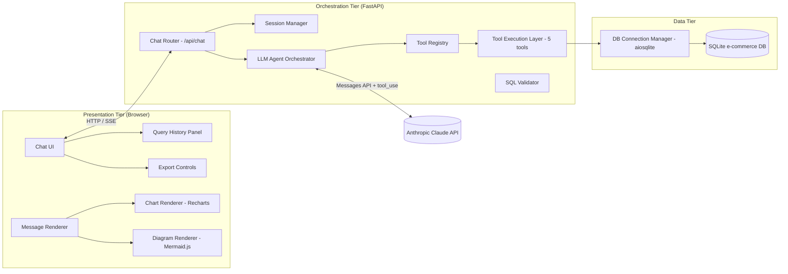
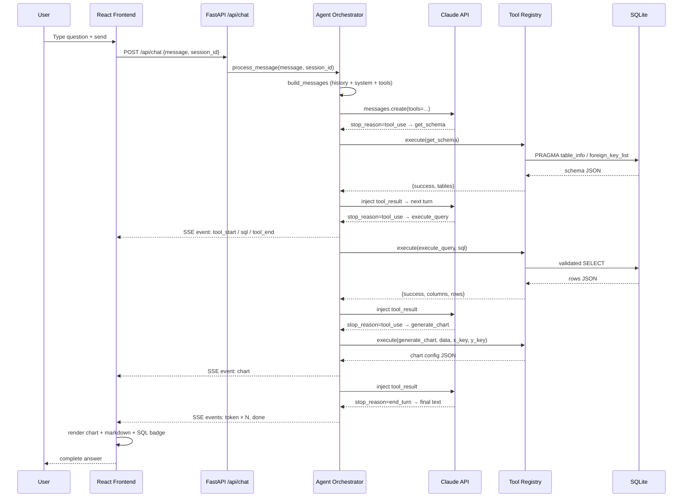
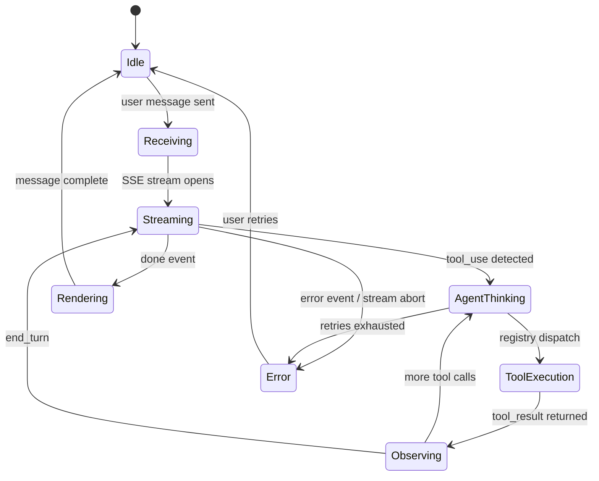
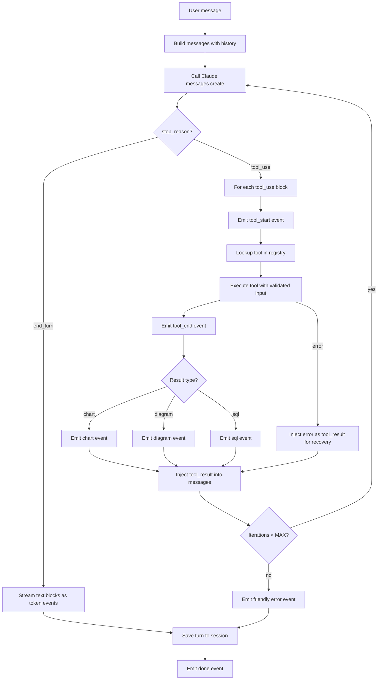
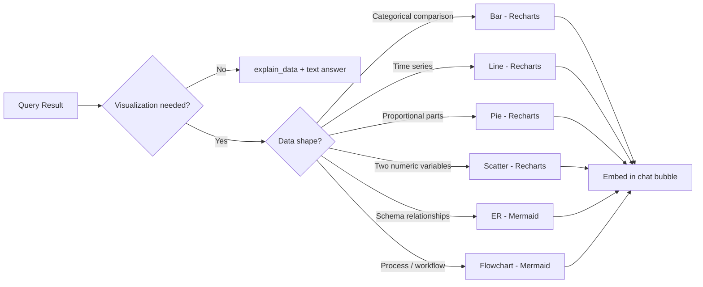

# 02 — System Architecture: DataFlow AI

**Document Class**: Architecture Repository — System Architecture
**Project**: DataFlow AI — Conversational Database Analytics
**Status**: Final — establishes the top-level structure that all later documents decompose.

---

## Purpose

This document defines the system-level architecture of DataFlow AI: the tiers, the components within each tier, the runtime interactions (including the end-to-end sequence for a typical analytical request), and the request lifecycle state machine. It answers *"what are the pieces and how do they talk to each other"* at the highest level of abstraction. Component-level detail lives in `04_ComponentArchitecture.md`.

---

## Overview

DataFlow AI is a **3-tier conversational AI architecture**:

1. **Presentation Tier** — React 18 + Vite single-page application (chat UI, visualization renderers, query history, export controls).
2. **Orchestration Tier** — FastAPI backend hosting the chat router, session manager, LLM agent orchestrator (Anthropic Claude with function calling), and the tool execution layer.
3. **Data Tier** — SQLite database (provided e-commerce sample) accessed through an async connection manager.

The presentation and orchestration tiers communicate exclusively through **HTTP + Server-Sent Events (SSE)** over a single endpoint (`POST /api/chat`), plus a small set of REST utilities (history, schema, health, export). The orchestration tier talks to the LLM over the Anthropic Messages API using the native `tool_use` mechanism.

---

## Tier Responsibilities

### Presentation Tier

| Component | Responsibility |
|-----------|----------------|
| Chat UI | Message list, input bar, typing indicator, welcome state |
| Message Renderer | Renders markdown text, SQL badge, and embeds charts/diagrams in bubbles |
| Chart Renderer | Recharts-based bar/line/pie/scatter rendering from `chart` events |
| Diagram Renderer | Mermaid.js rendering of ER/flowchart/sequence from `diagram` events |
| Query History Panel | localStorage-backed history with re-run and delete |
| Export Controls | PNG capture of charts; CSV download via backend endpoint |

### Orchestration Tier

| Component | Responsibility |
|-----------|----------------|
| Chat Router | `POST /api/chat` — validates requests, wires SSE response stream |
| Session Manager | In-memory per-session message store; 10-turn sliding window; schema cache |
| LLM Agent Orchestrator | ReAct-style loop: sends messages+tools to Claude, executes tool calls, streams results |
| Tool Registry | Maps tool names to implementations; single dispatch point |
| Tool Execution Layer | The 5 tools: `get_schema`, `execute_query`, `generate_chart`, `generate_flowchart`, `explain_data` |
| SQL Validator | SELECT-only enforcement + row caps before execution |

### Data Tier

| Component | Responsibility |
|-----------|----------------|
| DB Connection Manager | Async aiosqlite connections, row serialization (`{columns, rows, row_count}`) |
| SQLite DB | Provided e-commerce sample: customers, products, orders, order_items, inventory |

---

## Interaction Model (End-to-End Sequence)

The canonical flow for an analytical request (e.g., UC1 "top 5 products by revenue"):

---

## Request Lifecycle State Machine

The per-request lifecycle, shared by backend stream generation and frontend rendering:

States are deliberately coarse (6 states) so that the frontend can map them to UI affordances (typing indicator, tool label, error bubble) without over-engineering.

---

## Tool Calling Loop (Orchestrator Behavior)

The loop is bounded by `MAX_TOOL_ITERATIONS = 8` and per-tool timeout `TOOL_TIMEOUT_SECONDS = 30` — both from configuration, never hardcoded.

---

## Visualization Decision Flow

Chart-type selection rules are encoded in the agent system prompt (`33_PromptEngineeringStrategy.md`) so the LLM chooses by analytical fit — the rubric rewards "appropriate choices."

---

## Design Decisions

| Decision | Why |
|----------|-----|
| 3-tier split (UI / orchestration / data) | Cleanest separation for 2 developers: Dev B owns tier 1, Dev A owns tiers 2–3; integration surface is one API contract |
| SSE as the only chat transport | One-way server→client push exactly matches chat streaming; natively supported by both FastAPI and the browser; simpler and more reliable than WebSockets for this scope |
| Custom agent loop over LangChain | Fewer dependencies, deterministic behavior, full control of the event stream (needed for typed SSE events like `chart`/`diagram`) |
| Agent calls tools through a registry | Single dispatch point makes the architecture rubric's "clean, modular, extensible" criterion visibly true; adding a tool = registering one function |
| SQLite + aiosqlite | Provided sample DB, zero-config, async-safe; demo reliability is prioritized over database breadth |
| In-memory sessions | Stateless backend: no persistence complexity, no PII at rest; acceptable for hackathon scope |
| Result validation before visualization | Prevents misleading charts (empty/wrong-shape data never reaches the renderer) |

---

## Responsibilities (Boundaries of Ownership)

| Concern | Owner | Documented In |
|---------|-------|---------------|
| SSE event contract (8 types) | Both (shared; frozen Day 1) | `18_IntegrationPlan.md` |
| All tier-2/3 components | Dev A | `10_BackendArchitecture.md`, `16_DeveloperA.md` |
| All tier-1 components | Dev B | `09_FrontendArchitecture.md`, `17_DeveloperB.md` |
| Deployment topology | Dev A writes, Dev B reviews | `22_DockerArchitecture.md` |

---

## Dependencies

| Component | Depends On |
|-----------|------------|
| Agent Orchestrator | Session Manager, Tool Registry, Anthropic API |
| Tool Registry | 5 tool implementations |
| Tools | DB Connection Manager, SQL Validator |
| Chat Router | Agent Orchestrator, Session Manager |
| Frontend SSE hook | Chat Router contract |
| Chart/Diagram Renderers | `chart` / `diagram` event payload schemas |

---

## Advantages

- **Single integration surface** (SSE contract) de-risks the 2-developer split.
- **Transparent tool activity** (`tool_start`/`tool_end`/`sql` events) builds judge-facing trust and supports the Innovation criterion.
- **Bounded loops and timeouts** guarantee no hung requests during live demos.
- **Graceful recovery** is structurally built into the loop (errors injected as `tool_result`), satisfying the brief's error-handling requirement.
- **Fully localizable runtime**: SQLite + local Claude API calls; works offline except for LLM calls.

---

## Limitations

- SSE is unidirectional — the backend cannot proactively push (future: WebSockets for real-time feeds).
- Sessions are volatile (restart clears them).
- Single database backend; multi-DB requires the connector layer designed in `26_ScalabilityPlan.md`.
- Anthropic API dependency: rate limits/timeouts must be handled (see `34_RiskAssessment.md`).

---

## Future Scope

- WebSocket upgrade path for real-time data streaming and push notifications.
- Persistent session storage (SQLite/Redis) for multi-session durability.
- Multi-database connectors abstracted behind the existing `db/` layer.
- Horizontal scaling: stateless FastAPI replicas behind a load balancer (SSE-compatible).

---

## Summary

DataFlow AI's system architecture is a 3-tier, SSE-driven conversational analytics platform: a React presentation tier, a FastAPI orchestration tier running a custom ReAct agent loop over Anthropic Claude with a 5-tool registry, and a SQLite data tier behind an async connection manager and SELECT-only validator. The design is optimized for a 2-developer parallel build (one frozen integration contract), judge-visible transparency (typed SSE events for every agent action), and demo reliability (bounded loops, graceful recovery, offline database). The next documents decompose each tier: high-level design decisions (03), component architecture (04), agent (05), tools (06), database (07), API (08), frontend (09), and backend (10).

---

*Next document: `03_HighLevelDesign.md` — design principles, patterns, and the rationale behind every major decision.*
