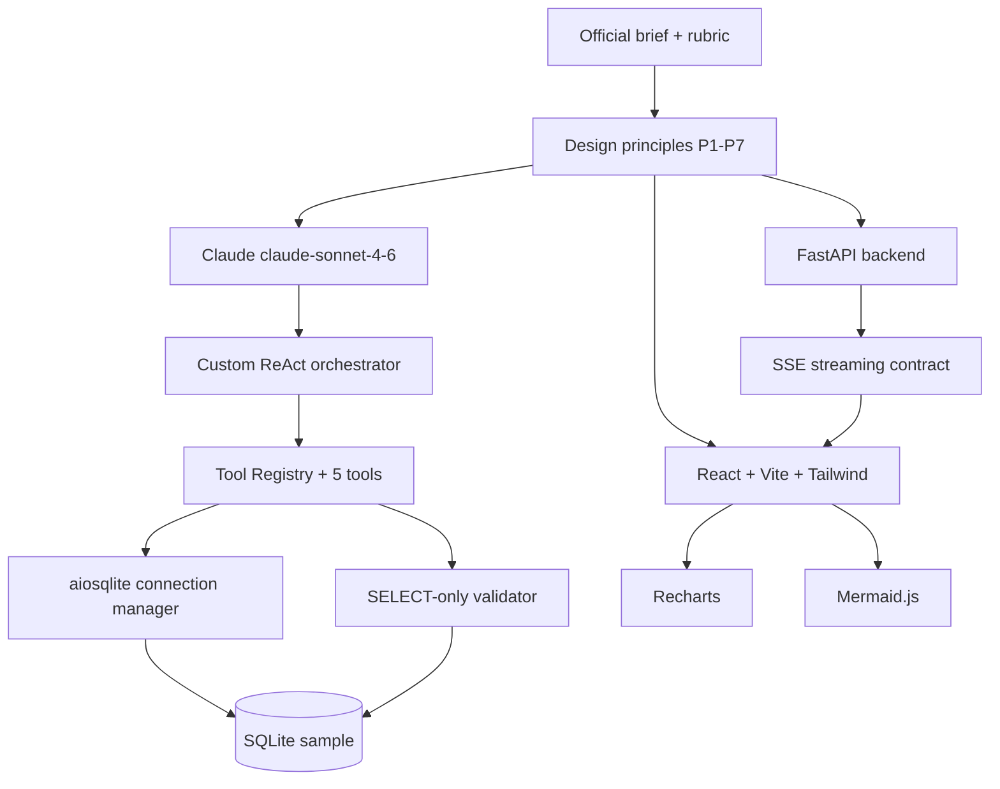

# 03 — High-Level Design: DataFlow AI

**Document Class**: Architecture Repository — High-Level Design
**Project**: DataFlow AI — Conversational Database Analytics
**Status**: Final — the reasoning layer above the system architecture; explains every major design decision with its rationale, alternatives considered, and tradeoffs accepted.

---

## Purpose

While `02_SystemArchitecture.md` describes *what* the system is, this document describes *why it is designed that way*. It records the design principles, the architecture patterns applied, the decision log (choice, alternatives rejected, reasoning), and the non-negotiable design constraints. Future developers and judges can read this to understand the engineering judgment behind the system — a key input to the 25% Architecture rubric.

---

## Overview

DataFlow AI's high-level design is governed by five principles derived directly from the competition context:

1. **Score-first engineering** — every decision is traceable to a rubric line item.
2. **Demo reliability over breadth** — the live demo is the moment that matters; deterministic, bounded, graceful.
3. **Single integration surface** — one SSE contract between two developers means zero merge deadlocks.
4. **Transparency by design** — the agent's actions (schema read, SQL, tool calls) are visible to the user, building trust with technical judges.
5. **Speed of build** — a 2-day sprint forces smallest-friction choices even when a theoretically superior option exists.

---

## 1. Design Principles

| Principle | Statement | Evidence in Design |
|-----------|-----------|--------------------|
| P1: Narrow tools | Each tool does exactly one thing, well-specified | 5 tools with single responsibilities; no mega-tool |
| P2: Structured handoffs | Tool outputs are structured JSON the LLM and frontend both interpret | `{success, data, config}` envelopes everywhere |
| P3: Bounded autonomy | The agent may act, but always within limits | MAX_TOOL_ITERATIONS=8, SELECT-only SQL, row caps |
| P4: Fail visibly, recover gracefully | Errors are surfaced to the user as recovery paths, not crashes | error tool_results → LLM self-correction → friendly message |
| P5: Stream everything | Nothing computed server-side is hidden; all becomes SSE events | token/sql/chart/diagram/tool_start/tool_end/done/error |
| P6: Context is a first-class resource | History, schema cache, and token budgets are managed explicitly | 10-turn window, schema cache per session, 200K context budget |
| P7: Stateless backend | Sessions live in memory; restart is acceptable | No auth, no persistence layers |

---

## 2. Architecture Patterns Applied

| Pattern | Where | Why |
|---------|-------|-----|
| **ReAct loop (Reason + Act)** | Agent orchestrator | The brief's core challenge is tool design; ReAct is the canonical LLM tool-use pattern; Claude's native `tool_use` implements it natively |
| **Tool Registry (Strategy)** | `agent/tool_registry.py` | Runtime dispatch by name; adding a tool is a one-line registration — visible extensibility for the Architecture rubric |
| **Adapter / Connection Manager** | `db/connection.py` | Isolates SQLite behind an async interface so future PostgreSQL/MySQL adapters can plug in (Multi-DB bonus path) |
| **Guard/Validator (Interceptor)** | `db/validator.py` | Single choke point for SQL safety; cannot be bypassed by any tool |
| **Envelope Result Pattern** | All tools | Every tool returns `{success: bool, ...}` — uniform handling by orchestrator, uniform error injection |
| **Observer (SSE push)** | Chat router | Server pushes typed events; frontend subscribes and renders |
| **Repository (localStorage)** | Query history | Simple client-side persistence for history/favorites without backend state |
| **Error Boundary** | Diagram renderer | Mermaid failures render raw source instead of breaking the app |

---

## 3. Decision Log (Major Decisions + Alternatives)

### D1: LLM — Anthropic Claude (claude-sonnet-4-6)

- **Chosen**: Anthropic Claude `claude-sonnet-4-6` (approved provider).
- **Alternatives rejected**: OpenAI GPT-4 (tool-use schema reliability weaker for multi-step agentic loops; rejected on reliability), Gemini (function calling less battle-tested at time of writing), open-source Llama/Mistral (no managed function-calling guarantees; would slow the 2-day sprint).
- **Why**: best-in-class `tool_use` implementation, 200K context window, native streaming, structured JSON output quality, and low hallucination rate on SQL generation — directly serving the Functionality (30%) criterion.

### D2: Agent Framework — Custom, not LangChain/LlamaIndex/CrewAI

- **Chosen**: hand-written orchestrator loop.
- **Alternatives rejected**: LangChain (abstraction overhead, version churn, harder to emit precise typed SSE events), CrewAI (multi-agent overkill for single-agent tool use), LlamaIndex (document-centric; less aligned with SQL tooling).
- **Why**: full control over the stream contract, fewer dependency risks in a 2-day sprint, and the Architecture rubric rewards clean custom tool design — which is impossible to showcase through a thick framework.

### D3: Backend — Python FastAPI

- **Chosen**: FastAPI 0.111+.
- **Alternatives rejected**: Express/Node (weaker SQLite + LLM SDK ecosystem for this task; Python's aiosqlite + Anthropic SDK is a better fit), Flask (no native async → SSE and concurrent tool calls become awkward).
- **Why**: native async (StreamingResponse for SSE, concurrent tool execution), automatic OpenAPI docs (bonus architecture visibility), Python ecosystem alignment with the Anthropic SDK and the provided database.

### D4: Frontend — React 18 + Vite + Tailwind

- **Chosen**: React 18 + Vite + Tailwind CSS 3.
- **Alternatives rejected**: Streamlit/Gradio (generic UI; the UX rubric explicitly rewards a ChatGPT-like experience), Vue (smaller ecosystem for Recharts/Mermaid integration).
- **Why**: chat UI is a component tree; React's model matches message bubbles with embedded visualizations perfectly; Vite gives instant HMR (fast iteration in 2 days); Tailwind delivers a polished dark theme quickly.

### D5: Charts — Recharts

- **Chosen**: Recharts 2.x.
- **Alternatives rejected**: Chart.js (canvas/DOM refs are clumsy in React), Plotly (heavy bundle, overkill), D3 (too low-level for a 2-day sprint).
- **Why**: React-native components, all 4 required chart types out of the box, responsive by default, trivial theming with the shared palette, production-proven.

### D6: Diagrams — Mermaid.js

- **Chosen**: Mermaid.js 10.x.
- **Alternatives rejected**: Graphviz (server-side rendering complexity, poor interactivity), Draw.io API (not designed for LLM-generated content), GoJS (commercial licensing, heavy).
- **Why**: explicitly suggested in the brief, the LLM emits Mermaid text natively (zero parsing on the backend), ER/flowchart/sequence render out of the box, and `@mermaid-js/mermaid-react` integrates cleanly.

### D7: Database — SQLite + aiosqlite

- **Chosen**: SQLite 3.x with aiosqlite.
- **Alternatives rejected**: PostgreSQL (connection pools, setup overhead — overkill for the provided sample), MySQL (same), MongoDB (NoSQL support is a bonus path, not a sprint requirement).
- **Why**: the brief provides an e-commerce SQLite sample; file-based zero-config means the demo can never fail on infrastructure; aiosqlite gives async access within FastAPI.

### D8: Streaming — SSE over WebSocket

- **Chosen**: Server-Sent Events.
- **Alternatives rejected**: WebSocket (bidirectional complexity, socket lifecycle management, overkill for one-way chat streaming).
- **Why**: FastAPI `StreamingResponse` + browser `EventSource` are both native; one-way push exactly matches chat streaming; simpler failure semantics.

### D9: Memory — In-memory sessions

- **Chosen**: Python dict keyed by session_id; 10-turn sliding window; per-session schema cache.
- **Alternatives rejected**: Redis (infrastructure), SQLite-backed history (persistence complexity not needed for demo).
- **Why**: stateless-backend constraint (NFR-5); sufficient for multi-turn context scoring; zero PII at rest (Security guideline).

### D10: SQL Safety — SELECT-only validator

- **Chosen**: dedicated validator module; forbidden keywords list; must-start-with-SELECT; auto-LIMIT.
- **Alternatives rejected**: DB user with read-only permissions (works, but adds deployment complexity; validator is visible in code review), no validation (unacceptable risk for the "secure database connections" guideline).
- **Why**: defense in depth in the code review (Architecture rubric), protects the demo database, and satisfies the security guideline.

---

## 4. Non-Negotiable Design Constraints

| Constraint | Reason |
|------------|--------|
| SSE event contract frozen Day 1 | Two developers must not negotiate at runtime |
| No hardcoded API keys anywhere | Mandatory brief requirement; grep-checked before submission |
| All 5 tools must be independently testable | Unit tests are a bonus item and protect the demo |
| Agent loop bounded (iterations, timeouts) | A hung demo loses Functionality and UX points |
| Charts/diagrams render inside chat bubbles | Explicit FR-1.4 |
| SQL shown before results | Secondary objective + innovation item |

---

## 5. Architecture Decisions Mermaid (Decision Dependencies)

---

## 6. Design Quality Checklist (Self-Assessment Against Architecture Rubric)

| Rubric Signal | Where Evidenced |
|---------------|-----------------|
| Clean per-tool modules | `tools/get_schema.py` … `tools/explain_data.py` (`13_ProjectStructure.md`) |
| JSON schemas with descriptions | `30_ToolSpecifications.md` |
| Registry pattern | `06_ToolArchitecture.md` |
| Validator layer | `23_SecurityDesign.md` |
| Orchestrator separated from router | `10_BackendArchitecture.md` |
| Pydantic request/response models | `08_APIArchitecture.md` |
| Structured errors with hints | `24_ErrorHandlingStrategy.md` |

---

## 7. Responsibilities, Dependencies, Advantages, Limitations, Future Scope

**Responsibilities**: this document is owned by the architecture team (both devs); Dev A is custodian for backend patterns, Dev B for frontend patterns; changes require documented rationale.
**Dependencies**: inputs from requirements (01) and system architecture (02); outputs feed every component document (04–14).
**Advantages**: decisions are auditable; alternatives are recorded so judges see engineering depth; constraints prevent scope creep.
**Limitations**: decisions are optimized for a 2-day sprint — some (e.g., in-memory sessions, SQLite-only) trade long-term sophistication for deliverability.
**Future scope**: the decision log extends naturally — multi-DB adapter, Redis sessions, WebSockets, LangGraph-based orchestration if team grows.

---

## Summary

The high-level design of DataFlow AI rests on seven principles (narrow tools, structured handoffs, bounded autonomy, visible failure, streaming transparency, context management, statelessness) applied through ten recorded decisions — Claude for function-calling reliability, a custom ReAct orchestrator for control, FastAPI+SSE for async streaming, React+Recharts+Mermaid for a visualization-native chat UX, SQLite for demo reliability, and a SELECT-only validator for security. Every decision names the alternatives rejected and the rubric it serves, making the architecture auditable and judge-friendly while remaining deliverable in a 2-day sprint by two developers.

---

*Next document: `04_ComponentArchitecture.md` — every component with its responsibility, interface, and dependency.*
