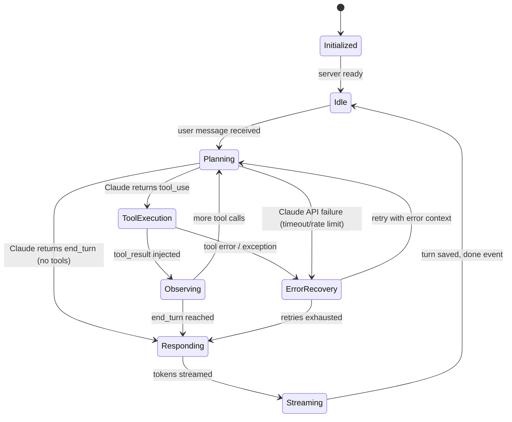
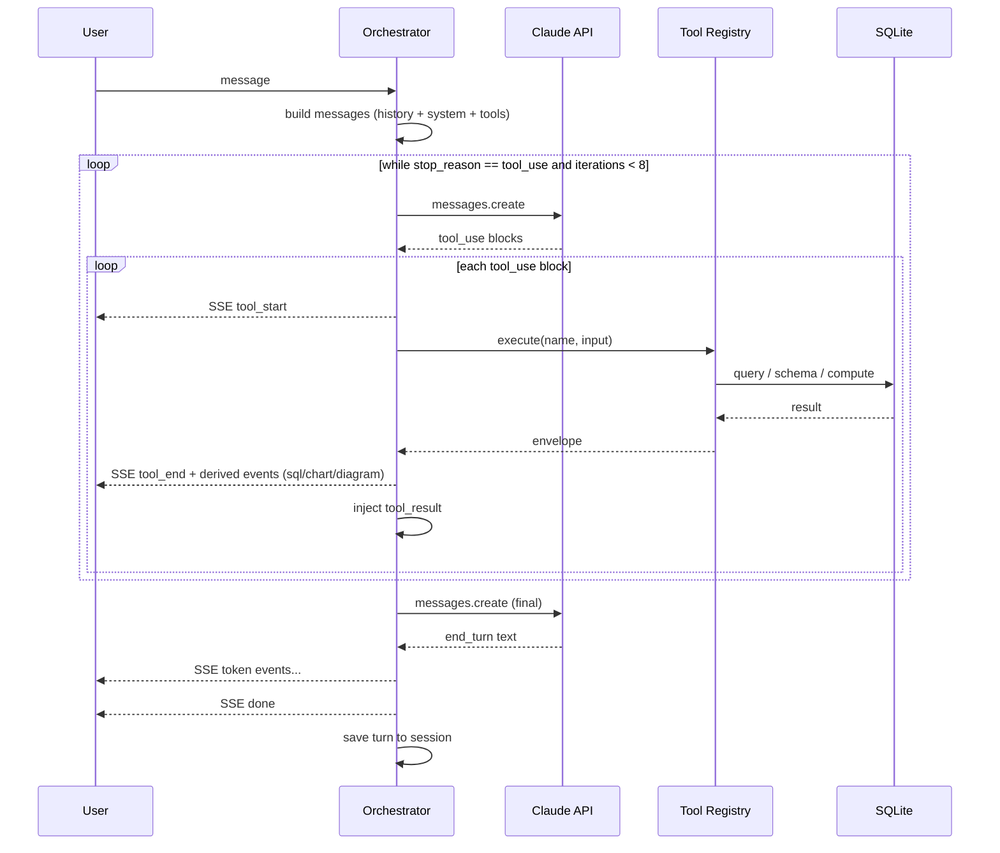

# 05 — Agent Architecture: DataFlow AI

**Document Class**: Architecture Repository — Agent Architecture
**Project**: DataFlow AI — Conversational Database Analytics
**Status**: Final — the complete design of the LLM agent: lifecycle, memory, tool-calling protocol, context budgeting, and error recovery.

---

## Purpose

This document specifies the heart of the system: the LLM agent. It defines the ReAct-style orchestration loop over Anthropic Claude's native `tool_use` mechanism, the agent lifecycle state machine, the memory model, the tool-calling protocol (how `tool_use` blocks and `tool_result` blocks flow), context budgeting, and the error recovery machinery. This is the reference for `10_BackendArchitecture.md` (module placement), `33_PromptEngineeringStrategy.md` (prompt content), and `20_TestingStrategy.md` (agent tests).

---

## Overview

The agent is a **custom ReAct (Reason + Act) loop** — deliberately not built on LangChain or CrewAI (rationale in `03_HighLevelDesign.md` D2). It uses Anthropic's native function-calling: the model receives tool schemas via the `tools` parameter, decides when to call them (`stop_reason: "tool_use"`), and the orchestrator executes the calls and returns results as `tool_result` blocks until the model concludes (`stop_reason: "end_turn"`).

---

## 1. Agent Lifecycle

| State | Meaning | Entry Condition |
|-------|---------|-----------------|
| `Initialized` | Server startup; tools registered | app boot |
| `Idle` | Awaiting user message | previous turn complete |
| `Planning` | Claude reasoning with history + tools | user message / tool_result injected |
| `ToolExecution` | Orchestrator executes one or more tool calls | Claude returns `tool_use` |
| `Observing` | Tool results are packaged as `tool_result` blocks | tool execution finished |
| `ErrorRecovery` | Failure context injected; Claude re-reasons | tool error, API failure, retries remaining |
| `Responding` | Claude returns `end_turn`; text streamed | loop termination condition |
| `Streaming` | Token events pushed to frontend | response generation in progress |

The loop is bounded: `MAX_TOOL_ITERATIONS = 8` (configurable via env). If the bound is hit, the orchestrator emits a friendly `error` event instead of continuing — the demo can never hang.

---

## 2. Memory Model

### 2.1 Session Store

- In-memory Python dict keyed by `session_id`.
- Stores the conversation as message records: `{role: "user"|"assistant", content, timestamp, charts?, sql_used?}`.
- **Sliding window**: the last **10 user+assistant turns** are replayed to the model (plus the current message). Older turns are dropped from the API call (still viewable in the UI history).
- No DB persistence: sessions are cleared on server restart (documented limitation; acceptable per NFR-5).

### 2.2 Schema Cache

- After the first successful `get_schema` call in a session, the schema JSON is cached on the session object.
- Subsequent turns reuse the cache — saving API round-trips and tokens (rate-limit mitigation; `34_RiskAssessment.md`).
- Cache is invalidated when the session is cleared; refreshed when the user asks about a different domain (new table filter).

### 2.3 Context Budget (200K window usage)

| Content | Approximate Tokens |
|---------|-------------------|
| System prompt | ~300 |
| Tool schemas (5 tools) | ~1,500 |
| History (10 turns) | ~8,000 |
| Current message | ~100 |
| Model response + tool calls | ≤ 4,096 (MAX_TOKENS) |
| **Total per turn** | **~14,000** — comfortably within 200K |

The budget is engineered so that even a long demo session never approaches the context limit — no truncation logic needed in the sprint.

---

## 3. Tool-Calling Protocol

### 3.1 Message Construction

For each user message the orchestrator builds an API call composed of:

1. `system` — the DataFlow AI system prompt (`33_PromptEngineeringStrategy.md`).
2. `tools` — the 5 tool schemas with JSON-Schema `input_schema` (from `30_ToolSpecifications.md`).
3. `messages` — sliding-window history + current user message.

### 3.2 Executing a Tool Call

When Claude returns `stop_reason: "tool_use"`, each content block of `type: "tool_use"` carries `{id, name, input}`. The orchestrator:

1. Emits `tool_start` SSE event (`{tool: name}`).
2. Looks up the implementation in the registry.
3. Executes with `**input` (validated kwargs).
4. Emits `tool_end` SSE event (`{tool, success}`).
5. Emits derived events: `sql` (for `execute_query` when show_sql), `chart` (for `generate_chart`), `diagram` (for `generate_flowchart`).
6. Appends to the message list: the assistant `tool_use` block, then a user block containing `tool_result` with the envelope JSON (`json.dumps` of the result).
7. Calls Claude again (Planning state) — unless the loop bound is reached.

### 3.3 Termination

Claude returns `stop_reason: "end_turn"` → the orchestrator streams text content blocks as `token` events, saves the turn, and emits `done`.

### 3.4 Parallel Tool Calls

Claude may return multiple `tool_use` blocks in one response; the orchestrator executes them sequentially (awaiting each) to keep the SSE event order deterministic — a deliberate simplicity choice for the demo.

---

## 4. Orchestrator Flow (Design-Level Sequence)

---

## 5. Error Recovery

The recovery mechanism is the same ReAct loop used for success — **errors are data**:

| Failure | Recovery Path |
|---------|---------------|
| SQL syntax error / unknown table | Error envelope (`{success: false, error, hint, sql_attempted}`) injected as `tool_result` → Claude re-reasons (e.g., "Did you mean products?") → corrected query → up to 2 retries |
| Tool input validation failure | Error envelope with available columns/tables in the hint → Claude adjusts input |
| Claude API timeout / rate limit | Orchestrator retries with backoff (short) → on final failure emits friendly `error` event with code `CLAUDE_TIMEOUT`/`CLAUDE_RATE_LIMIT` |
| Empty result set | Tool returns `success: true` with `row_count: 0` → Claude reports "no records found" and suggests a refinement — no chart is generated |
| Loop bound exceeded | Friendly error event; conversation continues on next user message |

Error message shape (consistent across tools):

- `{success: false, error: "<human/LLM-readable problem>", hint: "<recovery guidance>", ...}`

The frontend maps these to `ErrorBubble` presentations with a retry affordance (`24_ErrorHandlingStrategy.md`).

---

## 6. Agent Behavior Rules (System Prompt Directives)

The system prompt (`33_PromptEngineeringStrategy.md`) encodes behavior rules that make the agent deterministic and judge-friendly:

1. Call `get_schema` first whenever table structure is unknown.
2. Always surface the SQL used (SQL transparency).
3. Generate a chart for numerical comparisons/trends; choose type by analytical fit.
4. Generate an ER diagram when asked about database structure.
5. On query failure: explain what went wrong, then retry with a corrected version.
6. Keep explanations concise and business-focused (bold key entities, currency formatting).
7. Only SELECT statements are ever executed.

---

## 7. Configuration

| Variable | Default | Purpose |
|----------|---------|---------|
| `MODEL` | `claude-sonnet-4-6` | Model id |
| `MAX_TOKENS` | `4096` | Per-response cap |
| `MAX_TOOL_ITERATIONS` | `8` | Loop bound |
| `MAX_HISTORY_TURNS` | `10` | Sliding window size |
| `TOOL_TIMEOUT_SECONDS` | `30` | Per-tool execution timeout |
| `ANTHROPIC_API_KEY` | — | From `.env` only |

All configurable via environment; no hardcoded values in code.

---

## 8. Design Decisions

| Decision | Why |
|----------|-----|
| Native `tool_use` over parsing model JSON | Anthropic's protocol is designed for this; no fragile regex/JSON extraction layer |
| Errors as `tool_result` | Claude self-corrects naturally — the same loop handles success and failure; fewer bespoke code paths |
| Sequential tool execution | Deterministic SSE event ordering; avoids interleaving complexity in a 2-day build |
| In-memory + 10-turn window | Statelessness (NFR-5) + sufficient multi-turn context for UC follow-ups |
| Schema cache | Cuts API calls and tokens; directly mitigates rate-limit risk |
| Bounded loop + timeouts | A hung agent is the worst demo failure mode; bounds make it impossible |
| No framework | Control of the stream contract and zero dependency churn |

---

## 9. Responsibilities, Dependencies, Advantages, Limitations, Future Scope

**Responsibilities**: orchestrator = loop control + event emission; registry = dispatch; session = memory; prompt = behavior policy.
**Dependencies**: Anthropic SDK, all 5 tools, session store, SSE emitter.
**Advantages**: deterministic events (great for demo and tests), self-correcting errors, cheap token budget, fully custom (architecture visibility).
**Limitations**: sequential execution leaves parallelism unused; in-memory memory is volatile; single-provider lock-in (Claude).
**Future scope**: parallel tool execution, persistent memory (Redis/SQLite), multi-agent decomposition (CrewAI-style), model fallback chain, and tool-call caching.

---

## Summary

The DataFlow AI agent is a bounded, self-correcting ReAct loop over Claude's native `tool_use`: it plans with 10 turns of history plus a cached schema, executes tools through a registry, streams every action as typed SSE events, and recovers from failures by feeding errors back to the model as data. With a 200K context budget of ~14K tokens per turn, a hard iteration cap of 8, and 30-second tool timeouts, the agent is deterministic, cheap, and incapable of hanging — precisely the properties a live hackathon demo demands.

---

*Next document: `06_ToolArchitecture.md` — the 5-tool registry design, orchestration rules, and recovery expectations.*
