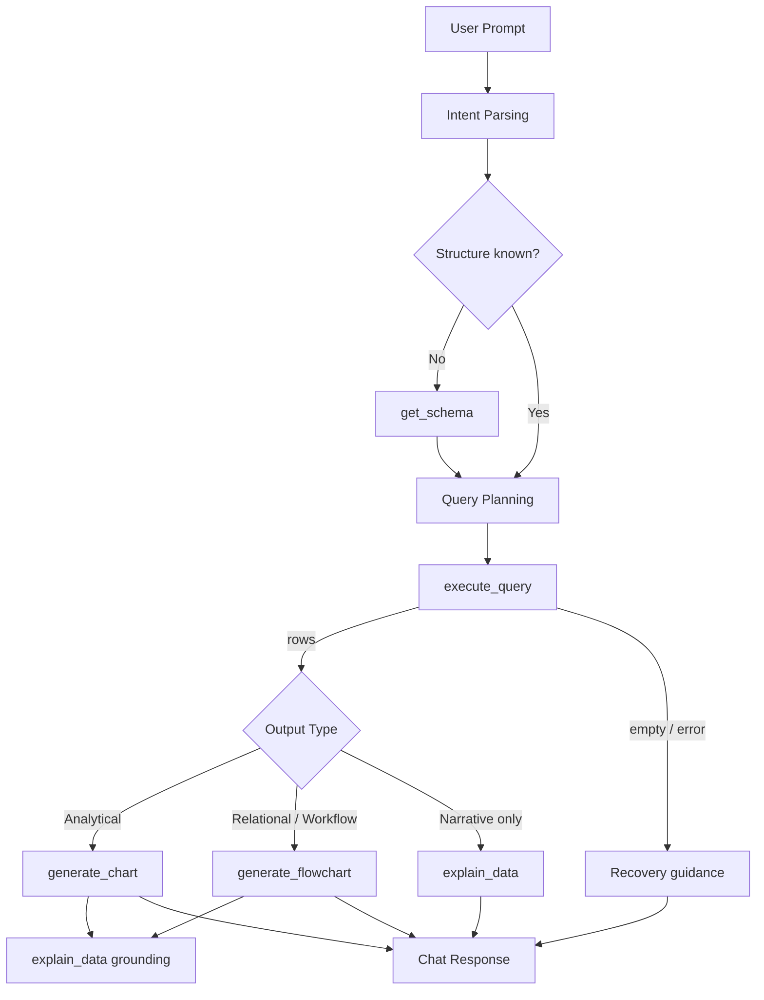
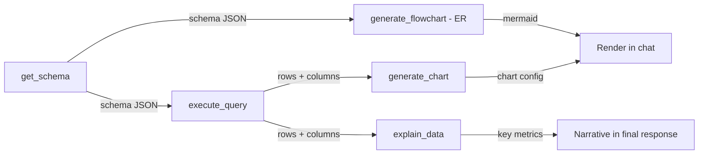

# 06 — Tool Architecture: DataFlow AI

**Document Class**: Architecture Repository — Tool Architecture
**Project**: DataFlow AI — Conversational Database Analytics
**Status**: Final — the tool-layer architecture: registry pattern, orchestration rules, tool composition, and recovery expectations. Full per-tool interface specs are in `30_ToolSpecifications.md`.

---

## Purpose

The official brief identifies tool design as the core engineering challenge of the hackathon ("design custom tools/functions for DB connectivity, query execution, visualization generation") and awards 25% of the score to Tool Design & Architecture. This document therefore specifies the architectural principles of the tool layer, how the five required tools interoperate, when each tool may be called, and how the system recovers when a tool cannot do its job. It complements the mechanical detail in `30_ToolSpecifications.md`.

---

## Overview

DataFlow AI exposes exactly five tools to the LLM, each with a narrow responsibility:

| Tool | Responsibility | Produces |
|------|----------------|----------|
| `get_schema` | Retrieve database structure (tables, columns, types, PKs, FKs, row counts) | JSON schema |
| `execute_query` | Run a validated SELECT and return structured rows | JSON tabular result |
| `generate_chart` | Convert a result set into a chart config the frontend renders | Chart config JSON |
| `generate_flowchart` | Convert schema/process knowledge into a Mermaid diagram | Mermaid string |
| `explain_data` | Compute key metrics locally to ground the LLM's narrative | Metric summary + key values |

---

## 1. Architectural Principles

| Principle | Statement | Enforcement |
|-----------|-----------|-------------|
| P-T1: Narrow responsibilities | One tool = one job; no mega-tools | Each tool file ≤ one concern; docstrings state limits |
| P-T2: Structured handoffs | Every tool output is a machine-parseable envelope the LLM (and frontend) can consume | `{success: bool, ...}` envelope everywhere |
| P-T3: Interpretable status | Tools report what happened, including failure causes and hints | `error` + `hint` fields on failures |
| P-T4: Traceability | Every tool action maps to the user's question | `sql_attempted`, `context` threading |
| P-T5: Safe by construction | Tools cannot mutate data or exceed bounds | validator + LIMIT caps + timeout |

---

## 2. Registry Pattern

All tools are registered in a single `TOOL_MAP` and dispatched through one entry point:

| Concern | Design |
|---------|--------|
| Registration | `TOOL_MAP = {name: async_function}` — one line per tool |
| Dispatch | `execute_tool(name, **inputs)` → awaited function; unknown name → `{success: false, error: "Unknown tool: <name>"}` |
| Exception safety | Any raised exception → `{success: false, error: str(e)}` envelope (never a raw crash) |
| Extensibility | Adding a tool = implement function + register + add schema to prompt — no orchestrator changes |

The registry is the single point where the Architecture rubric's "clean, modular, extensible" criterion becomes inspectable in code review.

---

## 3. Tool Schemas (Function-Calling Contracts)

Every tool declares a JSON-Schema `input_schema` with:

- **`type: "object"`** with typed `properties`.
- **Descriptions** on every parameter (the LLM relies on them for correct invocation).
- **`required`** arrays naming mandatory inputs.
- **Enums** where values are constrained (chart types, diagram types, insight types).

| Tool | Required Inputs | Key Validation |
|------|-----------------|----------------|
| `get_schema` | — (optional `table_filter`) | table exists check |
| `execute_query` | `sql` | SELECT-only; LIMIT ≤ 1000 |
| `generate_chart` | `chart_type`, `data`, `x_key`, `y_key` | enum + non-empty data + key existence |
| `generate_flowchart` | `diagram_type` + (`mermaid_code` XOR `schema_data`) | enum + at least one content source |
| `explain_data` | `data`, `columns` | non-empty data; column existence |

Full schemas with descriptions: `30_ToolSpecifications.md`.

---

## 4. Orchestration Rules (When Each Tool Is Called)

These rules are encoded in the system prompt and enforced by the orchestrator:

| Situation | Tool Sequence |
|-----------|---------------|
| Any analytical question (metric, filter, grouping) | `get_schema` (if unknown) → `execute_query` → `generate_chart` → `explain_data` (grounding) |
| Database structure question | `get_schema` → text answer (or `generate_flowchart` for ER) |
| ER diagram request | `get_schema` → `generate_flowchart(er, schema_data)` |
| Process/flow question | `get_schema` → infer process → `generate_flowchart(flowchart, mermaid_code)` |
| Narrative-only question (e.g., "what's in this table?") | `get_schema` → `execute_query` → `explain_data` |

**Guard rails:**

- `get_schema` must precede query generation whenever structure is unknown (prevents hallucinated table names).
- `execute_query` only when metric/filters/grouping are clear; otherwise clarify with the user first.
- `generate_chart` only when data has enough shape/volume (≥1 row; validated keys).
- `generate_flowchart` requires either pre-written Mermaid or schema data — never fabricates a diagram from nothing.
- `explain_data` runs after retrieval or visualization to ground the narrative in computed metrics.

---

## 5. Tool Composition (Data Flow Between Tools)

Composition rule: **outputs of one tool are valid inputs to the next** — the schema JSON returned by `get_schema` is exactly what `generate_flowchart` accepts as `schema_data`; the rows from `execute_query` are exactly what `generate_chart` expects as `data`.

---

## 6. Recovery Expectations (Failure → System Behavior)

| Failure | System Behavior |
|---------|-----------------|
| Ambiguous prompt | Agent asks a focused clarification question (no tool call) |
| Missing table/field | Error hint with nearest alternative ("Did you mean products?") → agent re-queries |
| Empty result set | `row_count: 0` reported; agent states no records and suggests a refinement; no chart |
| Visualization mismatch (data shape wrong for chart type) | Chart tool validation error → agent falls back to tabular presentation + recommends a better chart |
| Diagram inference uncertainty | Agent states assumptions before rendering (e.g., "assuming order flow starts at customer") |
| Unknown tool name | Registry error envelope → agent corrects tool selection |
| Tool timeout | Envelope error → agent retries or answers without the tool |

---

## 7. Design Decisions

| Decision | Why |
|----------|-----|
| Registry dispatch | Single extension point; rubric-visible modularity |
| Envelope results (`success` flag) | Uniform error injection into the ReAct loop; no per-tool error conventions |
| Chart tool returns config, not pixels | LLM output stays textual/JSON; rendering stays in the frontend; no binary serialization |
| Diagram tool returns Mermaid text | LLM natively writes Mermaid; backend never parses diagram syntax |
| `explain_data` computes locally | Metrics are factual (computed from rows), the narrative is the LLM's — grounding prevents hallucinated numbers |
| Validation inside tools, not just API layer | Defense in depth: even a malformed LLM call cannot crash the demo |
| Docstrings + descriptions everywhere | Both the LLM and the judge read them; architecture transparency |

---

## 8. Responsibilities, Dependencies, Advantages, Limitations, Future Scope

**Responsibilities**: registry = dispatch; each tool = its narrow job; validator = safety; orchestrator = call sequencing.
**Dependencies**: tools depend on `db/connection.py` and `db/validator.py`; registry depends on all tools; orchestrator depends on registry.
**Advantages**: five independently testable units; errors self-correct through the loop; extensibility without refactoring; every tool maps to a rubric line item.
**Limitations**: sequential execution (parallelism deferred); single-database tool implementations; tool surface is fixed to the required five plus bonus types.
**Future scope**: additional tools (`export_report`, `get_realtime`, `recommend_chart`), tool versioning, parallel execution, and multi-DB variants behind the same registry.

---

## Summary

The tool architecture of DataFlow AI is a five-tool registry with narrow responsibilities, structured envelope outputs, JSON-Schema contracts, and explicit orchestration rules that guarantee the correct tool sequence for any intent. Tools compose naturally — schema feeds queries, queries feed charts and narratives, schema feeds diagrams. Failure handling is part of the tool contract itself: every error is an envelope the agent can reason about, so the system recovers conversationally rather than crashing. This design directly targets the 25% Tool Design & Architecture criterion while remaining buildable in a 2-day sprint.

---

*Next document: `07_DatabaseDesign.md` — schema, relationships, reference queries, and data-layer design.*
