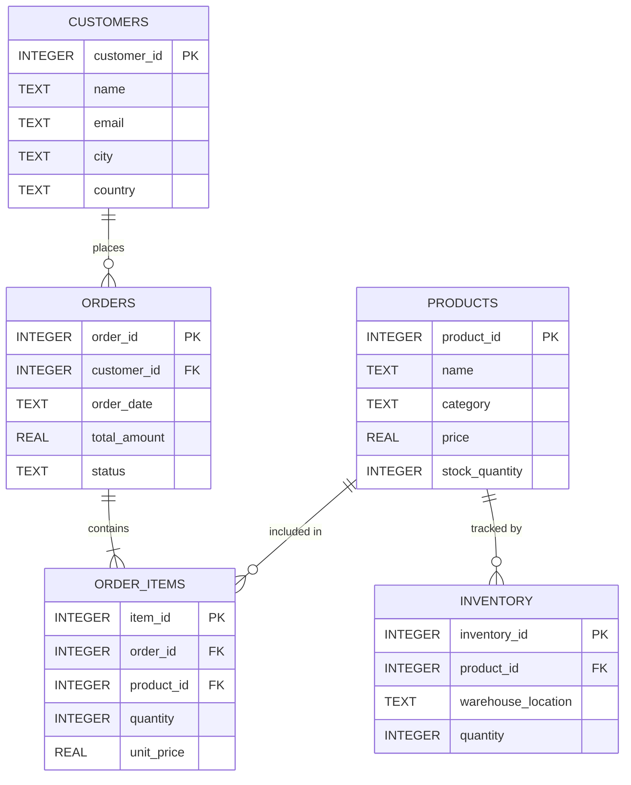

# 07 — Database Design: DataFlow AI

**Document Class**: Architecture Repository — Database Design
**Project**: DataFlow AI — Conversational Database Analytics
**Status**: Final — schema, relationships, reference queries, connection manager, and validator design for the SQLite e-commerce sample.

---

## Purpose

This document defines the data layer of DataFlow AI: the physical schema of the provided SQLite e-commerce database, the entity relationships the agent reasons about, the six reference queries used to validate NL→SQL quality, the async connection manager design, the SELECT-only validator, and the index strategy. It is the source of truth for the `db/` module and the tool implementations that consume it (`get_schema`, `execute_query`).

---

## Overview

The brief provides a sample **SQLite e-commerce database**. The design uses it as the sole demo data source (reliability over breadth) while structuring the data layer behind an async connection manager so additional engines (PostgreSQL/MySQL/MongoDB) can be added later behind the same interface (multi-DB bonus path — `26_ScalabilityPlan.md`).

Key data-layer commitments:

- **Runtime schema discovery**: `get_schema` reads the actual schema via PRAGMA — never a hardcoded copy — so the app works even if the provided file's columns differ from this document.
- **SELECT-only enforcement** at a single choke point.
- **Structured result serialization**: `{columns, rows: [dict], row_count}` for both the LLM and the frontend.

---

## 1. Schema Overview

Five tables (the brief names four core tables; the sample includes `order_items` — the runtime discovery handles the actual shape):

| Table | Purpose | Key Columns |
|-------|---------|-------------|
| `customers` | Buyer records | `customer_id` (PK), `name`, `email`, `phone`, `city`, `country`, `created_at` |
| `products` | Catalog | `product_id` (PK), `name`, `category`, `price`, `stock_quantity`, `description`, `created_at` |
| `orders` | Purchase headers | `order_id` (PK), `customer_id` (FK), `order_date`, `total_amount`, `status` |
| `order_items` | Order line items | `item_id` (PK), `order_id` (FK), `product_id` (FK), `quantity`, `unit_price` |
| `inventory` | Stock locations | `inventory_id` (PK), `product_id` (FK), `warehouse_location`, `quantity`, `last_updated` |

### Design-level DDL (reference; actual file is authoritative)

| Table | Columns (design reference) |
|-------|----------------------------|
| `customers` | `customer_id INTEGER PK AUTOINCREMENT`, `name TEXT NOT NULL`, `email TEXT UNIQUE NOT NULL`, `phone TEXT`, `city TEXT`, `country TEXT DEFAULT 'India'`, `created_at TEXT DEFAULT datetime('now')` |
| `products` | `product_id INTEGER PK`, `name TEXT NOT NULL`, `category TEXT`, `price REAL NOT NULL`, `stock_quantity INTEGER DEFAULT 0`, `description TEXT`, `created_at TEXT` |
| `orders` | `order_id INTEGER PK`, `customer_id INTEGER FK→customers`, `order_date TEXT`, `total_amount REAL NOT NULL`, `status TEXT CHECK IN ('pending','processing','shipped','delivered','cancelled')` |
| `order_items` | `item_id INTEGER PK`, `order_id INTEGER FK→orders`, `product_id INTEGER FK→products`, `quantity INTEGER`, `unit_price REAL` |
| `inventory` | `inventory_id INTEGER PK`, `product_id INTEGER FK→products`, `warehouse_location TEXT`, `quantity INTEGER DEFAULT 0`, `last_updated TEXT` |

---

## 2. Entity Relationships

| Relationship | Cardinality | Meaning |
|--------------|-------------|---------|
| `customers` → `orders` | 1:N | A customer places many orders |
| `orders` → `order_items` | 1:N | An order contains many line items |
| `products` → `order_items` | 1:N | A product appears in many line items |
| `products` → `inventory` | 1:N | A product is tracked in many warehouses |

These relationships are what the agent exposes in ER diagrams (UC2) and reasons about for process flows (UC3).

---

## 3. Reference Queries (NL→SQL Quality Benchmarks)

These six queries are the deterministic test set for the agent's SQL generation (used in agent tests and demo scenarios):

| # | Question (user intent) | Query Shape |
|---|------------------------|-------------|
| Q1 | Top 5 products by revenue | `SELECT p.name AS product_name, SUM(oi.quantity*oi.unit_price) AS total_revenue FROM order_items oi JOIN products p ON oi.product_id = p.product_id GROUP BY p.product_id, p.name ORDER BY total_revenue DESC LIMIT 5` |
| Q2 | Monthly revenue trend (last 12 months) | `strftime('%Y-%m', order_date) AS month, SUM(total_amount) AS revenue FROM orders WHERE order_date >= date('now','-12 months') AND status != 'cancelled' GROUP BY month ORDER BY month` |
| Q3 | Order status distribution | `status, COUNT(*) AS count FROM orders GROUP BY status ORDER BY count DESC` |
| Q4 | Revenue by product category | `p.category, SUM(oi.quantity*oi.unit_price) AS revenue FROM order_items oi JOIN products p ... GROUP BY p.category ORDER BY revenue DESC` |
| Q5 | Low-stock products | `p.name, p.stock_quantity, i.warehouse_location FROM products p JOIN inventory i ON ... WHERE p.stock_quantity < 20 ORDER BY p.stock_quantity ASC` |
| Q6 | Top customers by spend | `c.name, COUNT(o.order_id) AS total_orders, SUM(o.total_amount) AS total_spent FROM customers c JOIN orders o ... GROUP BY c.customer_id ORDER BY total_spent DESC LIMIT 10` |

Each query exercises a distinct pattern: JOIN+GROUP+ORDER (Q1), date functions + filtering (Q2), GROUP BY distribution (Q3), multi-join aggregation (Q4), filtered join (Q5), and aggregate across customers (Q6). Passing all six in agent tests gives high confidence in the Functionality 30% score.

---

## 4. Connection Manager Design

| Concern | Design |
|---------|--------|
| Engine | aiosqlite (async wrapper over stdlib sqlite3) |
| Path | `DATABASE_PATH` env var (default `../database/ecommerce.sqlite` relative to backend) |
| Row access | `row_factory = aiosqlite.Row`; results serialized as `[{column: value}]` dicts |
| Result envelope | `{columns: [...], rows: [{...}], row_count: N}` |
| Concurrency | One connection per request context (SQLite file locking is fine for demo scale) |
| Fail-fast | Startup check: `get_schema`-style probe at boot surfaces missing DB early (`/api/health` reports `database: connected`) |

---

## 5. SQL Validator Design

| Concern | Design |
|---------|--------|
| Purpose | Enforce read-only access; the agent may never mutate data |
| Rule 1 | Statement must start with `SELECT` (after trimming whitespace) |
| Rule 2 | Forbidden keywords rejected anywhere in the statement: `INSERT`, `UPDATE`, `DELETE`, `DROP`, `CREATE`, `ALTER`, `TRUNCATE`, `EXEC`, `EXECUTE` |
| Rule 3 | Automatic `LIMIT` append when missing (default 100) |
| Rule 4 | Hard cap `LIMIT ≤ 1000` |
| Return | `(is_valid: bool, error_message: str \| None)` |

Design decision: a code-level validator (rather than a read-only DB user) is chosen because it is (a) visible to judges in code review (Architecture rubric), (b) engine-agnostic, and (c) free of deployment complexity.

---

## 6. Index Strategy

Indexes are created idempotently at startup (`CREATE INDEX IF NOT EXISTS`):

| Index | On | Serves |
|-------|-----|--------|
| `idx_orders_customer` | `orders(customer_id)` | Q6 |
| `idx_orders_date` | `orders(order_date)` | Q2 |
| `idx_order_items_order` | `order_items(order_id)` | Q1 joins |
| `idx_order_items_product` | `order_items(product_id)` | Q1/Q4 joins |
| `idx_inventory_product` | `inventory(product_id)` | Q5 |

For a sample database these are optional, but they make the data layer demonstrably performant and are trivially cheap to include.

---

## 7. Schema Discovery (get_schema Mechanics)

`get_schema` composes the actual database state at runtime:

1. `SELECT name FROM sqlite_master WHERE type='table'` → table list (system tables filtered).
2. Per table: `PRAGMA table_info(<t>)` → `{name, type, pk, notnull}` per column.
3. Per table: `PRAGMA foreign_key_list(<t>)` → `{from, table, to}` per FK.
4. Per table: `SELECT COUNT(*)` → `row_count`.
5. Optional `table_filter` narrows output; unknown table → error envelope with `available_tables`.

This is why the app tolerates a schema file that differs from this document: the agent always sees the truth.

---

## 8. Design Decisions

| Decision | Why |
|----------|-----|
| SQLite as the only sprint database | Provided sample; zero infra; demo-proof |
| PRAGMA-based runtime discovery | Robust to schema drift; single source of truth is the actual file |
| SELECT-only code validator | Rubric-visible safety; engine-agnostic |
| Structured result envelope | Consumed identically by LLM and frontend |
| 6 benchmark queries | Deterministic NL→SQL acceptance criteria; demos without improvisation |
| Indexes idempotent at boot | Zero-risk performance polish |

---

## 9. Responsibilities, Dependencies, Advantages, Limitations, Future Scope

**Responsibilities**: connection manager = access + serialization; validator = safety; `get_schema` = discovery; `execute_query` = execution.
**Dependencies**: tools depend on this layer; `/api/health` and `/api/schema` read it.
**Advantages**: zero-config, deterministic demo, schema-drift-proof, read-only by construction, small and auditable.
**Limitations**: single engine; file-based (no concurrent writers at scale); row caps limit huge result sets.
**Future scope**: PostgreSQL/MySQL/MongoDB adapters behind the same interface; read-replica patterns; query plan logging; persistent session tables.

---

## Summary

The data layer is a deliberately minimal, deterministic design: a provided SQLite e-commerce schema (5 tables, 4 relationships) accessed through an async connection manager, guarded by a SELECT-only validator, and understood by the agent through PRAGMA-based runtime discovery. Six reference queries define the NL→SQL quality bar. This design maximizes demo reliability and architectural transparency while leaving a clean seam for multi-database expansion.

---

*Next document: `08_APIArchitecture.md` — endpoints, the SSE contract, models, and error codes.*
