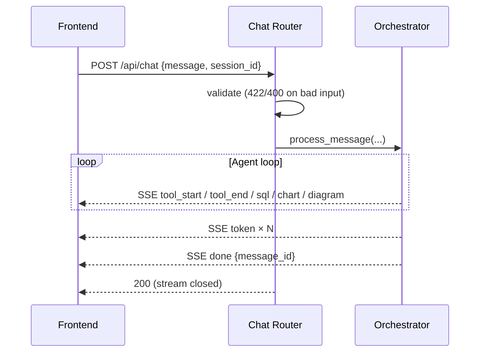

# 08 — API Architecture: DataFlow AI

**Document Class**: Architecture Repository — API Architecture
**Project**: DataFlow AI — Conversational Database Analytics
**Status**: Final — the complete HTTP/SSE API surface: endpoints, request/response models, the SSE event contract, error codes, and CORS.

---

## Purpose

This document is the contract definition for every client-visible interface of the backend: the REST utility endpoints, the streaming chat endpoint, the exact SSE event vocabulary, the Pydantic models, the error code taxonomy, and CORS configuration. It is the authoritative reference for `09_FrontendArchitecture.md` (consumption) and `18_IntegrationPlan.md` (the frozen contract).

---

## Overview

The backend exposes a **small REST surface + one streaming endpoint**:

- `POST /api/chat` — the only streaming endpoint; consumes a JSON request and produces an SSE stream of typed events.
- `GET /api/session/{id}/history`, `DELETE /api/session/{id}` — session utilities.
- `GET /api/health` — liveness (Docker healthchecks).
- `GET /api/schema` — direct schema introspection (UI schema panel).
- `POST /api/export/csv` — bonus CSV export.

Base URL: `http://localhost:8000` (dev). No authentication (explicitly out of scope for the hackathon; documented in `23_SecurityDesign.md`).

---

## 1. Endpoint Catalog

### 1.1 POST /api/chat (SSE stream)

| Concern | Specification |
|---------|---------------|
| Request body | `ChatRequest { message: str, session_id: str, options?: ChatOptions }` |
| `ChatOptions` | `{ show_sql: bool = true, stream: bool = true }` |
| Response | `text/event-stream`; sequence of typed events (section 2) |
| Status codes | `200` stream, `400` (EMPTY_MESSAGE / INVALID_SESSION), `422` (schema validation), `500` (DB_ERROR), `503` (CLAUDE_TIMEOUT) |

Request lifecycle on the server: validate → resolve/create session → run orchestrator → stream events → finalize (`done`).

### 1.2 Session Endpoints

| Endpoint | Response |
|----------|----------|
| `GET /api/session/{id}/history` | `{session_id, messages: [MessageRecord], message_count}`; `404` when unknown |
| `DELETE /api/session/{id}` | `{success: true, message: "Session cleared"}` |

`MessageRecord`: `{role, content, timestamp, charts?, sql_used?}` — enough to restore the UI view of a session.

### 1.3 Utility Endpoints

| Endpoint | Response |
|----------|----------|
| `GET /api/health` | `{status: "ok", database: "connected", claude_api: "reachable", version: "1.0.0"}` |
| `GET /api/schema` | `{tables: [SchemaTable], total_tables: N}` — direct PRAGMA output, bypassing the agent |
| `POST /api/export/csv` | CSV file download; body `{sql, filename}`; `400 SQL_UNSAFE` on violation |

`SchemaTable`: `{name, columns: [SchemaColumn], row_count, foreign_keys}`; `SchemaColumn`: `{name, type, pk, nullable}`.

---

## 2. SSE Event Contract (The Frozen Interface)

The contract below is **frozen on Day 1** (`18_IntegrationPlan.md`). Eight event types; each event is a JSON payload on its own SSE line, `data:` prefixed and terminated by blank lines.

| Event | Payload | Emitted When |
|-------|---------|--------------|
| `token` | `{type: "token", content}` | Each text chunk of the final response |
| `sql` | `{type: "sql", content}` | A validated query executed (respects `show_sql`) |
| `chart` | `{type: "chart", chart_type, title, data, config}` | `generate_chart` succeeded; `config = {x_key, y_key, x_label?, y_label?, color?}` |
| `diagram` | `{type: "diagram", diagram_type, title?, mermaid}` | `generate_flowchart` succeeded |
| `tool_start` | `{type: "tool_start", tool}` | Before any tool executes |
| `tool_end` | `{type: "tool_end", tool, success}` | After a tool finishes (success or error) |
| `done` | `{type: "done", message_id}` | Turn complete; closes the message |
| `error` | `{type: "error", code, message}` | Terminal failure; stream then closes |

TypeScript declaration of the union (shared `types/index.ts`):

| Type | Fields |
|------|--------|
| `SSETokenEvent` | `type`, `content` |
| `SSESQLEvent` | `type`, `content` |
| `SSEChartEvent` | `type`, `chart_type: "bar"\|"line"\|"pie"\|"scatter"`, `title`, `data: Record<string, any>[]`, `config` |
| `SSEDiagramEvent` | `type`, `diagram_type: "er"\|"flowchart"\|"sequence"`, `title?`, `mermaid` |
| `SSEToolEvent` | `type: "tool_start"\|"tool_end"`, `tool` (union of 5 tool names), `success?` |
| `SSEDoneEvent` | `type`, `message_id` |
| `SSEErrorEvent` | `type`, `code`, `message` |

**Consumption rule (frontend)**: unknown event types are ignored safely; renderers subscribe only to their payload types; `error` always terminates the message rendering.

---

## 3. Pydantic Models (Request Validation)

| Model | Fields | Validation |
|-------|--------|------------|
| `ChatOptions` | `show_sql: bool = True`, `stream: bool = True` | defaults |
| `ChatRequest` | `message: str`, `session_id: str`, `options: ChatOptions = default` | non-empty message |
| `MessageRecord` | `role`, `content`, `timestamp`, `charts?`, `sql_used?` | role enum |
| `HistoryResponse` | `session_id`, `messages: list[MessageRecord]`, `message_count` | — |
| `SchemaColumn` / `SchemaTable` / `SchemaResponse` | as in §1.3 | — |
| `ExportRequest` | `sql: str`, `filename: str` | SELECT-only check server-side |

Pydantic gives 422 responses automatically and powers the auto-generated OpenAPI docs — both are rubric-visible quality signals.

---

## 4. Error Code Taxonomy

All `error` events and HTTP error responses carry a stable code:

| Code | HTTP | Meaning | Recovery |
|------|------|---------|----------|
| `EMPTY_MESSAGE` | 400 | Empty chat message | Client disables send until text present |
| `INVALID_SESSION` | 400 | Unknown session id | Client re-creates session |
| `SQL_UNSAFE` | 400 | Validator rejected query | Agent re-writes; user sees hint |
| `DB_ERROR` | 500 | Database failure | Friendly message + retry |
| `TOOL_ERROR` | 500 | Tool raised exception | Envelope error; agent recovers |
| `PARSE_ERROR` | 422 | Malformed request body | Client fixes payload |
| `CLAUDE_TIMEOUT` | 503 | LLM call timed out | Fallback message |
| `CLAUDE_RATE_LIMIT` | 429 | LLM rate-limited | Backoff + retry or graceful message |

Client-side mapping to user-facing copy lives in `24_ErrorHandlingStrategy.md`.

---

## 5. CORS Configuration

| Setting | Value |
|---------|-------|
| `allow_origins` | `os.getenv("CORS_ORIGIN", "http://localhost:5173")` — env-driven |
| `allow_credentials` | `true` |
| `allow_methods` | `*` |
| `allow_headers` | `*` |

Design: origin is configurable via `.env` so dev (Vite :5173) and Docker (nginx :3000) both work without code changes. Restricted origin list, not `*`.

---

## 6. API Design Decisions

| Decision | Why |
|----------|-----|
| One streaming endpoint for everything chat | Keeps the contract single; renderers key off event types, not endpoints |
| Typed events instead of one generic JSON blob | Frontend can render incrementally (chart appears as soon as ready, before final text) |
| `done` event with `message_id` | Frontend can finalize message state and persist history deterministically |
| Terminal `error` event (not HTTP 500 mid-stream) | SSE stream already opened; errors must travel in-band |
| Utility endpoints separate from chat | Schema panel and healthchecks don't need agent round-trips |
| Pydantic everywhere | Validation + OpenAPI; judges can browse `/docs` |
| CORS origin from env | One codebase, two origins (dev + container) |

---

## 7. Responsibilities, Dependencies, Advantages, Limitations, Future Scope

**Responsibilities**: router = validation + streaming; orchestrator = event emission; schemas = contracts.
**Dependencies**: Pydantic, orchestrator, session store, tools (via orchestrator), db layer (schema/export endpoints).
**Advantages**: one frozen contract → parallel build; typed events → incremental rendering; OpenAPI docs → architecture visibility; stable error codes → clean UX mapping.
**Limitations**: SSE is unidirectional; no auth (scope); no pagination for history (fine at demo scale).
**Future scope**: WebSocket transport variant; authenticated sessions; rate limiting middleware; pagination; OpenAPI-generated client SDK.

---

## Summary

The API surface is deliberately small and stable: five REST endpoints plus one SSE streaming endpoint whose eight typed events are the single integration contract between frontend and backend. Pydantic models validate every boundary, a stable error-code taxonomy drives consistent UX, CORS is env-driven for dev/container parity, and the whole surface is self-documenting through OpenAPI. This contract, frozen on Day 1, is what makes a two-developer parallel build safe.

---

*Next document: `09_FrontendArchitecture.md` — the React application: component tree, state, SSE consumption.*
