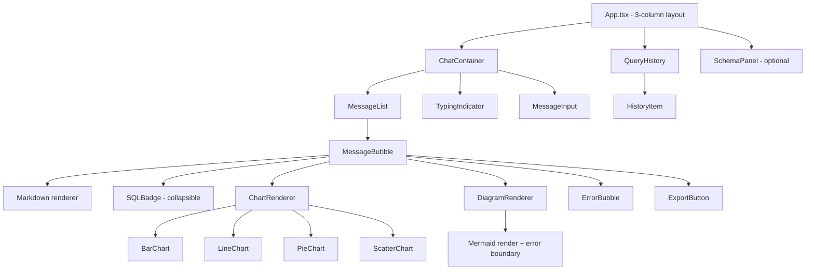
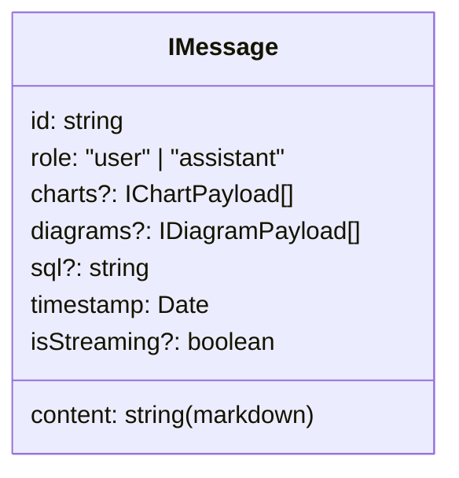
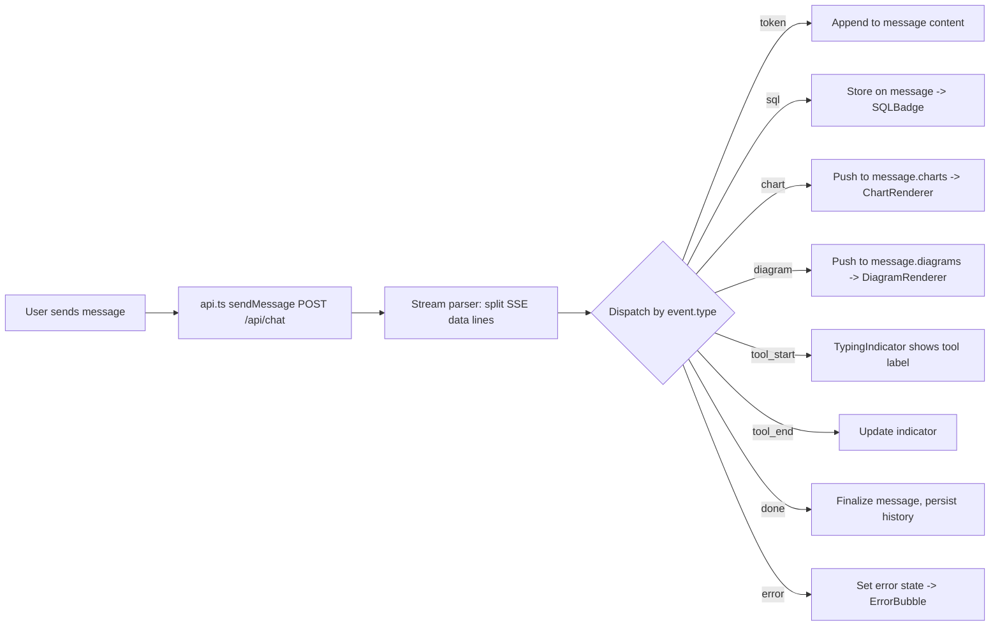

# 09 — Frontend Architecture: DataFlow AI

**Document Class**: Architecture Repository — Frontend Architecture
**Project**: DataFlow AI — Conversational Database Analytics
**Status**: Final — the React application architecture: component tree, state management, SSE consumption, rendering pipeline, and responsive behavior.

---

## Purpose

This document specifies the complete frontend architecture of DataFlow AI: the React 18 + Vite + Tailwind application that presents the ChatGPT-like interface. It covers the component tree, the message/stream state model, the SSE consumption pipeline (how raw events become rendered UI), the visualization rendering delegation, session/history persistence, and responsive behavior. It is the implementation reference for Dev B (`17_DeveloperB.md`) and pairs with `27_UI_UX_Documentation.md` (visual design) and `08_APIArchitecture.md` (the contract consumed).

---

## Overview

The frontend is a single-page React application with three regions:

1. **Left sidebar** — query history (localStorage-backed, re-runnable).
2. **Center chat panel** — message list, input bar, typing indicator.
3. **Right schema panel** (optional toggle) — live database schema from `GET /api/schema`.

All chat traffic flows through one hook (`useChat`) that owns the SSE connection lifecycle and the message state machine. Rendering is delegated: markdown → text renderer; `chart` events → ChartRenderer (Recharts); `diagram` events → DiagramRenderer (Mermaid); `sql` events → SQLBadge; `error` events → ErrorBubble.

---

## 1. Component Tree

All components are presentational except hooks:

| Layer | Components | Concern |
|-------|-----------|---------|
| Shell | `App`, `SchemaPanel` | Layout, panes |
| Chat | `ChatContainer`, `MessageList`, `MessageBubble`, `MessageInput`, `TypingIndicator`, `ErrorBubble` | Conversation UX |
| Visualization | `ChartRenderer` + 4 charts, `DiagramRenderer` | Event → visual |
| Utilities | `QueryHistory`, `HistoryItem`, `SQLBadge`, `ExportButton`, `Button`, `Spinner` | Side features |
| Hooks | `useChat`, `useQueryHistory`, `useExport` | State + side effects |
| Services | `api.ts` | HTTP/SSE transport |

---

## 2. State Model

### 2.1 Message Model

- User messages: appended immediately on send.
- Assistant messages: created empty on first `tool_start`/`token`; content accumulates; `isStreaming` shows a blinking cursor until `done`.

### 2.2 Connection State

| State | Meaning | UI |
|-------|---------|-----|
| `idle` | No active request | Input enabled |
| `connecting` | Request sent, stream not yet opened | Input disabled, spinner |
| `streaming` | Receiving events | TypingIndicator (tool label) then live text |
| `error` | Terminal error event | ErrorBubble + retry |
| `done` | `done` event received | Finalize message; re-enable input |

The state machine lives entirely in `useChat`; components never manage connection state themselves.

---

## 3. SSE Consumption Pipeline

The frontend uses `fetch` + `ReadableStream` (EventSource cannot send POST bodies — a known limitation the design explicitly avoids):

Key design points:

- The parser is a pure function (event string → typed object) — unit-testable in isolation.
- `token` events accumulate into the streaming message; React renders per batch (no re-render per character — performance decision, `25_PerformanceOptimization.md`).
- `chart`/`diagram` events are pushed into arrays on the message; renderers mount as soon as data arrives, so charts appear *during* generation, before the final text finishes — a deliberate UX flourish.
- Unknown event types are ignored defensively (forward compatibility).

---

## 4. Rendering Delegation

| Event | Renderer | Fallback |
|-------|----------|----------|
| `chart` (bar/line/pie/scatter) | Recharts component chosen by `chart_type`; shared palette; tooltips; responsive container (100% × 300px) | Render error → table fallback of `data` |
| `diagram` (er/flowchart/sequence) | Mermaid.js via `@mermaid-js/mermaid-react`; error boundary | Boundary catch → raw Mermaid source in `<pre>` |
| `sql` | Collapsible SQLBadge with syntax highlight + copy | — |
| `error` | ErrorBubble (friendly copy + code + retry) | — |

### 4.1 ChartRenderer Contract

Input: `IChartPayload {chart_type, title, data, config}`.
Output: the matching Recharts composition (XAxis from `x_key`, YAxis from `y_key`, tooltip, legend when relevant, `color` from config or palette default `#6366f1`).

### 4.2 DiagramRenderer Contract

Input: `IDiagramPayload {diagram_type, title?, mermaid}`.
Output: Mermaid SVG inside a bordered card; fullscreen toggle for large diagrams; download SVG affordance.

---

## 5. Session & History

| Concern | Mechanism |
|---------|-----------|
| Session identity | `session_id` generated client-side (crypto.randomUUID) on first load; kept in memory/state |
| History persistence | localStorage keyed per session; `useQueryHistory` CRUD (add on `done`, re-run, delete item, clear all) |
| Restore | `GET /api/session/{id}/history` on reload to rebuild message list |
| Schema panel | `GET /api/schema` on toggle; cached in memory |

---

## 6. Responsive Behavior

| Breakpoint | Layout |
|------------|--------|
| > 1024 px | 3 columns (history / chat / schema) |
| 768–1024 px | 2 columns; history behind hamburger |
| < 768 px | 1 column; history + schema as bottom sheets |

Design decisions: chat remains primary on all sizes (the demo laptop is ≥ 1024 px; mobile support is courtesy, not critical path).

---

## 7. Frontend Design Decisions

| Decision | Why |
|----------|-----|
| `useChat` owns all stream state | One state machine; components stay presentational and testable |
| fetch + ReadableStream over EventSource | EventSource cannot POST; streaming must begin from a request body |
| Charts render incrementally mid-generation | Judges see the "thinking → doing" progression; UX rubric reward |
| Pure SSE parser | Unit-testable contract handling; unknown events ignored safely |
| Renderers keyed by event type | Adding a new visualization = new renderer + type, no UI surgery |
| localStorage history (no backend) | Zero backend state; instant re-run; bonus feature with minimal cost |
| No state library (no Redux/Zustand) | Two hooks suffice; fewer deps for a 2-day sprint |

---

## 8. Responsibilities, Dependencies, Advantages, Limitations, Future Scope

**Responsibilities**: `api.ts` = transport; `useChat` = stream/state; renderers = visualization; shell = layout.
**Dependencies**: backend contract (`08_APIArchitecture.md`), Recharts, Mermaid, react-markdown, Tailwind, html2canvas (export).
**Advantages**: fast iteration (Vite HMR), incremental rendering, one testable parser, clean split of concerns, no merge conflicts with backend work.
**Limitations**: no offline mode (LLM calls require network); localStorage per-browser; streaming state lives only in memory (history fetch on reload).
**Future scope**: WebSocket transport, voice input (Web Speech API), dashboard builder, i18n, PWA installability.

---

## Summary

The frontend is a React 18 SPA built around a single streaming hook: `useChat` owns the fetch-based SSE connection and a five-state machine, a pure parser converts the eight typed events into UI state, and rendering is delegated to specialized components (Recharts charts, Mermaid diagrams, SQL badge, error bubble) that mount incrementally during generation. History is localStorage-backed, the layout is responsive in three tiers, and every choice prioritizes the judge-visible UX (streaming, transparency, graceful errors) with minimal dependency surface.

---

*Next document: `10_BackendArchitecture.md` — FastAPI module structure, async design, session management, and configuration.*
