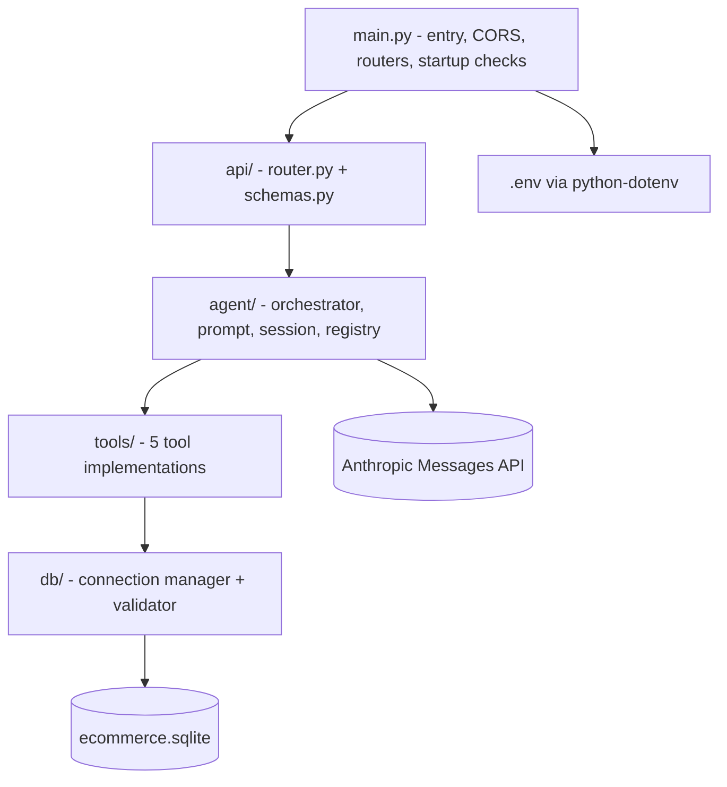
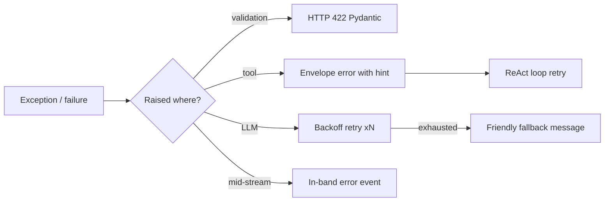

# 10 — Backend Architecture: DataFlow AI

**Document Class**: Architecture Repository — Backend Architecture
**Project**: DataFlow AI — Conversational Database Analytics
**Status**: Final — the FastAPI backend: module structure, async execution model, session management, configuration, and startup behavior.

---

## Purpose

This document specifies the complete backend architecture of DataFlow AI: the FastAPI application structure (entry, API layer, agent layer, tool layer, data layer), the async execution model that makes SSE streaming and tool calls work, session lifecycle, configuration management, and startup/shutdown behavior. It is the implementation reference for Dev A (`16_DeveloperA.md`); agent internals are detailed in `05_AgentArchitecture.md` and tool internals in `30_ToolSpecifications.md`.

---

## Overview

The backend is a Python 3.11+ FastAPI application organized in four layers with strict inward dependency (API → agent → tools → data):



| Layer | Modules | Responsibility |
|-------|---------|----------------|
| Entry | `main.py` | App factory, CORS, router registration, startup DB probe, health |
| API | `api/router.py`, `api/schemas.py` | HTTP/SSE endpoints, Pydantic validation |
| Agent | `agent/orchestrator.py`, `agent/prompt.py`, `agent/session.py`, `agent/tool_registry.py` | LLM loop, memory, dispatch |
| Tools | `tools/*.py` | The five function-calling tools |
| Data | `db/connection.py`, `db/validator.py` | Async SQLite access, SELECT-only guard |

---

## 1. Async Execution Model

| Concern | Design |
|---------|--------|
| Framework async | FastAPI async endpoints; everything in the request path is `async` (aiosqlite, Anthropic async SDK) |
| SSE streaming | `StreamingResponse` over an async generator that yields `data: {json}\n\n` lines |
| Concurrent tool calls | Tools are awaited sequentially in v1 (deterministic ordering); the async model allows parallel execution as future scope |
| Blocking work | None expected; if introduced, offload to a thread pool (`run_in_executor`) |
| Timeouts | Per-tool `TOOL_TIMEOUT_SECONDS=30`; LLM call timeout; loop bound `MAX_TOOL_ITERATIONS=8` |

The design ensures a single chat request never blocks the event loop — multiple judges could chat concurrently without interference.

---

## 2. Module Structure

```
backend/
├── main.py              # FastAPI entry: CORS, routers, startup probe, /api/health
├── requirements.txt
├── Dockerfile
├── .env
├── api/
│   ├── router.py        # Chat Router + session/schema/export endpoints
│   └── schemas.py       # Pydantic models (ChatRequest, HistoryResponse, ...)
├── agent/
│   ├── orchestrator.py  # ReAct loop, SSE event emission
│   ├── prompt.py        # System prompt + tool rules
│   ├── session.py       # In-memory sessions, 10-turn window, schema cache
│   └── tool_registry.py # name → implementation dispatch
├── tools/
│   ├── get_schema.py
│   ├── execute_query.py
│   ├── generate_chart.py
│   ├── generate_flowchart.py
│   └── explain_data.py
├── db/
│   ├── connection.py    # aiosqlite manager, result serialization
│   └── validator.py     # SELECT-only enforcement
└── tests/
    ├── conftest.py
    ├── test_tools.py
    ├── test_agent.py    # integration-marked (real Claude)
    ├── test_api.py
    └── test_db.py
```

---

## 3. Router Design (Thin)

The Chat Router is intentionally thin:

1. Validate body (Pydantic → 422).
2. Resolve/create session (400 `INVALID_SESSION` on failure).
3. Hand control to the orchestrator via an async generator.
4. Stream every yielded event; wrap the whole stream so mid-stream exceptions become in-band `error` events (never a broken pipe).

All agent logic lives in the orchestrator — the router contains no LLM or tool code. This separation is a deliberate Architecture-rubric signal.

---

## 4. Session Management

| Concern | Design |
|---------|--------|
| Storage | In-memory dict `{session_id: Session}` |
| Content | Message records (role/content/timestamp/charts/sql) + schema cache + turn counter |
| Window | Last 10 user+assistant turns replayed to the LLM |
| Lifecycle | Created on first `POST /api/chat`; cleared via `DELETE /api/session/{id}`; lost on restart (documented) |
| Concurrency | A single session is served sequentially; different sessions run independently |

The session layer is deliberately dependency-free (no Redis) — the stateless-backend decision (NFR-5) trades durability for zero infrastructure risk.

---

## 5. Configuration

| Variable | Default | Used By |
|----------|---------|---------|
| `ANTHROPIC_API_KEY` | — (required) | Anthropic SDK |
| `DATABASE_PATH` | `../database/ecommerce.sqlite` | connection manager |
| `CORS_ORIGIN` | `http://localhost:5173` | CORS middleware |
| `MODEL` | `claude-sonnet-4-6` | orchestrator |
| `MAX_TOKENS` | `4096` | orchestrator |
| `MAX_TOOL_ITERATIONS` | `8` | orchestrator |
| `MAX_HISTORY_TURNS` | `10` | session |
| `TOOL_TIMEOUT_SECONDS` | `30` | tool execution |

- Loaded via `python-dotenv` at import.
- `.env.example` committed with placeholders; `.env` gitignored (security requirement).
- No hardcoded keys anywhere; verified by grep before submission.

---

## 6. Startup & Health

| Step | Behavior |
|------|----------|
| Startup | Load env → create app → register CORS → include routers → probe database (open file, read `sqlite_master`) |
| Probe failure | Log warning; `/api/health` reports `database: disconnected`; chat still starts and fails gracefully per tool |
| `/api/health` | `{status, database, claude_api, version}` — used by Docker healthcheck (interval 10s, timeout 5s, retries 3) |
| Shutdown | Close any pooled connections (aiosqlite context) |

Fail-fast on DB at startup is avoided deliberately: a missing DB at boot should not prevent the UI from loading and showing a friendly health state.

---

## 7. Error Handling Pipeline



Full taxonomy and UX mapping: `24_ErrorHandlingStrategy.md`.

---

## 8. Backend Design Decisions

| Decision | Why |
|----------|-----|
| Four-layer strict dependency | Single direction of imports — testable, reviewable, rubric-clear |
| Thin router / thick orchestrator | Separation of transport from agent logic; SSE edge cases isolated |
| async everywhere | SSE + LLM I/O are I/O-bound; async keeps one process serving all sessions |
| In-memory sessions | Zero infra; stateless backend requirement |
| Env-driven configuration | One codebase for dev/container/judge-machine |
| Startup probe without hard fail | UI always loads; failures surface gracefully |
| In-band SSE errors | Stream already open; HTTP status codes cannot carry mid-stream failures |

---

## 9. Responsibilities, Dependencies, Advantages, Limitations, Future Scope

**Responsibilities**: main = wiring; router = transport; orchestrator = agent loop; session = memory; registry = dispatch; tools = execution; db = access + safety.
**Dependencies**: FastAPI, uvicorn, aiosqlite, anthropic SDK, pydantic, python-dotenv.
**Advantages**: async throughput, auto OpenAPI docs, small module graph (auditable by judges), graceful degradation at every layer, Docker-ready.
**Limitations**: volatile sessions; single worker scale model (async covers demo loads); SQLite write concurrency limits (read-only app — fine).
**Future scope**: Redis sessions, worker processes, structured logging (OpenTelemetry), API keys per session, rate limiting, multi-model fallback.

---

## Summary

The backend is a four-layer async FastAPI application: a thin router streams SSE events produced by a custom agent orchestrator; sessions are in-memory with a 10-turn window and schema cache; five tools execute behind a registry; a SELECT-only validator and aiosqlite connection manager guard the data layer; and all configuration flows from `.env`. The design favors auditability, graceful failure, and a single event loop that keeps streaming fast — exactly what a judge-facing live demo requires.

---

*Next document: `11_VisualizationArchitecture.md` — charts: type selection, Recharts pipeline, theming, embedding.*
