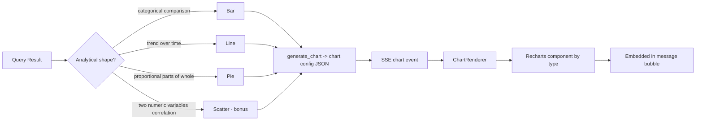
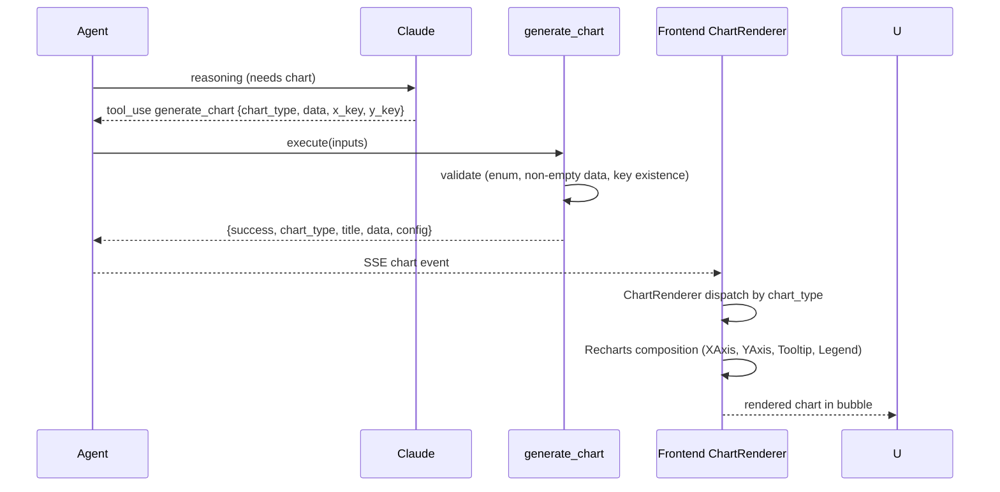
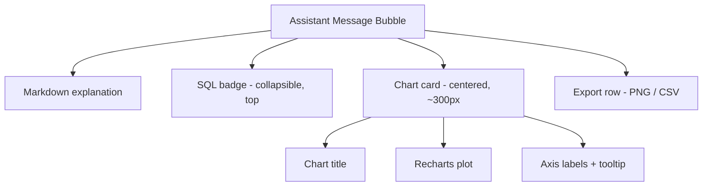

# 11 — Visualization Architecture: DataFlow AI

**Document Class**: Architecture Repository — Visualization Architecture
**Project**: DataFlow AI — Conversational Database Analytics
**Status**: Final — the chart visualization subsystem: type-selection logic, the chart-config pipeline, theming, and in-chat embedding.

---

## Purpose

Visualization Quality is 20% of the rubric and is the most visible part of the demo. This document specifies the chart subsystem of DataFlow AI: how the agent decides which chart to draw, how chart config JSON flows from the tool to the Recharts renderer, how theming keeps every chart aesthetically consistent, and how charts embed in chat. The diagram subsystem (Mermaid) has its own document (`12_FlowchartArchitecture.md`).

---

## Overview

Charts are **config-driven, not pixel-driven**: the LLM's `generate_chart` tool returns a JSON config (`chart_type`, `data`, `x_key`, `y_key`, labels, color); the frontend renders it with Recharts. The backend never renders images; the frontend never guesses chart structure. This split is the architectural core of the visualization pipeline.

---

## 1. Chart Type Selection (Agent-Level Logic)

Selection rules are encoded in the system prompt so the agent chooses by **analytical fit** — the rubric's "appropriate choices" criterion:

| Data Shape | Chart Type | When |
|-----------|------------|------|
| Categories vs value (few categories) | Bar | "top 5 products by revenue", "revenue by category" |
| Time series | Line | "monthly trend over the last year" |
| Parts of a whole | Pie | "order status distribution" |
| Two numeric variables | Scatter (bonus) | "price vs quantity correlation" |

The system prompt instructs: prefer bar over pie when categories are many; use line only for time-ordered data; never force a chart when a table is clearer.

---

## 2. The Chart-Config Pipeline (End-to-End)

### Validation Guarantees (tool side)

| Rule | Behavior on Failure |
|------|---------------------|
| `chart_type` in enum | Error envelope: "chart_type X is not supported. Use: bar, line, pie, scatter" |
| `data` non-empty | Error envelope: no chart from empty rows |
| `x_key`/`y_key` exist in data | Error envelope listing available columns |
| Row count reasonable | Frontend table fallback if render fails |

The result: a malformed LLM call can never produce a blank or broken chart in the demo.

---

## 3. Renderer Design (Recharts)

| Chart | Recharts Composition | Styling |
|-------|----------------------|---------|
| Bar | BarChart + CartesianGrid + XAxis(x_key) + YAxis(y_key) + Tooltip + Bar | fill = config.color or palette default; rounded bars |
| Line | LineChart + axes + Tooltip + Line with dots | stroke = config.color; smooth curve off (truthful lines) |
| Pie | PieChart + Cells per category + Tooltip + Legend | palette cycle per slice |
| Scatter | ScatterChart + axes + Tooltip + Scatter | palette color; semi-transparent |

Common behaviors:

- Responsive container (width 100%, height ~300px) via `ResponsiveContainer`.
- Shared tooltip styling (dark surface, muted text).
- Axis labels from `x_label`/`y_label` when provided.
- Legend only when meaningful (pie; multi-series).
- Empty-data guard: renderer shows "No data to display" instead of a blank canvas.

---

## 4. Theming (Visual Consistency)

| Token | Value | Use |
|-------|-------|-----|
| Palette | `#6366f1 #8b5cf6 #06b6d4 #10b981 #f59e0b` | Series colors (cycled) |
| Default color | `#6366f1` | Single-series charts |
| Background | `#0f0f13` (app) / `#1a1a24` (surface) | Chart container inherits |
| Text | `#f1f0ff` primary, `#8b8ba7` muted | Axis ticks/labels |
| Grid | `#2a2a3a` | Cartesian grid lines |
| Border | `#2a2a3a` | Chart card border |

Consistency rules: charts never exceed the palette; tooltips always match the dark theme; grid always subtle. The rubric's "aesthetics" component is served by a system, not luck.

---

## 5. In-Chat Embedding

Order within the bubble (deliberate): SQL (transparency) → chart (evidence) → explanation (conclusion). Judges see cause → data → insight.

---

## 6. Export (Bonus)

| Format | Mechanism |
|--------|-----------|
| PNG | html2canvas captures the chart container → download |
| CSV | `POST /api/export/csv` with the executed SQL → server-side CSV → download |
| SVG (diagrams only) | Mermaid SVG DOM serialization |

Export is a low-effort, high-visibility bonus (Innovation rubric) — `29_FeatureSpecifications.md` B3.

---

## 7. Visualization Design Decisions

| Decision | Why |
|----------|-----|
| Config-driven (JSON) not image-driven | LLM writes config, not pixels; frontend renders; no binary transport; inspectable payloads |
| Type selection by analytical fit, encoded in prompt | "Appropriate choices" is a scored criterion; rules make it deterministic |
| Recharts over Chart.js/Plotly/D3 | React-native, 4 types out of box, responsive, themeable, light enough (D3 decision log in `03_HighLevelDesign.md` D5) |
| Shared palette with token system | Aesthetic consistency is scored; one palette = consistent output |
| Validation inside the chart tool | Malformed LLM calls degrade gracefully, never break the render |
| Table fallback on render failure | The conversation never dead-ends on a visualization problem |

---

## 8. Responsibilities, Dependencies, Advantages, Limitations, Future Scope

**Responsibilities**: agent = type choice; tool = config validation; renderer = composition; theme = consistency; export = capture.
**Dependencies**: generate_chart tool, SSE chart event, Recharts, html2canvas (export).
**Advantages**: deterministic charts, testable configs, rubric-aligned theming, incremental rendering (chart appears mid-generation), cheap export.
**Limitations**: Recharts customization ceiling (accepted tradeoff); canvas export fidelity (html2canvas); no 3D/interactive-animation depth (not needed).
**Future scope**: multi-series charts, chart annotations, dashboard builder with pinned charts, PDF report export, animated transitions.

---

## Summary

The visualization architecture is a config-driven pipeline: the agent selects chart type by analytical fit, `generate_chart` validates and packages a chart config, an SSE event carries it to the frontend, and a Recharts renderer composes it inside the message bubble with a shared palette, dark-theme tooltips, and table fallbacks. Every layer is deterministic and rubric-aligned — appropriate choices (20% criterion), aesthetic consistency, and zero broken charts during the live demo.

---

*Next document: `12_FlowchartArchitecture.md` — Mermaid diagrams: ER, process flows, rendering, and error containment.*
