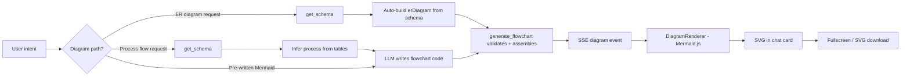
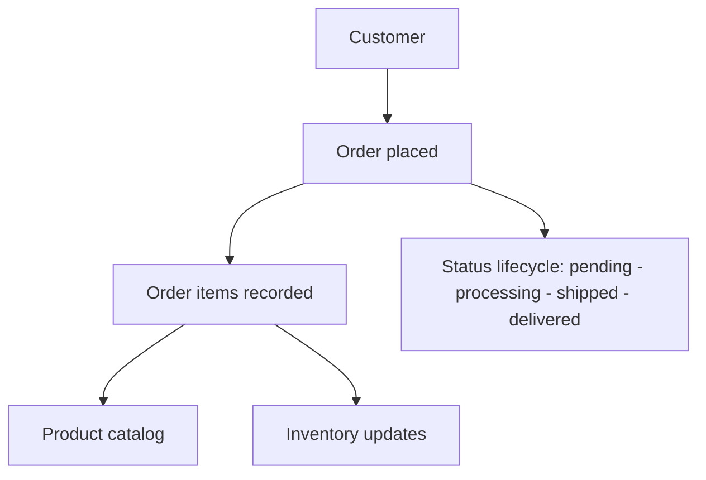
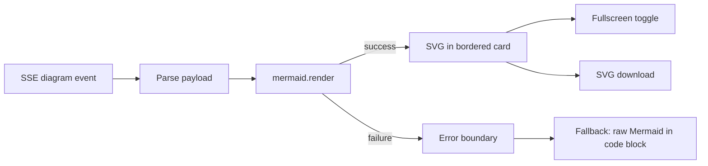

# 12 — Flowchart Architecture: DataFlow AI

**Document Class**: Architecture Repository — Flowchart (Diagram) Architecture
**Project**: DataFlow AI — Conversational Database Analytics
**Status**: Final — the diagram subsystem: ER diagrams, process flowcharts, sequence diagrams, generation paths, rendering, and error containment.

---

## Purpose

Diagrams are the second visualization pillar (minimum 2 types required: ER + process flow; decision trees are bonus). This document specifies the diagram subsystem of DataFlow AI: the `generate_flowchart` tool's generation paths (auto-ER from schema, pass-through Mermaid), the Mermaid.js rendering pipeline in the frontend, full-screen/export affordances, and the error-containment strategy that guarantees a bad diagram never breaks the chat.

---

## Overview

Diagrams are text-first: the LLM produces Mermaid source (or the tool auto-generates ER from schema JSON); the frontend renders it with Mermaid.js. Because Mermaid is text, the LLM can write it natively and the backend never parses diagram syntax — the tool's job is validation and assembly, not rendering.

---

## 1. Diagram Types (Supported)

| Type | Enum | Purpose | Example |
|------|------|---------|---------|
| ER | `er` | Entity relationships | UC2 "Draw me the ER diagram" |
| Flowchart | `flowchart` | Process/workflow | UC3 "how orders flow through our system" |
| Sequence | `sequence` | Interaction timelines | Bonus: explain tool orchestration |

Decision trees (`flowchart` with branch logic) are achievable through the same path and are documented as bonus scope.

---

## 2. Generation Paths (generate_flowchart)

| Path | Input | Behavior |
|------|-------|----------|
| A — Auto-ER | `schema_data` (from get_schema) | Tool builds `erDiagram` from tables, PKs, FKs — deterministic, no LLM involvement |
| B — Pass-through | `mermaid_code` (LLM-written) | Tool validates structure and returns as-is |
| C — Neither | — | Error envelope: diagram_type validation + guidance to provide code or schema |

### Path A mechanics (design-level)

For each table: `TABLE { type col PK/FK }` block; for each FK: `PARENT ||--o{ CHILD : "label"`. The tool derives cardinality from PK/FK presence (1:N in all sample relationships). This path guarantees UC2 works even if the LLM's hand-written Mermaid is imperfect — reliability through determinism.

### Path B validation

| Check | Failure Behavior |
|-------|------------------|
| `diagram_type` in enum | Error: "diagram_type X is not supported. Use: er, flowchart, sequence" |
| `mermaid_code` non-empty | Error: provide code |
| code mentions the declared type (`erDiagram`/`flowchart`/`sequenceDiagram`) | Error: type mismatch hint |
| Basic syntax markers present | Error: malformed diagram hint |

The LLM then self-corrects via the error envelope (ReAct recovery, `05_AgentArchitecture.md` §5).

---

## 3. Process-Flow Inference (UC3)

For "how do orders flow through our system", the agent:

1. Calls `get_schema` to see tables + FKs.
2. Identifies the chain: `customers → orders → order_items → products` (+ `inventory`).
3. States assumptions explicitly (e.g., "assuming flow starts at customer checkout").
4. Writes a `flowchart TD` Mermaid diagram of the chain.

This deterministic chain is the demo script for UC3; the diagram must match it (`20_TestingStrategy.md` scenario 3).

---

## 4. Rendering Pipeline (Frontend)

| Concern | Design |
|---------|--------|
| Library | Mermaid.js 10.x via `@mermaid-js/mermaid-react` |
| Async safety | Render triggered in effect; loading skeleton while rendering |
| Card | Bordered surface card, title, fullscreen icon, download |
| Error containment | React Error Boundary + try/catch around render → raw source fallback (never a white screen) |
| Security | Mermaid `securityLevel` configured to strict (no HTML/script injection from LLM output) — `23_SecurityDesign.md` |

---

## 5. Design Decisions

| Decision | Why |
|----------|-----|
| Text-first Mermaid over image generation | LLM writes diagram code natively; backend stays render-free; diffs/review easy; brief explicitly suggests Mermaid |
| Auto-ER from schema as a tool capability | Deterministic fallback for UC2; judges see correct ER even if LLM Mermaid is imperfect |
| Pass-through validation over full Mermaid parsing | Backend validates structure, not syntax — no fragile parser; renderer is the syntax authority |
| Error boundary + raw fallback | A malformed diagram degrades to readable source instead of breaking the session |
| Strict Mermaid security level | LLM output is untrusted; prevents script injection in SVG |
| Assumption surfacing for inferred flows | Trust: judges see the agent's reasoning about process structure |

---

## 6. Responsibilities, Dependencies, Advantages, Limitations, Future Scope

**Responsibilities**: agent = flow inference + code writing; tool = validation + auto-ER assembly; renderer = Mermaid render + fallback.
**Dependencies**: generate_flowchart tool, SSE diagram event, Mermaid.js, schema JSON (auto-ER).
**Advantages**: deterministic UC2, graceful degradation, text-based artifacts (judge-inspectable), secure rendering, no server-side diagram infrastructure.
**Limitations**: Mermaid syntax errors surface at render time (mitigated by fallback); complex diagrams need fullscreen; layout control is Mermaid-internal.
**Future scope**: decision trees, timeline diagrams, diagram export as PNG/PDF, edit-in-chat for diagrams, Graphviz path for advanced layouts.

---

## Summary

The diagram subsystem is text-first and deterministic-by-design: `generate_flowchart` either auto-builds an ER diagram from schema JSON or validates LLM-written Mermaid, an SSE `diagram` event carries the source to the frontend, and Mermaid.js renders it in a chat card with a strict error boundary that falls back to raw source. ER (UC2), process flow (UC3), and sequence diagrams are all supported with secure rendering and explicit assumption surfacing — completing the second mandatory visualization pillar.

---

*Next document: `13_ProjectStructure.md` — the full repository layout and naming conventions.*
