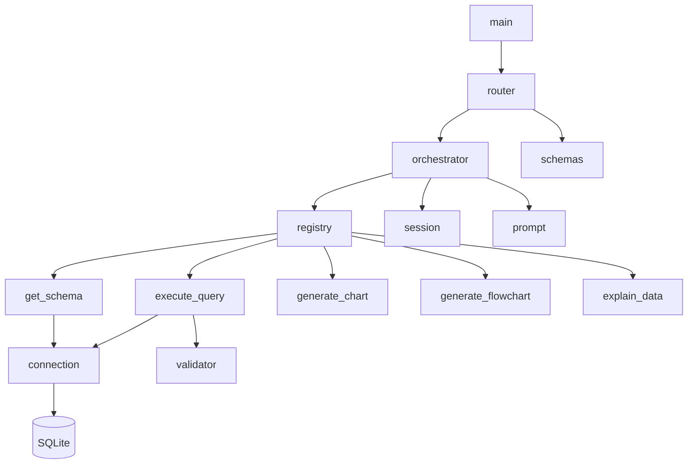
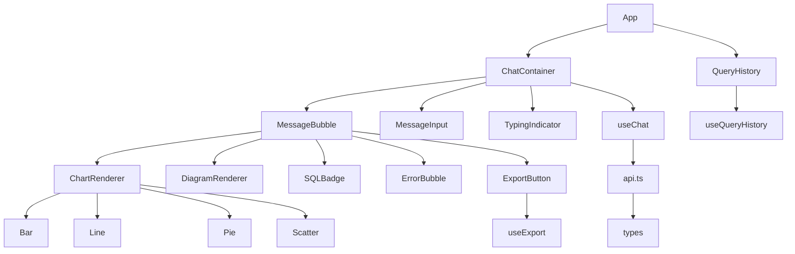

# 14 — Module Breakdown: DataFlow AI

**Document Class**: Architecture Repository — Module Breakdown
**Project**: DataFlow AI — Conversational Database Analytics
**Status**: Final — the module map: every module with its public interface, dependencies, and build priority.

---

## Purpose

This document provides the exhaustive module inventory of DataFlow AI — the granular counterpart of `04_ComponentArchitecture.md`. For every module it records: responsibility, public interface (what other modules call), dependencies (what it calls), and build priority. It is the direct input to the developer plans (`16_DeveloperA.md`, `17_DeveloperB.md`) and the roadmap (`19_ImplementationRoadmap.md`).

---

## Overview

The system comprises **17 backend modules** and **19 frontend modules**, organized in dependency layers. Backend dependencies flow one direction (api → agent → tools → db); frontend dependencies flow shell → chat → visualization/hooks → services.

---

## 1. Backend Modules

| # | Module | Responsibility (Interface) | Depends On | Priority |
|---|--------|---------------------------|------------|----------|
| B1 | `main.py` | App factory, CORS, router registration, startup probe (`app`, `/api/health`) | api.router, db.connection, env | P0 |
| B2 | `api/router.py` | HTTP/SSE endpoints (`chat()`, `history()`, `schema()`, `export_csv()`) | orchestrator, session, schemas | P0 |
| B3 | `api/schemas.py` | Pydantic models (`ChatRequest`, `HistoryResponse`, …) | pydantic | P0 |
| B4 | `agent/orchestrator.py` | ReAct loop, SSE event emission (`process_message()`) | registry, session, prompt, anthropic SDK | P0 |
| B5 | `agent/prompt.py` | System prompt content (`SYSTEM_PROMPT`) | — | P0 |
| B6 | `agent/session.py` | Session store (`get_or_create`, `add_turn`, `clear`, schema cache) | — | P0 |
| B7 | `agent/tool_registry.py` | Dispatch (`execute(name, **inputs)`) | tools.* | P1 |
| B8 | `tools/get_schema.py` | Schema discovery (`get_schema(table_filter?)`) | db.connection | P0 |
| B9 | `tools/execute_query.py` | Safe SELECT execution (`execute_query(sql, limit)`) | db.connection, db.validator | P0 |
| B10 | `tools/generate_chart.py` | Chart config assembly (`generate_chart(...)`) | — | P1 |
| B11 | `tools/generate_flowchart.py` | Mermaid assembly (`generate_flowchart(...)`) | — (schema_data passed in) | P1 |
| B12 | `tools/explain_data.py` | Metric computation (`explain_data(data, columns, ...)`) | — | P1 |
| B13 | `db/connection.py` | Async SQLite manager (`execute`, result serialization) | aiosqlite, env | P0 |
| B14 | `db/validator.py` | SQL safety (`validate(sql) → (bool, msg)`) | — | P0 |
| B15 | `tests/conftest.py` | Fixtures (test DB, session factory) | pytest, db | P1 |
| B16 | `tests/test_tools.py` | Tool unit tests | tools.*, pytest | P1 |
| B17 | `tests/test_agent.py`, `test_api.py`, `test_db.py` | Agent/API/validator tests | pytest, httpx | P2 |

### Backend dependency graph

---

## 2. Frontend Modules

| # | Module | Responsibility (Interface) | Depends On | Priority |
|---|--------|---------------------------|------------|----------|
| F1 | `main.tsx` | React bootstrap | App | P0 |
| F2 | `App.tsx` | 3-column layout, panes | chat, sidebar, hooks | P0 |
| F3 | `ChatContainer.tsx` | Message list + input wiring (`messages`, `onSend`) | useChat, MessageBubble, MessageInput, TypingIndicator | P0 |
| F4 | `MessageBubble.tsx` | Assistant/user message composition | markdown, SQLBadge, ChartRenderer, DiagramRenderer, ErrorBubble | P0 |
| F5 | `MessageInput.tsx` | Textarea, send, disabled state (`onSend(text)`) | — | P0 |
| F6 | `TypingIndicator.tsx` | Dots + tool label (`toolLabel`) | useChat state | P0 |
| F7 | `hooks/useChat.ts` | Stream state machine (`messages`, `sendMessage`, `isStreaming`) | api.ts, types | P0 |
| F8 | `services/api.ts` | SSE client (`sendMessage() → AsyncGenerator<SSEEvent>`) | types | P0 |
| F9 | `types/index.ts` | Shared contract (8 event types, IMessage) | — | P0 |
| F10 | `ChartRenderer.tsx` | Chart dispatch (`payload: IChartPayload`) | 4 chart components | P1 |
| F11 | `BarChart/LineChart/PieChart/ScatterChart.tsx` | Recharts compositions | Recharts, theme tokens | P1 |
| F12 | `DiagramRenderer.tsx` | Mermaid render + boundary (`payload: IDiagramPayload`) | mermaid-react | P1 |
| F13 | `SQLBadge.tsx` | Collapsible SQL panel (`sql: string`) | highlight, clipboard | P1 |
| F14 | `ErrorBubble.tsx` | Error presentation (`error: IError`) | — | P1 |
| F15 | `QueryHistory.tsx` / `HistoryItem.tsx` | History list UI | useQueryHistory | P2 |
| F16 | `hooks/useQueryHistory.ts` | localStorage CRUD (`add`, `remove`, `clear`, `rerun`) | — | P2 |
| F17 | `ExportButton.tsx` | PNG/CSV export (`onExport(type)`) | useExport, api.ts | P2 |
| F18 | `hooks/useExport.ts` | Capture + download logic | html2canvas | P2 |
| F19 | `styles/globals.css`, `Button`, `Spinner` | Theme tokens + primitives | Tailwind | P0 |

### Frontend dependency graph

---

## 3. Cross-Module Contracts (Non-Negotiable)

| Contract | Defined In | Consumers |
|----------|-----------|-----------|
| SSE event vocabulary (8 types) | `types/index.ts` + `08_APIArchitecture.md` | F8, F7, F10, F12 |
| Tool input/output envelopes | `30_ToolSpecifications.md` | B7 → B8..B12 |
| Result serialization `{columns, rows, row_count}` | `07_DatabaseDesign.md` | B9, B13 |
| Error codes | `08_APIArchitecture.md` §4 | B2, F14 |

---

## 4. Build Priority (P0 → P2)

| Priority | Modules | Rationale |
|----------|---------|-----------|
| P0 (Day 1 morning) | B1–B9, B13, B14; F1–F9, F19 | The vertical slice: chat UI ↔ SSE ↔ tools ↔ DB |
| P1 (Day 1 afternoon – Day 2 morning) | B10–B12, B15, B16; F10–F14 | Visualization + error UX + unit tests |
| P2 (Day 2 afternoon) | B17; F15–F18 | History, export, integration tests, polish |

Cut order for the 2-day sprint follows this priority (see `19_ImplementationRoadmap.md` §5).

---

## 5. Design Decisions

| Decision | Why |
|----------|-----|
| Module map mirrors file tree 1:1 | Anyone can navigate from architecture to code without a map legend |
| Interfaces named by responsibility, not type | `sendMessage`, `process_message` read as actions; intent is obvious |
| Priority = demo-criticality | P0 is the streaming vertical slice (UX+Functionality); P1 is visualization (Functionality+Visualization); P2 is polish/bonus |
| Strict acyclic dependencies | Backend: api→agent→tools→db; frontend: shell→chat→hooks→services — testability and review speed |

---

## 6. Advantages, Limitations, Future Scope

**Advantages**: complete traceability module→owner→priority→test; acyclic graphs make isolated testing trivial; cut-order is derived, not invented.
**Limitations**: sequential tool execution means registry fan-out is serial (accepted); frontend bubble composition is the densest module (mitigated by delegation).
**Future scope**: new tools slot into the registry (B7) without touching orchestrator; new visualizations slot into renderers (F10/F12); a `packages/shared` workspace can lift `types/index.ts` for reuse.

---

## Summary

The module breakdown inventories 17 backend and 19 frontend modules with exact interfaces, acyclic dependency graphs, and three build priorities that map directly onto the 2-day sprint. The SSE contract, tool envelopes, result serialization, and error codes are the four non-negotiable cross-module contracts. With this map, two developers can build in parallel with zero interface ambiguity, and any dropped scope is a P2 cut, never a core-architecture change.

---

*Next document: `15_DeveloperWorkflow.md` — git strategy, daily cadence, and checkpoints.*
