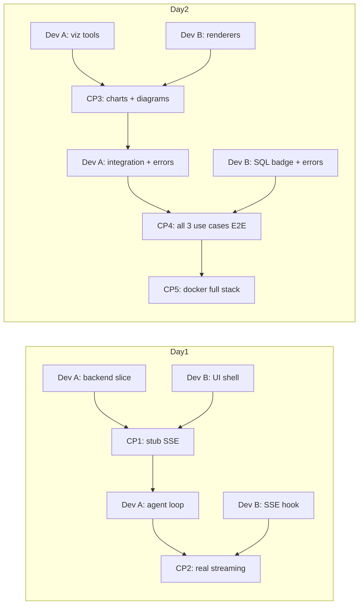

# 15 — Developer Workflow: DataFlow AI

**Document Class**: Architecture Repository — Developer Workflow
**Project**: DataFlow AI — Conversational Database Analytics
**Status**: Final — how the 2-developer team works: git strategy, branch discipline, daily cadence, checkpoints, and communication rules for a 2-day production sprint.

---

## Purpose

This document defines the operational workflow for the two developers building DataFlow AI in a 2-day sprint (Aug 4–5, 2026): version-control strategy, branch discipline, commit conventions, the daily cadence with integration checkpoints, and the communication rules that keep two people building in parallel without colliding. It is the process companion to the technical plans in `16_DeveloperA.md` and `17_DeveloperB.md`.

---

## Overview

Two developers, one monorepo, one frozen contract, two days. The workflow rests on four pillars:

1. **Exclusive file ownership** — no two people ever edit the same file (except the shared types file, governed by protocol).
2. **A single integration surface** — the SSE contract, frozen Day 1, changed only via the change protocol.
3. **Checkpointed integration** — the day is divided into checkpoints (CP1–CP5) where code merges to `dev` and both sides verify.
4. **Small, conventional commits** — history reads as a narrative for judges.

---

## 1. Git Strategy

| Concern | Policy |
|---------|--------|
| Repository | Single monorepo `dataflow-ai/` |
| `main` | Protected — always deployable; merges only via PR |
| `dev` | Integration branch — both developers merge here at checkpoints |
| Feature branches | `feature/backend-*`, `feature/frontend-*` — short-lived (hours) |
| Hotfixes | `fix(backend|frontend): <description>` on feature branches, merged immediately |
| Commit convention | Conventional commits: `feat(backend): add execute_query validator`, `fix(frontend): chart overflow on mobile` |
| Push frequency | After every checkpoint merge and at each half-day break — no overnight uncommitted work |
| Final state | Squash-clean history, tag `v1.0.0` for the demo commit |

**Rule**: never merge to `main` with failing tests or an unbuilt frontend. The repo is a deliverable — its history is judged.

---

## 2. Daily Cadence

### Day 1 (Aug 4) — The Vertical Slice

| Time | Dev A (Backend) | Dev B (Frontend) |
|------|-----------------|------------------|
| 08:00–08:30 | Repo init, `.env.example`, scaffold `backend/` | Repo init, Vite scaffold, deps, Tailwind |
| 08:30–10:30 | DB layer (connection, validator) + `get_schema` + `execute_query` | App shell, ChatContainer, MessageBubble, MessageInput, types |
| 10:30–12:30 | Stub `/api/chat` SSE + session store | `api.ts` SSE client + `useChat` against **mock** stream |
| 12:30–13:30 | Lunch + CP1 merge | CP1 merge |
| 13:30–17:00 | Orchestrator + prompt + registry (real Claude loop) | `useChat` real parsing: token/sql/tool events, TypingIndicator |
| 17:00–17:30 | **CP2**: real streaming E2E | CP2 verify |
| 17:30–19:00 | Remaining tools stubs + error envelopes | react-markdown, auto-scroll, input lock |

**Day-1 milestone**: a user message produces a streamed, markdown-rendered response through the real agent loop.

### Day 2 (Aug 5) — Visualization, Integration, Polish

| Time | Dev A | Dev B |
|------|-------|-------|
| 08:00–10:30 | `generate_chart`, `generate_flowchart`, `explain_data` + SSE chart/diagram events | ChartRenderer + 4 charts, DiagramRenderer + boundary |
| 10:30–11:00 | **CP3**: chart + diagram events live | CP3 verify |
| 11:00–14:00 | UC1–UC3 integration, error recovery, schema cache, `/api/schema`, `/api/export/csv` | SQLBadge, ErrorBubble, welcome screen + chips |
| 14:00–14:30 | **CP4**: all 3 use cases E2E | CP4 verify |
| 14:30–17:00 | Unit tests, backend Dockerfile, compose, README | QueryHistory, ExportButton, frontend Dockerfile, responsive polish |
| 17:00–18:00 | **CP5**: `docker-compose up` full stack, smoke test | CP5 verify |
| 18:00–19:00 | Freeze: tag v1.0.0, cleanup, .env hygiene check | Screenshots for README, final UI pass |

**Day-2 milestone**: production-grade full stack runs from one command.

---

## 3. Checkpoints (The Integration Ladder)

| CP | When | Deliverable | Verify |
|----|------|-------------|--------|
| CP1 | Day 1 lunch | Stub SSE emitting token events (backend) ↔ mock-consumer UI | Text renders from stub stream |
| CP2 | Day 1 late | Real agent loop streams tokens | UC1-adjacent question answers in <10 s |
| CP3 | Day 2 mid-morning | `chart` + `diagram` events flow | Bar chart + ER render from real queries |
| CP4 | Day 2 early afternoon | All 3 use cases pass E2E | Scenario matrix (`20_TestingStrategy.md` §5) |
| CP5 | Day 2 late | Docker full stack on :3000 | Acceptance checklist (`20_TestingStrategy.md` §7) |

Each CP has a definition of done; a checkpoint failing means stop-and-fix before proceeding — the ladder never has a gap.

---

## 4. Communication Rules

| Rule | Detail |
|------|--------|
| Contract freeze | SSE vocabulary + payloads cannot change without the protocol (see `18_IntegrationPlan.md` §4) |
| Notify → ACK | Any contract/type change: notify the other dev, get ACK, update `types/index.ts` together, integrate, then merge |
| Overlap escalation | If a task requires touching the other's files, swap ownership instead of co-editing |
| Blocker rule | Any blocker > 30 min is escalated to the other dev or cut via the roadmap cut-order |
| Daily standup | 5 minutes at 08:00 and 17:00: what's done, what's next, what's blocked |

---

## 5. Parallelism & Unblocking Strategy

| Scenario | Strategy |
|----------|----------|
| Backend behind schedule | Dev B builds against a **mock SSE server** (Express or a fixture file) emitting scripted token/chart/diagram events — UI never waits for the agent |
| Frontend behind schedule | Dev A tests the SSE contract with `curl -N` against real endpoints — backend never waits for the UI |
| Claude API unavailable | Both devs work against recorded fixture responses; agent tests are integration-marked and skipped in CI without the key |
| Contract mismatch at CP | Diff `types/index.ts` + payload examples; fix the emitter first (backend is source of truth), then the parser |

---

## 6. Definition of "Done" (per task)

A task is done only when: code merged to `dev` (or branch ready), related unit test passes, SSE contract honored, and the other dev has been told what to verify. No "locally it works" — the checkpoint is the definition of done.

---

## 7. Design Decisions

| Decision | Why |
|----------|-----|
| Exclusive ownership over shared branches | Eliminates merge conflicts entirely; the shared types file is a small, controlled exception |
| Checkpoints over continuous integration | Two humans, two days: checkpoints give rhythm and catch drift early without CI overhead |
| Mock-server fallback for UI | The riskiest dependency (agent backend) never blocks the UI track |
| Conventional commits | Judge-legible history; easy blame for checkpoint fixes |
| Tagged v1.0.0 final state | Demo runs from a known, tagged commit — reproducible at judging |

---

## 8. Advantages, Limitations, Future Scope

**Advantages**: near-zero conflict probability; both tracks always busy; drift caught at 4-6 hour intervals; history is a deliverable.
**Limitations**: no CI pipeline in the sprint (manual checkpoint discipline replaces it); pair knowledge of each other's code is thin (acceptable for 2 days).
**Future scope**: CI (lint + pytest + build per PR), PR review requirements, automated contract tests (schema-checking SSE payloads), trunk-based development with feature flags.

---

## Summary

The developer workflow is a checkpointed, ownership-exclusive, contract-frozen process: Dev A and Dev B build the backend and frontend tracks in parallel against a single frozen SSE contract, integrate at five checkpoints across two days, communicate via a strict notify/ACK protocol, and deliver a tagged, demo-ready repository. The mock-server unblocking strategy guarantees neither track ever idles — the workflow itself is engineered to make the 2-day production-grade deadline realistic.

---

*Next document: `16_DeveloperA.md` — Dev A's complete 2-day backend plan.*
