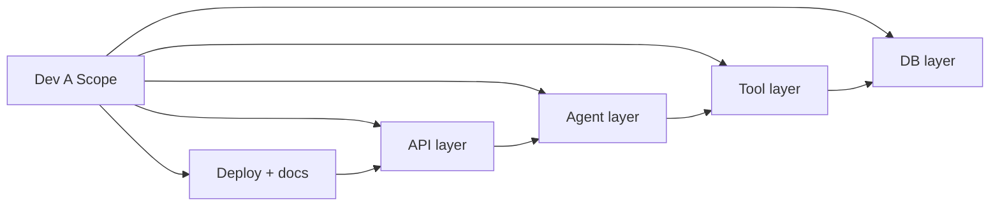

# 16 — Developer A: Backend Engineer / Agent Architect

**Document Class**: Architecture Repository — Developer Assignment
**Project**: DataFlow AI — Conversational Database Analytics
**Sprint**: 2 days (Aug 4–5, 2026); Aug 6–7 = verification + video + submission
**Owner**: Dev A — everything in `backend/**`, `database/**`, deployment files, README (with Dev B screenshots)

---

## Purpose

This document is Dev A's complete, hour-level execution plan for the 2-day production sprint: every task, its order, its dependencies, its definition of done, and its integration checkpoint. It assumes the architecture, contracts, and modules defined in `02`–`14` are understood; it references them rather than repeating them.

---

## Overview

Dev A owns the entire Python backend: FastAPI entry and routers, the agent orchestrator, all 5 tools, the data layer, the SSE event emitter, Docker, and the README. Dev A's work is delivered to Dev B exclusively through the frozen SSE contract and REST endpoints — there is **no shared-code dependency** beyond `types/index.ts`, which both maintain via the change protocol.

---

## 1. File Ownership (Exclusive)

| Path | Owner |
|------|-------|
| `backend/**` (all) | Dev A |
| `database/ecommerce.sqlite`, `database/schema.sql` | Dev A |
| `docker-compose.yml` | Dev A writes, Dev B reviews |
| `README.md` | Dev A drafts, Dev B supplies screenshots |
| `.env.example`, `.gitignore` | Dev A |
| `frontend/src/types/index.ts` | **Shared** — notify/ACK protocol |

---

## 2. Day 1 Plan (Aug 4) — Vertical Slice

### Morning — Foundations (P0)

| # | Task | Est. | Done When |
|---|------|------|-----------|
| A1.1 | Repo init: `backend/` scaffold, `requirements.txt`, `.env.example`, `.gitignore` | 0.5 h | `uvicorn main:app` boots |
| A1.2 | `main.py`: FastAPI app, CORS (env-driven), router registration, `/api/health` | 1 h | health returns `{status:"ok"}` |
| A1.3 | `db/connection.py`: aiosqlite manager, result serialization `{columns, rows, row_count}` | 1 h | probe query works against `ecommerce.sqlite` |
| A1.4 | `db/validator.py`: SELECT-only rules + LIMIT policy | 1 h | unit test: INSERT/DROP blocked |
| A1.5 | `tools/get_schema.py`: PRAGMA-based discovery, `table_filter`, error envelope | 2 h | unit test: real schema returned; bad table → hint |
| A1.6 | `tools/execute_query.py`: validate → cap limit → execute → serialize | 2 h | unit test: aggregation query OK; typo → hint |
| A1.7 | `api/schemas.py` (Pydantic models) | 0.5 h | 422 on invalid body |
| A1.8 | `agent/session.py`: store, 10-turn window, schema cache | 1 h | session persists turns |

### Afternoon — Agent Core (P0)

| # | Task | Est. | Done When |
|---|------|------|-----------|
| A2.1 | `agent/prompt.py`: system prompt + rules (from `33_PromptEngineeringStrategy.md`) | 1 h | prompt < 500 tokens |
| A2.2 | `agent/tool_registry.py`: `TOOL_MAP`, `execute()` dispatch, unknown-tool envelope | 1 h | dispatch tests pass |
| A2.3 | `api/router.py` `POST /api/chat`: stub SSE (token events only) | 1 h | **CP1** — Dev B consumes stub stream |
| A2.4 | `agent/orchestrator.py`: full ReAct loop (tool_use → registry → tool_result → end_turn), event emission (tool_start/tool_end/sql/token/done/error), iteration bound, timeout | 4 h | **CP2** — real streamed answer E2E |
| A2.5 | Anthropic client config from env (MODEL, MAX_TOKENS, timeout) | 0.5 h | no hardcoded values |

### Evening — Hardening

| # | Task | Est. |
|---|------|------|
| A2.6 | Error envelopes everywhere (tool error → LLM recovery retry) | 1 h |
| A2.7 | `GET /api/session/{id}/history`, `DELETE /api/session/{id}` | 1 h |
| A2.8 | README skeleton (setup, env, run commands) | 0.5 h |

**Day-1 definition of done**: UC1's first sentence ("show top 5 products by revenue") streams a real answer with SQL shown, in < 10 s.

---

## 3. Day 2 Plan (Aug 5) — Visualization, Integration, Polish

### Morning — Visualization Tools (P1)

| # | Task | Est. | Done When |
|---|------|------|-----------|
| A3.1 | `tools/generate_chart.py`: type enum validation, key existence, config envelope | 1.5 h | unit tests pass |
| A3.2 | `tools/generate_flowchart.py`: auto-ER from schema_data + mermaid pass-through + validation | 2 h | auto-ER output starts with `erDiagram` |
| A3.3 | `tools/explain_data.py`: metric computation (top/bottom/total/average), insight_type | 1 h | empty data → helpful error |
| A3.4 | Emit `chart` / `diagram` SSE events from orchestrator | 1 h | **CP3** — chart + ER render from real query |
| A3.5 | `/api/schema` endpoint (direct introspection) | 0.5 h | schema panel feeds |

### Midday — Integration (P1)

| # | Task | Est. |
|---|------|------|
| A4.1 | UC1 end-to-end: bar chart for Q1 + line for Q2 follow-up | 1 h |
| A4.2 | UC2 end-to-end: ER diagram via auto-ER; "which tables relate to customers" answer | 1 h |
| A4.3 | UC3 end-to-end: order-flow inference → flowchart | 1 h |
| A4.4 | Error-recovery hardening: SQL typo recovery, empty result messaging | 1 h |

**CP4**: all 3 use cases pass the scenario matrix (`20_TestingStrategy.md` §5).

### Afternoon — Deliverables (P1/P2)

| # | Task | Est. | Done When |
|---|------|------|-----------|
| A5.1 | `POST /api/export/csv` (validated SELECT → CSV download) | 1 h | curl returns CSV |
| A5.2 | Unit tests complete: `test_tools.py`, `test_db.py`, `test_api.py`; agent tests integration-marked | 1.5 h | `pytest` green |
| A5.3 | `backend/Dockerfile` | 0.5 h | image builds |
| A5.4 | `docker-compose.yml` (backend+frontend, healthcheck, volumes, env_file) | 1 h | **CP5** — full stack up |
| A5.5 | README finalize: architecture mermaid, tool docs, demo scenarios | 1 h | < 5 commands to run |

### Evening — Freeze

| # | Task | Est. |
|---|------|------|
| A6.1 | `.env` hygiene: grep for keys, confirm gitignore | 0.25 h |
| A6.2 | Tag `v1.0.0`, cleanup branches, verify clean `git status` | 0.25 h |

---

## 4. Integration Checkpoints (What Dev B Needs From Dev A)

| CP | Dev A Delivers | Dev B Needs |
|----|----------------|-------------|
| CP1 | Stub SSE stream with token events | Parse + render text |
| CP2 | Real agent loop streaming | Real `useChat` wiring |
| CP3 | `chart` + `diagram` events | ChartRenderer/DiagramRenderer live |
| CP4 | All 3 use cases working | ErrorBubble, SQLBadge verified |
| CP5 | Compose + healthcheck | Frontend containerized against it |

**Handoff rule**: every event payload Dev A emits must be validated against `types/index.ts` before CP — payload drift is the #1 integration failure and is prevented by contract tests at each CP.

---

## 5. Dev A Risks & Mitigations

| Risk | Mitigation |
|------|------------|
| Claude rate limiting | Schema cache, bounded iterations, backoff retry, integration tests marked/skipped without key |
| Sample DB schema differs from docs | PRAGMA runtime discovery; never hardcode columns |
| SSE stream breaks mid-response | In-band error events; stream always terminates with done/error |
| Docker build slow | Build backend image early (Day 2 morning) to warm cache |
| Anthropic SDK API drift | Pin SDK version in requirements; verify at CP2 earliest |

---

## 6. Definition of Done (Dev A, Sprint End)

- [ ] `pytest` green (unit suites; agent integration suite marked)
- [ ] All 3 use cases pass via curl or UI
- [ ] No hardcoded secrets (grep check)
- [ ] Docker compose full stack boots on clean machine
- [ ] README complete; OpenAPI `/docs` reachable

---

## 7. Design Decisions (Role-Specific)

| Decision | Why |
|----------|-----|
| Backend first, UI second, by vertical slice | The agent loop is the riskiest component — proven by CP2 before visualization work begins |
| All error paths return envelopes | Envelope errors are what make the agent self-correct; they are also the demo's recovery story |
| Containerize early (Day 2) | Avoids the classic "works locally, fails in Docker" last-minute crisis |
| Contract tests at every CP | The SSE contract is Dev A's primary interface to Dev B — verified mechanically, not by trust |

---

## 8. Advantages, Limitations, Future Scope

**Advantages**: full ownership → zero interference; vertical-slice ordering surfaces agent risk early; the SSE emitter is testable in isolation with curl.
**Limitations**: sequential tool execution (parallelism is future scope); in-memory sessions (volatile); single model provider.
**Future scope**: Redis-backed sessions, parallel tool fan-out, multi-model fallback, structured OpenTelemetry logging, CI pipeline.

---

## Summary

Dev A executes a 2-day, hour-level plan: Day 1 builds the vertical slice (DB layer → schema/query tools → stub SSE → full ReAct orchestrator) to CP2 with real streaming; Day 2 adds the three visualization/insight tools, integrates all three official use cases to CP4, and finishes with unit tests, Docker, README, and a tagged v1.0.0 to CP5. Every deliverable to Dev B travels over the frozen SSE contract, and every failure path returns an envelope the agent can recover from — the two properties that make the demo both streamable and unbreakable.

---

*Next document: `17_DeveloperB.md` — Dev B's complete 2-day frontend plan.*
