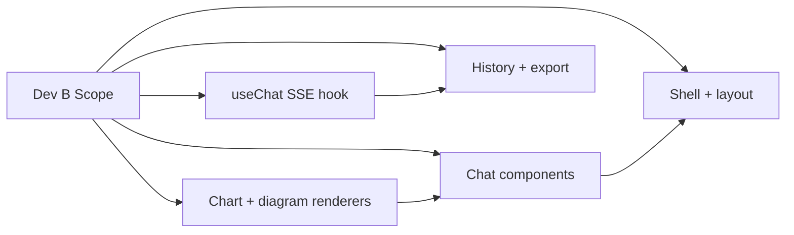

# 17 — Developer B: Frontend Engineer / UI

**Document Class**: Architecture Repository — Developer Assignment
**Project**: DataFlow AI — Conversational Database Analytics
**Sprint**: 2 days (Aug 4–5, 2026); Aug 6–7 = verification + video + submission
**Owner**: Dev B — everything in `frontend/**` except `types/index.ts` (shared)

---

## Purpose

This document is Dev B's complete, hour-level execution plan for the 2-day production sprint: every task, its order, its dependencies, its definition of done, and its integration checkpoints. It assumes the frontend architecture (`09_FrontendArchitecture.md`), the visual design (`27_UI_UX_Documentation.md`), and the SSE contract (`08_APIArchitecture.md`, `18_IntegrationPlan.md`) are understood.

---

## Overview

Dev B owns the entire React application: shell and layout, chat components, SSE consumption hook, chart and diagram renderers, history, export, and the responsive polish that carries the UX (15%) and Visualization (20%) rubric scores. Dev B consumes Dev A's backend exclusively through the frozen SSE contract and REST endpoints — and never waits for it, thanks to the mock-server strategy.

---

## 1. File Ownership (Exclusive)

| Path | Owner |
|------|-------|
| `frontend/src/**` (except types) | Dev B |
| `frontend/vite.config.ts`, `package.json`, `tailwind.config.ts`, `Dockerfile` | Dev B |
| `frontend/src/types/index.ts` | **Shared** — notify/ACK protocol |
| README screenshots section | Dev B supplies |

---

## 2. Day 1 Plan (Aug 4) — UI Shell + Streaming

### Morning — Foundations (P0)

| # | Task | Est. | Done When |
|---|------|------|-----------|
| B1.1 | Vite scaffold + deps (react, tailwind, recharts, mermaid, react-markdown, html2canvas, @mermaid-js/mermaid-react) | 0.5 h | dev server on :5173 |
| B1.2 | Tailwind config + `globals.css` theme tokens (dark palette from `27_UI_UX_Documentation.md`) | 0.5 h | tokens applied |
| B1.3 | `types/index.ts` — the 8 SSE event types + `IMessage` (with Dev A ACK) | 0.5 h | both approve |
| B1.4 | `App.tsx` 3-column layout (history / chat / schema) | 1 h | responsive skeleton |
| B1.5 | `ChatContainer` + `MessageBubble` + `MessageInput` (markdown ready) | 2 h | messages render |
| B1.6 | `api.ts` — fetch + ReadableStream SSE client | 1 h | parses stream |

### Afternoon — Streaming (P0)

| # | Task | Est. | Done When |
|---|------|------|-----------|
| B2.1 | **Mock SSE server** (scripted token/chart/diagram events) | 1 h | UI fully demoable offline |
| B2.2 | `useChat`: state machine (idle/connecting/streaming/error/done), token accumulation | 2 h | mock text streams |
| B2.3 | TypingIndicator with tool label from `tool_start`/`tool_end` | 1 h | labels switch live |
| B2.4 | Wire real backend (CP2); auto-scroll; input lock while streaming | 1.5 h | **CP2** — real answer renders |
| B2.5 | react-markdown styling; blinking-cursor streaming indicator | 0.5 h | polish |

**Day-1 definition of done**: a real backend answer streams into a markdown-rendered assistant bubble with typing indicator and disabled input.

---

## 3. Day 2 Plan (Aug 5) — Visualization, Errors, Polish

### Morning — Renderers (P1)

| # | Task | Est. | Done When |
|---|------|------|-----------|
| B3.1 | 4 chart components (Bar/Line/Pie/Scatter) with palette + tooltips | 2 h | each renders test data |
| B3.2 | `ChartRenderer` dispatch by `chart_type`; responsive container; table fallback | 1 h | **CP3** — live bar chart |
| B3.3 | `DiagramRenderer`: Mermaid render, error boundary → raw fallback, fullscreen | 1.5 h | **CP3** — live ER renders |
| B3.4 | Wire chart/diagram events into `useChat` message state | 1 h | incremental mount mid-stream |

### Midday — Transparency + Errors (P1)

| # | Task | Est. |
|---|------|------|
| B4.1 | `SQLBadge`: collapsible, syntax highlight, copy button | 1 h |
| B4.2 | `ErrorBubble`: friendly copy per error code + retry | 1 h |
| B4.3 | Welcome screen + 3 example prompt chips | 0.5 h |
| B4.4 | **CP4 verification**: all 3 use cases visually pass | 1 h |

### Afternoon — Bonus + Deliverables (P2)

| # | Task | Est. | Done When |
|---|------|------|-----------|
| B5.1 | `useQueryHistory` (localStorage) + `QueryHistory` UI with re-run/delete/clear | 1 h | history persists |
| B5.2 | `ExportButton`: PNG (html2canvas) + CSV (endpoint) | 1 h | both downloads valid |
| B5.3 | Schema panel (`GET /api/schema`) with toggle | 0.75 h | panel fills |
| B5.4 | `frontend/Dockerfile` (multi-stage → nginx) + vite proxy config | 0.75 h | image builds |
| B5.5 | Responsive polish (tablet/mobile tiers), contrast check, final visual pass | 1 h | no visual regressions |

### Evening — Freeze

| # | Task | Est. |
|---|------|------|
| B6.1 | README screenshots + UI captures | 0.5 h |
| B6.2 | `npm run build` clean; verify containerized app against compose backend | 0.5 h |

---

## 4. Integration Checkpoints (What Dev B Delivers)

| CP | Dev B Delivers | Verified With |
|----|----------------|---------------|
| CP1 | Parser + render for stub stream | Dev A stub SSE |
| CP2 | Real `useChat` wiring | Dev A real loop |
| CP3 | Live chart + diagram rendering | Dev A viz tools |
| CP4 | SQL badge, error UX, all 3 scenarios | E2E scenario matrix |
| CP5 | Containerized frontend behind nginx | Compose full stack |

---

## 5. Dev B Risks & Mitigations

| Risk | Mitigation |
|------|------------|
| Backend delayed | Mock SSE server (B2.1) — UI proceeds to full polish offline |
| Mermaid silent render failure | try/catch + Error Boundary + raw-source fallback; strict security level |
| SSE payload drift | Parser defensive (ignore unknown types); contract checked at each CP |
| Chart overflow on small screens | ResponsiveContainer + `max-w-full`; mobile tier keeps charts at full width |
| html2canvas fidelity | Capture the chart container only; test export at CP4 |

---

## 6. Definition of Done (Dev B, Sprint End)

- [ ] All 3 use cases render correctly in UI (bar, line, ER, flowchart, explanations)
- [ ] Streaming indicator, SQL badge, error bubbles, retry all functional
- [ ] History persists and re-runs; PNG/CSV export produce valid files
- [ ] `npm run build` clean; no console errors in demo flow
- [ ] Containerized app runs against compose backend on :3000

---

## 7. Design Decisions (Role-Specific)

| Decision | Why |
|----------|-----|
| Mock server on Day 1 | UI track is immune to backend slippage — parallelism is real, not theoretical |
| One `useChat` state machine | All stream state in one hook; components stay presentational and testable |
| Charts mount mid-stream | The "thinking → working → presenting" progression is the demo's UX story |
| Parser ignores unknown events | Forward-compatible with contract evolution without code changes |
| localStorage history | Zero backend coupling for a rubric-visible bonus feature |

---

## 8. Advantages, Limitations, Future Scope

**Advantages**: never blocked (mock-first); rubric-led priorities (streaming → charts → errors → polish); container-ready from Day 2; visual consistency via token system.
**Limitations**: no offline mode; localStorage is per-browser; streaming state is memory-only (restored via history endpoint on reload).
**Future scope**: voice input (Web Speech API), dashboard builder, PWA, i18n, chart annotations, WebSocket transport upgrade.

---

## Summary

Dev B executes a 2-day, hour-level plan: Day 1 delivers the chat shell, the SSE client, and a mock-server-backed streaming UX to CP2; Day 2 delivers the four chart components and Mermaid renderer to CP3, SQL transparency and error UX through CP4, and history/export/containerization/polish to CP5. The mock-first strategy guarantees the UI track never idles, and every rendering path has a graceful fallback — the frontend carries the UX and Visualization rubric scores without ever being the thing that breaks the demo.

---

*Next document: `18_IntegrationPlan.md` — the frozen SSE contract and the integration protocol.*
