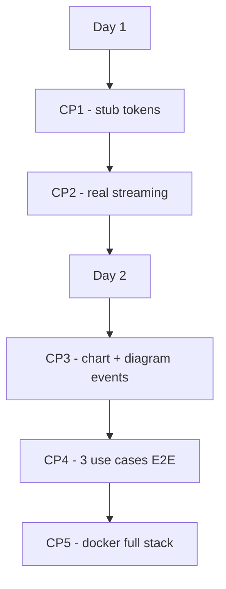
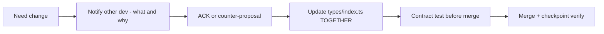

# 18 — Integration Plan: DataFlow AI

**Document Class**: Architecture Repository — Integration Plan
**Project**: DataFlow AI — Conversational Database Analytics
**Status**: Final — the integration strategy for two parallel developers: the frozen SSE contract, the change protocol, checkpoints, and conflict prevention.

---

## Purpose

Integration is the only place two-developer projects fail. This document defines DataFlow AI's integration strategy: the SSE event contract as the **single integration surface** (agreed Day 1, changed only via protocol), the checkpoint ladder, conflict-prevention rules, and the verification steps at each checkpoint. It operationalizes the workflow defined in `15_DeveloperWorkflow.md`.

---

## Overview

Integration philosophy, one sentence: **the SSE event contract is the only integration surface, it is frozen on Day 1, and it is never changed unilaterally.** Everything else follows from that: ownership boundaries that make conflicts structurally impossible, a change protocol that makes contract evolution safe, and checkpoints that verify integration early and often.

---

## 1. The Single Integration Surface

All chat traffic between frontend and backend flows through `POST /api/chat` and its SSE stream. The contract is defined **twice, mechanically**:

1. `frontend/src/types/index.ts` — TypeScript declarations (the frontend's truth).
2. `08_APIArchitecture.md` §2 — the payload specifications (the backend's truth).

At every checkpoint, payload samples from the backend are validated against the TS types — drift is caught mechanically, not by reading.

### The 8 Event Types (frozen)

| Event | Payload Fields |
|-------|----------------|
| `token` | `type`, `content` |
| `sql` | `type`, `content` |
| `chart` | `type`, `chart_type: "bar"\|"line"\|"pie"\|"scatter"`, `title`, `data: Record<string, any>[]`, `config: {x_key, y_key, x_label?, y_label?, color?}` |
| `diagram` | `type`, `diagram_type: "er"\|"flowchart"\|"sequence"`, `title?`, `mermaid` |
| `tool_start` | `type`, `tool` (5-tool union) |
| `tool_end` | `type`, `tool`, `success` |
| `done` | `type`, `message_id` |
| `error` | `type`, `code`, `message` |

Wire format: each event is one `data: <json>` line followed by a blank line (SSE framing), UTF-8.

---

## 2. Contract Change Protocol

Even frozen contracts evolve. The protocol:

| Rule | Detail |
|------|--------|
| Notify | State the change and its reason (e.g., "chart event needs `subtitle`") |
| ACK | Explicit agreement required; no unilateral edits |
| Update together | The types file is edited in a pairing session or sequentially with immediate push |
| Test before merge | A curl capture of the new payload is validated against the updated type |
| Revert rule | If integration breaks, roll back the types change, not the implementation |

---

## 3. Conflict Prevention

| Area | Rule |
|------|------|
| File ownership | `backend/**` Dev A only; `frontend/**` Dev B only (table in `13_ProjectStructure.md` §3) |
| Shared file | `types/index.ts` only — change protocol applies |
| Deployment files | Dev A writes, Dev B reviews (review is not editing) |
| README | Dev A drafts, Dev B appends screenshots |
| Git | `dev` branch integration at checkpoints; feature branches short-lived |

**The rule that prevents 95% of conflicts: if you need the other dev's file, you ask — you never edit.**

---

## 4. Checkpoint Definitions

| CP | Time | Trigger | Integration Test |
|----|------|---------|------------------|
| CP1 | Day 1, ~12:30 | Stub SSE emits token events | Dev B UI renders stub tokens; curl shows `data:` lines with `\n\n` |
| CP2 | Day 1, ~17:00 | Real agent loop | UC1 first sentence streams < 10 s; SQL event shown |
| CP3 | Day 2, ~10:30 | Chart + diagram events | `curl -N` captures `chart` and `diagram` events; UI renders both |
| CP4 | Day 2, ~14:00 | All use cases | 5-scenario matrix passes (below) |
| CP5 | Day 2, ~17:00 | Docker full stack | `docker-compose up` → :3000 chat works, health OK |

### CP4 Scenario Matrix

| # | Input | Expected Events | Render |
|---|-------|-----------------|--------|
| 1 | "Show me the top 5 products by revenue this quarter" | tool_start×3, sql, chart(bar), token, done | Bar chart + insight |
| 2 | "Now show me the trend for these products over the last year" | tool_start×2, sql, chart(line), token, done | Line chart (follow-up context) |
| 3 | "Draw me the ER diagram for this database" | tool_start, diagram(er), token, done | ER diagram |
| 4 | "Which tables are related to customers?" | tool_start, token, done | Text answer (no chart) |
| 5 | "Create a flowchart showing how orders flow through our system" | tool_start, diagram(flowchart), token, done | Process flowchart |

---

## 5. Integration Testing Protocol

### Backend-side (Dev A, before each CP)

1. Start backend with test env.
2. `curl -N -X POST http://localhost:8000/api/chat -H "Content-Type: application/json" -d '{"message":"...", "session_id":"t1"}'`
3. Capture output; validate each `data:` line against the event table.
4. Confirm the stream terminates with `done` or `error` (never a dangling stream).

### Frontend-side (Dev B, at each CP)

1. Clear localStorage; open app on :5173.
2. Run the scenario inputs; watch console for parse errors (must be zero).
3. Verify renderers mount for every chart/diagram event.

### Post-merge (both)

- `pytest` (backend) green.
- `npm run build` (frontend) green.
- `docker-compose up` smoke test on :3000.

---

## 6. Design Decisions

| Decision | Why |
|----------|-----|
| Contract frozen Day 1 | Negotiating interfaces mid-sprint is the classic two-dev failure mode |
| Mechanically duplicated truth (TS types + spec doc) | Each side owns its truth; the CP tests reconcile them |
| Contract tests before merge | Drift is caught in minutes, not at demo time |
| Checkpoints aligned to milestones, not clock | Definition-of-done per CP keeps both tracks honest |
| Rollback prefers types change over implementation | Payloads are the expensive thing to change; types are cheap |

---

## 7. Responsibilities, Dependencies, Advantages, Limitations, Future Scope

**Responsibilities**: Dev A = emitter truth; Dev B = consumer truth; both = CP verification.
**Dependencies**: backend router/orchestrator (emitter), frontend parser/renderers (consumer), types file (shared).
**Advantages**: structurally conflict-free; drift detected mechanically; the contract itself is a reviewable artifact for judges; both tracks stay busy.
**Limitations**: contract rigidity can slow speculative features (mitigated by protocol); no automated CI in the sprint (manual discipline).
**Future scope**: automated contract tests in CI (schema-validate every SSE payload), OpenAPI-generated client types, consumer-driven contract testing (Pact-style).

---

## Summary

DataFlow AI integrates two parallel tracks through a single frozen interface: the 8-event SSE contract, defined mechanically in shared TS types and the API spec, evolved only via a notify/ACK/test protocol, and verified at five checkpoints across two days — ending with the CP4 scenario matrix and the CP5 docker full stack. Combined with exclusive file ownership, integration risk is engineered down to near zero: the demo cannot fail because two people touched the same code.

---

*Next document: `19_ImplementationRoadmap.md` — the 2-day sprint roadmap with priorities and cut-order.*
