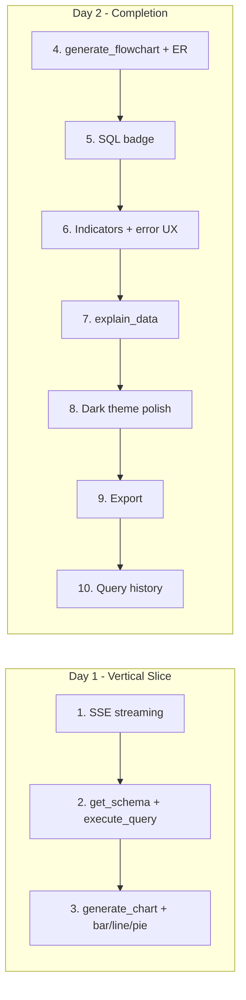
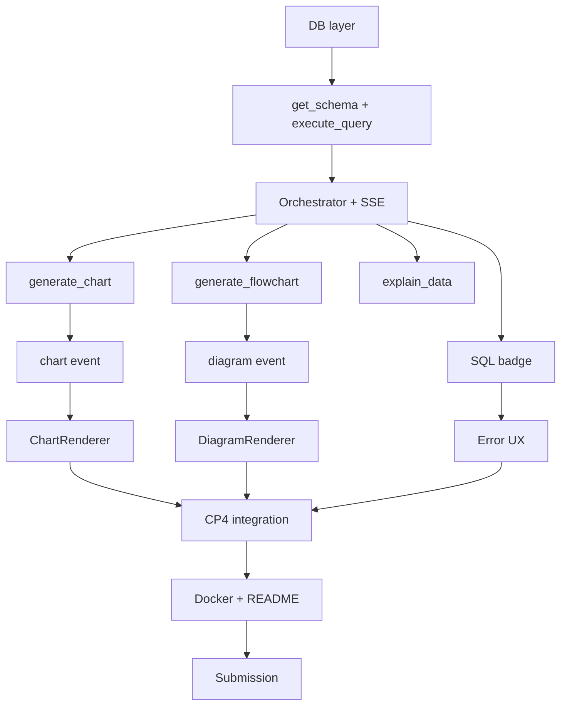
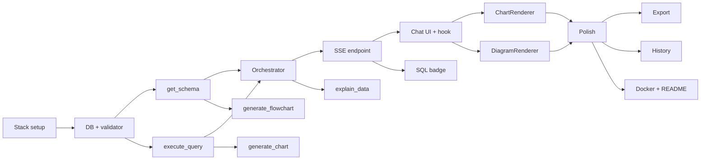

# 19 — Implementation Roadmap: DataFlow AI

**Document Class**: Architecture Repository — Implementation Roadmap
**Project**: DataFlow AI — Conversational Database Analytics
**Sprint**: 2 days (Aug 4–5, 2026); Aug 6–7 = verification, demo video, submission
**Status**: Final — the score-optimized execution order with priorities, critical path, and cut-order.

---

## Purpose

This document is the master execution timeline for the 2-day production sprint: what gets built, in what order, why that order, what happens if time runs out, and how the Aug 6–7 buffer is used. It converts the module priorities (`14_ModuleBreakdown.md`) and the score mapping (`36_JudgingOptimization.md`) into a single actionable schedule.

---

## Overview

The roadmap is **score-optimized**: implementation order follows rubric points per hour of effort, not alphabetical or by developer preference. The first 8 steps of the priority ladder capture ~87 of the targeted 88–100 points; steps 9–10 are pure bonus.

---

## 1. The 10-Step Priority Ladder

| # | Step | Points Covered | Est. Effort | When |
|---|------|----------------|-------------|------|
| 1 | SSE streaming (UX 4) | 4 | ~3 h (2 devs) | Day 1 AM |
| 2 | `get_schema` + `execute_query` (Func 12) | 12 | ~5 h | Day 1 AM–noon |
| 3 | `generate_chart` + bar/line/pie (Func+Viz 13) | 13 | ~5 h | Day 1 PM |
| 4 | `generate_flowchart` + ER renderer (Func+Viz 9) | 9 | ~4 h | Day 2 AM |
| 5 | SQL badge (Innov+Arch 5) | 5 | ~1.5 h | Day 2 AM |
| 6 | TypingIndicator + error states (UX 4) | 4 | ~2 h | Day 2 AM |
| 7 | `explain_data` (Func 3) | 3 | ~1.5 h | Day 2 noon |
| 8 | Dark theme polish (UX+Viz 4) | 4 | ~2 h | Day 2 PM |
| 9 | Export PNG/CSV (Innov 2) | 2 | ~2 h | Day 2 PM |
| 10 | Query history (Innov 2) | 2 | ~2 h | Day 2 PM |

**Steps 1–8 = 87 potential points. Steps 9–10 = pure bonus.**

---

## 2. Critical Path

The critical path is: **DB → tools → agent → SSE → renderers → integration → Docker**. Frontend shell work (chat UI) runs parallel and off-critical-path. Every hour saved on the critical path protects the demo.

---

## 3. Day-by-Day Timeline (2-Day Sprint)

### Day 1 (Aug 4): Vertical Slice — streaming end to end

| Window | Dev A | Dev B |
|--------|-------|-------|
| 08:00–08:30 | Scaffold, env, health | Vite scaffold, deps, theme |
| 08:30–12:00 | DB layer, validator, get_schema, execute_query | Shell, chat components, types, SSE client |
| 12:00–12:30 | Stub SSE (CP1) | Mock server (CP1) |
| 12:30–13:30 | Lunch | Lunch |
| 13:30–17:00 | Orchestrator + prompt + registry | useChat + parsing + TypingIndicator |
| 17:00–17:30 | **CP2 — real streaming** | CP2 verify |
| 17:30–19:00 | Error envelopes, session endpoints | Markdown styling, input lock |

### Day 2 (Aug 5): Visualization + integration + polish

| Window | Dev A | Dev B |
|--------|-------|-------|
| 08:00–10:30 | generate_chart, generate_flowchart, explain_data, chart/diagram SSE | 4 charts, ChartRenderer, DiagramRenderer |
| 10:30–11:00 | **CP3 — charts + ER live** | CP3 verify |
| 11:00–14:00 | UC1–3 integration, error recovery, schema cache, export CSV, /api/schema | SQLBadge, ErrorBubble, welcome + chips |
| 14:00–14:30 | **CP4 — 3 use cases E2E** | CP4 verify |
| 14:30–17:00 | Unit tests, backend Dockerfile, compose, README | QueryHistory, ExportButton, frontend Dockerfile, responsive polish |
| 17:00–18:00 | **CP5 — docker full stack** | CP5 verify |
| 18:00–19:00 | Freeze: tag v1.0.0, hygiene | Screenshots, final pass |

### Aug 6–7 (Buffer — not build): verification + submission

| Day | Activity |
|-----|----------|
| Aug 6 | Full regression pass; demo video recording (3–5 min script in `35_SubmissionChecklist.md` §3); README final |
| Aug 7 | Live-demo dress rehearsal on a clean machine; submission (repo URL, video URL, team form) |

---

## 4. Feature Dependency Graph

Key dependencies: **visualization tools need query results** (G3/G4 depend on G2/G1); **renderers need the SSE contract**; **export needs an executed query**; **everything needs the agent loop**.

---

## 5. Cut-Order (If Time Runs Out)

| Cut | What | Score Lost | Why It's Cut First |
|-----|------|------------|--------------------|
| 1 | Query history favorites (part of step 10) | 1 | Lowest effort→score ratio |
| 2 | Scatter chart (bonus type) | 1–2 | Already have 3 chart types |
| 3 | Sequence diagrams | 1 | ER + flowchart satisfy minimum 2 |
| 4 | Schema panel | 0 (courtesy) | No rubric line |
| 5 | CSV export only (keep PNG) | 1 | PNG is the visible one |

**Never cut**: steps 1–7. Core functionality (Days 1–2, steps 1–8) is non-negotiable — the 30% Functionality score depends on it.

---

## 6. Risk-Adjusted Buffers

| Risk | Built-in Buffer |
|------|-----------------|
| Claude rate limiting | Schema cache + integration tests marked (skip without key) |
| SSE contract drift | Contract tests at each CP (18_IntegrationPlan.md) |
| Mermaid render issues | Error boundary + raw fallback |
| Docker build surprises | Images built Day 2 morning (warm cache) |
| Demo DB missing on judge machine | `ecommerce.sqlite` committed to repo |

---

## 7. Design Decisions

| Decision | Why |
|----------|-----|
| Score-ordered implementation | Every hour spent maps to rubric points; zero wasted effort |
| Streaming first (step 1) | UX 4 points + it is the riskiest technology — proven earliest |
| Tools before orchestrator polish | Functionality points dominate (30%); the agent is useless without tools |
| Visualization before bonus | 20% Visualization vs 10% Innovation — weight dictates order |
| Aug 6–7 strictly non-build | Prevent scope creep; the video and submission are deliverables too |
| Explicit cut-order | Prevents panic-driven bad cuts under deadline pressure |

---

## 8. Responsibilities, Dependencies, Advantages, Limitations, Future Scope

**Responsibilities**: roadmap is executed by both devs per `16`/`17`; the cut-order decision belongs to both (escalate if disagreement).
**Dependencies**: module priorities (14), score mapping (36), checkpoint definitions (18).
**Advantages**: every hour is rubric-mapped; critical path is explicit; cuts are pre-decided; buffer days protect deliverables.
**Limitations**: aggressive schedule assumes no major surprises (mitigated by risk buffers); 2-day window leaves no time for speculative features.
**Future scope**: post-hackathon the roadmap extends naturally into `26_ScalabilityPlan.md` items — multi-DB, real-time, auth.

---

## Summary

The 2-day roadmap executes a 10-step, score-ordered ladder: streaming and the two query tools first (Day 1), then chart/flowchart tools, SQL transparency, error UX, and explain_data (Day 2 morning), followed by theme polish and the export/history bonuses (Day 2 afternoon). Five checkpoints gate progress, a documented cut-order protects the core, and Aug 6–7 are reserved strictly for verification, video, and submission. The first 8 steps capture ~87 of the targeted 88–100 points — the demo-winning core is guaranteed even if the bonus is cut.

---

*Next document: `20_TestingStrategy.md` — the test pyramid, scenario matrix, and acceptance criteria.*
