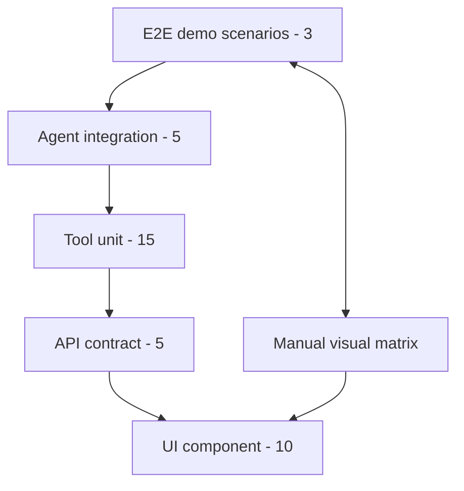

# 20 — Testing Strategy: DataFlow AI

**Document Class**: Architecture Repository — Testing Strategy
**Project**: DataFlow AI — Conversational Database Analytics
**Status**: Final — the test pyramid, unit/integration/E2E plans, scenario matrix, and acceptance criteria.

---

## Purpose

This document defines how DataFlow AI is verified: what is tested, at what level, with what tools, and to what acceptance bar. The philosophy is **fast, targeted, demo-protecting** — tests exist to guarantee the live demo and the three official use cases, not to achieve coverage theater. Unit tests for critical tools are an official bonus item; correctness is a Functionality requirement.

---

## Overview

Testing follows a pragmatic pyramid weighted toward the demo:

| Level | Count | Tooling | Priority |
|-------|-------|---------|----------|
| E2E demo scenarios | 3 (scripted) | Manual + curl | Highest |
| Agent integration | 5 (marked) | pytest + real Claude | High |
| Tool unit | 15 | pytest (async) | High |
| API contract | 5 | pytest + TestClient | Medium |
| UI component | 10 | Vitest/React Testing Library | Medium |
| Manual visual matrix | 8 checks | Human | High |

---

## 1. Tool Unit Tests (15) — `tests/test_tools.py`

| Tool | Tests | Key Assertions |
|------|-------|----------------|
| `get_schema` | 3 | Returns all tables with columns/types/PK/FK; `table_filter` narrows; unknown table → error envelope with `available_tables` |
| `execute_query` | 5 | SELECT returns `{columns, rows, row_count}`; INSERT/DROP/UPDATE blocked by validator; syntax error → hint ("Did you mean products?"); aggregation query works; LIMIT applied when missing |
| `generate_chart` | 3 | Valid config envelope; invalid chart_type → enum error; missing key → error listing available columns |
| `generate_flowchart` | 2 | Auto-ER from `schema_data` output starts with `erDiagram`; `mermaid_code` pass-through preserved |
| `explain_data` | 2 | Computes key_metrics (top/bottom/total/average); empty data → helpful error |

Tests run against a **fixture test DB** (in-memory SQLite seeded with the sample schema) — never the real demo file.

---

## 2. Agent Integration Tests (5) — `tests/test_agent.py`

Marked `@pytest.mark.integration` (skipped automatically when `ANTHROPIC_API_KEY` is absent — the suite never blocks local runs).

| # | Scenario | Assertion |
|---|----------|-----------|
| 1 | "What tables are in this database?" | Agent calls `get_schema` first; answer lists tables |
| 2 | "Show me the top 5 products by revenue this quarter" | Emits `chart` event with `chart_type: "bar"` |
| 3 | Follow-up: "Now show me the trend for these products over the last year" | Emits `chart` event with `chart_type: "line"` (context retained) |
| 4 | "Draw me the ER diagram for this database" | Emits `diagram` event with `diagram_type: "er"` |
| 5 | Malformed SQL request | Agent recovers (error envelope → corrected query or graceful explanation) |

These five tests are the Functionality rubric's automated conscience.

---

## 3. API Contract Tests (5) — `tests/test_api.py`

| # | Endpoint | Assertion |
|---|----------|-----------|
| 1 | `GET /api/health` | 200, `status: "ok"` |
| 2 | `GET /api/schema` | 200, `tables` array with columns/FKs |
| 3 | `POST /api/chat` empty message | 422 (Pydantic) |
| 4 | `POST /api/chat` missing session | 400 `INVALID_SESSION` |
| 5 | `GET /api/session/unknown/history` | 404 |

Plus validator tests in `tests/test_db.py`: allows SELECT; blocks INSERT/DROP/UPDATE; enforces LIMIT cap.

---

## 4. UI Component Tests (10) — Vitest + RTL

| Component | Tests |
|-----------|-------|
| SSE parser (pure function) | 3 — parses token/chart/error; ignores unknown types |
| `useChat` | 3 — token accumulation; error event → error state; done → finalize |
| `ChartRenderer` | 2 — dispatches by type; table fallback on render failure |
| `DiagramRenderer` | 2 — renders Mermaid; error boundary → raw source fallback |

The pure parser and hooks are the highest-value frontend tests — they cover the contract, which is the integration risk.

---

## 5. E2E Demo Scenario Matrix (Manual, Scripted)

These are the exact demo scripts — same inputs, same expected outputs, run at CP4 and again pre-submission:

| # | Input | Expected Output |
|---|-------|-----------------|
| S1a | "Show me the top 5 products by revenue this quarter" | Bar chart (5 bars) + insight text; SQL badge shows JOIN/GROUP/ORDER query |
| S1b | "Now show me the trend for these products over the last year" | Line chart over months; no restated context needed |
| S2a | "Draw me the ER diagram for this database" | ER diagram with all 5 tables and FKs |
| S2b | "Which tables are related to customers?" | Text answer: orders (and indirectly order_items) |
| S3 | "Create a flowchart showing how orders flow through our system" | Process flowchart: Customer → Order → Order Items → Products → Inventory |

---

## 6. Manual Visualization Matrix (Pass Criteria)

| Viz | Pass Criteria |
|-----|---------------|
| Bar | Category labels readable, values on hover, palette colors |
| Line | Time-ordered x-axis, points legible, no misleading interpolation |
| Pie | Labels + percentages, legend matches data |
| Scatter (bonus) | Axis scales sensible, no overlapping illegibility |
| ER | All 5 tables, FKs shown, layout non-overlapping |
| Flowchart | Readable direction, labels, no truncation |

---

## 7. Acceptance Testing (Final Gate, Before Tagging v1.0.0)

| # | Check |
|---|-------|
| 1 | `docker-compose up` completes < 60 s on a clean machine |
| 2 | `localhost:3000` loads the chat UI |
| 3 | `GET /api/health` returns ok (database + claude reachable) |
| 4 | Scenarios S1a–S3 all pass |
| 5 | SQL badge shows and hides |
| 6 | PNG export produces a valid image file |
| 7 | Query history populates and re-runs |
| 8 | No console errors during the demo flow |
| 9 | No backend exceptions in logs |
| 10 | README run instructions succeed in < 5 commands |

---

## 8. Design Decisions

| Decision | Why |
|----------|-----|
| Demo scenarios > coverage | The demo is the score; tests exist to protect it |
| Fixture DB for unit tests | Deterministic, fast, offline; never touches the demo file |
| Integration tests marked | Real-Claude tests exist but never block keyless local runs |
| Pure-function SSE parser | The contract is the integration risk; it gets the most mechanical testing |
| Manual visual matrix | Visualization quality is a human judgment (rubric 20%); automated snapshot tests add little |
| Acceptance gate before tag | v1.0.0 means "demo-safe", not merely "compiles" |

---

## 9. Responsibilities, Dependencies, Advantages, Limitations, Future Scope

**Responsibilities**: Dev A = tool/agent/API tests; Dev B = UI/parser/hook tests; both = scenario matrix at CP4.
**Dependencies**: pytest, httpx/TestClient, Vitest, React Testing Library; fixture DB builder (conftest).
**Advantages**: fast suites (unit < 30 s), demo-protecting priorities, bonus-point unit tests, mechanical contract verification.
**Limitations**: no CI in the sprint (manual gates); no end-to-end browser automation (Playwright) — acceptable for 2 days; visual checks are human.
**Future scope**: CI pipeline (pytest + vitest + build per PR), Playwright E2E, SSE contract schema tests, load test (concurrent sessions), screenshot diffing.

---

## Summary

DataFlow AI's testing strategy is a four-level pyramid — 15 tool unit tests, 5 marked agent integration tests, 5 API contract tests, 10 UI component tests — capped by a scripted 3-scenario E2E matrix and a manual visualization pass, gated by a 10-point acceptance checklist before the v1.0.0 tag. Tests are deliberately concentrated where demo risk lives: the SSE contract, the tool correctness that carries 30% of the score, and the three official use cases.

---

*Next document: `21_DeploymentStrategy.md` — local, containerized, and cloud deployment.*
