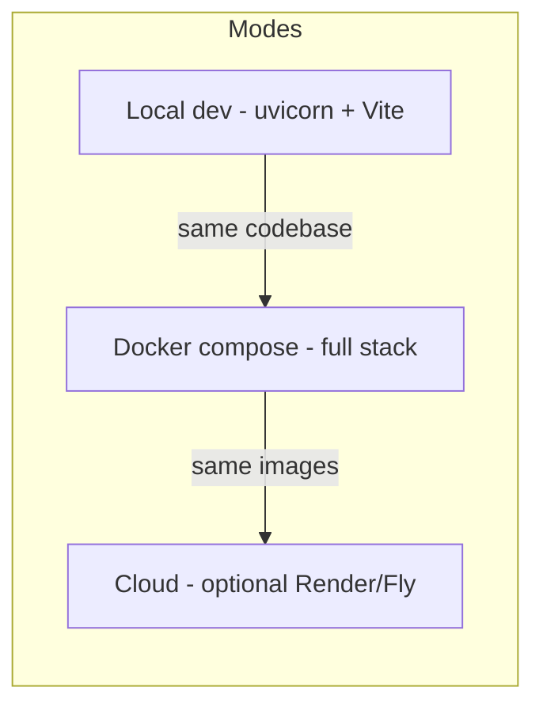
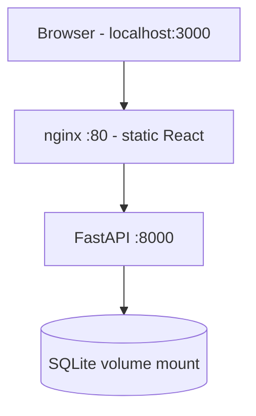
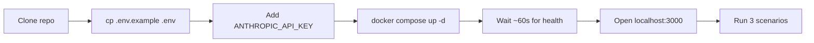

# 21 — Deployment Strategy: DataFlow AI

**Document Class**: Architecture Repository — Deployment Strategy
**Project**: DataFlow AI — Conversational Database Analytics
**Status**: Final — how the application is deployed and run: local development, containerized stack, cloud options, and the judge-machine scenario.

---

## Purpose

The official brief requires a working, demonstrable application with Docker support preferred. This document defines the deployment strategy for DataFlow AI: the three supported run modes (local dev, docker-compose, optional cloud), the health/readiness gates, environment configuration, and the exact judge-machine playbook that guarantees the live demo runs.

---

## Overview

Three modes, one codebase, one config surface (`.env`). The docker-compose stack is the **primary demo vehicle**; local mode is the development fallback; cloud is optional polish for a hosted live link.

---

## 1. Run Modes

### Mode 1 — Local Development

| Service | Command | URL |
|---------|---------|-----|
| Backend | `pip install -r requirements.txt` then `uvicorn main:app --reload` (from `backend/`) | `http://localhost:8000` |
| Frontend | `npm install` then `npm run dev` (from `frontend/`) | `http://localhost:5173` |

Config: `.env` in `backend/` (DATABASE_PATH, CORS_ORIGIN=http://localhost:5173, ANTHROPIC_API_KEY). Vite dev proxy forwards `/api` → `:8000`.

### Mode 2 — Docker Compose (Primary Demo Vehicle)

| Service | Image Source | Port | Health Gate |
|---------|--------------|------|-------------|
| `backend` | `backend/Dockerfile` | `8000:8000` | `/api/health` interval 10s timeout 5s retries 3 |
| `frontend` | `frontend/Dockerfile` (multi-stage → nginx) | `3000:80` | depends_on backend `service_healthy` |

Key properties: database mounted from `./database` (the committed sample file); env from `.env` (env_file); frontend cannot start before the backend is healthy — the demo never shows a half-started stack.

### Mode 3 — Cloud (Optional)

- Backend: Render/Railway web service from `backend/Dockerfile`; set env vars in the dashboard.
- Frontend: static host (Netlify/Vercel) with `API_BASE_URL` pointing at the hosted backend.
- Database: keep SQLite mounted via a volume, or migrate to Postgres (future scope).
- Motivation: a hosted URL is a nice-to-have; the brief accepts a local run — cloud is only if time allows after Aug 6 verification.

---

## 2. Health & Readiness

| Check | Endpoint | Purpose |
|-------|----------|---------|
| Backend liveness | `GET /api/health` | `status: "ok"` — Docker healthcheck |
| Database readiness | `database: "connected"` field | Probe at startup + on demand |
| Claude reachability | `claude_api: "reachable"` field | Warns before the demo that the API key is valid |

The health endpoint distinguishes backend-down vs DB-down vs key-down — the demo operator can diagnose in seconds.

---

## 3. Environment Configuration

| Variable | Dev | Docker |
|----------|-----|--------|
| `ANTHROPIC_API_KEY` | backend/.env | .env (compose env_file) |
| `DATABASE_PATH` | `../database/ecommerce.sqlite` | `/app/database/ecommerce.sqlite` (volume) |
| `CORS_ORIGIN` | `http://localhost:5173` | `http://localhost:3000` |
| `MODEL`, `MAX_TOKENS`, etc. | defaults | same defaults |

Rule: every variable has a sensible default or a `.env.example` entry; **no hardcoded values in code**; `.env` never committed.

---

## 4. Judge-Machine Playbook (Live Demo)

| Step | Command / Action |
|------|------------------|
| 1 | `git clone <repo-url>` |
| 2 | `cp .env.example .env` and set `ANTHROPIC_API_KEY` |
| 3 | `docker compose up -d` |
| 4 | Wait for backend healthy (healthcheck gates frontend) |
| 5 | Browser → `http://localhost:3000` |
| 6 | Run S1a → S3 scenarios (`20_TestingStrategy.md` §5) |

Fallbacks: if Docker is unavailable on the judge machine, local mode (Mode 1) with `README.md` commands (fewer than 5); if the API key is invalid, the app still loads and fails gracefully with clear messages (health endpoint shows `claude_api: "unreachable"`).

---

## 5. Deployment Design Decisions

| Decision | Why |
|----------|-----|
| Compose as primary demo vehicle | One command, reproducible on any machine with Docker; the brief prefers Docker |
| Frontend served by nginx (not Vite) | Production-grade serving, SPA fallback routing, small footprint |
| Healthcheck-gated startup | The UI never faces a backend that isn't ready — a judge sees a working app, not a race |
| SQLite via volume mount | The committed sample file is authoritative; no container-side generation |
| CORS origin per mode | One codebase, three origins — config-driven, zero code change |
| Cloud as optional tier | The brief accepts local runs; cloud only if time permits |

---

## 6. Responsibilities, Dependencies, Advantages, Limitations, Future Scope

**Responsibilities**: Dev A = compose, Dockerfiles, README run docs; Dev B = frontend image + proxy; both = judge-machine rehearsal.
**Dependencies**: Docker 24+, docker-compose v2; Python 3.11+, Node 18+ for local mode.
**Advantages**: one-command demo, health-gated startup, offline database, portable config, three run modes with one codebase.
**Limitations**: SQLite single-node (fine for demo); no TLS/domain in local mode; cloud deployment untested in the sprint.
**Future scope**: Postgres/MySQL swap via the adapter seam, managed hosting with persistent volumes, CI/CD (build + deploy on push), TLS via reverse proxy, autoscaling (stateless backend).

---

## Summary

DataFlow AI deploys in three modes from one codebase: local dev (uvicorn + Vite), the primary demo vehicle (docker-compose with a healthcheck-gated nginx frontend and volume-mounted SQLite), and optional cloud hosting. The judge-machine playbook is four commands plus a browser, with graceful degradation if Docker or the API key fails. Deployment is engineered so the live demo — a mandatory deliverable — cannot fail on infrastructure.

---

*Next document: `22_DockerArchitecture.md` — images, compose topology, volumes, and healthchecks.*
