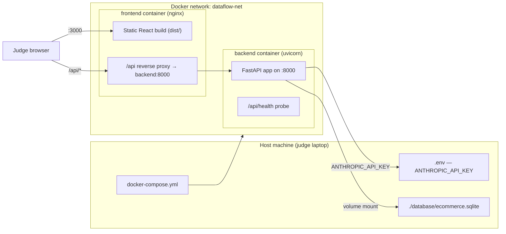
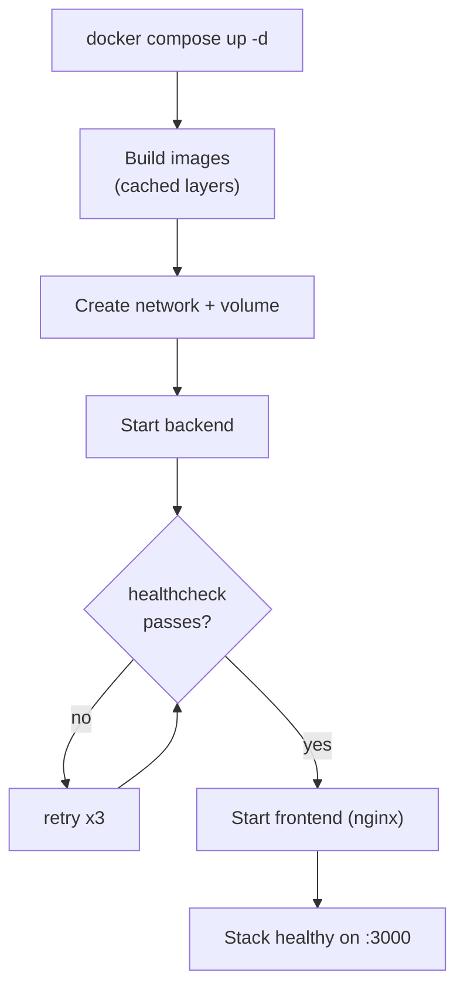

# 22. Docker Architecture — DataFlow AI

## Purpose

Define the containerization strategy for DataFlow AI: how the backend, frontend, and database are packaged into images, orchestrated as a single stack, and verified end-to-end. Docker is the primary deployment vehicle because the official brief lists "Docker support preferred" and the live-demo requirement makes a one-command, dependency-free startup the single most reliable way to show the product to judges on an unknown machine.

## Overview

The repository is a single Compose stack with two services plus a mounted data volume:

- **Backend service** — FastAPI + Anthropic SDK, built from a slim Python image, served by Uvicorn on port 8000.
- **Frontend service** — React build produced in a Node build stage, served as static files by nginx on port 3000; nginx also reverse-proxies `/api` traffic to the backend container so the browser speaks one origin.
- **Database** — the provided SQLite file is mounted into the backend container from a host volume, so the same seed data is shared, is visible to tooling outside Docker, and survives container recreation.

The philosophy is *deliverability first*: two images, one command, five seconds of explanation. Kubernetes, multi-stage optimization heroics, and image size games are deliberately out of scope for a 2-day sprint; the architecture still leaves room for them later.

## Architecture

### 22.1 Backend Image

**Base**: official Python slim image (3.11/3.12 line). **Why slim**: the backend only needs Python, pip, and the runtime of the C standard library; a full distribution image adds hundreds of megabytes for no runtime benefit and slows first pull on an unknown demo machine.

**Layer order** (critical for cache reuse during the sprint):

1. Install OS-level build tools only if required by a wheel (pure-Python wheels avoid this entirely).
2. Copy `requirements.txt` first and install dependencies — this layer changes only when dependencies change, so every code-only rebuild reuses it.
3. Copy application source.
4. Declare the non-root runtime user, exposed port 8000, health probe, and the Uvicorn entrypoint.

**Runtime behavior**: the container is stateless by design. Sessions live in process memory and the SQLite file is external (volume). Restarting the container loses sessions, which is acceptable in the demo context and consistent with the "stateless backend" non-functional requirement.

### 22.2 Frontend Image (multi-stage)

**Stage 1 — build**: Node image, copy package manifests, install dependencies, copy source, run the production build (Vite). The output is a static `dist/` directory; nothing else from this stage is carried forward.

**Stage 2 — serve**: nginx-alpine image copies `dist/` into the web root and a minimal nginx config that (a) serves the SPA with a fallback to `index.html` for client-side routes, (b) proxies `/api` to `backend:8000`, and (c) disables server version banners. **Why two stages**: the final image contains only static files plus a 5 MB web server — no Node, no `node_modules`, no build toolchain. This is the single largest size win in the stack and costs nothing but a second `FROM` line.

### 22.3 Compose Orchestration

- **Service ordering**: the frontend declares `depends_on` the backend with the `service_healthy` condition, so nginx never starts proxying to a backend that is not yet listening. Ordering is enforced by the healthcheck, not by start sequence.
- **Healthcheck**: the backend exposes `/api/health`; the compose healthcheck curls it every 10 s with a 5 s timeout and 3 retries. This single endpoint gives both Compose ordering and human verification.
- **Environment**: both services read from the host `.env` file via `env_file`. No secrets are baked into images — the same image runs with any API key.
- **Volumes**: `./database:/app/database` mounts the SQLite file into the backend workdir so the sample data is present, shared with the host (inspectable, replaceable), and persistent across container recreation.
- **Networks**: the default Compose network keeps the two services reachable by service name (`backend`, `frontend`) — nginx uses `backend:8000` as its proxy target; no published port is needed for the backend.

### 22.4 Runtime Topology

## Design Decisions

| Decision | Choice | Why |
|---|---|---|
| Compose v3.9, two services | No k8s, no swarm | One-file, one-command stack a judge can run on a borrowed laptop; k8s is unshippable in 2 days |
| `env_file: .env` | Secrets at runtime | Image stays key-agnostic; `.env` is gitignored; a broken key can be replaced without a rebuild |
| Healthcheck + `service_healthy` | Deterministic startup | Prevents the classic demo failure of nginx answering before the API exists |
| SQLite on a volume | External data | Seed data persists, is host-inspectable, and can be swapped per demo; container recreation does not reset the demo |
| Frontend proxying `/api` via nginx | Single origin | Browser sends everything to `:3000`; no CORS in the demo path at all; CORS remains configured for the dev path |
| Multi-stage frontend build | Small final image | Static nginx image (~20 MB) instead of a Node image (~1 GB); faster pull on demo machines |
| Non-root runtime user | Defense in depth | Container escapes are less impactful; also a clean signal in code review |
| Compose file owned by Dev A, reviewed by Dev B | Ownership discipline | One writer, one reviewer; no merge conflict on the file that both tracks touch |

## Responsibilities

- **Backend Dockerfile**: reproducible Python runtime; correct layer caching; runs migrations/setup (none needed — SQLite file is provided); exposes health probe.
- **Frontend Dockerfile**: reproducible production build; SPA fallback; `/api` proxy wiring to the compose service name.
- **docker-compose.yml**: service topology, health gating, env plumbing, volume mounts, network defaults, port mapping (host 3000 → nginx 80; backend published only when explicitly needed for debugging).
- **.dockerignore files**: keep `node_modules`, `__pycache__`, `.env`, and build artifacts out of the build context so images stay small and secrets never enter a build.
- **Developer workflow**: Docker is the *verification* environment, not the daily dev environment — developers run locally with hot reload and use Compose at checkpoints (CP5) and before submission.

## Dependencies

- Python 3.11+ slim base image and Node LTS image (pulled from Docker Hub on the demo machine; network needed at build time).
- nginx-alpine image (pulled at build time).
- The provided `database/ecommerce.sqlite` (host file, mounted).
- Valid `ANTHROPIC_API_KEY` in `.env` (runtime, not build).
- The built application artifacts (backend source, frontend `dist/`).
- Ports 3000 (published) and 8000 (internal) — see `21_DeploymentStrategy.md` for the port plan.

## Advantages

- **One command** (`docker compose up -d`) covers install, build, config, and start — the demo cannot fail on missing system dependencies.
- **Reproducible**: the same Compose file runs identically on the dev laptop, the judge machine, and a cloud host.
- **Isolated failures**: a crash in nginx or the API is contained; `docker compose logs` gives instant diagnostics during the demo.
- **Cache-aware**: layer ordering makes the two-day iteration loop fast (code changes rebuild in seconds; dependency layers stay cached).
- **Auditable**: the image definitions double as documentation of the runtime contract (ports, probes, env vars, mounts).

## Limitations

- Single-host only; no load balancing or rolling updates (irrelevant at demo scale, see `26_ScalabilityPlan.md`).
- Image pulls require network access at build time — mitigated by building images the night before submission so the judge machine only needs a pull of locally exported images if offline.
- In-memory sessions mean backend restarts clear conversation history; acceptable for a demo, documented in `05_AgentArchitecture.md`.
- SQLite file mount assumes the host filesystem; fine on Windows/macOS/Linux, but the volume path convention must match the `DATABASE_PATH` environment default.

## Future Improvements

- Compose profile for a local-only database service (PostgreSQL container) behind the same adapter interface — the multi-database bonus path.
- `docker compose build --parallel` and explicit image tags per commit for release traceability.
- GitHub Actions pipeline: build both images, run pytest in the container, then `docker compose up` for a smoke test on every push to `main`.
- Pre-pulled images exported to a USB drive (or a tarball in the repo) as an offline-demo contingency.
- Resource limits (`mem_limit`, `cpus`) on both services to keep the demo machine responsive during the recording.

## Best Practices

- Never copy `.env` into an image; always pass via `env_file` or `--env-file`.
- Keep the healthcheck cheap and dependency-free (stdout/curl only, no app logic).
- Use exact image tags (e.g., `python:3.12-slim`) — never `latest` — so the demo build is deterministic.
- Verify Compose on a clean machine once during the sprint (CP5) and again the morning of submission.

## Summary

Docker is the delivery backbone of the project: two small images, one Compose file, deterministic startup ordering, and secrets that live only in `.env`. The design favors demo reliability over infrastructure sophistication, and the layer/healthcheck choices specifically de-risk the live-demo requirement of the hackathon. This document complements the deployment modes in `21_DeploymentStrategy.md` and the environment/security treatment in `23_SecurityDesign.md`.

---

**Next document:** `23_SecurityDesign.md`
