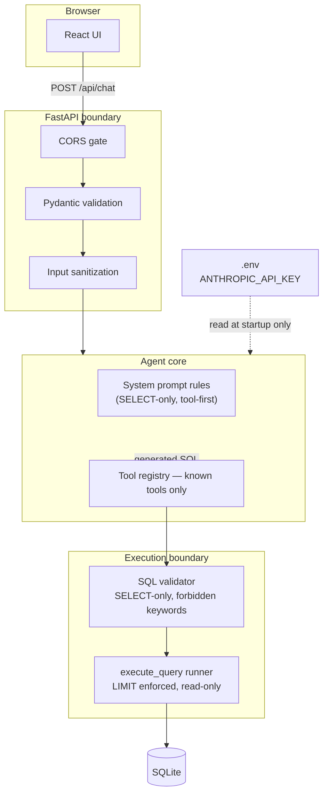

# 23. Security Design — DataFlow AI

## Purpose

Define the security posture of DataFlow AI: how the application protects the database, the LLM credentials, the browser channel, and the user's session data — within the realistic scope of a hackathon demo while still demonstrating the practices a production system would require. The official brief explicitly calls out "ensure secure database connections," "no hardcoded API keys," and meaningful error handling; this document shows how those requirements are engineered.

## Overview

The threat model is deliberately scoped. DataFlow AI is a single-tenant, local demo application that reads a provided SQLite dataset through an LLM-generated query pipeline. The attacker surface of interest is therefore not the internet at large, but four concrete channels:

1. **The LLM itself** — the model generates SQL; the model can be tricked, confused, or prompted into producing statements that mutate or exfiltrate the database.
2. **The API layer** — a malicious or malformed request to the FastAPI endpoints.
3. **The credential store** — the Anthropic API key, which has monetary value and must never leak into code, images, or logs.
4. **The browser channel** — CORS, XSS via rendered markdown/Mermaid, and accidental cross-origin reads.

The strategy is *defense at the boundary closest to the risk*: SQL is guarded at the execution boundary, credentials are guarded at the configuration boundary, and content is neutralized at the render boundary.

## Architecture

### 23.1 The SQL Execution Boundary (primary control)

Every statement the LLM proposes passes through the validator before touching the database:

- **Whitelist-first**: the statement must begin with `SELECT`; anything else is rejected outright.
- **Blacklist reinforcement**: keywords such as INSERT, UPDATE, DELETE, DROP, CREATE, ALTER, TRUNCATE, EXEC, and EXECUTE are rejected even if disguised (case-insensitive matching, whitespace normalization).
- **Read caps**: queries without an explicit `LIMIT` are auto-limited; a hard cap (1000 rows) prevents a runaway SELECT from consuming memory or freezing the demo.
- **Fail closed**: any ambiguity, parse anomaly, or unsupported construct produces a structured error envelope rather than a best-effort execution.

This is a pragmatic guard for SQLite in a demo context. It is *not* claimed as a substitute for prepared statements, a read-only DB user, or network isolation — and the design does not rely on it as the only control. It is the innermost layer of a layered defense: the system prompt forbids mutations, the tool schema only exposes safe operations, and the validator enforces it at the point of execution.

### 23.2 Credential Management

- The Anthropic API key exists only in `.env` (gitignored), read at process startup via the configuration layer.
- No key ever appears in source, tests, images, Compose files, or logs; the health endpoint reports reachability, never the key.
- The `.gitignore` hard-blocks `.env`; a pre-submission sweep (`grep -r 'sk-ant'`) is part of the checklist (`37_FinalExecutionChecklist.md`).
- Docker images receive the key only at runtime through `env_file`, so the same image is safe to share.

### 23.3 The Browser Channel

- **CORS**: the API accepts only the configured origin (`CORS_ORIGIN` — `http://localhost:5173` in dev, the deployed origin in production). Credentials are not forwarded, and wildcard origins are never used.
- **Content neutralization at render time**: user and model markdown is rendered with a safe markdown renderer (no raw HTML execution); Mermaid is rendered with `securityLevel: strict` so diagram code cannot smuggle HTML or scripts into the DOM; SVG downloads are generated locally, never fetched from a third party.
- **No third-party scripts**: the app loads no external analytics or CDN scripts beyond the bundled libraries, eliminating supply-chain XSS vectors in the page itself.

### 23.4 API Input Validation

Every request body is validated by Pydantic models before any handler logic runs: required fields (message, session_id), type constraints, and length ceilings. Malformed input returns a structured 422/400, not a stack trace — no internals are leaked to the client.

### 23.5 Session Data Minimization

- Sessions hold only the conversation text and tool artifacts required for multi-turn context; they live in process memory and die with the server.
- No user data is written to disk, logged, or transmitted anywhere except the single LLM provider call for which the user asked.
- The frontend keeps query history in `localStorage` only — no server-side persistence, no cookies, no tracking.

### 23.6 The Agent Loop as a Security Surface

The tool-calling loop is bounded and typed:

- Only the five registered tools can be invoked; an unknown tool name returns a structured error envelope — the registry is an allowlist.
- `MAX_TOOL_ITERATIONS` (8) bounds the loop, preventing a confused model from hammering tools.
- `TOOL_TIMEOUT_SECONDS` (30) bounds each execution, preventing a hung query from wedging the demo.
- Tool outputs are JSON-serialized before being returned to the model; they are data, never instructions the model blindly executes — though the prompt explicitly instructs the model to treat tool errors as facts for recovery.

## Design Decisions

| Decision | Why |
|---|---|
| Validator at execution boundary, not just prompt-level | The prompt is advisory; the validator is enforceable. Defense in depth requires the hard control at the last touchpoint |
| Fail-closed validator | A rejected-but-safe query costs a retry; an accepted-but-mutating query costs the demo and possibly the database. Fail closed is the correct asymmetry |
| Read-only mental model (SELECT-only) | The dataset is a provided sample; no legitimate user flow needs writes; removing write capability removes the whole mutation threat class |
| Secrets in `.env` only, never in images | The brief demands it; images are shared artifacts and must be key-agnostic |
| Mermaid `securityLevel: strict` | Mermaid code is LLM-generated — an untrusted input class. Strict mode is the documented way to prevent HTML/script injection via diagram syntax |
| No auth in scope | Single-tenant local demo; auth adds surface area without score. Explicitly out of scope; the architecture keeps auth a future concern isolated at the router layer |
| CORS default `http://localhost:5173` | Dev uses Vite on 5173; production (nginx on 3000) sets the env var. Restricting by default is safer than opening by default |

## Responsibilities

- **db/validator**: sole authority over statement admissibility; deterministic, unit-tested, no side effects.
- **execute_query**: applies LIMIT caps, serializes rows, never returns connection objects or internals.
- **config layer**: loads secrets from environment, fails loudly if `ANTHROPIC_API_KEY` is absent, never prints values.
- **api layer**: CORS middleware, Pydantic validation, structured error responses, request-size ceilings.
- **frontend**: strict-mode Mermaid rendering, safe markdown, no raw HTML, no external scripts, localStorage-only history.
- **Dev A / Dev B (joint)**: commit hygiene — `.env` never committed, key never in screenshots or video (video is blurred/edited if a key appears).

## Dependencies

- `python-dotenv` (or equivalent) for environment loading.
- Pydantic (via FastAPI) for request validation.
- CORS middleware configuration from `CORS_ORIGIN`.
- Mermaid.js strict security mode configuration in the diagram renderer.
- `.gitignore` + `.env.example` conventions from `13_ProjectStructure.md`.
- Compose `env_file` wiring from `22_DockerArchitecture.md`.

## Advantages

- Every risk channel has a control that is *verifiable in code review* — the validator, the allowlist registry, the CORS gate, the strict renderer. Security is demonstrable to judges without a security theater slide.
- Controls are cheap: no external services, no certificates, no auth plumbing — all within a 2-day budget.
- The SELECT-only posture is also a demo feature: judges can watch a rejected `DROP TABLE` attempt in the demo to prove the guard works.

## Limitations

- The keyword-based validator is not a general SQL firewall; a determined attacker with a writable connection could find parser edge cases. Mitigation: SQLite is local and single-tenant; the guard's real job is stopping the *LLM*, not an adversary with shell access.
- No rate limiting or abuse protection on the API — acceptable for local demo, must be added before any public deployment.
- In-memory sessions mean no multi-user isolation story yet; multi-tenancy is deferred to `26_ScalabilityPlan.md`.
- The API key is a single point of failure — if it leaks or is revoked, the demo dies. Backup key strategy is covered in `34_RiskAssessment.md`.

## Future Improvements

- Parameterized query execution path and a read-only SQLite connection opened with restricted flags.
- API-key rotation support, request signing, and per-session rate limits for public deployment.
- Audit log of tool invocations (which tool, which SQL, when) — also a nice innovation-bonus talking point.
- Optional basic auth or magic-link gating for the multi-user/collaborative bonus features.
- Static analysis (bandit, npm audit) wired into the CI pipeline.

## Best Practices

- Treat the LLM as an untrusted author of SQL and of Mermaid; both cross a trust boundary.
- Never log request bodies or tool inputs verbatim; log shapes and statuses.
- Keep validation logic free of network and I/O so it can be exhaustively unit-tested.
- Re-check `.gitignore` and run the secret sweep before every checkpoint merge, not just at the end.

## Summary

The security design concentrates enforcement at three boundaries — SQL execution, credential configuration, and content rendering — each with a single, testable control: the validator, `.env`-only secrets, and strict-mode rendering. The posture is honest about its demo-scale scope and explicitly defers multi-user hardening, while delivering everything the brief requires and giving judges a visible, demonstrable security story.

---

**Next document:** `24_ErrorHandlingStrategy.md`
