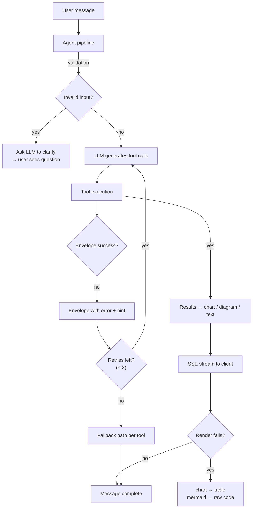
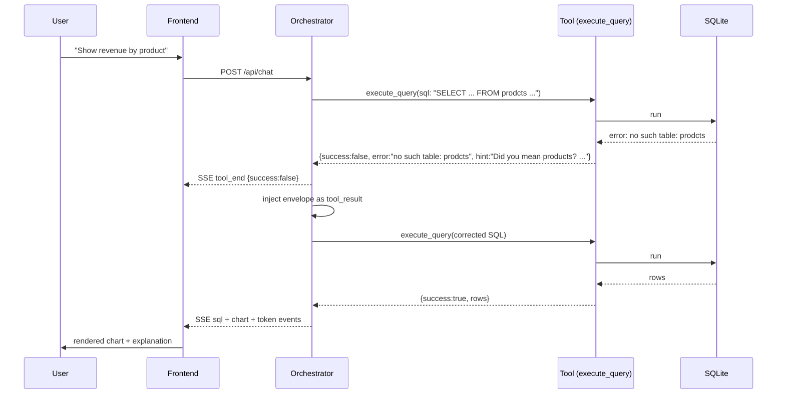

# 24. Error Handling Strategy — DataFlow AI

## Purpose

Define how DataFlow AI detects, classifies, communicates, and recovers from failure across every layer — user input, LLM, SQL generation, tool execution, database, network, and rendering. The brief demands "graceful error handling, meaningful error messages, and LLM self-recovery"; the UX rubric rewards clear error states; and the demo cannot afford a single unhandled crash. This document is the single source of truth for the error taxonomy and recovery flows.

## Overview

The strategy has three layers, each with distinct goals:

1. **Envelope layer (backend)** — every tool returns a structured envelope that distinguishes success, failure, and *recoverable* failure, with a hint field that tells the LLM what to do next.
2. **Agent layer (orchestrator)** — failures are injected back into the conversation as facts, the model re-reasons and retries (bounded), and only then does a human-readable message reach the user.
3. **Experience layer (frontend)** — failures render as friendly, actionable states with retry affordances; nothing ever shows a stack trace, and the session always remains usable.

The governing principle: **fail visibly, recover automatically, degrade gracefully**. No silent failures, no dead ends, no broken sessions.

## Architecture

### 24.1 Error Taxonomy

Every failure in the system maps to one of the following classes. Each class has a canonical error code (see `08_APIArchitecture.md`), a recovery strategy, and a user-facing tone.

| Class | Examples | Code | Recovery strategy |
|---|---|---|---|
| User input | Empty message, malformed JSON, missing session | `EMPTY_MESSAGE` 400 / `INVALID_SESSION` 400 / `PARSE_ERROR` 422 | Validate at the boundary; ask the LLM to ask a clarifying question for ambiguous but valid input |
| SQL generation | Wrong table name, wrong column, wrong syntax | (in-band envelope) | Envelope carries `hint` + `available_tables`; model self-corrects |
| SQL safety | INSERT/DROP attempted, no leading SELECT | `SQL_UNSAFE` 400 | Validator rejects; hint explains the SELECT-only rule; model rephrases |
| Database | Table missing, connection error, locked file | `DB_ERROR` 500 | Envelope + hint; model re-checks schema and retries |
| Tool logic | Unknown chart type, missing key, empty data | `TOOL_ERROR` 500 | Tool-specific validation errors; model adjusts inputs |
| LLM provider | Timeout, rate limit, auth failure | `CLAUDE_TIMEOUT` 503 / `CLAUDE_RATE_LIMIT` 429 | Cache schema, batch calls; friendly fallback message; ask user to retry |
| Rendering | Mermaid parse failure, chart component crash | (client-side) | Error boundary → raw Mermaid text / tabular fallback |
| Network | SSE drop, mid-stream disconnect | (client-side) | Reconnect logic, resend prompt affordance, error banner |

### 24.2 The Envelope Contract (backend)

Every tool returns one of two shapes:

- **Success**: `{success: true, ...tool-specific fields}` — the payload is structured data the model can reason about and pass to the next tool.
- **Failure**: `{success: false, error: <human-readable cause>, hint: <what to try next>, ...contextual fields}` — the model treats this as a fact of the environment and re-plans.

The `hint` field is the recovery engine: it converts an opaque failure into a directive the model can act on (e.g., "no such table: prodcts — did you mean products? Available tables: ..."). Hints are written for the *model*, and the model is instructed to translate them into user-friendly language.

### 24.3 Agent-Side Recovery Loop

- On a failure envelope, the orchestrator injects the envelope as the `tool_result` for the failed call and lets the model continue — no abort, no special-casing.
- Retries are bounded (`MAX_TOOL_ITERATIONS = 8` for the whole turn; effectively ≤ 2 recovery attempts per failing tool) so a confused loop terminates and produces an honest apology + suggested next step.
- LLM-level failures (timeout/rate limit) bypass the tool loop: a cached-schema retry once, then a friendly fallback message ("The analysis service is busy — please try again in a moment") with no data fabricated.

### 24.4 Empty Results (a first-class case)

Empty query results are not errors, but they are handled explicitly: the model states plainly that no records matched, explains why that might be (filters, date window, joins), and suggests a concrete refinement. No chart is generated for empty data — `generate_chart` rejects it, and the model is told to present the fact conversationally instead.

### 24.5 Frontend Error Experience

- **ErrorBubble**: a visually distinct, red-bordered message state with an icon, a friendly explanation, and a retry button — the user can always re-send the same prompt.
- **In-stream resilience**: a failed render mid-stream does not destroy the conversation; the fallback (table for chart, raw Mermaid code block for diagram) keeps the answer usable.
- **Connection errors**: the input bar shows a disconnected state with a "Reconnect / Retry" affordance; sent-message state is preserved so a resend does not duplicate the message.
- **Nothing technical leaks**: errors shown to users are pre-written templates + LLM-generated explanations; raw exception text appears only in server logs.

### 24.6 Error Flow Reference

## Design Decisions

| Decision | Why |
|---|---|
| Envelopes, not exceptions, across tool boundaries | Exceptions are for programmers; envelopes are for the LLM. The model can only recover from failures it can *read* |
| Hints written for the model | The model composes the user-facing message; giving it actionable hints produces better UX text than canned strings |
| Bounded retries inside the agent loop | Unbounded retry is the classic demo-killer (infinite tool loops); 8 iterations is generous for 3–4 tool steps plus 2 corrections |
| LLM failures never fabricate data | The cardinal UX sin is inventing numbers; a "service busy" message costs nothing and preserves trust |
| Empty results handled explicitly | Prevents misleading empty charts and gives the model a script for a common case |
| Client-side fallbacks for rendering | Rendering is the last hop; an error there must not kill the answer — degrade the artifact, keep the answer |
| Human-friendly templates + LLM explanations | Consistent, calm error copy; judges see polish instead of stack traces |

## Responsibilities

- **db/validator**: deterministic safety errors with actionable hints (SELECT-only rule, available tables).
- **execute_query**: DB errors translated to envelopes with schema-aware hints; row caps enforced.
- **generate_chart / generate_flowchart / explain_data**: input-validation errors (type, keys, empty data) with hints listing what the tool expects.
- **tool_registry**: unknown-tool and unexpected-exception envelopes; the last line of defense so no crash escapes the loop.
- **orchestrator**: retry budget, LLM-failure fallback messages, loop termination, in-band SSE `error` events.
- **frontend**: error states, fallback rendering, reconnect affordances, zero stack-trace policy.
- **Dev A / Dev B**: each owns the tests that prove their layer's error paths (`20_TestingStrategy.md`).

## Dependencies

- Envelope format defined in `30_ToolSpecifications.md`; SSE error event in `08_APIArchitecture.md`; error codes table shared with the frontend types.
- Retry budget configuration (`MAX_TOOL_ITERATIONS`, `TOOL_TIMEOUT_SECONDS`) from `10_BackendArchitecture.md`.
- Schema-cache behavior (used by recovery hints) from `05_AgentArchitecture.md`.
- Frontend error UI components from `27_UI_UX_Documentation.md`.

## Advantages

- The recovery loop is *automatic*: most demo failures (typos, wrong columns, empty results) self-heal through the LLM without user intervention — a genuinely impressive live moment.
- Failures never break the session: the user can always retry or ask a follow-up.
- The taxonomy makes testing tractable: each class has defined inputs and expected envelopes (see `20_TestingStrategy.md`).
- Error handling is also a judging story: a demoed intentional error + graceful recovery demonstrates Functionality and UX simultaneously.

## Limitations

- Bounded retries mean pathological inputs still produce a "give-up" message; the design accepts this in exchange for guaranteed termination.
- The validator's hint quality depends on the schema cache being fresh; stale cache can produce misleading "available tables" hints (mitigated by refreshing on `get_schema` calls).
- LLM-authored error text can occasionally be verbose; the system prompt caps it.
- Rate-limit recovery is best-effort; a hard rate limit may still surface during a busy demo window.

## Future Improvements

- Structured error telemetry (class, tool, retry count, latency) exposed on a `/api/health`-style diagnostics endpoint.
- Automatic fallback to a cached/summarized answer for repeated LLM timeouts.
- Client-side sentry-style error capture for the video recording phase.
- Per-tool circuit breakers if a specific tool fails repeatedly within a session.

## Best Practices

- Never expose exception internals to the client; log them server-side with correlation IDs.
- Test the *recovery*, not just the error: assert the envelope hint text, then assert the corrected retry succeeds.
- Keep error copy consistent with the design system (tone, iconography) — see `27_UI_UX_Documentation.md`.
- Rehearse at least one intentional failure in the demo so the recovery moment is polished.

## Summary

Error handling is designed as a three-layer recovery system: envelopes at the boundary, model-driven retry in the agent loop, and graceful fallbacks in the UI. Every failure class has a code, a recovery path, and a user experience. The net effect is an application that looks resilient because it is — failures are events the system plans for, not accidents it suffers.

---

**Next document:** `25_PerformanceOptimization.md`
