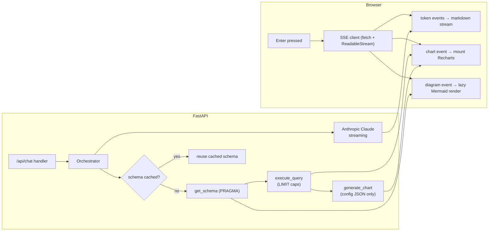

# 25. Performance Optimization — DataFlow AI

## Purpose

Define how DataFlow AI meets its responsiveness commitments — first token under 2 seconds, chart render under 500 ms, smooth streaming, and no perceived stutter on a modest demo machine — and how performance is measured, protected, and tuned within a 2-day sprint. Performance here is a UX and judging metric, not an infrastructure exercise.

## Overview

The performance budget is end-to-end: from the user pressing Enter to the first token appearing, and from the query result arriving to the chart being interactive. The main costs are (a) the LLM round-trip, (b) tool execution (SQLite is effectively free at demo scale), (c) serialization of results, and (d) client rendering of charts and diagrams. The strategy is *stream everything, cache the expensive, cap the unbounded, and render lazily*.

## Architecture

### 25.1 Streaming as the Primary Latency Strategy

The first-token budget is won or lost on one decision: **never buffer the LLM response**. The orchestrator streams every artifact as it is produced — `tool_start`, `tool_end`, `sql`, `chart`, `diagram`, `token` events over SSE — so the UI is live from the moment the agent begins. Even when the model is mid-reasoning, the TypingIndicator communicates progress, which the UX research treats as perceived latency (see `27_UI_UX_Documentation.md`).

### 25.2 Caching the Expensive

- **Schema cache (per session)**: `get_schema` is called once per session, then cached; subsequent queries skip the PRAGMA round-trips. The cache is invalidated on session clear and refreshed on demand.
- **Static assets**: Vite emits content-hashed assets with long-lived cache headers (nginx serves them with `immutable`); the SPA shell loads once.
- **Provider-agnostic**: the LLM call itself cannot be cached safely (queries vary); caching is reserved for deterministic, session-invariant data.

### 25.3 Capping the Unbounded

| Dimension | Cap | Rationale |
|---|---|---|
| Result rows | 100 default, 1000 hard max | Bounds serialization, SSE payload, and chart data |
| Chart data points | Bounded by row cap | Keeps Recharts interaction smooth |
| Diagram size | Model guidance + client render guard | Mermaid rendering is the slowest client operation; huge graphs freeze the tab |
| Tool iterations per turn | 8 | Bounds LLM+tool loop latency to a predictable window |
| Tool execution time | 30 s per tool | A hung query cannot wedge the stream |
| History in context | 10 turns | Bounds prompt size, latency, and cost per request |
| Token generation | 4096 max per response | Bounds worst-case stream duration |
| SSE chunk size | Small, frequent chunks | Feels instant; enables incremental markdown rendering |

### 25.4 Client-Side Rendering

- **Lazy-load Mermaid**: the diagram engine is the heaviest frontend dependency; it loads on first diagram use (dynamic import), keeping initial bundle small and the first paint fast.
- **Incremental rendering**: markdown is rendered as tokens accumulate (throttled to avoid layout thrash); charts mount only when their full `chart` event arrives; the container is `ResponsiveContainer`-based so resize is cheap.
- **Chart render budget (< 500 ms)**: guaranteed by (a) small data (row caps), (b) SVG-based Recharts (no canvas pixel loops), and (c) memoized components so parent re-renders (streaming) do not re-render charts.
- **No unnecessary re-renders**: streaming state lives in a single `useChat` state machine; message objects are appended immutably; chart/diagram payloads are stable references after mount.

### 25.5 Serialization & I/O

- Tool results are serialized once, in Python, into JSON before entering the LLM context or SSE; no repeated re-serialization in the loop.
- SQLite access is async (aiosqlite) so query waits never block the event loop; at demo scale a single connection per session is sufficient, with a small pool as a safety valve.
- SSE events use compact JSON with only the fields the client needs (no echoed session state, no debug fields in the wire format).

### 25.6 Measurement & Verification

- **First token**: measured from POST to first `token` event; target < 2 s (dominated by provider latency — realistically 0.8–1.8 s for the first streaming chunk).
- **Tool latency**: get_schema < 50 ms (PRAGMA reads), execute_query < 20 ms at demo scale; verified by unit tests and a `curl -N` capture at CP2/CP4.
- **Chart render**: measured in-browser via `Performance` marks around the chart mount; target < 500 ms.
- **Bundle budget**: initial JS < 300 kB gzipped (Mermaid excluded from initial chunk); verified with `vite build` output and a quick Lighthouse pass.

## Design Decisions

| Decision | Why |
|---|---|
| Stream everything, buffer nothing | Perceived latency collapses; judges see a ChatGPT-like product, not a spinner |
| Cache only deterministic data | Schema is the one expensive, safe cache; caching query results would be wrong and costly |
| Hard caps over cleverness | At demo scale, caps deliver 99% of the performance win with zero tuning risk |
| Lazy Mermaid import | The heaviest dependency never touches the critical path unless a diagram is requested |
| Memoized visualization components | Streaming re-renders are frequent; charts must not re-render with each token |
| Async everywhere on the backend | A single blocking DB call during a stream would stall every concurrent session |
| Measure at checkpoints | CP2 (streaming), CP4 (full scenarios), and CP5 (Docker) each include a timing check |

## Responsibilities

- **orchestrator**: emit events as early as possible; respect iteration/timeout caps; never buffer the full response before sending.
- **db layer**: async connections; indexed queries (see `07_DatabaseDesign.md`); row caps applied at execution.
- **api layer**: SSE framing efficiency; no heavyweight middleware on the stream path.
- **frontend**: lazy Mermaid, memoized charts, throttled markdown rendering, performance marks.
- **Dev A / Dev B**: run the timing checks at each checkpoint and record numbers in the integration log.

## Dependencies

- SSE transport from `08_APIArchitecture.md`; caps from `10_BackendArchitecture.md`; schema cache from `05_AgentArchitecture.md`; indexes from `07_DatabaseDesign.md`; component design from `09_FrontendArchitecture.md`.
- `20_TestingStrategy.md` for the acceptance timing tests.

## Advantages

- The streaming-first design converts the dominant cost (LLM latency) into an asset — the product *feels* fast because it is always doing something visible.
- Caps make worst-case behavior predictable, which protects the demo and simplifies testing.
- Every optimization is cheap to implement; none requires infrastructure or profiling expertise — feasible in a 2-day sprint.
- Performance evidence (timings captured at checkpoints) is a strong talking point for the Visualization/UX criteria.

## Limitations

- First-token latency is ultimately bounded by the provider; no client-side trick can beat the network. Mitigation: warm cache, small prompts, and the TypingIndicator.
- Mermaid rendering of large diagrams can still cost hundreds of milliseconds; capped by the model guidance and row caps, but not eliminated.
- In-memory session state means no cross-process caching; a multi-worker deployment would duplicate the schema cache (see `26_ScalabilityPlan.md`).
- No load testing; "performance" here means single-user demo responsiveness, not throughput.

## Future Improvements

- Provider-side prompt caching (Anthropic) for the system prompt + tool schemas, cutting latency and cost on multi-turn flows.
- Result-level caching keyed by normalized SQL for repeated identical questions.
- Server-sent incremental SQL validation (lint the generated SQL before execution) to fail faster on typos.
- Web Worker-based Mermaid rendering to keep the main thread free.
- Real streaming telemetry surfaced on a dev-only dashboard for the demo narrative.

## Best Practices

- Profile the demo path, not the abstract system: the three use-case queries are the performance spec.
- Keep the wire format minimal; every field on the SSE event is a tax on every chunk.
- Re-test after dependency upgrades — Recharts and Mermaid versions change render costs.
- Capture timing evidence (screenshots of network panel / performance marks) for the video and README.

## Summary

Performance is engineered as a set of cooperating behaviors: streaming everywhere, caching the schema, capping the unbounded, and rendering lazily on the client. The measurable targets (first token < 2 s, chart < 500 ms) are simple to verify and aligned with the UX rubric. The design treats latency as a UX property rather than an infrastructure metric — appropriate for a demo product whose judges experience it live.

---

**Next document:** `26_ScalabilityPlan.md`
