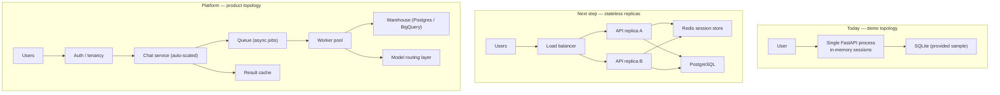

# 26. Scalability Plan — DataFlow AI

## Purpose

Define how DataFlow AI scales from a 2-developer demo to a production conversational analytics platform — and, equally important, why the demo deliberately does *not* scale certain dimensions yet. The plan separates "must scale for judging day" (reliability, multi-session concurrency on one host) from "will scale for a product" (multi-tenancy, horizontal replicas, distributed memory), and shows the seams where growth plugs in without rework.

## Overview

DataFlow AI's architecture was chosen with scale in mind in the seams that matter: the backend is stateless except for the session store; the tool layer is a registry (add tools without touching the orchestrator); the database access is behind an adapter (swap SQLite for PostgreSQL); and the frontend consumes a versioned wire contract. Three scaling dimensions are tracked explicitly:

1. **Sessions** (concurrent users) — bounded today by in-memory sessions and one process.
2. **Data** (query volume and size) — bounded today by SQLite and row caps.
3. **Capabilities** (databases, tools, users) — the fastest-growing dimension, already unbounded by design.

## Architecture

### 26.1 Session Store — the First Bottleneck, by Design

Sessions live in an in-memory dictionary (`agent/session.py`): the 10-turn sliding window plus the per-session schema cache. This is a *deliberate* demo-scale choice (zero infrastructure, restart-clears-all is fine for a demo) with a defined replacement path:

- The session interface is already isolated behind a module boundary with a small, explicit surface (create, get, append, clear).
- Scaling step 1: back that interface with Redis (or a SQLite file) — no orchestrator changes.
- The 10-turn window and schema-cache semantics are transport-agnostic; they move as data, not logic.

### 26.2 Stateless API Replicas

The backend exposes no sticky-state assumptions on the request path: the only mutable state is the session store, which is externalizable. Once sessions move to Redis, the API tier scales horizontally behind any load balancer:

- SSE streams are per-connection; replicas are independent; no shared streaming infrastructure is needed at this scale.
- LLM calls are the cost driver; per-replica rate limiting plus a shared cache for schema are the first operational controls.
- Docker Compose (`22_DockerArchitecture.md`) already builds the artifact; scaling means more replicas, not new code.

### 26.3 Database Adapter — Multi-Database as a Growth Path

The database layer is an adapter over SQLite with one SQL dialect in play. The growth path:

- **Phase 1 (today)**: SQLite only; validator tuned to SQLite syntax; `get_schema` via PRAGMA.
- **Phase 2 (bonus feature)**: add a `db_type` configuration and per-dialect schema discovery (information_schema for PostgreSQL/MySQL) and query generation guidance in the system prompt. The tool contract (schema JSON → SQL → rows JSON) does not change — which is exactly why the multi-database bonus is *low-risk high-value*: the LLM does the dialect work once the schema adapter provides correct metadata.
- **Phase 3 (platform)**: a read replica / warehouse tier for analytical load, keeping the conversational tier thin.

### 26.4 Data-Volume Scaling

At demo scale, SQLite + row caps are sufficient and *faster* than a networked database. When the data outgrows the single file:

- Row caps and LIMIT discipline already protect the query path — the same caps scale the product.
- The `execute_query` result contract (columns + rows + row_count + truncated flag) is identical for a warehouse backend; aggregation stays on the database.
- Charts are fed from bounded, already-aggregated datasets; visualization cost never scales with raw table size.

### 26.5 Capability Scaling (the dimension that wins)

The tool registry pattern (`06_ToolArchitecture.md`) means new capabilities are additive: register a tool, define its JSON schema, and the agent can use it immediately. Candidate additions with the same contract: live-data connectors (real-time bonus), forecasting tools (ML-insights bonus), dashboard-pinning tools, export-to-PDF.

### 26.6 Operational Scaling

- **Observability**: `/api/health` exists; add request timing, tool latency histograms, and LLM token usage counters next.
- **Cost control**: token budget per turn, per-session spend caps, and schema caching are the first levers; a model-routing layer (small model for intent, large model for SQL) is the next.
- **Reliability**: bounded retries, timeouts, and circuit breakers per tool already exist; they generalize unchanged.

## Design Decisions

| Decision | Why |
|---|---|
| In-memory sessions for the demo | Zero infrastructure, simplest correct behavior for single-host judging; the interface is designed for replacement, so the cost is deferred, not paid |
| Session store behind a module boundary | The one stateful thing is quarantined; every other layer stays stateless and therefore scale-ready |
| SQLite today, adapter tomorrow | The brief provides SQLite and the demo must be reliable; the adapter seam means multi-database is a config change plus a schema-discovery tweak, not a rewrite |
| Row caps as the universal data guard | Limits protect every downstream consumer (LLM context, charts, SSE payloads) with one mechanism |
| Registry-based tool growth | Capability scaling is additive; the orchestrator never changes when a tool is added |
| SSE per-connection | No shared streaming broker needed at this scale; websocket/broker upgrades are deferred until genuinely required |

## Responsibilities

- **session module**: isolate and document the stateful surface; make the store swappable.
- **db layer**: keep the dialect seam clean; document what changes for PostgreSQL/MySQL.
- **tool_registry**: remain the only place tools are registered; keep schemas declarative.
- **orchestrator**: stateless core logic; no session-affinity assumptions.
- **Dev A / Dev B**: implement today's topology only; do not add speculative infrastructure — the plan above is the constraint.

## Dependencies

- Session interface contract from `05_AgentArchitecture.md`; DB adapter from `07_DatabaseDesign.md`; registry from `06_ToolArchitecture.md`; statelessness from `10_BackendArchitecture.md`; multi-DB bonus from `29_FeatureSpecifications.md`.

## Advantages

- The demo topology is minimal (no Redis, no Postgres) — faster to build, easier to demo, fewer failure points on judging day.
- The scale seams are real: every growth path listed above requires changes in one module, not a rewrite.
- The multi-database bonus is genuinely reachable within the sprint because the adapter seam exists.
- Bounded sessions and capped queries make worst-case resource usage predictable.

## Limitations

- Single-process session memory limits concurrent sessions to the host's RAM and resets on restart — acceptable for judging, fatal for production without the Redis step.
- SQLite serializes writes; as a read-only analytical source it is fine, but write-heavy workloads require Phase 3.
- SSE without a broker means long-lived connections are tied to one replica; sticky or broker-based routing becomes necessary at platform scale.
- No auth/tenancy today; multi-user features (collaborative bonus) need the tenancy layer first.

## Future Improvements

- Redis-backed session store + two API replicas behind nginx load balancing (an afternoon's work once the store interface is implemented).
- PostgreSQL adapter with information_schema discovery; validator dialect configuration.
- Async job queue for long-running analytical queries with result polling.
- Model-routing layer and provider failover for cost and reliability.
- Real-time data connectors exposed as new registry tools.

## Best Practices

- Keep the session store interface tiny and testable; it is the highest-value scaling investment per line of code.
- Never let a new feature touch the orchestrator's core loop; grow the registry, not the loop.
- Re-validate caps when adding data sources — the caps are the contract that protects the LLM context and the chart renderer.
- Document scale decisions in commit messages so the growth path stays discoverable.

## Summary

Scalability is a set of seams, not a feature: the session store is quarantined behind an interface, the database behind an adapter, the tools behind a registry, and the API stateless by construction. The demo runs on the minimal topology that judges need, while every material growth path — multi-session, multi-database, horizontal replicas, capability expansion — is a single-module change. The plan deliberately defers infrastructure until it pays for itself, which is precisely the right calculus for a 2-day sprint that must still feel production-grade.

---

**Next document:** `27_UI_UX_Documentation.md`
