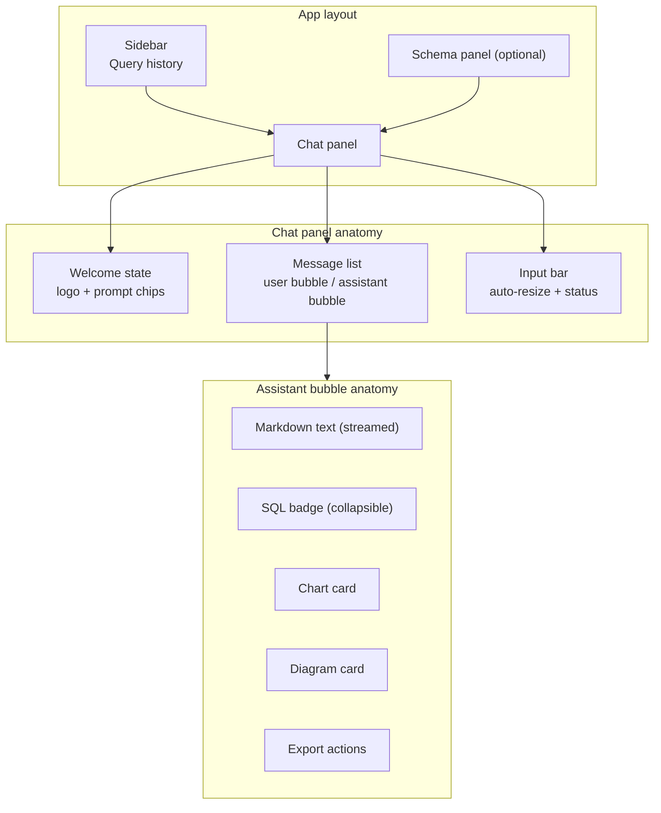

# 27. UI/UX Documentation — DataFlow AI

## Purpose

Define the complete visual and interaction design system for DataFlow AI: the design philosophy, color and typography tokens, layout anatomy, every screen state, component-level interaction behavior, responsive behavior, and accessibility commitments. The UX criterion is worth 15% of the score and is experienced within the first minute of judging — the UI must look and feel like a polished product, not a prototype.

## Overview

Five principles anchor the design:

1. **Familiar** — the layout, streaming behavior, and message anatomy mirror ChatGPT, so judges understand it instantly with zero instruction.
2. **Streaming-first** — token-by-token responses with a live status indicator; the interface is always visibly working.
3. **Visualization-native** — charts and diagrams render *inside* the conversation, at the point of relevance, not in a separate panel.
4. **Trust through transparency** — the SQL that produced an answer is one click away; tool activity is shown while it happens.
5. **Dark, polished, consistent** — a single design language across every state; nothing looks bolted on.

## Architecture

### 27.1 Design Tokens

| Token | Value | Usage |
|---|---|---|
| Background | `#0f0f13` | App canvas |
| Surface | `#1a1a24` | Cards, bubbles, panels |
| Border | `#2a2a3a` | Dividers, card outlines |
| Primary | `#6366f1` (indigo) | Accents, user bubbles, CTAs, default chart color |
| Text primary | `#f1f0ff` | Body copy |
| Text muted | `#8b8ba7` | Secondary copy, placeholders |
| Success | `#22c55e` | Positive states, tool success |
| Error | `#ef4444` | Error states, destructive actions |
| Chart palette | `#6366f1 #8b5cf6 #06b6d4 #10b981 #f59e0b` | Series colors across all charts |

Typography follows a system-font stack (UI sans for interface, monospace for SQL/Mermaid code blocks) with a strict scale: 24 px page-level headings, 15–16 px body, 13 px secondary, 12 px captions/labels. Contrast between text and surfaces exceeds WCAG AA (≥ 4.5:1) by construction of the tokens.

### 27.2 Layout Anatomy

- **Desktop (> 1024 px)**: three columns — history sidebar (240 px), chat panel (flex), optional schema panel (280 px, toggleable).
- **Tablet (768–1024 px)**: two columns; sidebar collapses behind a hamburger.
- **Mobile (< 768 px)**: single column; sidebar and schema panel become slide-over sheets.

The chat panel itself is a vertical flex: welcome content or message list (scrollable, auto-scroll pinned to bottom), then the input bar docked at the bottom.

### 27.3 Conversation States

| State | Trigger | Visual behavior |
|---|---|---|
| Welcome | Fresh session, no messages | Sparkle mark, "DataFlow AI" heading, subtitle "Ask questions about your data in plain English", three example chips (top products revenue, ER diagram, revenue trend) — clicking a chip sends it |
| Idle | Ready for input | Active input bar, placeholder "Ask anything about your data…" |
| Thinking | Message sent, pre-first-token | TypingIndicator: three pulsing dots + contextual tool label ("Reading schema…", "Running query…", "Building chart…"); input bar disabled |
| Streaming | Tokens arriving | Text renders incrementally with a blinking cursor; SQL badge and chart/diagram cards mount as their events arrive |
| Chart/Diagram rendered | Artifact complete | Card with title, embedded visualization, export row (PNG, CSV) |
| Error | Failure or give-up | ErrorBubble: red-bordered, icon, friendly message, retry button |
| Disconnected | SSE lost | Banner in input area + reconnect/retry affordance; sent message preserved |

### 27.4 Component Interaction Specs

- **MessageInput**: auto-resizing textarea (1–5 rows); Enter sends, Shift+Enter newline; disabled with spinner while processing; character counter appears beyond 500 chars.
- **MessageBubble**: user messages right-aligned, indigo; assistant messages left-aligned, surface-colored, with a sparkle avatar; content is markdown; streaming messages show the blinking cursor.
- **SQLBadge**: collapsible row atop assistant messages that used SQL — "Show SQL / Hide SQL" toggle with monospace, syntax-highlighted SQL and a copy button. This is the SQL-transparency innovation feature and must be prominent in demos.
- **TypingIndicator**: appears immediately on send; cycles tool-specific labels with a small icon (magnifier = schema/query, chart glyph = chart build, diagram glyph = diagram build); disappears at the first token.
- **ChartRenderer**: renders the four chart types from the `chart` event payload; responsive container; tooltips and legend enabled; title and axis labels from the payload.
- **DiagramRenderer**: renders Mermaid; loading skeleton while the lazy chunk loads; full-screen toggle for large diagrams; SVG download; error boundary falls back to the raw Mermaid code in a code block.
- **QueryHistory (sidebar)**: local list of past questions; click re-runs; per-item delete; "Clear all". Populated automatically after each sent message.
- **ExportButton**: "PNG" (captures the chart container) and "CSV" (calls the export endpoint with the executed SQL). Sits on every chart card.
- **SchemaPanel**: read-only tree from `GET /api/schema` — tables, columns, types, keys — reinforcing the technical-reviewer persona's trust story.

### 27.5 Loading & Empty States

Every async surface has a defined pre-state: chart cards show a skeleton before the payload arrives; the diagram renderer shows a spinner; empty history shows a hint ("Your questions will appear here"); empty query results produce an assistant message explaining the empty set with a refinement suggestion — never a bare "no data".

## Design Decisions

| Decision | Why |
|---|---|
| ChatGPT-familiar anatomy | Judges map prior knowledge onto the product in seconds; the brief explicitly asks for a "ChatGPT-like" interface |
| Dark theme by default | Matches the chart palette, reads as "product" rather than "assignment", and hides streamed-render artifacts |
| Visualizations inside the bubble | The analytical narrative and its evidence are co-located; this is the core UX differentiator of the product |
| SQL transparency as a first-class UI element | It is an innovation-bonus feature *and* the trust mechanism for technical reviewers — design prominence pays twice |
| TypingIndicator with tool names | Converts invisible agent work into perceived progress; judges see the agent "thinking" |
| Strict state inventory | Every state designed in advance = no improvisation under demo pressure |
| No skeleton libraries | Hand-rolled states keep the bundle small and the look unique |

## Responsibilities

- **Design tokens**: single source of truth in the theme config; components consume tokens, never raw hex.
- **Layout components**: responsive behavior per the tier map; auto-scroll logic; sidebar toggles.
- **Message pipeline**: state machine ownership (useChat) governs all transitions; components are presentational.
- **Accessibility**: every interactive element has a label; streaming regions use `aria-live="polite"` with `role="article"`; modals trap focus; keyboard navigation covers all controls.
- **Dev B**: implements and owns the entire UI surface; Dev A supplies screenshots for the README and never edits frontend files.

## Dependencies

- SSE event contract (`08_APIArchitecture.md`) — event types drive the states above.
- Chart/diagram payload shapes (`30_ToolSpecifications.md`).
- Design tokens and component conventions per `13_ProjectStructure.md`.
- `09_FrontendArchitecture.md` for the component tree this doc maps to screens.

## Advantages

- The UI is the strongest per-hour scoring investment: 15% UX + part of 20% Visualization, all visible in the first minute.
- Streaming-first hides provider latency, making the product feel fast regardless of network conditions.
- SQL transparency and tool-status indicators give judges a story to tell about the architecture — the UI literally narrates the agent.
- A complete state inventory eliminates demo improvisation; every screen the judge can reach is already designed.

## Limitations

- Dark-only theme is a stylistic bet; a light theme would require a token pass (cheap later, skipped now).
- No motion design system beyond the pulsing indicator; micro-animations are deferred (risk of jank under streamed re-renders).
- html2canvas PNG export fidelity varies with CSS features used in charts; acceptable for demo, documented in `24_ErrorHandlingStrategy.md`.
- Custom components (no UI kit) means more hand-written CSS; controlled by the strict token system.

## Future Improvements

- Light theme via token swapping; user preference persistence.
- Voice-input affordance (bonus feature) integrated into the input bar.
- Custom dashboard builder: drag visualization cards from chat into a pinboard view.
- Micro-animations (message entrance, chart mount) once the streamed re-render is proven stable.
- i18n scaffolding for the demo audience.

## Best Practices

- Design every state before writing components — the state inventory above is the contract.
- Never render raw LLM markdown without sanitization; the renderer is part of the security boundary (`23_SecurityDesign.md`).
- Keep charts on a consistent palette; random colors destroy the "polished product" feel.
- Test the UI at 100% and 125% zoom — judges use varied displays.
- Record the demo with the design system visible: the polish is a scoring asset.

## Summary

The UI/UX documentation defines a complete, consistent, product-grade experience: a familiar chat anatomy, a strict dark-theme token system, every conversation state designed in advance, visualizations embedded where they matter, and SQL transparency promoted to a first-class UI element. The design converts the agent's invisible work into visible progress and trust, which is exactly what the UX and Visualization criteria reward.

---

**Next document:** `28_UserJourney.md`
