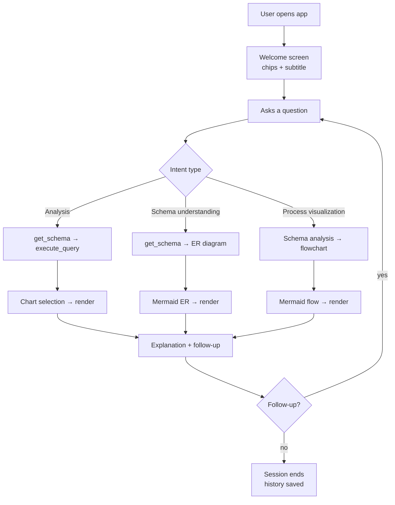

# 28. User Journey — DataFlow AI

## Purpose

Document the complete end-to-end journeys of every persona who touches DataFlow AI — the business user, the technical reviewer (judge/mentor), and the team operator (demo runner) — mapping each step to the system behavior that serves it. The journeys double as the acceptance scenarios for the demo and as the design rationale behind conversation, visualization, and error-handling decisions.

## Overview

Three personas were derived from the brief's audience (non-technical questioners, technical judges, and the presenting team) in `01_RequirementsAnalysis.md`. Each has a distinct emotional arc and different evidence needs:

- **Business User** needs a correct answer, a readable visual, and the freedom to follow up without re-explaining context.
- **Technical Reviewer** needs schema awareness, query transparency, tool-selection rationale, and graceful failure behavior — proof of architecture.
- **Team Operator** needs deterministic flows, visible states, and recovery paths — a demo that cannot embarrass the team.

The journeys below are written as experience maps: step, system behavior, user emotion, and the design lever that serves it.

## Architecture

### 28.1 Journey 1 — Analytical Question → Insight (Business User)

| Step | User action | System behavior | Emotion | Design lever |
|---|---|---|---|---|
| 1 | Opens app | Welcome screen with example chips | Curious, low effort | Zero-training onboarding |
| 2 | "Show me the top 5 products by revenue this quarter" | TypingIndicator ("Reading schema…"), then SQL event, then chart event, then streamed explanation | Anticipatory | Streaming + tool status |
| 3 | Reads answer | Bar chart + concise markdown summary referencing the numbers | Confident | Chart-data co-location |
| 4 | "Now show me the trend for these products over the last year" | Follow-up resolution: carries products + time context; line chart + trend commentary | Effortless | Context retention (`32_ConversationFlow.md`) |
| 5 | Exports the chart | PNG download / CSV export | Satisfied | Export affordances |
| 6 | Wants to repeat tomorrow | Question found in sidebar history; click to re-run | Loyal | Query history |

The emotional contract: the user never needs SQL, never re-explains context, and always sees the evidence behind the answer.

### 28.2 Journey 2 — Database Understanding (Technical Reviewer)

| Step | User action | System behavior | Evidence shown |
|---|---|---|---|
| 1 | "Draw me the ER diagram for this database" | get_schema (PRAGMA discovery) → auto-generated ER diagram | Tool activity visible in indicator |
| 2 | Inspects diagram | Mermaid ER with 5 tables + relationships, rendered in-bubble | Schema fidelity |
| 3 | "Which tables are related to customers?" | Text answer from schema metadata (no SQL needed) | Schema-aware reasoning |
| 4 | Opens SQL badge on an analysis answer | Generated SQL visible with highlighting + copy | SQL transparency (innovation feature) |
| 5 | Deliberately asks something unsupported / triggers a typo | Model surfaces a clarification or recovers via hint + retry | Graceful failure = architecture proof |

The emotional contract: a technical reviewer should leave believing the architecture is clean, the tools are real, and the agent is genuinely tool-orchestrated — not scripted.

### 28.3 Journey 3 — Process Visualization (Team Operator / demo script)

| Step | User action | System behavior | Demo objective |
|---|---|---|---|
| 1 | "Create a flowchart showing how orders flow through our system" | Schema analysis → process inference (Customer → Order → Order Items → Products → Inventory) → flowchart render | UC3 pass |
| 2 | Flowchart renders with stated assumptions | Diagram card + one-line note about inferred assumptions | Assumption surfacing = trust |
| 3 | Full-screen / SVG download | Diagram tooling works on a large graph | Polished tooling |
| 4 | Any failure | ErrorBubble with retry; no crash, no dead end | Recovery under live conditions |

The emotional contract: the operator can run the demo cold, knows every state in advance, and has a scripted recovery for every plausible failure.

### 28.4 The Judge's First Five Minutes (critical path)

Judging decisions crystallize early. The first five minutes map onto Journey 1 (top-products bar chart + follow-up line chart) then Journey 2 (ER diagram + SQL badge). The sequence deliberately demonstrates: streaming (UX), accurate NL→SQL (Functionality), chart selection (Visualization), schema awareness + SQL transparency (Architecture + Innovation), and a recovery moment (Error Handling). The script in `36_JudgingOptimization.md` follows this arc exactly.

### 28.5 Journey Design Principles

- **Trust before depth**: the first answer must be visibly grounded (SQL visible, chart attached, numbers quoted) because judges assess the product before they assess the code.
- **Every journey ends in a working state**: regardless of path (success, empty result, error, disconnect), the user can send the next message — no journey dead-ends.
- **The follow-up is the differentiator**: multi-turn context is what separates a chat product from a query tool; every journey includes at least one follow-up step.

## Design Decisions

| Decision | Why |
|---|---|
| Three personas mapped to three journeys | Each persona has different evidence needs; the demo must serve all three in one five-minute run |
| Journey 1 first in any demo | The business-value story lands first; technical depth comes after trust |
| Follow-ups built into every journey | Demonstrates the multi-turn requirement (secondary objective) as a natural user behavior |
| Assumption surfacing in Journey 3 | Process inference is inherently interpretive; stating assumptions pre-empts the "is this made up?" objection |
| All journeys share the same system path | One pipeline serves three journeys — the architecture is provably general, not scripted per journey |

## Responsibilities

- **System**: implement the shared pipeline so all three journeys work through the same tools and events.
- **Dev A**: guarantee the backend behaviors each journey row depends on (context retention, recovery, schema discovery).
- **Dev B**: guarantee the UI states each journey row names (welcome chips, indicator labels, SQL badge, error bubble).
- **Team**: rehearse the three journeys as the canonical demo; the journeys are the acceptance test for the product.

## Dependencies

- Personas and requirements: `01_RequirementsAnalysis.md`.
- Conversation/memory semantics: `32_ConversationFlow.md`.
- Tool orchestration: `06_ToolArchitecture.md`.
- UI states: `27_UI_UX_Documentation.md`.
- Demo script and judging arc: `36_JudgingOptimization.md`.

## Advantages

- The journeys are *testable requirements*: each row names a system behavior with a visible outcome — they double as the E2E acceptance matrix (`20_TestingStrategy.md`).
- They align the team on a shared mental model of the product before a line of code exists.
- They make the demo deterministic: the operator knows exactly which states will appear and in what order.

## Limitations

- Journeys assume a well-behaved LLM; deviations (wrong tool choice, verbose answers) are handled by prompt engineering and recovery, not by the journey map.
- Business-user journeys beyond the three (e.g., anomaly hunting, forecasting) are future work; the pipeline supports them but the UI copy and prompts do not yet.

## Future Improvements

- Additional journeys for bonus features: dashboard building (pin charts), collaborative sharing, voice input.
- Persona-specific welcome content (technical users see schema panel hints; business users see business-intent chips).
- Journey analytics: instrument which chips are clicked and where users stall, to tune prompts and UI copy.

## Best Practices

- Rehearse journeys cold: each team member should be able to run all three without notes.
- Rehearse the failure variant of each journey (typo, empty result, disconnection) at least once.
- Keep the demo narrative aligned with the journey arcs — the video script in `35_SubmissionChecklist.md` follows them.

## Summary

The three user journeys define the product's promise — plain-language answers with visible evidence, schema understanding, and process visualization — and map every step to concrete system behavior. They are simultaneously UX design, acceptance criteria, and demo script, ensuring the product built in 2 days is the product judged, in the exact order the judges experience it.

---

**Next document:** `29_FeatureSpecifications.md`
