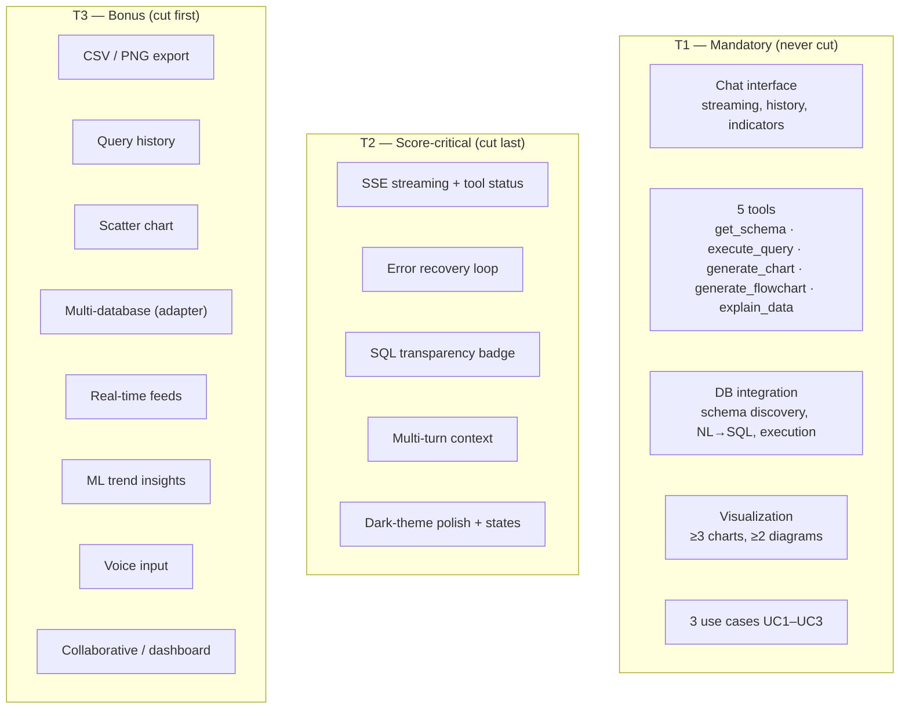

# 29. Feature Specifications — DataFlow AI

## Purpose

Define every feature of DataFlow AI — mandatory, optional, and bonus — with its purpose, acceptance criteria, dependencies, and priority. This is the authoritative requirements register: it distinguishes what the brief *requires* (never inventing mandatory requirements), what the team chooses to build for score, and what is deferred. It is the source for the roadmap (`19_ImplementationRoadmap.md`) and the final checklists.

## Overview

Features are tiered by obligation and by scoring impact:

- **Mandatory (T1)** — explicitly required by the official problem statement: chat interface behaviors, the five tools, database integration, and the visualization minimums. These are non-negotiable and carry the bulk of the Functionality (30%) score.
- **Optional / score-critical (T2)** — not required by the brief but materially improve rubric outcomes (streaming, error recovery, polished states, explain_data depth). Chosen deliberately, not accidentally.
- **Bonus (T3)** — the brief's bonus challenges and additional ideas from the OCR'd prompt assets. Ranked by effort × impact; only those that fit the 2-day sprint are committed.

## Architecture

### 29.1 T1 — Mandatory Features

| ID | Feature | Specification & acceptance criteria | Requirement source |
|---|---|---|---|
| F-01 | Chat interface — real-time display | Messages appear incrementally (streamed); text renders as markdown; the interface remains responsive during streaming | Brief §4.1 |
| F-02 | Chat interface — session history | All messages persist for the session's duration; history visible on reload via session restore | Brief §4.1 |
| F-03 | Chat interface — processing indication | TypingIndicator with contextual tool labels during agent work; input disabled while busy | Brief §4.1 |
| F-04 | Chat interface — embedded visualizations | Charts and diagrams render inside the message thread at the point of relevance | Brief §4.1 |
| F-05 | Tool — get_schema | Returns tables, columns, types, PKs, FKs, row counts as structured JSON; optional table filter; errors list available tables | Brief §4.2 |
| F-06 | Tool — execute_query | Executes SELECT-only SQL with validation, LIMIT caps, structured rows output; unsafe SQL rejected with hint | Brief §4.2 |
| F-07 | Tool — generate_chart | Produces chart config JSON (type, data, keys, labels, color) for bar/line/pie/scatter; validates inputs | Brief §4.2 |
| F-08 | Tool — generate_flowchart | Produces Mermaid code for ER / flowchart / sequence diagrams; auto-ER from schema; validates input | Brief §4.2 |
| F-09 | Tool — explain_data | Computes key metrics locally and feeds them to the model for grounded narrative summaries | Brief §4.2 |
| F-10 | DB integration | NL→SQL generation, schema discovery, safe execution against the provided SQLite sample | Brief §4.2/§9 |
| F-11 | Visualization minimums | ≥ 3 chart types (bar, line, pie) and ≥ 2 diagram types (ER, process flowchart) working end-to-end | Brief §4.3 |
| F-12 | Use case UC1 | Top-5-products-by-revenue question → query → bar chart → explanation; trend follow-up works | Brief §6 |
| F-13 | Use case UC2 | ER-diagram question → schema → rendered ER; table-relationship follow-up answered | Brief §6 |
| F-14 | Use case UC3 | Order-flow question → process inference → flowchart render | Brief §6 |
| F-15 | Secondary — multi-turn context | Follow-ups resolve using prior entities, filters, and time windows | Brief §3 |
| F-16 | Secondary — graceful errors | Every failure class produces a meaningful message and a recovery path | Brief §3 |
| F-17 | Secondary — SQL transparency | Generated SQL is visible to the user (SQL badge) | Brief §3 |

### 29.2 T2 — Score-Critical Optional Features

| ID | Feature | Why it matters | Acceptance criteria |
|---|---|---|---|
| S-01 | Token streaming over SSE | The single largest UX-scoring element (4 pts); makes the product feel ChatGPT-like | First token < 2 s; continuous stream |
| S-02 | Tool status events | Converts agent work into visible progress; narrates the architecture | Indicator labels appear per tool |
| S-03 | LLM self-recovery | Errors re-injected for retry (≤ 2); demo-visible "fix itself" moment | Typo question self-corrects once |
| S-04 | SQL transparency badge | Innovation + trust; required for reviewer persona | Collapsible SQL with copy on every query answer |
| S-05 | Polished state inventory | Welcome, skeleton, empty, error, disconnected states | All states designed and reachable |
| S-06 | Chart-appropriate selection | Chart type chosen by analytical fit, not randomness (Bar/Line/Pie/Scatter rules) | UC1 yields bar; follow-up yields line |
| S-07 | Session memory semantics | 10-turn sliding window + schema cache; explicit follow-up behavior | Follow-up uses prior context |

### 29.3 T3 — Bonus Features (ranked)

| Rank | Feature | Effort | Impact | Commitment |
|---|---|---|---|---|
| 1 | NL→SQL explanation (SQL badge + in-stream `sql` event) | Low | High (Innovation 3) | **Committed** |
| 2 | SSE streaming itself (double-duty: required UX + innovation story) | Medium | High | **Committed** (it is S-01) |
| 3 | Export — PNG chart download + CSV data download | Low | Medium | **Committed** |
| 4 | Query history & favorites | Medium | Medium | **Committed** (history; favorites deferred) |
| 5 | Scatter chart (4th chart type) | Low | Low–Med | **Committed** (already in the tool enum) |
| 6 | Multi-database support | High | Medium | Deferred (adapter seam documented in `26_ScalabilityPlan.md`) |
| 7 | Real-time data feeds | High | High | Deferred (capability path documented) |
| 8 | ML insights / trend detection | High | High | Deferred |
| 9 | Voice input | High | Low | Deferred |
| 10 | Collaborative sharing / dashboard builder | High | Low | Deferred |

The commitment rule: T3 items 1–5 ship inside the 2-day sprint only after T1 and T2 are demonstrably green (see `19_ImplementationRoadmap.md` cut order).

## Design Decisions

| Decision | Why |
|---|---|
| Three explicit tiers | Prevents scope creep (the brief forbids inventing requirements) and creates a defensible cut order under time pressure |
| Bonus features chosen by effort × impact | The team's 2-day constraint makes effort the dominant filter; SQL transparency and export give the best score per hour |
| Streaming counted twice (S-01 + bonus #2) | It is required-adjacent and is the innovation story's backbone — honest engineering, single implementation, double narrative value |
| No invented mandatory features | Every T1 row cites the brief section; the requirement register is auditable |
| Deferred features get seams, not stubs | Multi-DB, real-time, and analytics are documented as extension points so the 2-day scope never blocks the product direction |

## Responsibilities

- **Requirements owner (Dev A)**: maintains this register; no feature is added without a tier and a source.
- **Dev A**: backend features F-05–F-10, S-03/S-07, T3 export/multi-DB seams.
- **Dev B**: frontend features F-01–F-04, S-01/S-02/S-05, T3 export/history UI.
- **Both**: joint verification of F-11–F-17 acceptance criteria at checkpoints.

## Dependencies

- Requirements analysis and traceability: `01_RequirementsAnalysis.md`.
- Tool behaviors: `30_ToolSpecifications.md`.
- Roadmap and cut order: `19_ImplementationRoadmap.md`.
- Acceptance matrix: `20_TestingStrategy.md`.
- Final checklists: `37_FinalExecutionChecklist.md`.

## Advantages

- The tier system makes every scoping decision auditable and every cut defensible — no feature is lost by accident.
- Acceptance criteria are test-ready: each row maps to at least one unit, contract, or E2E test.
- Bonus ranking matches the judging analysis (`36_JudgingOptimization.md`), so effort tracks score.

## Limitations

- T3 commitments assume a smooth LLM integration; a rate-limit or SDK setback consumes the bonus budget (risk-covered in `34_RiskAssessment.md`).
- The register documents the *planned* scope; live-demo improvisations (e.g., judge asks an off-script question) rely on recovery paths, not new features.
- Favorites, multi-DB, real-time, and ML features are specified only at the seam level here; deeper specs are future work.

## Future Improvements

- Full specifications for the deferred bonus features (multi-DB dialect matrix, real-time connector contract, trend-detection tool schema).
- A feature health dashboard: each T1/T2 feature's test status visible at a glance.
- User-facing feature documentation in the README (required deliverable) generated from this register.

## Best Practices

- When in doubt about whether a feature is required, consult the official problem statement — not prior documents.
- Cut from T3 upward and T2 only as a last resort; T1 is never cut.
- Update this register the moment a feature is dropped, added, or re-tiered; it is the contract the roadmap and checklists read.

## Summary

The feature register separates what the brief demands (T1), what the score demands (T2), and what ambition offers (T3), each with acceptance criteria and a source citation. This tiering is the team's scope governor for a 2-day sprint: it guarantees the mandatory 30% Functionality base, protects the score-critical UX/Architecture features, and confines ambition to the highest-effort-to-impact bonus items.

---

**Next document:** `30_ToolSpecifications.md`
