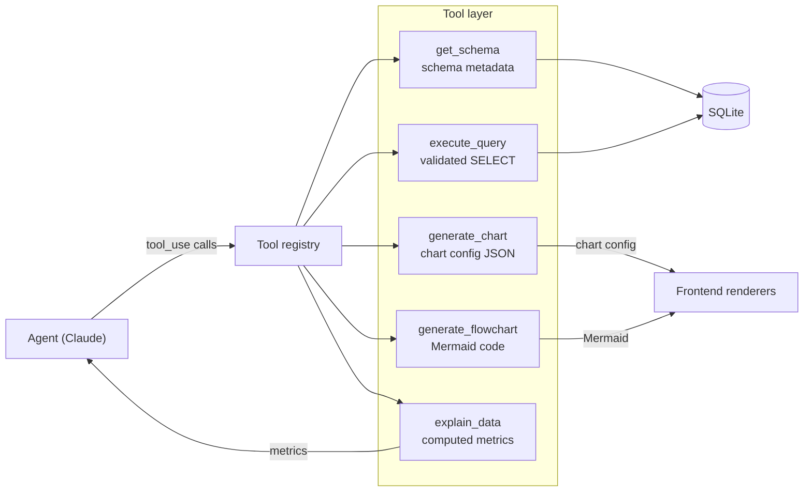
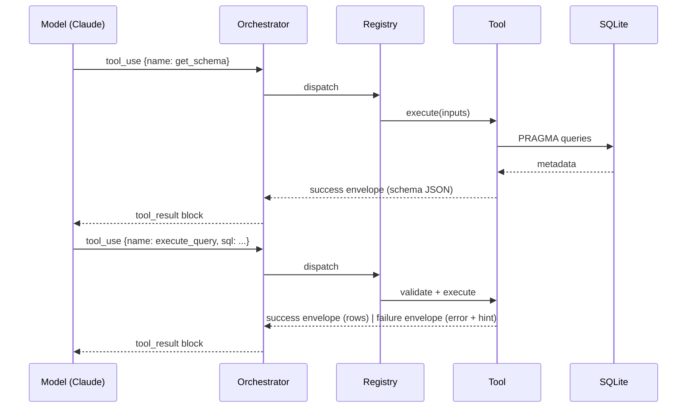

# 30. Tool Specifications — DataFlow AI

## Purpose

Define the definitive, implementation-ready specification for the five required tools: purpose, JSON input schemas, execution behavior, output envelopes, validation rules, and error contracts. These tools are the heart of the Functionality (30%) and Architecture (25%) scores — judges review their schemas in code, and the LLM depends on their precision to orchestrate correctly. This document is the single reference for the tool layer.

## Overview

The five tools form a coherent workflow: the agent discovers the schema, executes validated queries, and converts results into charts, diagrams, or explanations. Each tool has a **narrow responsibility**, a **typed JSON schema** the model can read, and a **structured envelope** the model can reason about. Tools never render anything — they produce data or configuration that the backend relays and the frontend renders. This separation is the core architectural bet: it keeps the LLM in charge of *decisions* and the system in charge of *execution*.

## Architecture

### 30.1 Tool 1 — `get_schema`

- **Purpose**: retrieve complete database structure — tables, columns, types, primary keys, foreign keys, row counts.
- **When called**: first tool of any session where the agent needs structure awareness; before writing SQL; before ER/relationship questions.
- **Input schema**:

| Field | Type | Required | Description |
|---|---|---|---|
| `table_filter` | string | no | Optional table name; when absent, all tables are returned |

- **Execution behavior**: discover table names from the SQLite catalog; for each table read column metadata (name, type, PK, nullability) via table info; read foreign keys; count rows.
- **Success envelope**: `{success: true, tables: [{name, columns: [{name, type, pk, nullable}], row_count, foreign_keys: [{from, table, to}]}], total_tables}`.
- **Error envelope**: `{success: false, error: "Table X not found", available_tables: [...]}`.
- **Design rationale**: the output shape doubles as the input to `generate_flowchart`'s schema_data path — one discovery, two consumers. The error lists available tables so the model can self-correct.

### 30.2 Tool 2 — `execute_query`

- **Purpose**: execute a validated SELECT and return structured rows.
- **When called**: whenever a metric, filter, or grouping can be resolved; never called before schema awareness in a fresh domain.
- **Input schema**:

| Field | Type | Required | Description |
|---|---|---|---|
| `sql` | string | yes | The SELECT statement to execute |
| `limit` | integer | no | Row cap; default 100, hard maximum 1000 |

- **Execution behavior**: validate (must start with SELECT; forbidden keywords INSERT/UPDATE/DELETE/DROP/CREATE/ALTER/TRUNCATE/EXEC/EXECUTE rejected); append LIMIT when absent; cap at 1000; execute on the async connection; serialize rows to dictionaries.
- **Success envelope**: `{success: true, sql_executed, columns, rows: [{column: value, ...}], row_count, truncated: bool}`.
- **Error envelope**: `{success: false, error: "no such table: prodcts", hint: "Did you mean products? Available tables: ...", sql_attempted}`.
- **Design rationale**: validation is *enforced*, not advised — the validator is the security boundary (`23_SecurityDesign.md`). The `truncated` flag keeps the model honest about partial data. The hint field is the recovery engine for LLM self-correction.

### 30.3 Tool 3 — `generate_chart`

- **Purpose**: produce a chart configuration JSON for the frontend renderer. The tool does **not** render; it validates and structures.
- **When called**: after a query returns data suited to visual comparison, trend, proportion, or correlation.
- **Input schema**:

| Field | Type | Required | Description |
|---|---|---|---|
| `chart_type` | enum: bar, line, pie, scatter | yes | Analytical shape (see `11_VisualizationArchitecture.md` selection rules) |
| `data` | array of objects | yes | Row data (from execute_query) |
| `x_key` | string | yes | Column for the category/independent axis |
| `y_key` | string | yes | Column for the value/dependent axis (pie: value; scatter: y) |
| `title` | string | no | Chart title |
| `x_label`, `y_label` | string | no | Axis labels |
| `color` | string | no | Series color; default indigo `#6366f1` |

- **Validation**: chart_type within enum; data non-empty; x_key/y_key exist in the data's column set.
- **Success envelope**: `{success: true, chart_type, title, data, config: {x_key, y_key, x_label, y_label, color}}`.
- **Error envelope**: `{success: false, error: "Column X not found in data. Available columns: ..."}`.
- **Design rationale**: validation failures list available columns so the model can re-map keys — the same recovery pattern as execute_query. Empty data is rejected here so a misleading empty chart can never be emitted.

### 30.4 Tool 4 — `generate_flowchart`

- **Purpose**: produce Mermaid code for ER diagrams, process flowcharts, or sequence diagrams.
- **When called**: for schema-structure questions (ER), workflow/process questions (flowchart), or ordered-interaction explanations (sequence).
- **Input schema**:

| Field | Type | Required | Description |
|---|---|---|---|
| `diagram_type` | enum: er, flowchart, sequence | yes | Diagram family |
| `mermaid_code` | string | no | Pre-written Mermaid (model-authored) |
| `schema_data` | object | no | Schema JSON from get_schema; auto-generates the ER diagram |
| `title` | string | no | Diagram title |

- **Execution behavior**: three paths — (A) `schema_data` provided → deterministic auto-ER generation from tables/columns/FKs; (B) `mermaid_code` provided → validate and pass through; (C) neither → validation error.
- **Success envelope**: `{success: true, diagram_type, title, mermaid: "erDiagram ..."}`.
- **Error envelope**: `{success: false, error: "diagram_type 'tree' is not supported. Use: er, flowchart, sequence"}`.
- **Design rationale**: path A gives the model a *deterministic* correct diagram for schema questions (the LLM is bad at drawing ER diagrams from scratch, good at reading them); path B preserves the model's creativity for process flows. Mermaid is the transport because the model natively emits it and the frontend natively renders it.

### 30.5 Tool 5 — `explain_data`

- **Purpose**: compute key metrics locally from a dataset so the model's narrative is *grounded in numbers*, not invented.
- **When called**: after retrieval or visualization when the user expects an explanatory summary.
- **Input schema**:

| Field | Type | Required | Description |
|---|---|---|---|
| `data` | array of objects | yes | Rows to summarize |
| `columns` | array of strings | yes | Columns available |
| `context` | string | no | The user's question, for framing |
| `insight_type` | enum: summary, trend, comparison, anomaly | no | Analytical lens; default summary |

- **Execution behavior**: local computation only — aggregates (totals, averages), extremes (top/bottom), trend deltas — returned to the model as structured metrics. The model writes the final prose.
- **Success envelope**: `{success: true, insight_type, summary: <metric digest for the model>, key_metrics: {top_value, bottom_value, total, average}}`.
- **Error envelope**: `{success: false, error: "data array is empty — no rows to explain."}`.
- **Design rationale**: separating *computation* (deterministic, here) from *prose* (generative, model) is the anti-hallucination contract: the numbers the model quotes were computed, not recalled.

### 30.6 The Registry

- All tools are registered in a name→function map; the orchestrator dispatches through it.
- Unknown tool name → `{success: false, error: "Unknown tool: <name>"}`.
- Any unexpected exception → `{success: false, error: <sanitized message>}` — the registry is the last line of defense so no failure escapes the loop un-enveloped.
- Registration is declarative (tool name + JSON input schema + description), which is exactly what the LLM's tool-use API consumes — the schema lives in one place.

### 30.7 Tool Interaction Contract

## Design Decisions

| Decision | Why |
|---|---|
| Narrow responsibilities per tool | Each tool is understandable alone, testable alone, and auditable alone — the Architecture rubric rewards exactly this |
| Tools return data/config, never render | Keeps the LLM's output deterministic-shaped and the rendering stack single-purpose; enables the SSE event design |
| Structured envelopes with hints | The model can only recover from failures it can read; hints convert failures into instructions |
| Shared recovery pattern across tools | One mental model for the agent: call → envelope → retry with hint → fallback |
| `schema_data` path in generate_flowchart | Deterministic ER diagrams where the model is weakest; creative diagrams where it is strongest |
| Computation separated from prose in explain_data | The anti-hallucination boundary for narrative answers |
| Descriptions written for the model | Tool descriptions are part of the prompt surface; they steer tool selection (`33_PromptEngineeringStrategy.md`) |

## Responsibilities

- **Each tool**: implement its spec exactly; validate inputs; return envelopes; never raise unhandled exceptions.
- **Registry**: single dispatch point; unknown-tool and exception envelopes; declarative schema registration.
- **Orchestrator**: calls the registry, relays envelopes to the model, emits SSE events from tool outcomes (`08_APIArchitecture.md`).
- **Tests**: every envelope and validation rule has a unit test (`20_TestingStrategy.md`).

## Dependencies

- DB layer (`07_DatabaseDesign.md`): connection manager, validator, schema discovery primitives.
- Agent loop (`05_AgentArchitecture.md`): how envelopes re-enter the conversation.
- SSE contract (`08_APIArchitecture.md`): how tool outcomes become `tool_start`/`tool_end`/`sql`/`chart`/`diagram` events.
- Frontend renderers (`09_FrontendArchitecture.md`, `11_VisualizationArchitecture.md`, `12_FlowchartArchitecture.md`).

## Advantages

- The five-tool design maps 1:1 to the brief's required-tool list — compliance is visible in code review.
- Envelopes + hints create a self-correcting agent with minimal orchestrator logic.
- Deterministic shapes make unit testing trivial and exhaustive.
- The registry makes the architecture extensible: a sixth tool is a registration, not a refactor.

## Limitations

- Keyword-based SQL validation is not a general SQL firewall (documented honestly in `23_SecurityDesign.md`); it is tuned for LLM-generated SELECTs.
- Auto-ER generation covers standard relational metadata; exotic constraints (composite FKs) render simply.
- explain_data's metric set is fixed; novel insight types require extending the tool, not the prompt.
- Tool execution is sequential; parallel tool calls are a future optimization (`25_PerformanceOptimization.md`).

## Future Improvements

- New tools via the registry: forecast (ML insights bonus), live-data connector, dashboard-pin, export-to-PDF.
- Streaming tool results for very large result sets (paged envelopes).
- Tool-level circuit breakers and per-tool rate limits.
- Explain-data extension: correlation coefficients, seasonality deltas, outlier scoring.

## Best Practices

- Keep every tool synchronous in contract, async in execution; the registry must never block the event loop.
- Write tool descriptions the model can act on — they are the steering wheel for tool selection.
- Return the smallest data the consumer needs; row caps protect the LLM context and the renderers.
- Test error envelopes exactly as written here; the hints are part of the public contract.

## Summary

The five tool specifications define the complete tool layer: typed inputs, deterministic execution, structured success envelopes, and recovery-oriented error envelopes — all registered through a single dispatcher. The design's core bet is that narrow, well-specified tools with machine-readable outputs and hints turn an LLM into a reliable agent, and that same spec is what judges will read in code review and what tests will assert.

---

**Next document:** `31_DataFlowDocumentation.md`
