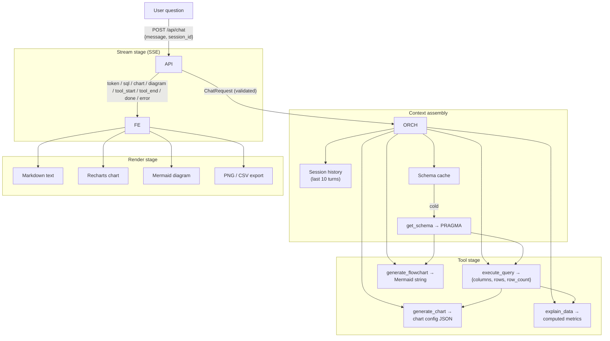
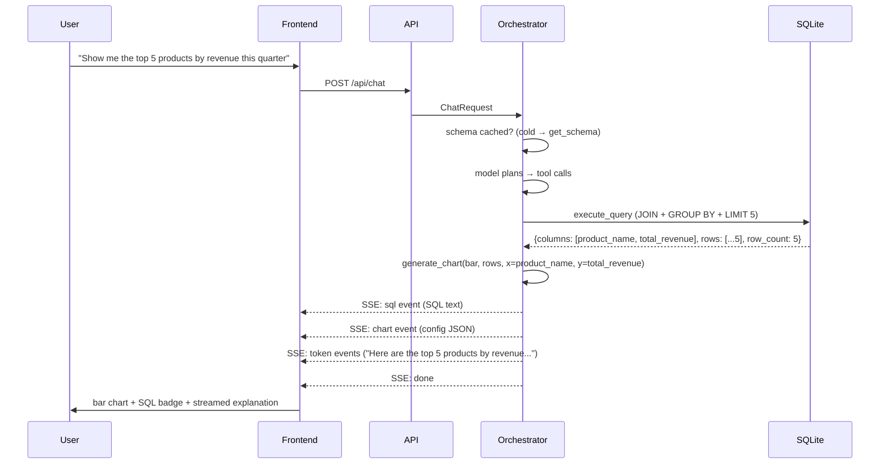

# 31. Data Flow Documentation — DataFlow AI

## Purpose

Document every data movement in the system — from the user's natural-language question to the rendered visualization and explanation — including the exact format of every payload at every hop. This is the plumbing reference for developers, the contract reference for integration (`18_IntegrationPlan.md`), and the traceability story for judges: every displayed artifact can be traced back to a database read.

## Overview

The system moves data through five logical stages:

1. **Request stage** — user message + session identity enter the API.
2. **Context stage** — history and schema shape what the model sees.
3. **Tool stage** — the model's tool calls produce schema, rows, chart configs, and diagrams.
4. **Stream stage** — artifacts are relayed as typed SSE events to the browser.
5. **Render stage** — the frontend turns events into text, charts, diagrams, and exports.

Each hop has a *stable format*: the JSON shapes defined in `08_APIArchitecture.md` and `30_ToolSpecifications.md`. Data changes shape exactly twice — rows → chart config (in generate_chart) and schema → Mermaid (in generate_flowchart) — and both transformations are deterministic and testable.

## Architecture

### 31.1 Request Stage

- The client sends `{message, session_id, options: {show_sql, stream}}` as JSON to `POST /api/chat`.
- Pydantic validation normalizes the payload; empty messages and unknown session shapes are rejected before any pipeline work.
- The session id is the only stateful handle; everything downstream is a pure function of (message, session state).

### 31.2 Context Stage

- The orchestrator assembles the model context: system prompt (~300 tokens), tool schemas (~1500 tokens), last 10 turns of history (~8000 tokens), and the current message.
- If the session's schema cache is cold and the intent needs structure, `get_schema` runs first; the result is cached for the session and injected into the context.
- No raw SQL results enter the *context* until a query actually runs; the model reasons over structure first, data second.

### 31.3 Tool Stage — Data Shapes

| Tool | Input | Output shape (success) | Consumers |
|---|---|---|---|
| get_schema | `{table_filter?}` | `{success, tables:[{name, columns:[{name,type,pk,nullable}], row_count, foreign_keys}], total_tables}` | Model context; generate_flowchart (schema_data); /api/schema |
| execute_query | `{sql, limit?}` | `{success, sql_executed, columns, rows:[dict], row_count, truncated}` | generate_chart (data); explain_data (data); SSE `sql` event (the executed SQL text) |
| generate_chart | `{chart_type, data, x_key, y_key, ...}` | `{success, chart_type, title, data, config}` | SSE `chart` event → Recharts |
| generate_flowchart | `{diagram_type, mermaid_code?, schema_data?}` | `{success, diagram_type, title, mermaid}` | SSE `diagram` event → Mermaid |
| explain_data | `{data, columns, context?, insight_type?}` | `{success, insight_type, summary, key_metrics}` | Model context (numbers for prose) |

### 31.4 Stream Stage — The Wire

Every artifact the user sees travels as an SSE event (full contract in `08_APIArchitecture.md`):

- `tool_start` / `tool_end` — progress narration.
- `sql` — the executed SQL (SQL transparency feature).
- `chart` — chart config JSON (never pixels; rendering is client-side).
- `diagram` — Mermaid source.
- `token` — text chunks for streaming markdown.
- `done` — message completion; `error` — terminal failures.

The wire format is deliberately *thin*: events carry only what the renderer needs. Heavy payloads (chart data) arrive in one event; text flows in many small ones.

### 31.5 Render Stage

- Text: token accumulation → incremental markdown.
- Charts: `chart` event → ChartRenderer → Recharts (data bounded by row caps).
- Diagrams: `diagram` event → DiagramRenderer → Mermaid (lazy-loaded).
- Exports: PNG captured from the rendered chart container; CSV produced server-side from the executed SQL via `POST /api/export/csv`.

### 31.6 Governance of the Flow

- **Facts vs. commentary**: rows and computed metrics are facts (deterministic); the model's prose is commentary. The UI visually separates evidence (SQL badge, chart) from interpretation (narrative).
- **No silent transformations**: any place data is reduced (LIMIT caps, truncation, chart key remapping) is explicit — the `truncated` flag, the config mapping, the SQL text shown.
- **Traceability**: each artifact in the UI can be traced back — chart ← config ← rows ← SQL ← question. This trace is the demo's trust story and the judge's audit path.

### 31.7 Example Trace — UC1 (Top 5 Products by Revenue)

## Design Decisions

| Decision | Why |
|---|---|
| Data changes shape only in tools | Every transformation is deterministic, named, and testable; nothing re-shapes in transit |
| Thin wire, fat events | Small frequent token events feel instant; one complete chart event avoids partial renders |
| Charts travel as config, not pixels | Server never renders; client owns visuals; export PNG is a client capture — one pipeline, two outputs |
| SQL text travels verbatim | SQL transparency needs the exact executed statement, not a paraphrase |
| Row caps at execution | Bounds every downstream consumer (context, charts, SSE, memory) with one mechanism |
| Facts and commentary visually separated | The user can always distinguish "the data shows" from "the assistant thinks" |

## Responsibilities

- **Dev A**: implement every backend transformation exactly per the shapes above; keep the wire format stable.
- **Dev B**: implement the render pipeline against the shapes; defensive parsing of events (unknown fields tolerated).
- **Both**: the SSE contract (`18_IntegrationPlan.md`) is the only handoff — no other data coupling is permitted.

## Dependencies

- Payload shapes: `08_APIArchitecture.md` (API), `30_ToolSpecifications.md` (tools).
- Rendering: `11_VisualizationArchitecture.md`, `12_FlowchartArchitecture.md`.
- Context assembly: `05_AgentArchitecture.md`.
- Storage: `07_DatabaseDesign.md`.

## Advantages

- The documented shapes are the test contract: unit tests, contract tests, and integration tests all assert these exact JSON structures.
- Traceability is a judging asset: a reviewer can walk any answer back to the SQL that produced it.
- The thin-wire design keeps the frontend simple and the stream responsive.

## Limitations

- Verbose chart payloads (up to 1000 rows) can produce a large single SSE event; acceptable at demo scale, paged in the future.
- The schema→Mermaid transformation is the only non-trivial generator; its output quality depends on the metadata available in the sample DB.
- No binary or compressed transport; SSE is plain text JSON (future: binary framing or JSON-pointer compression).

## Future Improvements

- Paged `rows` envelopes for very large result sets.
- A canonical event log (server-side) that replays any session's data flow for debugging and demos.
- Compression or delta encoding for token streams.
- A schema evolution policy for the wire contract with versioned event types.

## Best Practices

- Never mutate a payload in place; each hop produces a new, typed shape.
- Log shapes and row counts, never full payloads (security + noise).
- Keep the SQL event text byte-identical to what executed.
- When the wire changes, change `types/index.ts` and `08_APIArchitecture.md` together (per `18_IntegrationPlan.md`).

## Summary

The data flow is a chain of stable, documented shapes: question → context → tool envelopes → thin SSE events → rendered artifacts. Two deterministic transformations (rows→chart config, schema→Mermaid) sit at the boundaries where the LLM's decision-making meets the system's rendering. The result is a fully traceable pipeline — every pixel on screen can be traced to a validated query on the database — which is simultaneously the integration contract, the test contract, and the demo's trust story.

---

**Next document:** `32_ConversationFlow.md`
