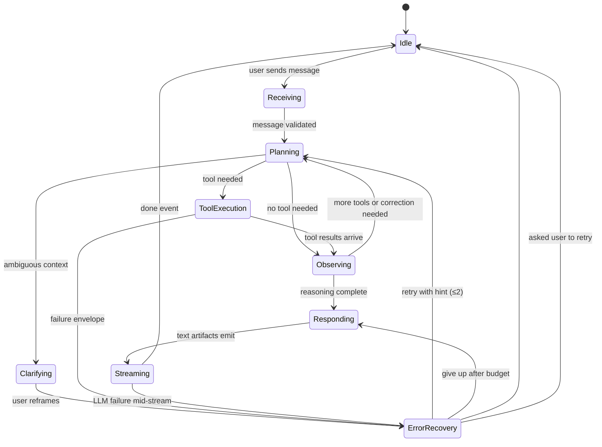
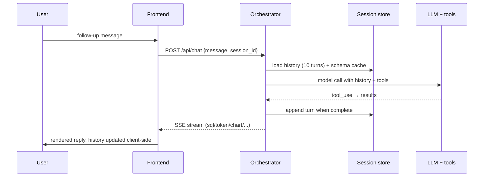

# 32. Conversation Flow — DataFlow AI

## Purpose

Define how DataFlow AI maintains coherent, multi-turn conversations: session semantics, memory scope, follow-up resolution, clarification behavior, and the explicit state machine a turn travels through. The brief's secondary objective — multi-turn context retention — is a scored deliverable and the product's core UX differentiator; this document is its design.

## Overview

A conversation is a sequence of turns within a session. Each turn assembles context (history window + schema awareness), reasons with the tools (which may require several tool calls), and produces artifacts for the user. Three mechanisms make the conversation feel continuous:

1. **The history window** — the last 10 user/assistant turns are replayed into every model call, so the model always knows what was asked and answered.
2. **Context carry-over** — follow-ups resolve pronouns and implied references using active entities, filters, and time windows established earlier (e.g., "these products", "this quarter").
3. **Explicit framing when ambiguous** — when a follow-up cannot be resolved from context, the model asks a focused clarification instead of guessing (guessing produces wrong charts; clarifying preserves trust).

## Architecture

### 32.1 Session Semantics

- **Identity**: each session has a `session_id`, generated by the frontend per new conversation.
- **Lifetime**: sessions live in memory for the server's lifetime and are cleared on demand (`DELETE /api/session/{id}`); history is restorable client-side from `localStorage` and server-side from the session store.
- **State carried**: message list (last 10 turns) + per-session schema cache. Tool artifacts (chart configs, diagrams) are *emitted*, not retained — the next turn re-derives what it needs, keeping memory lean.

### 32.2 The History Window

- Only the last 10 user/assistant turns enter the model context (a deliberate token/cost/latency cap; see `25_PerformanceOptimization.md`).
- Each assistant turn retains its SQL and any explanation, so follow-ups can reference prior analysis ("why was March lower?").
- The window is a *summary-free sliding window*: old turns drop as new ones arrive; no compression step is needed at demo scale (compression is a future improvement).

### 32.3 Follow-Up Resolution Rules

| Scenario | Behavior |
|---|---|
| Pronoun/entity follow-up ("these products", "that chart") | Resolve against the session's last active entity set |
| Time-window follow-up ("over the last year", "this quarter") | Reuse or extend the established date window when intended; re-ask when ambiguous |
| Filter follow-up ("only for category X") | Add to the active filter set |
| New-domain question ("what about inventory?") | Treat as fresh; refresh schema awareness for the new domain |
| Counting/ranking follow-up ("give me top 10") | Adjust the previous query's metric/limit |
| Truly ambiguous ("how is that") | Ask one focused clarifying question; never guess |

The system prompt encodes these rules (see `33_PromptEngineeringStrategy.md`); the session's history provides the material for them.

### 32.4 Clarification Behavior

- Clarification is a first-class turn outcome, not a failure: the model asks a short, concrete question (options or parameters), then proceeds once answered.
- Clarifications never fabricate analysis; they preserve the option-heavy branches (e.g., "Do you mean revenue this calendar quarter or the last 90 days?").

### 32.5 Turn Lifecycle (Data View)

## Design Decisions

| Decision | Why |
|---|---|
| 10-turn window in memory | Optimal cost/latency/quality trade-off at demo scale; large enough for the canonical follow-up demos, bounded enough to protect latency |
| Context carried implicitly via history | No separate memory-store abstraction needed; the natural language carries the context the model re-reads |
| Artifacts re-derived, not stored | Lean sessions; charts/diagrams are cheap to regenerate and never risk context bloat |
| Clarify over guess | A wrong guess produces a visibly wrong chart that erodes trust faster than a clarifying question costs |
| Schema cache per session | Structure discovery is deterministic and expensive; caching it makes follow-ups fast while staying correct |
| Idempotent session restore | History endpoints + localStorage allow the frontend to reconstruct a session on reload — the brief's history persistence requirement |

## Responsibilities

- **session store**: create/get/append/clear turns; enforce the 10-turn window; hold the schema cache.
- **orchestrator**: assemble context per turn; drive the state machine; enforce termination budgets.
- **system prompt**: encode follow-up resolution and clarification rules (authored per `33_PromptEngineeringStrategy.md`).
- **frontend**: manage session_id, render streaming turns, persist local history, restore on reload.

## Dependencies

- Memory mechanics: `05_AgentArchitecture.md`.
- Prompt rules: `33_PromptEngineeringStrategy.md`.
- Session endpoints: `08_APIArchitecture.md`.
- History UI: `27_UI_UX_Documentation.md`.
- Tests for multi-turn: `20_TestingStrategy.md`.

## Advantages

- Multi-turn is *demonstrable*: the canonical UC1 → trend-follow-up sequence shows context retention explicitly (scored secondary objective).
- The window/cache design is cheap, simple, and crash-safe (in-memory only; sessions are not a durability promise).
- Clarification behavior gives the agent a graceful path for the judge's off-script questions.
- The state machine makes conversation behavior testable and deterministic.

## Limitations

- In-memory sessions die on restart — acceptable for demo; persistence is a deferred production item (`26_ScalabilityPlan.md`).
- The window is summary-free; very long conversations lose early context eventually.
- Follow-up quality depends on the model's instruction adherence; prompt tuning (and the demo script sticking to canonical flows) mitigates this.
- No user-level multi-session isolation yet (single-tenant).

## Future Improvements

- Conversation summarization to extend effective window length gracefully.
- Session persistence to SQLite/Redis with restore-on-restart.
- Per-turn memory annotations (active entities, filters, time windows) injected as structured context instead of relying on prose.
- Cross-session memory (user preferences, saved analyses) for the dashboard-builder bonus.

## Best Practices

- Rehearse the follow-up flow: the second message in UC1 is the best demo of the entire memory design.
- Validate clarification behavior with a manual negative test (an intentionally ambiguous follow-up).
- Keep messages compact; verbose assistant turns bloat the window and cost latency on the next turn.
- Test session restore (reload mid-conversation) at least once before the demo.

## Summary

The conversation flow is a state machine over sessions: a bounded history window, per-session schema caching, and explicit rules for resolving follow-ups and clarifying ambiguity. The design makes multi-turn context cheap, deterministic, and demonstrable — satisfying the brief's secondary objective while keeping latency, token, and memory costs bounded. Context is carried the way humans carry it — in what was said — which is exactly what makes follow-ups feel natural.

---

**Next document:** `33_PromptEngineeringStrategy.md`