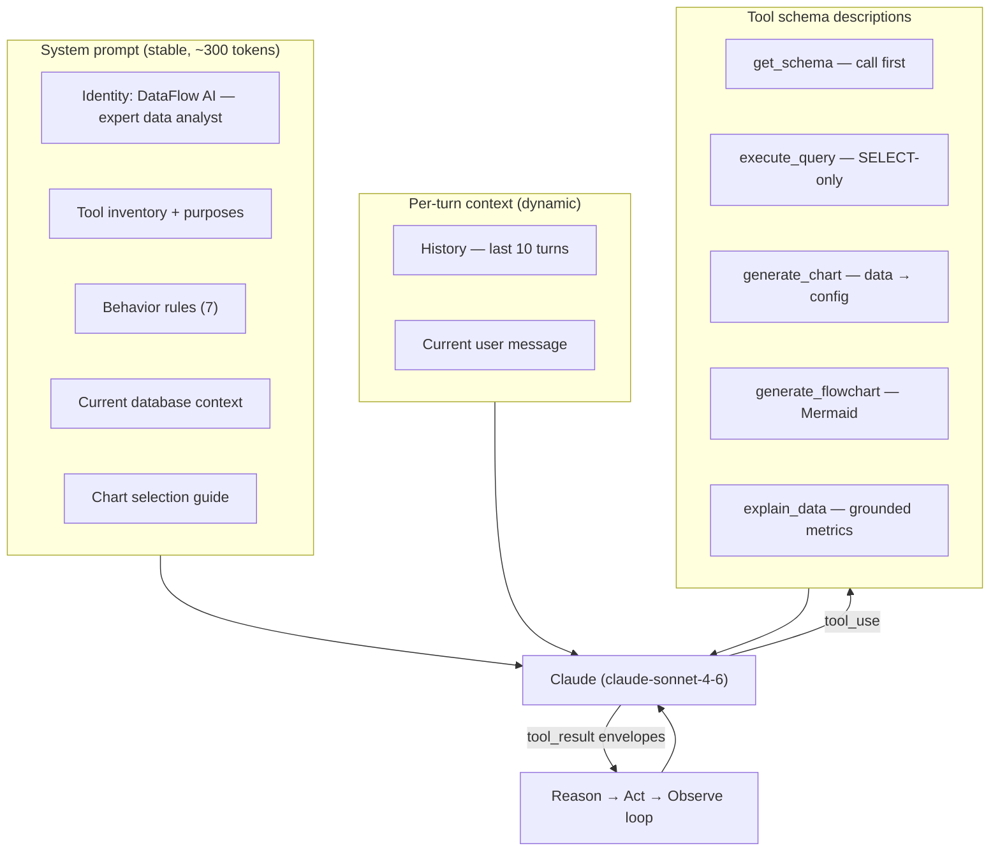

# 33. Prompt Engineering Strategy — DataFlow AI

## Purpose

Define how DataFlow AI's system prompt and supporting prompt surfaces are designed, structured, and maintained so the model reliably (a) selects the right tool at the right time, (b) generates correct, safe SQL, (c) chooses the appropriate visualization, and (d) explains results in grounded, business-friendly language. Prompt design is the highest-leverage quality lever in the system — it steers Functionality, Visualization, and UX simultaneously.

## Overview

Prompt surfaces in the system, in order of importance:

1. **System prompt** — identity, tool inventory, behavior rules, current-database context. Loaded once per session, cached across turns.
2. **Tool descriptions** — the descriptions in each tool's JSON schema; these are *prompt content* that steers tool selection.
3. **Tool results** — envelopes fed back as `tool_result` blocks; the agent reasons over them for recovery and follow-ups.
4. **History window** — last 10 turns; the material for follow-up resolution.
5. **Chart-selection guidance** — analytical-fit rules embedded in the system prompt so visualization choices are principled, not random.

## Architecture

### 33.1 System Prompt Structure

**Identity**: "DataFlow AI — an expert data analyst assistant that answers questions about the connected database by using tools, then explains results in clear business language."

**Behavior rules (the contract the model follows):**

1. Call `get_schema` first whenever table structure is unknown or the domain changes.
2. Always show the SQL used — include it in the response before presenting results (SQL transparency).
3. Generate a chart when presenting numerical comparisons or trends; choose the type by analytical fit.
4. Generate an ER diagram when asked about database structure; flowcharts for process/workflow questions.
5. If a query fails, explain what went wrong and try a corrected version (recovery behavior).
6. Keep explanations concise and business-focused; quote the actual returned numbers.
7. Only SELECT statements are allowed — never attempt to write data.

**Database context**: a one-paragraph description of the current dataset (E-commerce: orders, products, customers, inventory) so the model orients before its first schema call.

### 33.2 Chart-Selection Guide (embedded in the system prompt)

| Analytical intent | Chart type |
|---|---|
| Comparison across categories | Bar |
| Trend over time | Line |
| Proportion of a whole | Pie |
| Correlation between two numeric columns | Scatter (bonus) |
| Database structure / relationships | ER diagram |
| Process / workflow order | Flowchart |

The guide is a *rule the model applies to its own output* — visualization choice becomes deterministic by analysis, not preference, which is exactly what the Visualization rubric rewards.

### 33.3 Tool Description Craft

Each tool's description is written for the model, not for humans:

- **get_schema**: "Retrieve the database schema — all tables, columns, types, primary keys, and foreign keys. Call this first before writing any SQL."
- **execute_query**: "Execute a SQL SELECT query against the e-commerce database. Only SELECT is allowed — no INSERT, UPDATE, DELETE, or DDL."
- **generate_chart**: "Convert query results into chart configuration for the frontend renderer. Choose chart_type by analytical fit."
- **generate_flowchart**: "Generate Mermaid code for ER diagrams, process flows, or sequence diagrams."
- **explain_data**: "Compute key metrics from a dataset to ground the explanation in actual numbers."

The descriptions encode *when* to call (steering), *what* to pass (schema), and *what not to do* (constraints). Tool selection quality is a prompt-engineering output.

### 33.4 Grounding & Anti-Hallucination

- `explain_data` computes metrics locally; the model quotes those numbers, not recalled ones.
- The SQL badge shows the exact executed statement; the model's claims are checkable against it.
- The model is told to distinguish "the data shows X" (facts from rows/metrics) from "this suggests Y" (interpretation), and to state assumptions when inferring (e.g., process-flow inference).

### 33.5 Recovery Prompting

- Failure envelopes are injected as `tool_result` blocks with hints; the model is instructed to treat them as environment facts and retry corrected calls (≤ 2 attempts).
- For ambiguous user input, the model is instructed to ask one focused clarification rather than guess.
- For LLM-side failures (timeouts/rate limits), the system falls back to a canned friendly message — never fabricated data.

### 33.6 Token Discipline

- System prompt held under ~500 tokens; tool schemas ~1500; total per-turn context ~14K of the 200K window (`05_AgentArchitecture.md`).
- Max response 4096 tokens; concise-explanation rule keeps replies tight and streams fast.
- History capped at 10 turns to bound prompt growth across the session.

## Design Decisions

| Decision | Why |
|---|---|
| Rules over examples in the system prompt | Seven terse rules steer behavior more reliably than long examples, and cost fewer tokens |
| Chart selection encoded as rules | Deterministic, explainable visualization choices — the rubric's "appropriate choice" criterion |
| Tool descriptions carry the steering | Tool selection is decided by the schema descriptions the model reads; they are first-class prompt assets |
| Grounding by construction (explain_data + SQL badge) | Anti-hallucination is engineered into the data path, not left to prompt pleas |
| Recovery injected as facts | The model already has a loop; feeding it error envelopes makes recovery a reasoning task, not a special case |
| One system prompt, versioned in code | Prompt changes are code changes — reviewable, testable, revertible |

## Responsibilities

- **Dev A**: author and version the system prompt; tune tool descriptions; run prompt regression checks at each checkpoint.
- **Dev B**: surface prompt-driven behavior (SQL badge, clarification rendering) per the UI spec.
- **Both**: prompt changes go through the same review as code changes; never edit prompts directly on the demo machine.

## Dependencies

- Tool contracts: `30_ToolSpecifications.md`.
- Conversation/memory semantics: `32_ConversationFlow.md`.
- Visualization rules: `11_VisualizationArchitecture.md`, `12_FlowchartArchitecture.md`.
- Agent loop mechanics: `05_AgentArchitecture.md`.

## Advantages

- Prompt quality is the cheapest high-impact lever: one file governs tool selection, SQL safety, chart choice, and explanation quality.
- Rule-based steering makes behavior predictable for the demo — the canonical questions produce canonical flows.
- The SQL-transparency rule turns the innovation feature into default behavior, not an afterthought.

## Limitations

- Prompt behavior is probabilistic; edge inputs may still deviate (mitigated by recovery paths and the demo script).
- Model upgrades (provider-side) can shift behavior; prompts must be re-validated after any model-version change.
- Rule-based chart selection covers the canonical types; novel analytical needs require new rules or tools.

## Future Improvements

- Few-shot examples appended for the demo-critical paths (top-products, ER, process flow) as a fallback quality boost.
- Dynamic prompt assembly: domain description injected from the active database (multi-DB bonus).
- A/B prompt evaluation harness over the six reference queries.
- Structured output enforcement (JSON-only reasoning traces) for auditability.

## Best Practices

- Keep the system prompt short enough to re-read in one screen; verbosity degrades compliance.
- Test prompt changes against the six reference queries and the three use cases — a regression suite, not a vibe check.
- Never put user data into the system prompt; only session context into per-turn messages.
- Version prompts in code with the rest of the system; the git history is the prompt changelog.

## Summary

The prompt strategy treats the system prompt, tool descriptions, and injected results as one coherent steering surface: identity + seven rules + chart guidance + grounded data. The design converts quality requirements (correct SQL, appropriate visuals, truthful explanations, graceful recovery) into explicit instructions the model can follow, and grounds the anti-hallucination story in the tool layer rather than in prose. It is the least code, the most leverage, and the most demo-visible quality lever in the system.

---

**Next document:** `34_RiskAssessment.md`