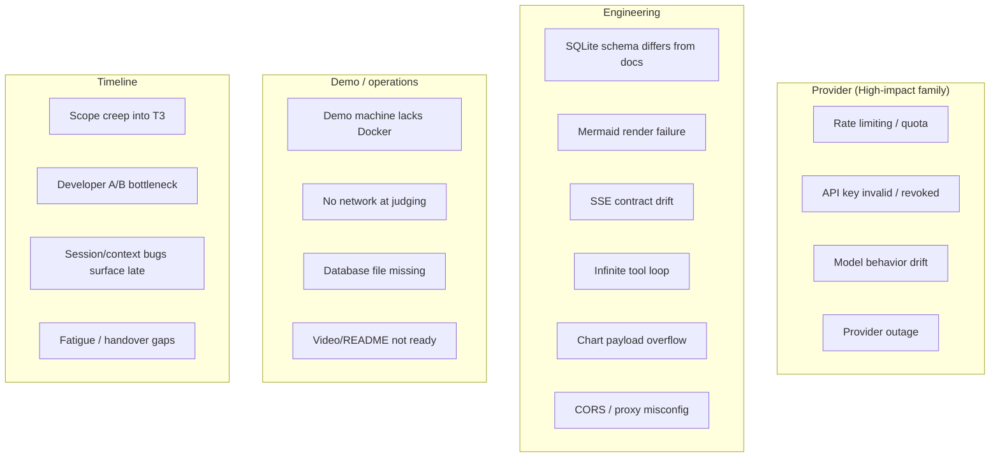
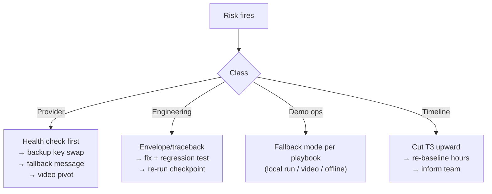

# 34. Risk Assessment — DataFlow AI

## Purpose

Identify, rank, and mitigate every material risk to the 2-day production-grade build and the live judging demo — technical, operational, and delivery risks — with owners, detection signals, and contingency actions. The sprint's compressed timeline makes risk management a daily activity, not a document: risks are reviewed at every checkpoint and the register is updated when facts change.

## Overview

Risks are scored by likelihood × impact (High/Medium/Low) and grouped into four families:

1. **LLM & provider risks** — the dependency that cannot be mocked on judging day.
2. **Engineering risks** — the build itself: schema drift, rendering, streaming, integration.
3. **Demo/operations risks** — the live experience: environment, credentials, connectivity.
4. **Timeline risks** — the 2-day constraint: scope creep, parallelism failure, fatigue.

The register below is the complete plan; the mitigation column is the action contract.

## Architecture — The Risk Register

| ID | Risk | Likelihood | Impact | Detection signal | Mitigation | Owner |
|---|---|---|---|---|---|---|
| R1 | Claude rate limiting / quota exhaustion | Medium | High | 429 errors; health check shows claude_api unreachable | Schema cache per session (fewer calls); batch tool calls; fallback message + retry; backup key in `.env` ready to swap | Dev A |
| R2 | API key invalid/revoked | Low | High | 401 at first call | `.env` only; backup key pre-provisioned; health endpoint verifies reachability at startup; key never in git | Dev A |
| R3 | Model behavior drift after provider update | Medium | Medium | Reference queries produce different tool flows | Pin model version in env (`MODEL`); prompt regression suite over 6 reference queries; re-run at CP4 | Dev A |
| R4 | Provider outage during judging | Low | High | Health check fails; no tokens stream | Pre-recorded video covers the demo; graceful offline fallback message; live demo pivots to video + local UI | Team |
| R5 | Provided SQLite schema differs from docs | Medium | High | get_schema output mismatches expected columns; queries fail | Auto-discovery (PRAGMA) is the single source of truth; validator hints use live schema; reference queries re-validated on the real file Day 1 | Dev A |
| R6 | Mermaid render failure (syntax, size) | Medium | Medium | DiagramRenderer fallback triggers; console errors | Strict security level; error boundary → raw code fallback; diagram size guidance in prompt; test all three diagram types at CP3 | Dev B |
| R7 | SSE contract drift between sides | Medium | High | Frontend misses events; empty responses | Contract frozen Day 1 (`18_IntegrationPlan.md`); types/index.ts shared; contract tests; defensive parser tolerates unknown fields | Both |
| R8 | Infinite/runaway tool loop | Low | High | Request hangs; tokens never end | `MAX_TOOL_ITERATIONS = 8`; `TOOL_TIMEOUT_SECONDS = 30`; test the bound at CP2 | Dev A |
| R9 | Chart payload overflow (wide/large data) | Medium | Medium | Chart lags or crashes renderer | Row caps (100/1000); Recharts on bounded data; memoized components; overflow tested at CP3 | Both |
| R10 | CORS/proxy misconfiguration | Low | Medium | Browser blocks requests; 404s on /api | CORS env-driven; dev proxy and nginx proxy both tested at CP2/CP5; curl -N verification | Both |
| R11 | Demo machine lacks Docker | Medium | Medium | compose up fails | Local-run fallback documented (uvicorn + static build); verify both modes before Aug 6 | Team |
| R12 | No network at judging | Low | Medium | Images/API unreachable | Build images and pre-pull before Aug 6; local SQLite (no DB network); API key must work offline-agnostic (it needs Anthropic — if fully offline, pivot to recorded video) | Team |
| R13 | Database file missing/wrong path | Low | High | All queries fail | File committed to repo; `DATABASE_PATH` env; health endpoint checks DB connectivity; volume mount verified at CP5 | Dev A |
| R14 | Video/README incomplete | Medium | Medium | Deliverables penalized | Video script drafted Day 1; recording scheduled Aug 6 morning; README skeleton from Day 1 grows with code | Both |
| R15 | Scope creep into T3 | High | Medium | Day 2 slips; T1/T2 incomplete | Tier system (`29_FeatureSpecifications.md`); cut order enforced; T3 only after T1/T2 green | Dev A (scope owner) |
| R16 | Developer A/B bottleneck (one waits on the other) | Medium | Medium | Standstill at integration points | CP cadence with mock SSE server for B and curl -N for A; ownership map prevents overlap; 30-min blocker rule | Both |
| R17 | Session/context bugs surface late | Medium | Medium | Follow-ups misbehave during rehearsal | Multi-turn tests in `20_TestingStrategy.md`; canonical follow-up rehearsed at CP4 | Dev A |
| R18 | Fatigue / handover gaps in 2-day sprint | Medium | Medium | Late-night bugs; unclear handover | Small commits with clear messages; daily standup with state summary; checklists for handover; buffer hours built into Day 2 PM | Team |

### Risk Response Matrix

## Design Decisions

| Decision | Why |
|---|---|
| Register reviewed at every checkpoint | Risks change hour to hour in a 2-day sprint; static documents rot |
| Every risk has an owner | Accountability without ambiguity; no "someone will handle it" |
| Fallback paths pre-designed per family | Demo-day decisions are rehearsed, not improvised |
| Provider risks treated as the top family | The single external dependency is the only one that cannot be mocked at judging |
| T3 cut as the universal timeline lever | The tier system makes scope reduction surgical, never core-threatening |
| Pinned model + prompt regression suite | The cheapest insurance against behavior drift |

## Responsibilities

- **Dev A**: provider and database risks (R1–R5, R8, R13); engineering mitigations in code.
- **Dev B**: rendering, UI, and contract risks (R6, R9, R10 frontend side).
- **Both**: R7, R10, R16 — contract and integration discipline.
- **Team**: R11–R14, R17, R18 — demo ops, deliverables, handover.

## Dependencies

- Tier system and cut order: `29_FeatureSpecifications.md`, `19_ImplementationRoadmap.md`.
- Checkpoint cadence: `18_IntegrationPlan.md`.
- Fallback playbook: `21_DeploymentStrategy.md`.
- Health/observability: `08_APIArchitecture.md`.

## Advantages

- The register converts "what if…" anxiety into concrete, owned, rehearsed actions.
- Fallback paths mean the demo has three escalating escape hatches (fix → local run → video).
- Early identification of schema-drift (R5) and contract-drift (R7) risks protects the two most expensive failure modes.

## Limitations

- Likelihood estimates are judgment calls; the register is a planning aid, not a guarantee.
- Provider outages are fundamentally unmitigable at demo time — the mitigations are *response* plans, not prevention.
- The register does not cover catastrophic personal-event risks (illness); cross-training via ownership docs partially covers this.

## Future Improvements

- Automated risk telemetry: alert when health checks fail, when 429s appear, when render fallbacks fire.
- A post-mortem template so lessons from rehearsal feed the Aug 6–7 buffer.
- Contingency runbooks for each fallback path, tested once before submission.

## Best Practices

- Review the register at every CP (five reviews across the sprint) and tick changed likelihoods.
- Rehearse at least one provider-failure response (swap key) and one demo-failure response (local run) before Aug 7.
- Keep the register visible — a printed/opened copy during the demo is the operator's cheat sheet.
- When in doubt during the sprint, cut scope before cutting sleep.

## Summary

The risk register covers the four families that threaten the sprint and the demo — provider, engineering, operations, timeline — each with likelihood, impact, detection signals, owned mitigations, and pre-designed fallback paths. The design treats risk management as a checkpoint activity with a triage matrix for when things go wrong, and the tier system guarantees that scope reduction never endangers the mandatory core. The demo is rehearsed to survive its plausible failures, not to pretend they don't exist.

---

**Next document:** `35_SubmissionChecklist.md`