# 35. Submission Checklist — DataFlow AI

## Purpose

Define everything required to submit DataFlow AI per the official brief's deliverables — complete codebase in a Git repository, README, 3–5 minute demo video, and live demo — as tickable checklists with quality gates. The checklist is organized so that Aug 6–7 (the post-sprint buffer) has a single authoritative list to execute from.

## Overview

The brief requires four deliverables:

1. **D1 — Source code**: a complete, clean Git repository.
2. **D2 — README.md**: setup, architecture overview, tool documentation.
3. **D3 — Demo video**: 3–5 minute walkthrough with narration.
4. **D4 — Live demo**: deployed or locally runnable at judging.

Each has a checklist below. The order of execution on Aug 6–7 is: D1 (final hygiene) → D2 → D3 → D4 last-minute verification. Every item is binary — ticked or not — with no ambiguous partial states.

```mermaid
flowchart LR
    subgraph D1["D1 — Source code"]
        A1["Repo complete & pushed"]
        A2[".env not committed"]
        A3["Clean commit history"]
        A4["Tag v1.0.0"]
    end

    subgraph D2["D2 — README"]
        B1["Setup + quick start"]
        B2["Architecture overview"]
        B3["Tool documentation"]
        B4["Demo scenarios + team"]
    end

    subgraph D3["D3 — Video"]
        C1["3–5 min, scripted"]
        C2["3 use cases covered"]
        C3["Narration + hosted link"]
    end

    subgraph D4["D4 — Live demo"]
        E1["Runs from one command"]
        E2["Health check green"]
        E3["3 scenarios pass"]
        E4["Backup video ready"]
    end

    D1 --> D2
    D2 --> D3
    D3 --> D4
```

## Architecture

### 35.1 D1 — Source Code Checklist

- [ ] Repository pushed to the final remote; `main` is the submission branch.
- [ ] Backend and frontend complete per `13_ProjectStructure.md`; no stub files remaining (stubs only if clearly marked).
- [ ] `database/ecommerce.sqlite` included (provided sample asset).
- [ ] `.env.example` present with all documented variables; `.env` absent from the repo and in `.gitignore`.
- [ ] `node_modules`, `__pycache__`, `*.pyc` ignored; no build artifacts committed.
- [ ] No secrets anywhere: `grep -r 'sk-ant' .` returns nothing.
- [ ] Commit history clean and readable; final tag `v1.0.0` on the submission commit.
- [ ] All tests pass on a fresh clone (pytest + frontend build).
- [ ] Docstrings/comments present on every module and tool per the brief's code-quality requirement.

### 35.2 D2 — README Checklist

- [ ] Title + one-line pitch ("DataFlow AI — Conversational Database Analytics").
- [ ] Demo screenshot or GIF of the working UI.
- [ ] Tech stack summary (LLM, backend, frontend, DB, charting, diagramming, streaming, deploy).
- [ ] Prerequisites: Python 3.11+, Node 18+, Docker (optional path).
- [ ] Environment setup: `cp .env.example .env` + `ANTHROPIC_API_KEY`.
- [ ] Run without Docker: backend (uvicorn) + frontend (Vite) commands.
- [ ] Run with Docker: `docker compose up` (the primary demo path).
- [ ] Architecture overview with a Mermaid diagram.
- [ ] Tool documentation: the five tools, their purpose, and example flows.
- [ ] Demo scenarios section (the three canonical use cases, verbatim).
- [ ] Bonus features list (SQL transparency, export, history, scatter).
- [ ] Team members section (name, role).

### 35.3 D3 — Demo Video Checklist

- [ ] 3–5 minutes; recorded with OBS/Loom/QuickTime at 1080p.
- [ ] Runs against the Docker stack (the same path judges will use).
- [ ] Scripted per the outline in `36_JudgingOptimization.md`: intro → UC1 (bar + line follow-up) → UC2 (ER + relationships) → UC3 (flowchart) → bonus features → architecture → wrap.
- [ ] SQL transparency shown on camera (SQL badge expanded).
- [ ] Chart export demonstrated (PNG download).
- [ ] Query history visible.
- [ ] Clear narration; no dead air; captions if possible.
- [ ] No secrets visible on screen.
- [ ] Hosted on a shareable link (YouTube unlisted / Drive / Loom).

### 35.4 D4 — Live Demo Checklist

- [ ] Fresh clone → `cp .env.example .env` → valid key → `docker compose up -d` works from zero.
- [ ] `localhost:3000` loads the UI; `/api/health` returns ok (backend:8000 internal).
- [ ] All three canonical scenarios pass end-to-end (per `20_TestingStrategy.md` matrix).
- [ ] SQL badge, PNG export, and history all functional on the demo machine.
- [ ] Backup: recorded video ready as pivot; backup `.env` with a second key.
- [ ] Offline check: SQLite path and data are local (no DB network dependency).
- [ ] Tested on the actual demo machine ≥ 30 minutes before judging.

### 35.5 Presentation-Day Checklist

- [ ] Charged laptop + charger; tested 30 min prior.
- [ ] Valid API key loaded; backup key on a stick/phone.
- [ ] Video file downloaded (not stream-only) as a fallback.
- [ ] README open and navigable for quick reference.
- [ ] Team name and member details confirmed for the registration form.
- [ ] Two-minute elevator pitch rehearsed (problem → product → architecture → results).

## Design Decisions

| Decision | Why |
|---|---|
| Four deliverable-specific checklists | Each deliverable has different risks; separate lists prevent cross-contamination |
| Every item binary | A checklist with ambiguous items is a wish list; binary items are executable |
| Video recorded against the Docker path | The video and the live demo must show the identical experience judges will get |
| Secrets sweep included explicitly | The brief forbids hardcoded keys; a failed sweep is disqualifying-level |
| Tag v1.0.0 as the submission boundary | Immutable reference point; any last-minute change creates v1.0.1, reviewed deliberately |

## Responsibilities

- **Dev A**: D1 hygiene, README technical sections, compose verification.
- **Dev B**: README screenshots, video recording and editing, live-demo UI verification.
- **Team**: D4 execution on Aug 7; presentation checklist.

## Dependencies

- Deliverable definitions: official problem statement §8.
- Code structure: `13_ProjectStructure.md`.
- Demo script: `36_JudgingOptimization.md`.
- Acceptance tests: `20_TestingStrategy.md`.
- Final execution checklist (superset with feature verification): `37_FinalExecutionChecklist.md`.

## Advantages

- Execution on Aug 6–7 is mechanical, not improvisational.
- Each deliverable has a quality gate aligned with the brief's exact wording.
- The demo-day checklist de-risks the highest-stakes hour of the event.

## Limitations

- The checklist assumes the sprint completed T1/T2; if scope slipped, the video must be re-scoped to what exists (never fake features).
- Video hosting depends on an external service; a local file copy is the guaranteed fallback.

## Future Improvements

- Automate the secrets sweep and test run into a `pre-submit` script that prints a pass/fail summary.
- Pre-record a 90-second "elevator" cut for judges in a hurry.
- A one-page submission summary (link, credentials, scenarios) printed for the judging table.

## Best Practices

- Freeze the demo *content* the day before judging; the video and live demo must match.
- Run the checklist twice: once on Aug 6 after the buffer begins, once 30 minutes before judging.
- Do not fix features during the video or demo; fix them in the build phase only.

## Summary

The submission checklist operationalizes the brief's four deliverables into binary, owned, rehearsable items across source hygiene, README quality, video production, and live-demo readiness. Its structure makes Aug 6–7 a mechanical execution window, and its quality gates are worded to match the official requirements exactly — the team submits knowing every checkbox was actually ticked.

---

**Next document:** `36_JudgingOptimization.md`