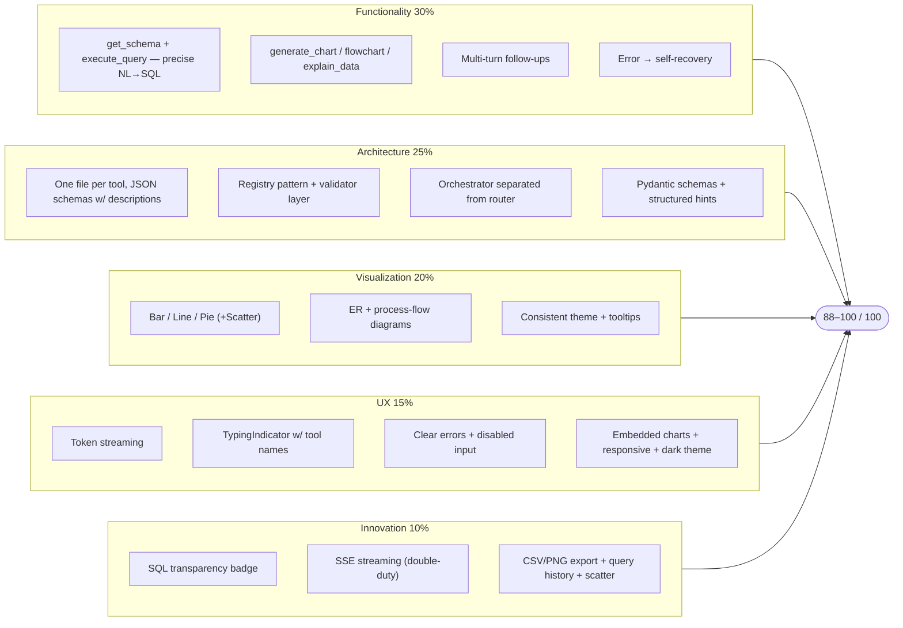

# 36. Judging Optimization — DataFlow AI

## Purpose

Translate the official evaluation criteria into a concrete scoring strategy: which features buy which points, what the judges will look for under each criterion, the canonical demo script, and preparation for live questioning. The goal is not to game the rubric but to spend engineering effort exactly where it scores, in the order it scores.

## Overview

The official criteria and the team's targets:

| Criterion | Weight | Target range | Strategy |
|---|---|---|---|
| Functionality | 30% | 27–30 | All five tools working; three use cases pass flawlessly; error recovery demoed |
| Tool Design & Architecture | 25% | 22–25 | Clean tool schemas, registry pattern, validator, modular layers — visible in code review |
| Visualization Quality | 20% | 18–20 | Appropriate chart selection, consistent theme, tooltips, clean diagrams |
| User Experience | 15% | 13–15 | Streaming, tool-status indicator, polished states, embedded visuals |
| Innovation & Creativity | 10% | 8–10 | SQL transparency, streaming, export, history, scatter |

**Total target: 88–100 / 100.**

## Architecture

### 36.1 Point Mapping (how the target is reached)

**Functionality (target 27–30 of 30):** get_schema 4 · execute_query 8 · generate_chart 5 · generate_flowchart 5 · explain_data 3 · multi-turn context 3 · error recovery 2. The execute_query weight is the highest single line — NL→SQL accuracy against the six reference queries is the single most-scored behavior. Priority: demo all three use cases; show one live error-and-recovery (typo → self-correction) on camera.

**Architecture (target 22–25 of 25):** per-tool files 4 · declarative JSON schemas with descriptions 5 · registry pattern 3 · validator layer 3 · orchestrator isolated from router 3 · Pydantic request models 3 · structured errors with hints 4. Judges review code; these features are *visible* in review. The tool descriptions double as prompt assets, so this criterion is scored by design quality that also improves Functionality.

**Visualization (target 18–20 of 20):** bar 3 · line 3 · pie 3 · scatter (bonus) 1 · ER 4 · process flow 3 · consistent theme 2 · tooltips/labels 2. The ER and process-flow quality dominates the diagram half; chart-type selection is judged on *appropriateness*, which the chart-selection rule in the system prompt enforces.

**UX (target 13–15 of 15):** streaming 4 · TypingIndicator with tool name 2 · input disabled while busy 1 · clear errors 2 · embedded charts 2 · responsive 1 · dark theme 2 · auto-scroll 1. Streaming is the single highest-value UX point — it is non-negotiable and was prioritized as roadmap step 1.

**Innovation (target 8–10 of 10):** SQL transparency 3 · SSE streaming 2 · export 2 · history 2 · scatter 1. SQL transparency is the anchor innovation: low effort, high visibility, and it reinforces Architecture and Trust.

### 36.2 The Canonical Demo Script (5 minutes)

| Time | Segment | What happens | Criteria hit |
|---|---|---|---|
| 0:00–0:30 | Intro | Team, product one-liner, problem statement | — |
| 0:30–1:30 | UC1 | "Top 5 products by revenue" → bar chart; follow-up "trend over last year" → line chart | Func, Viz, UX, Innov (SQL visible) |
| 1:30–2:30 | UC2 | "Draw the ER diagram" → auto-ER render; "which tables relate to customers?" | Func, Viz, Arch |
| 2:30–3:30 | UC3 | "Flowchart of how orders flow" → process diagram with assumptions | Func, Viz |
| 3:30–4:00 | Bonus | SQL badge expanded; PNG export; query history | Innov, UX |
| 4:00–4:30 | Architecture | Tools, registry, validator, SSE contract (crisp 3-slide style) | Arch |
| 4:30–5:00 | Wrap | Error-recovery clip or one-liner; summary; thank-you | Func, UX |

Include one *scripted error* early (e.g., "top prodcuts" typo) so judges watch the agent self-correct — a live demonstration of the error-handling secondary objective.

### 36.3 Point-Per-Hour Priorities (ties to the roadmap)

The roadmap ladder in `19_ImplementationRoadmap.md` is ordered by points-per-effort: SSE streaming (UX 4) → get_schema + execute_query (Func 12) → generate_chart + bar/line/pie (Func+Viz 13) → generate_flowchart + ER renderer (Func+Viz 9) → SQL badge (Innov+Arch 5) → TypingIndicator + errors (UX 4) → explain_data (Func 3) → dark-theme polish (UX+Viz 4) → export (Innov 2) → history (Innov 2). Steps 1–8 capture ~87 points; 9–10 are pure bonus.

### 36.4 Judge Question Preparation

| Likely question | Model answer |
|---|---|
| How does the agent choose tools? | Function calling: Claude returns `tool_use` blocks; the system prompt + tool descriptions steer selection; the registry dispatches deterministically |
| What happens when SQL fails? | The error envelope (message + hint + available tables) is injected as a `tool_result`; the model retries corrected SQL up to 2 times, then explains honestly |
| How is multi-turn context retained? | A 10-turn sliding window re-sent on every call, plus a per-session schema cache; follow-ups resolve via that history |
| How do charts get to the UI? | The tool emits a chart *config* JSON over an SSE `chart` event; Recharts renders client-side — no server pixels |
| Why Claude / why this stack? | Best-in-class `tool_use`, 200K context, native streaming, low-hallucination JSON; custom agent (no LangChain) for control and speed |

## Design Decisions

| Decision | Why |
|---|---|
| Score targets set before code | The roadmap is derived from the rubric, not from vibes |
| Architecture scored by visibility | Design choices (registry, validator, schemas, orchestration layering) are made to be *readable* in review |
| Streaming prioritized first | The highest single UX point and the innovation story backbone |
| SQL transparency as anchor innovation | Highest innovation points per effort, and it reinforces architecture and trust |
| Canonical demo script curated | Exactly the rubric's vocabulary appears on camera: functionality, tooling, visualization, errors |
| One scripted error | The brief's "graceful error handling" objective becomes a scored demonstration, not a claim |

## Responsibilities

- **Dev A**: execute_query precision (the 8-point line), validator and registry cleanliness, orchestration layering, error recovery demonstrable.
- **Dev B**: streaming UX, TypingIndicator labels, chart theming, SQL badge prominence, error states.
- **Team**: rehearse the canonical script to time; prepare judge-answer talking points; rehearse the error moment.

## Dependencies

- Rubric source: official problem statement §7.
- Point mapping detail: `19_ImplementationRoadmap.md`.
- Schedules/acceptance: `20_TestingStrategy.md`.
- Video script variant: `35_SubmissionChecklist.md`.

## Advantages

- Engineering effort is mapped to score before it is spent, so a 2-day sprint spends every hour on rubric value.
- The demo is a deliberate artifact that hits every criterion with named artifacts.
- The same design choices win twice: clean architecture is both the Architecture score and the quality that makes Functionality reliable.

## Limitations

- The model's live behavior is probabilistic; the demo may deviate (mitigated by the scripted flows and recovery rehearsal).
- Point estimates are the team's planning judgment, not the judges' rubric; targets are aspirations, not guarantees.
- Over-polish risk: the demo can consume Aug 6–7 at the expense of genuine robustness; the checklist gates keep polish bounded.

## Future Improvements

- Track actual rubric feedback if the organizers share scores; feed it back into the point map.
- Pre-record an alternate demo branch ("if the LLM misbehaves on UC1, pivot to UC2") — already inherent in the script.
- Analytics on the demo path (which chips judges click) to infer what they valued.

## Best Practices

- Never demo a feature that is not in the repo; the video and live demo are audited against the code.
- Rehearse the error-and-recovery moment — it only impresses if smooth.
- Overrun the video (never underrun): 3–5 minutes is mandatory; keep a tight 4:30 edit.
- Have the appointment-ready answers above internalized, not read.

## Summary

Judging optimization translates the official 100-point rubric into an engineering spending plan and a curated demo: score targets per criterion, point-per-effort implementation order, a five-minute script that demonstrates every criterion with a named artifact, and prepared answers to the likely questions. The strategy is honest engineering — the features that score are genuinely built — with the discipline required to fit a world-class demo into a 2-day sprint and a five-minute window.

---

**Next document:** `37_FinalExecutionChecklist.md`