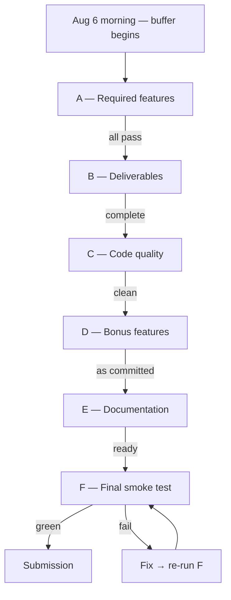

# 37. Final Execution Checklist — DataFlow AI

## Purpose

Provide the single, complete, tickable execution checklist covering required features, deliverables, code quality, bonus features, documentation, and the final smoke test — the superset of all verification activities. It is the last document consulted before submission and the first document consulted at the start of Aug 6 (buffer day).

## Overview

The checklist is organized into six sections (A–F). Sections A and B are non-negotiable (brief requirements); C and D are quality and bonus gates; E is documentation; F is the final smoke test procedure. Anything unticked in A or B blocks submission; C/D/E items are quality gates with defined severity.

## Architecture

### A — Required Features

**A1 — Chat interface (brief §4.1):**

- [ ] Real-time streaming display (tokens render incrementally)
- [ ] Message history persists within the session; restores on reload
- [ ] Clear processing/querying indication (TypingIndicator with tool labels)
- [ ] Input disabled while busy; Enter sends; Shift+Enter newline
- [ ] Auto-scroll to newest message
- [ ] Assistant messages render markdown
- [ ] Embedded charts render in-thread
- [ ] Embedded diagrams render in-thread
- [ ] SQL badge visible on query answers (transparency)
- [ ] Error bubbles with retry affordance
- [ ] Welcome screen with example chips
- [ ] Responsive across desktop/tablet/mobile

**A2 — Agent tools (brief §4.2):**

- [ ] `get_schema` — schema JSON with tables/columns/types/keys/row counts
- [ ] `execute_query` — validated SELECT execution with structured rows
- [ ] `generate_chart` — config JSON for bar/line/pie/scatter
- [ ] `generate_flowchart` — Mermaid for ER/flowchart/sequence
- [ ] `explain_data` — grounded metrics + model narrative
- [ ] Registry dispatches all five; unknown tools return envelopes
- [ ] All tool failures return structured envelopes with hints
- [ ] Tool loop bounded (MAX_TOOL_ITERATIONS)

**A3 — Database integration:**

- [ ] Schema discovery works against the provided SQLite file (auto-discovery, no hardcoding)
- [ ] NL→SQL generation accurate on the six reference queries
- [ ] SELECT-only validation enforced; DML/DDL rejected with hints
- [ ] Row caps and LIMIT discipline applied

**A4 — Visualization (brief §4.3):**

- [ ] Bar chart (categorical comparison)
- [ ] Line chart (time trend)
- [ ] Pie chart (proportion)
- [ ] Scatter (bonus — correlation)
- [ ] ER diagram (auto-generated from schema)
- [ ] Process flowchart (order flow)
- [ ] Consistent chart theme and tooltips
- [ ] Diagram error fallback (raw code) works

### B — Deliverables

- [ ] B1 — Source code: repo pushed, tag v1.0.0, `.env` absent, no secrets
- [ ] B2 — README: setup, architecture, tools, scenarios, team
- [ ] B3 — Demo video: 3–5 min, scripted, hosted link, local backup
- [ ] B4 — Live demo: runs from `docker compose up` on the demo machine

### C — Code Quality

- [ ] Every module/tool has docstrings; naming per `13_ProjectStructure.md`
- [ ] `.env.example` complete; `.gitignore` correct; secrets sweep clean
- [ ] No hardcoded API keys anywhere in code, tests, or docs
- [ ] Error handling per `24_ErrorHandlingStrategy.md` (no raw stack traces to client)
- [ ] `pytest` passes; frontend `npm run build` clean; no console errors in browser
- [ ] Modular boundaries respected: no frontend logic in backend and vice versa

### D — Bonus Features (committed set)

- [ ] D1 — NL→SQL explanation: SQL badge shows executed statement
- [ ] D2 — Real-time streaming (SSE): token-level streaming end-to-end
- [ ] D3 — Export: PNG chart download; CSV data download
- [ ] D4 — Query history in sidebar; re-run on click; clear-all
- [ ] D5 — Scatter chart working end-to-end

### E — Documentation

- [ ] README quick start verified from a fresh clone (≤ 5 commands)
- [ ] Architecture diagram in README matches the implemented system
- [ ] Tool documentation matches actual tool schemas
- [ ] `docs/architecture-repository/` present in the repo (this repository, 40 files)

### F — Final Smoke Test (run in order, on the demo machine)

- [ ] F1 — Fresh clone of the repository
- [ ] F2 — `cp .env.example .env` + insert valid key
- [ ] F3 — `docker compose up -d` completes in under 60 seconds
- [ ] F4 — Health check: `localhost:8000/api/health` returns ok (database + claude reachable)
- [ ] F5 — `localhost:3000` loads; UI renders the welcome state
- [ ] F6 — UC1: top-5-products question → bar chart within ~15 s; trend follow-up → line chart
- [ ] F7 — UC2: ER diagram renders with all tables; relationship follow-up answered
- [ ] F8 — UC3: process flowchart renders with assumptions noted
- [ ] F9 — Bonus spot-check: SQL badge expands; PNG downloads; history populates
- [ ] F10 — Negative spot-check: one typo query → agent self-corrects or errors gracefully

## Design Decisions

| Decision | Why |
|---|---|
| Six-letter sections with binary items | Complete coverage with zero ambiguity; the checklist is a protocol, not a wish list |
| A/B blocks the submission | Brief requirements gate the submission; quality/bonus items cannot be skipped silently but also cannot be faked |
| Smoke test as the final procedure | The last 20 minutes before judging execute a fixed, rehearsed sequence |
| Negative spot-check included | The brief's error-handling objective is verified, not assumed |
| Checks run on the demo machine | Proves the environment, not just the code |

## Responsibilities

- **Dev A**: A3, C (backend side), F3/F4/F6 (backend verification).
- **Dev B**: A1/A4 (frontend), D (frontend side), F5/F7/F8/F9 (UI verification).
- **Team**: A2 joint; B and E; F10 negative test; final sign-off.

## Dependencies

- Requirements: `29_FeatureSpecifications.md`.
- Test strategy: `20_TestingStrategy.md`.
- Submission: `35_SubmissionChecklist.md`.
- Scoring strategy: `36_JudgingOptimization.md`.

## Advantages

- A single document answers "are we done?" — no ambiguity, no institutional memory required.
- The smoke test is the dress rehearsal; Aug 6–7 runs it until green.
- Quality gates match the brief's wording, making compliance auditable.

## Limitations

- The checklist verifies what was planned; unplanned judge questions depend on the recovery design and preparation.
- It cannot repair a broken demo-day environment; mitigation is the backup video and local-run fallback.

## Future Improvements

- Automate F1–F4 into a single `pre-submit.sh` script with pass/fail output.
- A printed one-page version of A–F for the judging table.
- A post-event lessons-learned section appended after judging.

## Best Practices

- Run the full checklist once on Aug 6 and once again 30 minutes before judging.
- Never skip F10 — the negative test is the brief's error-handling requirement verified.
- Tick items only when demonstrated, not when believed.

## Summary

The final execution checklist is the complete verification protocol: required features A, deliverables B, quality C, bonus D, documentation E, and the smoke test F. It gates submission on the brief's mandatory surface, enforces the team's quality bar, and ends with a fixed rehearsal procedure that makes the last hour before judging mechanical. It is the last artifact touched before submission — and the reason nothing is left to memory.

---

**Next document:** `38_ChatGPTImplementationGuide.md`