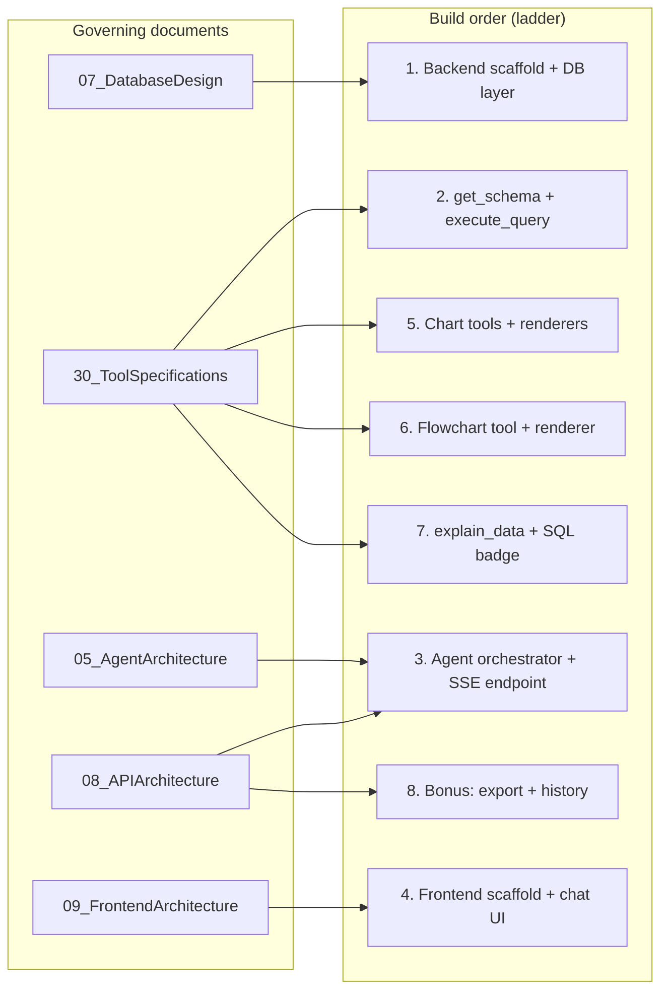

# 38. ChatGPT Implementation Guide — DataFlow AI

## Purpose

Provide a complete, self-contained implementation guide that enables another AI (ChatGPT or any coding model) — or a developer with zero context from this repository — to build the entire DataFlow AI application in the 2-day sprint. It defines the implementation order, the document map (which architecture file governs each step), the reusable prompt templates for the agentic build, the component independence matrix, the integration checkpoints, and the known pitfalls with their solutions.

## Overview

This guide treats the architecture repository as a *specification suite*: each implementation step names the governing documents, the deliverables, and the verification. The build order is the same score-ordered ladder as the roadmap (`19_ImplementationRoadmap.md`), mapped to files. Two parallel tracks (backend by Dev A, frontend by Dev B) are preserved, meeting only at the SSE contract.

## Architecture

### 38.1 The 15-Step Implementation Order (with document map)

| Step | Build item | Governed by | Deliverable verified by |
|---|---|---|---|
| 1 | Backend scaffold, config, CORS, health endpoint | `13_ProjectStructure`, `08_APIArchitecture` | health 200 via curl |
| 2 | DB connection manager + SQL validator | `07_DatabaseDesign`, `23_SecurityDesign` | validator unit tests pass |
| 3 | `get_schema` tool | `30_ToolSpecifications` | returns real schema JSON |
| 4 | `execute_query` tool (validation, caps, hints) | `30_ToolSpecifications` | reference query Q1 works |
| 5 | Session store + system prompt | `05_AgentArchitecture`, `33_PromptEngineeringStrategy` | 10-turn window holds |
| 6 | Agent orchestrator (tool_use loop, retries, budgets) | `05_AgentArchitecture`, `24_ErrorHandlingStrategy` | tool loop bounded; recovery works |
| 7 | SSE `/api/chat` endpoint (all 8 events) | `08_APIArchitecture` | curl -N shows token + done |
| 8 | Frontend scaffold: Vite, Tailwind, theme, layout | `13_ProjectStructure`, `27_UI_UX_Documentation` | 3-column layout renders |
| 9 | Chat UI: container, bubbles, input, indicator | `09_FrontendArchitecture`, `27_UI_UX_Documentation` | mock messages render |
| 10 | SSE client hook (fetch + ReadableStream) | `09_FrontendArchitecture`, `18_IntegrationPlan` | live streamed answer (CP2) |
| 11 | `generate_chart` + 4 chart components + renderer | `30_ToolSpecifications`, `11_VisualizationArchitecture` | bar chart from UC1 (CP3) |
| 12 | `generate_flowchart` + diagram renderer | `30_ToolSpecifications`, `12_FlowchartArchitecture` | ER + flowchart render (CP3) |
| 13 | `explain_data` + SQL badge + error states | `30_ToolSpecifications`, `27_UI_UX_Documentation` | explanation grounded in metrics |
| 14 | Bonus: PNG/CSV export, query history, scatter | `29_FeatureSpecifications` | each bonus works E2E |
| 15 | Docker, README, tests, smoke test | `22_DockerArchitecture`, `35_SubmissionChecklist`, `37_FinalExecutionChecklist` | full stack green |

### 38.2 Reusable AI Prompts (for the coding model)

1. **Tool implementation**: "Implement `{tool}` per `30_ToolSpecifications.md`: declare the JSON input schema exactly, validate inputs, return the success/failure envelopes verbatim-shaped, and write unit tests per `20_TestingStrategy.md`. Async execution; no rendering."
2. **Orchestrator**: "Implement the agent loop per `05_AgentArchitecture.md`: handle `stop_reason == 'tool_use'`, dispatch via the registry, inject envelopes as `tool_result` blocks, enforce MAX_TOOL_ITERATIONS and TOOL_TIMEOUT_SECONDS, emit SSE events per `08_APIArchitecture.md`."
3. **SSE endpoint**: "Implement `POST /api/chat` per `08_APIArchitecture.md` returning an SSE stream with exactly these event types: token, sql, chart, diagram, tool_start, tool_end, done, error. Terminate events with double newlines; flush after each event."
4. **React SSE hook**: "Implement `useChat` per `09_FrontendArchitecture.md` using `fetch` with a ReadableStream (EventSource cannot POST). Parse the 8 event types; accumulate tokens; mount chart/diagram payloads mid-stream; handle done/error; expose connection state."
5. **Chart component**: "Implement `ChartRenderer` + the four chart components per `11_VisualizationArchitecture.md` using Recharts; consume the `chart` event shape; use the theme palette; tooltips and legend on; responsive container; table fallback on render error."
6. **Mermaid renderer**: "Implement `DiagramRenderer` per `12_FlowchartArchitecture.md`: lazy-load Mermaid, render with `securityLevel: strict`, error boundary falling back to raw code, full-screen toggle, SVG download."
7. **docker-compose**: "Write `docker-compose.yml` per `22_DockerArchitecture.md`: two services, healthcheck-gated startup, env_file, SQLite volume, frontend on 3000 proxying /api to backend:8000."

### 38.3 Independently Buildable Components

| Component | Track | Blocks on | Can proceed with |
|---|---|---|---|
| DB layer + validator | A | nothing | — |
| get_schema / execute_query | A | DB layer | — |
| Session store + prompt | A | nothing | — |
| Orchestrator | A | tools + session | mock tool envelopes |
| SSE endpoint | A | orchestrator | — |
| Chat UI (visual only) | B | nothing | mock messages |
| SSE client hook | B | contract only | mock SSE server |
| Chart/diagram components | B | contract only | fixture payloads |
| Export + history | B | contract | — |

### 38.4 Integration Checkpoints (unchanged contract)

- **CP1 (Day 1, ~12:30)**: stub SSE stream; frontend renders streamed tokens.
- **CP2 (Day 1, ~17:00)**: real agent stream; live text answer.
- **CP3 (Day 2, ~10:30)**: chart + diagram events render.
- **CP4 (Day 2, ~14:00)**: all three use cases end-to-end.
- **CP5 (Day 2, ~17:00)**: docker-compose full stack.

Verify with: `curl -N -X POST http://localhost:8000/api/chat -H "Content-Type: application/json" -d '{"message": "Show top 5 products by revenue", "session_id": "t1"}'` — expect `token`, `sql`, `chart`, `done` events.

### 38.5 Known Pitfalls (the 10 that waste the most hours)

1. **Sync tool functions** must be async (await the DB calls) or the event loop blocks the stream.
2. **SSE framing**: each event must end with `\n\n` and be flushed; missing flush = invisible stream.
3. **EventSource cannot POST** — the client must use `fetch` + ReadableStream; EventSource only works for GET.
4. **Mermaid silent failures** — wrap rendering in try/catch; a bad diagram renders nothing otherwise.
5. **`stop_reason` is `'tool_use'`**, not `'tool_calls'`; wrong check = no tool execution, infinite loop.
6. **Tool dispatch**: pass `**tool_input` (the tool_use input dict) — missing kwargs raise TypeError.
7. **Chart layout overflow** — charts must sit in `max-w-full`/responsive containers; fixed widths overflow small screens.
8. **aiosqlite.Row is not JSON-serializable** — convert to `dict(row)` before envelopes.
9. **System prompt must stay < ~500 tokens** — verbose prompts degrade compliance and add latency.
10. **CORS origin mismatch** — the browser origin must match `CORS_ORIGIN` exactly (scheme, host, port).

### 38.6 Debugging Prompts (for the coding model)

- **Tool returns wrong output**: "Reproduce with the exact input in a unit test; compare the envelope shape to `30_ToolSpecifications.md`; fix the tool; add the regression test."
- **SSE broken**: "Capture the raw stream with curl -N; check framing (`\n\n`), flushing, and the event parser; test parser in isolation with fixture lines."
- **Claude selects the wrong tool**: "Review the tool descriptions in `30_ToolSpecifications.md` and the steering rules in `33_PromptEngineeringStrategy.md`; run the six reference queries as a prompt regression."

## Design Decisions

| Decision | Why |
|---|---|
| Every step names its governing document | The guide makes the architecture repository consumable as a build spec |
| Score-ordered ladder preserved | The build order itself is the scoring plan (`36_JudgingOptimization.md`) |
| Component independence matrix | Lets the coding model or the two developers proceed without cross-blocking |
| Pitfalls listed with fixes | The known failure modes of this exact stack are the highest-hour-cost traps |
| Contract-first checkpoints | The SSE contract is the only coupling; checkpoints verify it early and often |

## Responsibilities

- **The implementing model/developer**: follow the ladder, respect the documents, verify at each step.
- **Dev A / Dev B**: parallel tracks per the matrix; meet only at checkpoints.
- **Verification**: each step lists its acceptance check; nothing proceeds untested.

## Dependencies

- All governing documents cited in the table above (the entire `docs/architecture-repository/`).
- `18_IntegrationPlan.md` for the contract and change protocol.
- `19_ImplementationRoadmap.md` for the schedule and cut order.

## Advantages

- Zero-context onboarding: a fresh AI or developer can build the project from this document plus the suite.
- The document map guarantees no specification is lost during implementation.
- Pitfalls pre-empt the most expensive debugging hours in this exact stack.

## Limitations

- The guide assumes the governing documents are read; it is a navigation layer, not a replacement for them.
- LLM-built code still needs human review; the checklist gates (`37_FinalExecutionChecklist.md`) are the safety net.

## Future Improvements

- Step-level acceptance scripts that the coding model can run to self-verify.
- A Dockerized "build harness" that checks each step's outputs automatically.
- Versioned spec hashes so the guide detects when the governing documents drift.

## Best Practices

- Implement in the ladder order — never skip ahead into bonus features.
- After each step, run its verification before starting the next.
- Keep the SSE contract untouched; every deviation must follow the change protocol.
- Treat the pitfall list as a pre-flight checklist for every merge.

## Summary

The ChatGPT Implementation Guide is the execution interface of the architecture repository: a 15-step, document-mapped build order for two parallel tracks, reusable prompt templates, a component independence matrix, contract-first checkpoints, the ten highest-cost pitfalls with fixes, and debugging prompts. Combined with the repository's specification documents, it makes the 2-day production-grade build a guided execution rather than an act of discovery.

---

**Next document:** `39_MasterProjectBlueprint.md`