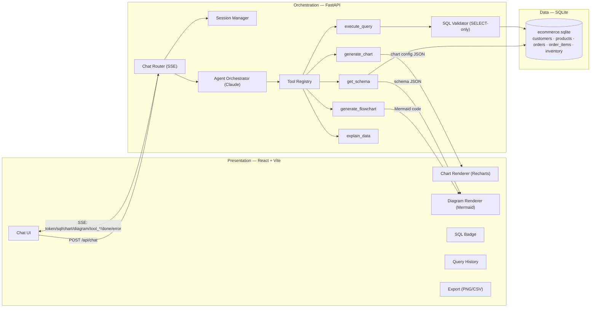
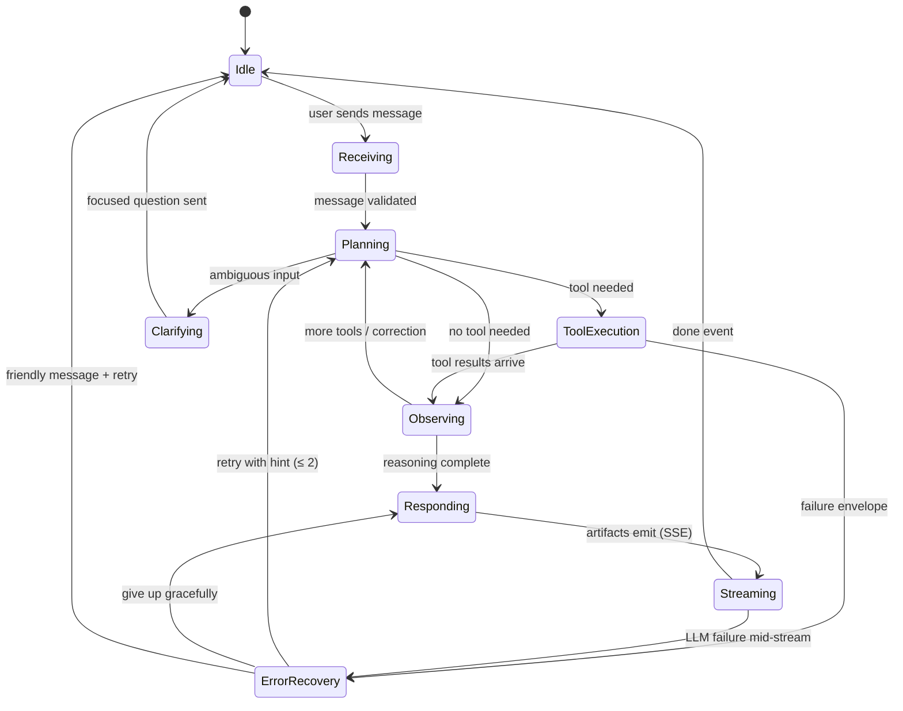
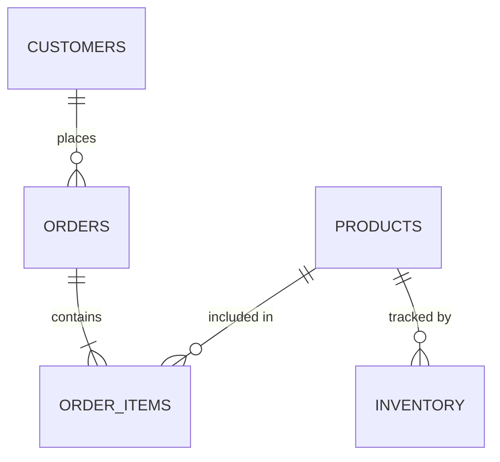

# 39. Master Project Blueprint — DataFlow AI

## Purpose

This document is the single source of truth for DataFlow AI: the complete project from problem statement to submission, synthesizing all 38 preceding documents into one authoritative blueprint. A reader of *only* this file can understand the entire project — what is being built, why, how, by whom, in what order, and how it wins. Every other document in this repository is a deep-dive; this one is the whole map.

## Overview

Fourteen parts follow: the project and its constraints (I), requirements (II), system architecture and stack (III), the agent (IV), the five tools (V), the database (VI), the API and wire contract (VII), the frontend (VIII), cross-cutting quality concerns — errors, security, performance (IX), the 2-day build (X), verification and delivery (XI), risks (XII), the scoring strategy (XIII), and the future direction (XIV). Together they reconstruct the entire system: every component, every contract, every decision, every schedule — implementation-ready with no other input.

---

## Design Decisions (Summary)

The blueprint embeds the full decision record; the headline decisions and their rationale:

| Decision | Rationale (full analysis in `03_HighLevelDesign.md`) |
|---|---|
| Claude claude-sonnet-4-6, pinned | Best-in-class `tool_use` function calling; 200K context; native streaming; low-hallucination JSON |
| Custom ReAct-style agent (no framework) | Five tools need no orchestration framework; full control, fewer moving parts, faster |
| FastAPI + async everywhere | Native SSE streaming; non-blocking DB I/O; auto OpenAPI |
| React 18 + Vite + Tailwind | Gold-standard chat UI patterns; instant HMR; fastest path to a polished dark theme |
| Recharts + Mermaid.js | React-native charts; LLM-native diagram syntax; both explicitly fit the brief's recommended stack |
| SQLite + aiosqlite | Provided sample; zero setup; demo reliability |
| SSE over WebSocket | One-way push matches chat exactly; trivial in FastAPI and browsers |
| SELECT-only validator at execution boundary | The enforced safety control; the prompt is advisory, the validator is law |
| In-memory sessions behind a module boundary | Zero infrastructure for demo; swappable for Redis without touching the orchestrator |
| Envelope + hint error contract | The only failure format the LLM can reason about and recover from |
| 2-day sprint, tiered scope | T1 mandatory never cut; T2 score-critical; T3 bonus — cut order enforced by the tier system |

---

## Part I — The Project

### 1.1 What We Are Building

**DataFlow AI** — a ChatGPT-like conversational analytics application for the iTech AI Innovation Hackathon 2026 (theme: *Building Intelligent LLM Agents for Database Interaction & Visualization*). A non-technical user asks a plain-language question about a database; an LLM agent interprets the intent, discovers the database schema, generates and executes safe SQL, chooses and renders the appropriate visualization (chart or diagram), and explains the insight in plain business language — all within one streaming conversation that remembers context across follow-ups.

The product answers four implicit needs in a single workflow: an intelligible interpretation of the request, a validated database action, an appropriate visual representation, and a concise grounded explanation.

### 1.2 The Problem

Non-technical users cannot extract insights from relational databases without SQL and schema knowledge. Existing tools are either dashboards (static, pre-built) or query tools (require technical skill). The gap: a conversational layer that turns language into validated data actions, visualizations, and explanations — transparently, so the user trusts the numbers.

### 1.3 Official Constraints (from the brief)

- **Event**: iTech AI Innovation Hackathon 2026; **window**: Aug 1–7, 2026; **team**: official size 3–5 — this team: **2 developers**; **difficulty**: Intermediate–Advanced.
- **Deliverables**: (1) complete codebase in a Git repo; (2) README (setup, architecture, tool docs); (3) demo video 3–5 min; (4) live demo (deployed or local run).
- **Code requirements**: clean, well-commented code; `.env` configuration with **no hardcoded API keys**; Docker support preferred; unit tests for critical tools (bonus).
- **Resources**: provided sample SQLite e-commerce database (orders, products, customers, inventory); limited API credits or bring-your-own key; approved providers: OpenAI, Anthropic, Google Gemini, or open-source.
- **Judging criteria**: Functionality 30% · Tool Design & Architecture 25% · Visualization Quality 20% · User Experience 15% · Innovation & Creativity 10%.

### 1.4 Team & Timeline

- **Dev A — Backend & Agent Engineer**: FastAPI, agent orchestration, all five tools, DB layer, SSE, Docker, README.
- **Dev B — Frontend & UI Engineer**: React app, streaming UX, chart/diagram renderers, export, history, demo video.
- **Build sprint: 2 days** (Aug 4–5) to a production-grade vertical slice and full product; **Aug 6–7**: verification buffer, demo video recording, rehearsal, submission.
- **Score target: 88–100 / 100** (Functionality 27–30, Architecture 22–25, Visualization 18–20, UX 13–15, Innovation 8–10).

---

## Part II — Requirements

### 2.1 Mandatory Features (from the brief — never cut)

| Area | Requirement |
|---|---|
| Chat interface | Real-time streaming display; session history persistence; clear processing/querying indication; embedded visualization rendering |
| Tools (min 5) | `get_schema` · `execute_query` · `generate_chart` · `generate_flowchart` · `explain_data` — typed schemas, structured JSON returns, graceful errors, docstrings |
| Visualization | ≥ 3 chart types (bar, line, pie; scatter = bonus) · ≥ 2 diagram types (ER, process flow; decision trees = bonus) |
| Database | Schema discovery, NL→SQL generation, safe execution against the provided SQLite sample |
| Secondary | Multi-turn context retention · graceful error handling and fallbacks · query explanation / SQL transparency |

### 2.2 The Three Canonical Use Cases (must work live)

- **UC1 — Sales analysis**: "Show me the top 5 products by revenue this quarter" → query → bar chart → insight; follow-up "Now show me the trend for these products over the last year" → line chart (proves multi-turn context).
- **UC2 — Database understanding**: "Draw me the ER diagram for this database" → schema → Mermaid ER render; follow-up "Which tables are related to customers?" → schema-aware answer.
- **UC3 — Process visualization**: "Create a flowchart showing how orders flow through our system" → schema analysis → process inference → flowchart render with stated assumptions.

### 2.3 Non-Functional Targets

First response token < 2 s · chart render < 500 ms · graceful fallback on every failure class · no hardcoded keys (`.env` only) · stateless backend + frontend session state · Docker and local run in < 5 commands · well-commented modular code · SELECT-only security posture.

### 2.4 Personas

1. **Business User** — non-technical; wants plain-language answers, readable charts, follow-ups without restating context.
2. **Technical Reviewer** (judge/mentor) — needs schema awareness, query transparency, tool-selection rationale, graceful failures.
3. **Team Operator** — runs the demo; needs deterministic flows, visible states, scripted recovery.

### 2.5 Bonus Features (committed set)

SQL transparency badge (NL→SQL explanation) · SSE token streaming · PNG/CSV export · query history (favorites deferred) · scatter chart. Deferred: multi-database, real-time feeds, ML trend insights, voice input, collaborative/dashboard — all with documented extension seams.

---

## Part III — System Architecture

### 3.1 Topology

A three-tier conversational AI system:

1. **Presentation tier** — React 18 + Vite + Tailwind SPA: chat thread, streaming text, embedded Recharts visualizations, embedded Mermaid diagrams, SQL badge, history sidebar, export controls, optional schema panel.
2. **Orchestration tier** — FastAPI (Python): chat router, session manager, LLM agent orchestrator (Anthropic Claude via function calling), tool registry, and the five tools. Streaming via Server-Sent Events.
3. **Data tier** — the provided SQLite e-commerce database behind an async connection manager and a SELECT-only SQL validator.

### 3.2 The Technology Stack (and why)

| Layer | Choice | Rationale (rejected alternatives) |
|---|---|---|
| LLM | Anthropic Claude (claude-sonnet-4-6), pinned via env | Best-in-class `tool_use` function calling; 200K context; native streaming; low-hallucination JSON (vs GPT-4: less reliable multi-step tool use; Gemini/Llama: weaker tooling for this pattern) |
| Agent framework | **Custom** ReAct-style loop on native tool_use | Full control, fewer moving parts, faster than LangChain/CrewAI/LlamaIndex — a 5-tool loop needs no framework |
| Backend | FastAPI (async) | Native async for SSE + concurrent DB I/O; auto OpenAPI; Python ecosystem (vs Express: weaker SQLite/LLM SDKs; Flask: no native async) |
| Frontend | React 18 + Vite + Tailwind | Gold-standard chat UI; instant HMR; Recharts + Mermaid integrations; polished dark theme fast (vs Streamlit: generic UI, poor UX score; Vue: smaller ecosystem) |
| Charts | Recharts 2.x | React-native components for all four chart types, responsive, themeable (vs Chart.js: canvas/DOM friction; Plotly: heavy; D3: too low-level) |
| Diagrams | Mermaid.js 10.x | Explicitly recommended in the brief; LLM emits Mermaid natively; text-in → render-out (vs Graphviz: server-side complexity; Draw.io API: not LLM-friendly) |
| Database | SQLite + aiosqlite | Provided sample; zero setup; file-based; demo reliability (vs PostgreSQL: overkill) |
| Streaming | SSE | One-way push matches chat; native in FastAPI and browsers; simpler than WebSocket |
| Deploy | Docker + docker-compose | Brief prefers Docker; one-command demo on unknown machines |
| Config | python-dotenv, `.env` | No hardcoded secrets (explicit brief requirement) |

### 3.3 End-to-End Request Lifecycle

---

## Part IV — The Agent

### 4.1 The Tool-Calling Loop

The orchestrator runs a bounded Reason→Act→Observe loop against Anthropic's native function calling:

1. Assemble context: system prompt (~300 tokens) + tool schemas (~1500) + last 10 turns (~8000) + current message.
2. Call the model. If `stop_reason == 'tool_use'`: dispatch each tool through the registry, emit `tool_start`/`tool_end`, relay the envelope as a `tool_result` block, and loop.
3. On success envelopes, derive streamed artifacts (SQL text, chart config, diagram code) as SSE events.
4. On failure envelopes, the model self-corrects (≤ 2 attempts) using the embedded hint; then answers honestly.
5. If `stop_reason == 'end_turn'`: stream the text, save the turn, emit `done`.

Guards: `MAX_TOOL_ITERATIONS = 8` (loop bound), `TOOL_TIMEOUT_SECONDS = 30`, `MAX_TOKENS = 4096`, `MAX_HISTORY_TURNS = 10`. Model and budgets are environment-configurable.

### 4.2 Memory & Context

- In-memory per-session store: last 10 user/assistant turns + schema cache (invalidated on session clear).
- Tool results are injected as `tool_result` blocks — the conversation carries the data the model reasons over.
- Follow-ups resolve via the history window: entities, filters, and time windows carry over ("these products", "this quarter"). Ambiguous follow-ups trigger a focused clarifying question — never a guess.
- No DB persistence; sessions die with the server (acceptable for demo; Redis-backed store is the documented scaling step).

### 4.3 The System Prompt (behavior contract)

Identity: "DataFlow AI — an expert data analyst assistant." Seven rules: (1) call `get_schema` first when structure is unknown; (2) always show the SQL used; (3) choose charts by analytical fit; (4) ER diagrams for structure, flowcharts for processes; (5) on query failure, explain and retry corrected; (6) concise business-focused explanations quoting actual numbers; (7) SELECT-only. Plus the chart-selection guide (categorical→Bar, trend→Line, proportion→Pie, correlation→Scatter, structure→ER, process→Flowchart) and current-database context. Total < 500 tokens, versioned in code.

---

## Part V — The Five Tools

Each tool: narrow responsibility, typed JSON schema, deterministic execution, structured envelope (`{success: true, ...}` / `{success: false, error, hint, ...}`), unit-tested.

| Tool | Purpose | Key inputs | Output highlights | Failure mode |
|---|---|---|---|---|
| `get_schema` | Structure discovery | `table_filter?` | tables, columns (name/type/pk/nullable), FKs, row counts | lists `available_tables` |
| `execute_query` | Safe SELECT execution | `sql`, `limit?` (100/1000) | `columns`, `rows`, `row_count`, `truncated` | error + hint ("did you mean products?") |
| `generate_chart` | Chart config JSON (no rendering) | `chart_type` (bar/line/pie/scatter), `data`, `x_key`, `y_key` | config: keys, labels, color (default `#6366f1`) | "Column X not found. Available columns: …" |
| `generate_flowchart` | Mermaid code | `diagram_type` (er/flowchart/sequence), `mermaid_code?`, `schema_data?` | deterministic auto-ER from schema; validated pass-through | "diagram_type 'tree' not supported…" |
| `explain_data` | Grounded metrics | `data`, `columns`, `context?`, `insight_type?` | `key_metrics` (top/bottom/total/avg) computed locally | "data array is empty — no rows to explain" |

**Registry**: name→function map, single dispatch point, declarative schemas that double as the LLM's tool API. Unknown tool or unhandled exception → sanitized failure envelope (the loop's last line of defense). Orchestration rules: get_schema before querying when structure is unknown; execute_query only when the metric/filters are clear; generate_chart only with adequate data shape; explain_data after retrieval. Outputs compose: schema → flowchart input; rows → chart data → explain_data input.

---

## Part VI — Database Design

### 6.1 Schema (auto-discovered at runtime; docs are reference)

Five tables: **customers** (customer_id PK, name, email UNIQUE, phone, city, country, created_at) · **products** (product_id PK, name, category, price, stock_quantity, description, created_at) · **orders** (order_id PK, customer_id FK, order_date, total_amount, status CHECK pending/processing/shipped/delivered/cancelled) · **order_items** (item_id PK, order_id FK, product_id FK, quantity, unit_price) · **inventory** (inventory_id PK, product_id FK, warehouse_location, quantity, last_updated).

Relationships: customers 1:N orders 1:N order_items N:1 products 1:N inventory.

### 6.2 Reference Queries (the NL→SQL accuracy bar)

Q1 Top 5 products by revenue (join + group + limit 5) · Q2 Monthly revenue trend, last 12 months (strftime, excludes cancelled) · Q3 Order status distribution (count by status) · Q4 Revenue by category · Q5 Low-stock products (< 20, joined with inventory) · Q6 Top customers by spend (limit 10).

### 6.3 Access Layer

- **Connection manager**: aiosqlite, `DATABASE_PATH` from env, row factory, returns `{columns, rows: [dict], row_count}`.
- **Validator**: must start with SELECT; forbidden: INSERT, UPDATE, DELETE, DROP, CREATE, ALTER, TRUNCATE, EXEC, EXECUTE; auto-LIMIT and 1000-row cap. The security boundary of the system.
- **Indexes**: on orders(customer_id), orders(order_date), order_items(order_id), order_items(product_id), inventory(product_id).
- **Schema discovery**: catalog → PRAGMA table_info → PRAGMA foreign_key_list → row counts; the single source of truth (never hardcode the schema).

---

## Part VII — The API & Wire Contract

### 7.1 Endpoints

| Endpoint | Purpose |
|---|---|
| `POST /api/chat` | Main chat; body `{message, session_id, options:{show_sql, stream}}`; returns SSE stream |
| `GET /api/session/{id}/history` | Session history (404 if missing) |
| `DELETE /api/session/{id}` | Clear session |
| `GET /api/health` | `{status, database, claude_api, version}` — used by Docker healthcheck |
| `GET /api/schema` | Direct schema (UI schema panel) |
| `POST /api/export/csv` | CSV export of a validated query (bonus) |

### 7.2 SSE Event Contract (the only integration surface — frozen Day 1)

`token {type, content}` · `sql {type, content}` · `chart {type, chart_type, title, data, config}` · `diagram {type, diagram_type, title?, mermaid}` · `tool_start` / `tool_end {type, tool, success?}` · `done {type, message_id}` · `error {type, code, message}`.

Error codes: EMPTY_MESSAGE 400 · INVALID_SESSION 400 · SQL_UNSAFE 400 · PARSE_ERROR 422 · DB_ERROR 500 · TOOL_ERROR 500 · CLAUDE_TIMEOUT 503 · CLAUDE_RATE_LIMIT 429.

Pydantic models validate every request; CORS is env-driven (default `http://localhost:5173`).

### 7.3 Data Flow (shapes change only in tools)

Question → ChatRequest → context assembly → tool envelopes (schema/rows/config/mermaid/metrics) → thin SSE events → rendered artifacts. Two deterministic transformations: rows→chart config (generate_chart) and schema→Mermaid (generate_flowchart). Facts (rows, metrics, SQL) are visually separated from commentary (model prose); every artifact on screen traces back to a validated query.

---

## Part VIII — The Frontend

### 8.1 Component Map

`App` (3-column layout) → `ChatContainer` → `MessageBubble` (user right/indigo, assistant left/dark with sparkle avatar) · `MessageInput` (auto-resize, Enter send, disabled while busy) · `TypingIndicator` (pulsing dots + tool labels: "Reading schema… / Running query… / Building chart…") · `SQLBadge` (collapsible, highlighted SQL, copy) · `ChartRenderer` + Bar/Line/Pie/Scatter · `DiagramRenderer` (lazy Mermaid, strict security, error boundary → raw code fallback, full-screen, SVG download) · `QueryHistory` (localStorage, click re-run, clear) · `ExportButton` (PNG capture, CSV) · `ErrorBubble` (friendly + retry) · optional `SchemaPanel`.

### 8.2 State & Streaming

One `useChat` state machine (no Redux): `idle / connecting / streaming / error / done`. SSE consumed via `fetch` + ReadableStream (EventSource cannot POST); pure parser; token accumulation with incremental markdown; charts/diagrams mount when their complete events arrive; unknown events ignored defensively. History: `crypto.randomUUID` session ids, localStorage persistence, server restore.

### 8.3 Design System

Dark theme: background `#0f0f13` · surface `#1a1a24` · border `#2a2a3a` · primary `#6366f1` · text `#f1f0ff` / muted `#8b8ba7` · success `#22c55e` · error `#ef4444` · chart palette `#6366f1 #8b5cf6 #06b6d4 #10b981 #f59e0b`. WCAG AA contrast by construction. Responsive: >1024 three columns, 768–1024 two, <768 one with slide-over panels. Every conversation state designed in advance: welcome (logo + 3 example chips), thinking, streaming (blinking cursor), rendered artifacts, error, disconnected.

---

## Part IX — Error Handling, Security, Performance

### 9.1 Error Handling (three layers)

1. **Envelopes** — every tool failure returns `{success:false, error, hint}`; hints are written for the model.
2. **Agent recovery** — envelopes re-enter as facts; model retries ≤ 2; then honest give-up. LLM-side failures (timeout/rate limit) never fabricate data — friendly retry message instead.
3. **Experience** — ErrorBubble with retry; chart→table and diagram→raw-code fallbacks; reconnect affordance; zero stack traces to the client.

Empty results are first-class: the model states the empty set, explains likely causes, suggests refinements — no empty charts.

### 9.2 Security

SELECT-only validator at the execution boundary · secrets in `.env` only (never images/logs; pre-submission `sk-ant` grep) · env-driven CORS · Pydantic input validation · Mermaid `securityLevel: strict` + safe markdown (no raw HTML) · no third-party scripts · session data stays in memory/localStorage · no auth (single-tenant demo scope, honestly documented).

### 9.3 Performance

Stream everything, buffer nothing (first token < 2 s) · per-session schema cache · row caps (100/1000) bound context/charts/SSE · lazy-loaded Mermaid (initial bundle small) · memoized chart components (streaming re-renders don't re-render charts) · async DB everywhere · measurement at every checkpoint (CP2/CP4/CP5).

---

## Part X — The 2-Day Build

### Day 1 (Aug 4) — Vertical slice: a real streamed answer end-to-end

| Time | Dev A (backend) | Dev B (frontend) |
|---|---|---|
| 08:00 | Scaffold, config, CORS, health | Vite scaffold, deps, Tailwind theme |
| 09:30 | DB connection + validator | 3-column layout + chat anatomy |
| 11:00 | `get_schema` (2h) | `MessageInput`, bubbles, indicator |
| 12:30 | **CP1** — stub SSE tokens stream | **CP1** — streamed tokens render |
| 13:30 | `execute_query` + hints | SSE client hook (ReadableStream) |
| 15:00 | Session store + system prompt | useChat state machine |
| 16:00 | Orchestrator (loop, budgets, envelopes) | TypingIndicator + markdown + cursor |
| 17:00 | **CP2** — real agent streaming | **CP2** — live streamed answer |

**Milestone: a real question returns a streamed, grounded answer in the chat UI.**

### Day 2 (Aug 5) — Visualization, integration, polish: production grade

| Time | Dev A (backend) | Dev B (frontend) |
|---|---|---|
| 08:00 | `generate_chart` (1.5h) | 4 chart components |
| 09:30 | `generate_flowchart` + auto-ER (2h) | ChartRenderer |
| 10:30 | **CP3** — chart + diagram SSE events | **CP3** — charts + diagrams render |
| 11:30 | `explain_data` (1h) | DiagramRenderer + error boundary |
| 13:00 | UC1–UC3 integration, error hardening | SQLBadge, ErrorBubble, welcome + chips |
| 14:00 | **CP4** — all three use cases | **CP4** — all three use cases |
| 15:00 | Export CSV, unit tests | QueryHistory, ExportButton, schema panel |
| 16:00 | Backend Dockerfile, compose, README | Frontend Dockerfile (multi-stage → nginx), proxy |
| 17:00 | **CP5** — full Docker stack green | **CP5** — full Docker stack green |
| 17:30+ | Env hygiene, tag v1.0.0, tests | README screenshots, build clean |

**Milestone: `docker compose up` on a clean machine yields the complete product — three use cases, bonus features, polished UI.**

### Aug 6–7 (buffer — not build)

Aug 6: regression pass (A–F checklist), demo video recording (scripted 5-min), README completion. Aug 7: dress rehearsal on the demo machine, final smoke test, submission (repo + README + video link + live demo). Cut order under pressure: T3 bonus → T2 polish; T1 (mandatory) is never cut.

### Score-Ordered Priority Ladder

1. SSE streaming (UX 4) → 2. get_schema + execute_query (Func 12) → 3. generate_chart + bar/line/pie (Func+Viz 13) → 4. generate_flowchart + ER renderer (Func+Viz 9) → 5. SQL badge (Innov+Arch 5) → 6. TypingIndicator + errors (UX 4) → 7. explain_data (Func 3) → 8. dark-theme polish (UX+Viz 4) → 9. export (Innov 2) → 10. history (Innov 2). **Steps 1–8 ≈ 87 points; 9–10 pure bonus.**

---

## Part XI — Verification & Delivery

### 11.1 Testing (pyramid)

E2E 3 (scenarios) / agent integration 5 (marked, skip without key) / tool unit 15 / API contract 5 / UI component 10 — plus manual visualization matrix and the 10-point acceptance checklist (compose up < 60 s, `:3000` loads, health ok, 3 scenarios pass, SQL badge, PNG valid, history populates, no console errors, no backend exceptions, README < 5 commands).

### 11.2 Delivery Modes

Local (uvicorn :8000 + Vite :5173) · **Docker (primary)** — backend :8000 + nginx frontend :3000, healthcheck-gated startup, SQLite volume, `.env` via env_file · Cloud (optional, Render/Railway + static host). Judge-machine playbook: clone → `cp .env.example .env` → key → `docker compose up -d` → `localhost:3000`.

### 11.3 The Demo (5 minutes, scripted)

Intro → UC1 (bar + line follow-up, SQL badge visible) → UC2 (auto-ER + relationships) → UC3 (flowchart with assumptions) → bonus (export, history) → architecture one-liner → wrap. Include one scripted typo error so judges watch the agent self-correct. Backup: recorded video + local-run fallback + second API key.

### 11.4 Submission

Repo tagged `v1.0.0`, `.env` absent, secrets sweep clean · README complete (setup, architecture, tools, scenarios, team) · video hosted + local copy · smoke test green on the demo machine 30 minutes before judging.

---

## Part XII — Risk Summary (top five)

1. **Provider rate limit / outage** → schema cache, batch calls, backup key, fallback message, video pivot.
2. **Schema drift from docs** → auto-discovery is the source of truth; hints use live schema.
3. **SSE contract drift** → frozen Day 1, shared types, contract tests, defensive parser.
4. **Demo machine problems** → Docker + local-run fallbacks; images pre-built; tested ≥ 30 min prior.
5. **Scope creep** → tier system; T3 cut first; T1 never cut.

---

## Part XIII — The Score Strategy

Functionality: five tools live + three use cases + one live error recovery (27–30). Architecture: per-tool files, declarative schemas, registry, validator, orchestration layering, Pydantic models, structured hints — all visible in code review (22–25). Visualization: appropriate chart selection (rule-driven), consistent theme, tooltips, clean ER/flow (18–20). UX: streaming, tool-status indicator, polished states, embedded visuals (13–15). Innovation: SQL transparency, streaming, export, history, scatter (8–10).

---

## Part XIV — Future Direction

Multi-database adapters (seam exists) · Redis-backed sessions + horizontal replicas · model routing and prompt caching · real-time data feeds and ML trend detection as new registry tools · auth/tenancy for collaborative and dashboard features · conversation summarization · light theme, i18n, voice input.

---

## Summary

DataFlow AI is a two-day, two-developer build of a production-grade conversational analytics product: a custom Claude-powered agent orchestrating five typed tools over a validated SQLite connection, streaming charts, diagrams, SQL transparency, and grounded explanations into a polished ChatGPT-like interface — containerized for a one-command demo. Every design decision in this blueprint traces to one of three drivers: the brief's mandatory requirements (never cut), the official rubric's points (spend effort where it scores), and the 2-day constraint (seams for growth, scope gates for survival). Read this file to know the whole project; read the other 38 documents to build any part of it in depth.

---

*This repository contains 40 documents (00–39). Document 39 is this blueprint — the single source of truth.*
