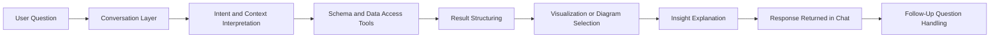

# Blueprint 10: Solution Vision

## Purpose
This document translates the hackathon brief into a delivery-oriented solution vision for a conversational analytics product. It defines the intended user value, the operating boundaries of the system, and the principles that should guide design and implementation decisions across the team.

## Brief Alignment
The solution directly addresses the brief's central requirement: a ChatGPT-like application that can understand natural language, query SQL or NoSQL data sources, generate visualizations, and explain findings conversationally. The blueprint treats these capabilities as one connected experience rather than isolated features.

## Target Outcome
The product should enable a non-technical user to ask a data question in plain language and receive four things in one workflow:

- an intelligible interpretation of the request
- a validated database action
- an appropriate visual representation of the result
- a concise explanation of the resulting insight

## Experience Principles
- Prioritize clarity over novelty so the agent remains understandable during live judging.
- Make tool usage visible enough to build trust without overwhelming the user.
- Preserve conversational continuity so follow-up questions feel natural.
- Select visual formats based on analytical fit rather than visual variety alone.
- Recover gracefully from ambiguous prompts, failed queries, or sparse results.

## In-Scope Capabilities
- Natural-language querying over a connected database
- Schema discovery and relationship awareness
- Query execution with structured result handling
- Chart generation for categorical, trend, and proportional analysis
- Diagram generation for ER and process visualization use cases
- Conversational insight summaries grounded in returned data
- Session-level context retention for multi-turn interactions

## Out-of-Scope Boundaries
- Fully autonomous decision-making without user review
- Unbounded support for arbitrary enterprise integrations
- Complex dashboard authoring beyond hackathon-practical scope unless used as a bonus feature
- Advanced administration features not needed for judging or live demo reliability

## End-to-End Interaction Model

## Success Conditions
A strong implementation of this blueprint should demonstrate the following during evaluation:

- the agent consistently chooses the correct data action for the user's intent
- required tools operate as a coherent workflow
- visuals improve comprehension rather than decorate the output
- explanations reference the returned data and remain easy to verify
- the user can continue the conversation without resetting context
