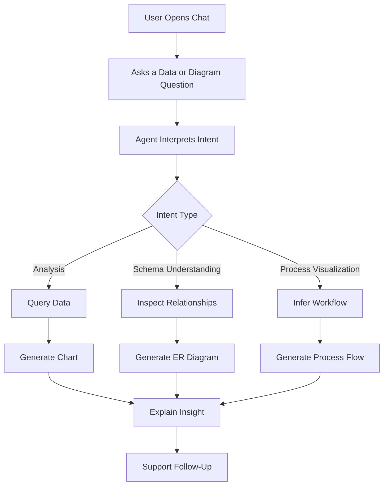

# Blueprint 11: Users and Journeys

## Purpose
This document defines the primary audiences implied by the hackathon brief and maps the interaction journeys that the product must support during demonstration and evaluation.

## Primary User Groups

| User Group | Profile | Primary Need | Blueprint Response |
|-----------|---------|--------------|--------------------|
| Business User | Non-technical participant who wants answers quickly | Ask plain-language data questions without writing SQL | Provide natural conversation, helpful clarifications, and readable charts |
| Technical Reviewer | Judge or mentor inspecting system credibility | Understand how the agent reached an answer | Expose schema awareness, query transparency, and tool rationale |
| Team Operator | Team member running the demo under time pressure | Keep the system stable and predictable | Favor deterministic flows, clear states, and graceful recovery |

## Core User Needs
- Ask questions in everyday language.
- Understand what data the system used.
- See results in a chart or diagram when a visual helps.
- Continue with follow-up questions without restating full context.
- Trust that the system handles errors responsibly.

## Journey 1: Analytical Question to Insight

| Step | User Intent | System Responsibility | Visible Outcome |
|------|-------------|-----------------------|-----------------|
| 1 | Ask a business question | Interpret intent and identify relevant data scope | Processing state and query understanding |
| 2 | Await answer | Retrieve schema context and execute the right query | Returned dataset or summary table |
| 3 | Understand result | Select an appropriate chart | Embedded visualization in chat |
| 4 | Interpret meaning | Generate insight summary | Concise explanation with confidence |
| 5 | Refine answer | Use prior context for follow-up | Continuity without rework |

## Journey 2: Database Understanding

| Step | User Intent | System Responsibility | Visible Outcome |
|------|-------------|-----------------------|-----------------|
| 1 | Ask how data is structured | Discover tables and relationships | Schema-aware response |
| 2 | Request a relationship view | Generate ER-style output | Diagram rendered in chat |
| 3 | Ask impact questions | Explain table relevance | Clear relational explanation |

## Journey 3: Process Visualization

| Step | User Intent | System Responsibility | Visible Outcome |
|------|-------------|-----------------------|-----------------|
| 1 | Ask for a workflow view | Infer process from available entities and logic | Diagram generation state |
| 2 | Review process steps | Produce a readable process flow | Mermaid or SVG flowchart |
| 3 | Clarify exceptions | Explain assumptions and limits | Transparent narrative |

## Journey Map

## Journey Design Implications
- The first response must establish trust quickly because judges will assess value within minutes.
- Visual generation should appear as a natural extension of the answer, not as a separate feature.
- Follow-up handling should preserve filters, entities, and time ranges whenever context remains valid.
- Explanations should surface assumptions whenever schema inference or process inference is involved.
