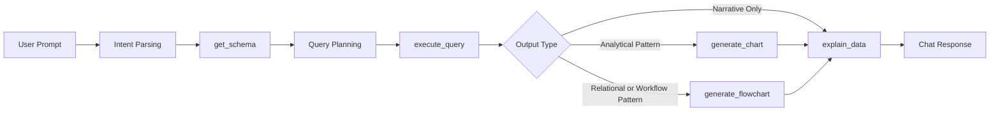

# Blueprint 12: Agent Tools and Responsibilities

## Purpose
This document defines how the required tools from the brief should behave as a coordinated operating layer for the LLM agent. The objective is to make each tool modular, interpretable, and reliable during live use.

## Required Tool Set

| Tool | Core Responsibility | Typical Trigger | Expected Result |
|------|---------------------|-----------------|-----------------|
| `get_schema` | Retrieve table, column, and relationship context | New analytical question or schema request | Structured schema description |
| `execute_query` | Run validated database queries | Data retrieval request | Tabular or JSON result set |
| `generate_chart` | Convert result data into a chart | Comparative, trend, or composition questions | Rendered chart suitable for chat |
| `generate_flowchart` | Produce ER or process diagrams | Relationship or workflow questions | Mermaid or SVG diagram |
| `explain_data` | Turn data and visuals into a clear narrative | Every result that needs interpretation | Grounded natural-language explanation |

## Tool Design Principles
- Keep tool responsibilities narrow so the agent can select them predictably.
- Return structured outputs that can feed subsequent tools without manual reshaping.
- Include interpretable status information to support recovery paths.
- Preserve traceability between user question, chosen action, and final answer.

## Tool Orchestration Rules
- Use `get_schema` before generating or validating a database query when the intent depends on structure awareness.
- Use `execute_query` only after the requested metric, filters, and grouping logic are sufficiently clear.
- Use `generate_chart` only when the result contains enough shape and volume to benefit from visualization.
- Use `generate_flowchart` for schema relationships, workflows, or inferred process explanations.
- Use `explain_data` after data retrieval or visualization generation so the final answer is interpretable.

## Recovery Expectations

| Failure Scenario | Preferred Agent Response |
|------------------|--------------------------|
| Ambiguous question | Ask a focused clarification before querying |
| Missing table or field | Re-check schema and propose the nearest supported alternative |
| Empty result set | State that no matching records were found and suggest refinement |
| Visualization mismatch | Fall back to tabular explanation and recommend a better chart type |
| Diagram inference uncertainty | Present assumptions explicitly before rendering |

## Tool Interaction Blueprint

## Acceptance Signals
- All five required tools are demonstrably usable during the demo.
- Tool outputs connect cleanly from one stage to the next.
- The user can understand why the agent selected a specific tool path.
- Failure handling keeps the conversation moving instead of ending abruptly.
