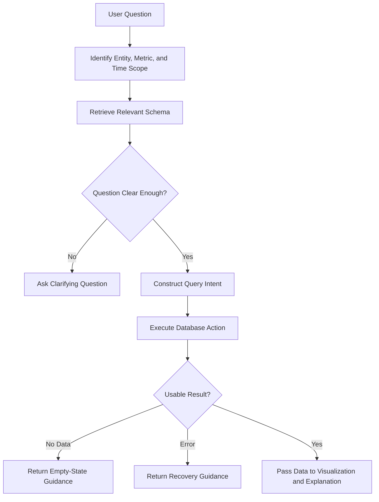

# Blueprint 13: Data Access and Query Workflow

## Purpose
This document establishes how the system should interact with databases in a trustworthy, explainable, and demo-friendly manner while remaining faithful to the brief's emphasis on schema discovery, query generation, and execution.

## Data Access Objectives
- Support the provided SQLite dataset as the default demonstration source.
- Preserve a design that can extend to PostgreSQL, MySQL, or MongoDB if time allows.
- Separate schema understanding from query execution so the agent remains explainable.
- Maintain result formats that can feed both visualization and narrative stages.

## Recommended Query Lifecycle

| Phase | Goal | Output |
|------|------|--------|
| Schema Discovery | Understand entities, fields, and relationships | Structured schema context |
| Intent Framing | Translate the user request into data operations | Validated analytical intent |
| Query Construction | Formulate the database operation | Executable query representation |
| Query Execution | Retrieve matching records or aggregates | Structured result set |
| Result Validation | Confirm relevance, completeness, and emptiness states | Reliable downstream input |
| Explanation and Visualization | Turn data into user-facing insight | Chart, diagram, or summary |

## Data Governance Expectations
- Expose query intent clearly enough that users and judges can follow the reasoning.
- Prevent silent failures by surfacing unsupported requests and missing fields explicitly.
- Preserve user trust by distinguishing returned facts from inferred commentary.
- Keep context on previously used entities, filters, and time ranges to support follow-up prompts.

## Multi-Turn Context Rules
- Carry forward the active dataset subject unless the user changes topic.
- Reuse previously referenced products, customers, or date windows where appropriate.
- Refresh schema context when the user asks about a new domain or relationship set.
- Confirm assumptions when a follow-up could refer to more than one prior result.

## Query Workflow

## Blueprint Decisions
- The sample database should anchor the first demo path because reliability matters more than breadth.
- Query transparency should be treated as a trust feature and a bonus opportunity.
- Result validation should happen before visualization so the system does not render misleading charts.
- Empty results should still produce helpful next-step suggestions.

## Readiness Criteria
- The agent can answer the brief's sample sales-analysis question.
- The agent can inspect database relationships before drawing an ER view.
- The agent can handle an empty or malformed request without breaking the session.
