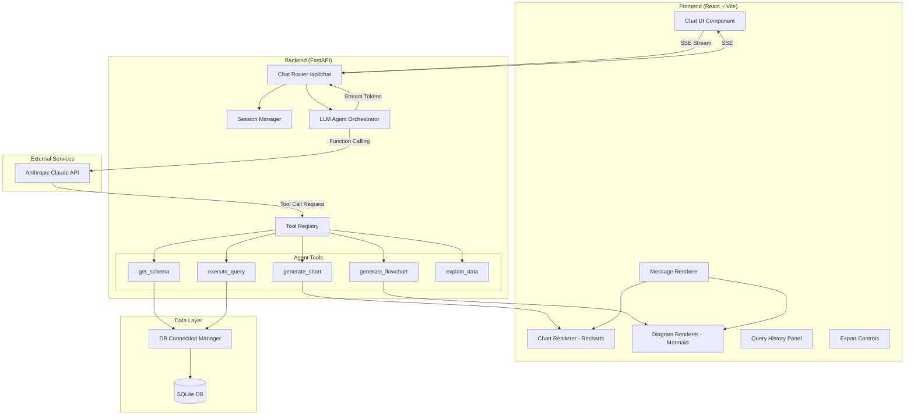
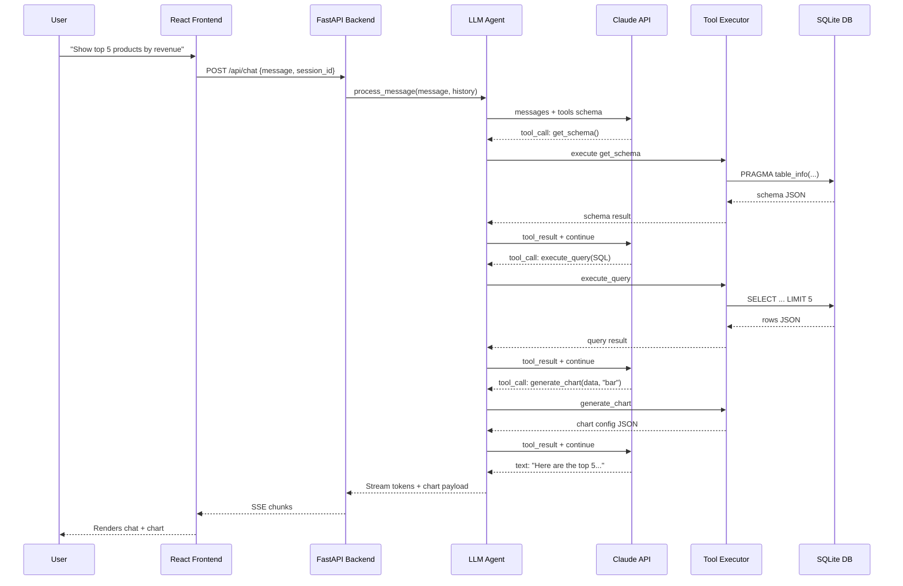
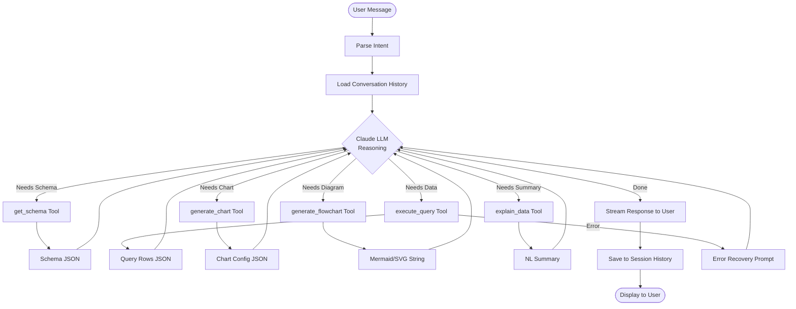
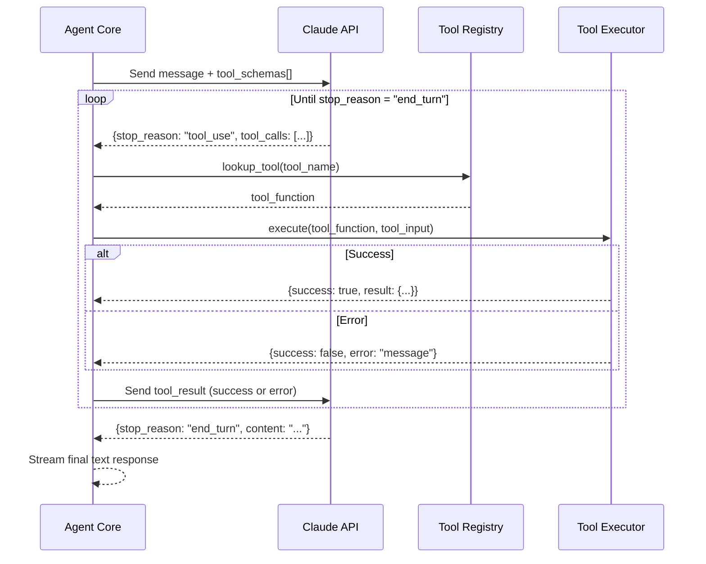
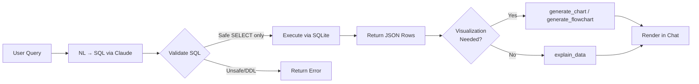
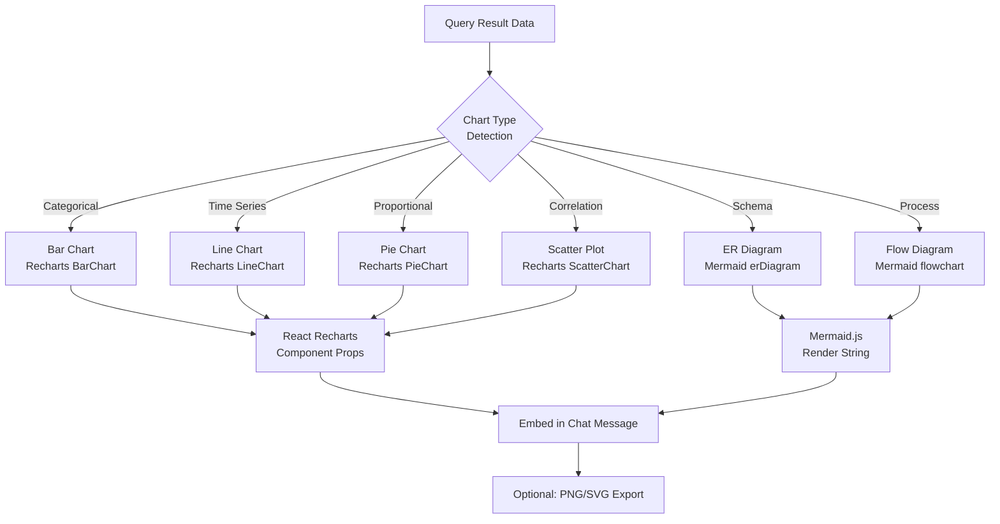
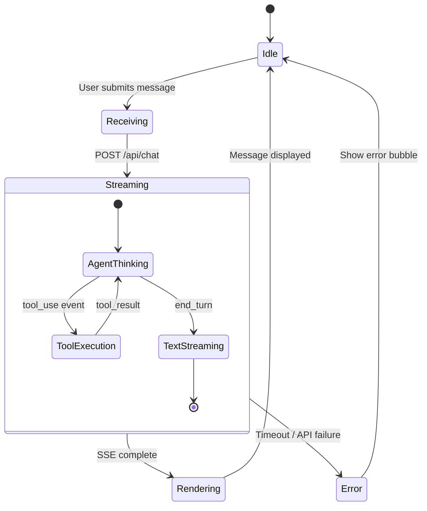
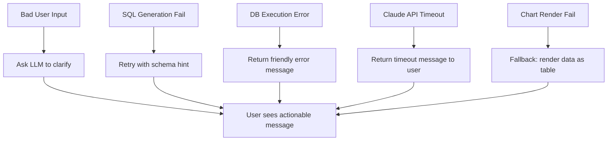

# 01 — System Architecture
## iTech AI Innovation Hackathon 2026

---

## 1. High-Level Architecture

The system follows a **3-tier conversational AI architecture**:

```
┌─────────────────────────────────────────────────────────┐
│                    USER BROWSER                          │
│              React Chat Interface (Vite)                 │
└─────────────────────┬───────────────────────────────────┘
                      │ HTTP/SSE (streaming)
┌─────────────────────▼───────────────────────────────────┐
│                  FASTAPI BACKEND                         │
│           Agent Orchestration Layer                      │
│  ┌──────────────┐  ┌──────────────┐  ┌───────────────┐ │
│  │ Chat Router  │  │ Tool Registry│  │ Session Store │ │
│  └──────┬───────┘  └──────┬───────┘  └───────────────┘ │
│         │                 │                              │
│  ┌──────▼─────────────────▼──────────────────────────┐ │
│  │              LLM Agent Core                        │ │
│  │    (Anthropic Claude + Function Calling)           │ │
│  └──────┬───────────────────────────────────────────┘  │
│         │ Tool Calls                                     │
│  ┌──────▼────────────────────────────────────────────┐ │
│  │              Tool Execution Layer                  │ │
│  │  get_schema │ execute_query │ generate_chart       │ │
│  │  generate_flowchart │ explain_data                 │ │
│  └──────┬────────────────────────────────────────────┘  │
└─────────┼───────────────────────────────────────────────┘
          │
┌─────────▼───────────────────────────────────────────────┐
│                  DATA LAYER                              │
│              SQLite (e-commerce DB)                      │
│    orders | products | customers | inventory             │
└─────────────────────────────────────────────────────────┘
```

---

## 2. Component Diagram



---

## 3. Data Flow Diagram



---

## 4. Agent Workflow



---

## 5. Tool Calling Workflow



---

## 6. Database Flow



---

## 7. Visualization Flow



---

## 8. Request Lifecycle



---

## 9. Error Flow



---

## 10. Security Architecture

- All DB queries validated as `SELECT`-only (no DDL/DML)
- API keys loaded from `.env` via `python-dotenv`
- CORS restricted to frontend origin
- Input sanitized before passing to SQL executor
- No user data persisted beyond session lifetime
