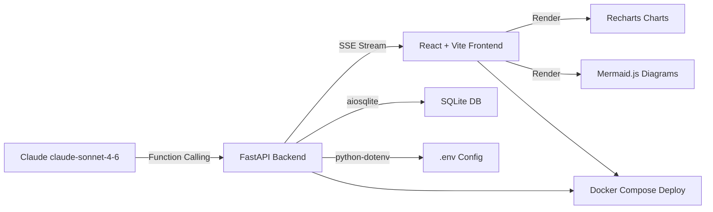

# 02 — Tech Stack Decision
## iTech AI Innovation Hackathon 2026

---

## 1. Decision Framework

All technology choices are evaluated against three hackathon-specific criteria:
1. **Speed** — Can we ship it in 7 days with 2 developers?
2. **Score Impact** — Does it maximize our evaluation rubric?
3. **Reliability** — Will it demo without crashing?

---

## 2. Recommended Tech Stack

| Layer | Technology | Version |
|-------|-----------|---------|
| LLM Provider | Anthropic Claude (claude-sonnet-4-6) | Latest |
| Backend Framework | FastAPI (Python) | 0.111+ |
| Frontend Framework | React + Vite | React 18 |
| Chart Library | Recharts | 2.x |
| Diagram Library | Mermaid.js | 10.x |
| Database | SQLite (provided sample DB) | 3.x |
| DB Driver | aiosqlite + sqlite3 | Latest |
| Streaming | Server-Sent Events (SSE) | — |
| Styling | Tailwind CSS | 3.x |
| Deployment | Docker + docker-compose | Latest |
| Environment Config | python-dotenv | Latest |

---

## 3. Why Each Technology Was Selected

### 3.1 LLM Provider: Anthropic Claude (claude-sonnet-4-6)

**Why chosen:**
- Listed as an approved provider in the hackathon brief
- Claude's function calling (tool_use) is best-in-class for structured tool invocation
- 200K context window handles large schemas and long conversations
- Native streaming via SSE — critical for chat UX score
- JSON tool output is precise and parseable with low hallucination rate

**Alternative considered:** OpenAI GPT-4
**Why rejected:** Claude's tool-use schema is more reliable for multi-step agentic workflows; Anthropic API is equally accessible

---

### 3.2 Backend: FastAPI (Python)

**Why chosen:**
- Native async support — essential for SSE streaming and concurrent tool execution
- Automatic OpenAPI docs (helps with README and judging demos)
- Python ecosystem is richest for DB connectors, data processing, and AI libraries
- `StreamingResponse` makes SSE trivial to implement
- Fastest Python framework to scaffold

**Alternative considered:** Node.js (Express)
**Why rejected:** Python has better native SQLite support, cleaner LLM SDK integration, and both developers are more productive in Python for AI tasks

**Alternative considered:** Flask
**Why rejected:** Flask lacks native async — streaming requires workarounds; FastAPI is strictly better here

---

### 3.3 Frontend: React + Vite

**Why chosen:**
- React is the gold standard for chat UIs (closest to ChatGPT architecture)
- Vite provides instant HMR — development speed matters at a hackathon
- Component-based architecture maps perfectly to "message bubble with embedded chart"
- Recharts and Mermaid.js have excellent React integration
- Both developers likely familiar

**Alternative considered:** Streamlit
**Why rejected:** Streamlit produces generic-looking UIs — poor UX score; limited chart customization; not suitable for a polished streaming chat interface

**Alternative considered:** Vue.js
**Why rejected:** React ecosystem has more chart/UI component options; team velocity is better

---

### 3.4 Charts: Recharts

**Why chosen:**
- Built for React — renders as native React components (no DOM manipulation)
- Supports all required chart types: BarChart, LineChart, PieChart, ScatterChart
- Responsive by default — works on mobile
- Beautiful default styles; easy to theme with Tailwind
- Used in production at scale — reliable for demo

**Alternative considered:** Chart.js
**Why rejected:** Requires canvas DOM refs in React — messy integration; Recharts is purpose-built for React

**Alternative considered:** Plotly
**Why rejected:** Heavy bundle size; overkill for this use case; slower render

**Alternative considered:** D3.js
**Why rejected:** Too low-level; would cost days of dev time for chart customization

---

### 3.5 Diagrams: Mermaid.js

**Why chosen:**
- Explicitly mentioned as an option in the hackathon brief
- Claude LLM can generate Mermaid syntax natively (it's in training data)
- ER diagrams, flowcharts, and sequence diagrams all supported out of the box
- Text-based — LLM can write Mermaid code, frontend renders it (no server-side image gen)
- React integration via `@mermaid-js/mermaid-react`

**Alternative considered:** Graphviz
**Why rejected:** Requires server-side rendering; complex setup; not web-native

**Alternative considered:** Draw.io API
**Why rejected:** Complex API; not designed for dynamic LLM-generated content

---

### 3.6 Database: SQLite

**Why chosen:**
- The hackathon explicitly provides an SQLite sample DB
- Zero setup — file-based, no DB server needed
- Python's `sqlite3` is in stdlib — no extra install
- `aiosqlite` gives async support for FastAPI
- Perfect for demo reliability (no connection pool issues)

**Alternative considered:** PostgreSQL
**Why rejected:** Not needed; overkill for hackathon scope; adds Docker complexity

---

### 3.7 Streaming: Server-Sent Events (SSE)

**Why chosen:**
- Natively supported by FastAPI's `StreamingResponse`
- Browser-native `EventSource` API — no library needed on frontend
- One-way server→client push is exactly what streaming chat requires
- Simpler than WebSocket for this use case

**Alternative considered:** WebSocket
**Why rejected:** Bidirectional — more complex to manage; SSE is simpler and sufficient

---

### 3.8 Styling: Tailwind CSS

**Why chosen:**
- Fastest way to build a polished chat UI that looks professional
- Utility-first — no context switching between CSS files
- Dark mode support out of the box (makes the app look like ChatGPT)
- Good default typography for markdown rendering

---

## 4. Tradeoffs Summary

| Decision | Tradeoff Accepted |
|----------|-----------------|
| SQLite over PostgreSQL | No multi-DB support by default (address with bonus feature) |
| SSE over WebSocket | Unidirectional only (sufficient for chat) |
| Recharts over D3 | Less customization ceiling, but much faster to ship |
| FastAPI over Flask | Steeper initial setup, but async is worth it |
| React over Streamlit | More code to write, but significantly better UX score |

---

## 5. Final Decision Summary

This stack maximizes:
- **Development velocity** (familiar tools, minimal boilerplate)
- **Demo reliability** (SQLite = no infra failures, Docker = consistent environment)
- **Evaluation score** (React chat UI scores highest on UX rubric; Claude tool_use scores highest on functionality)
