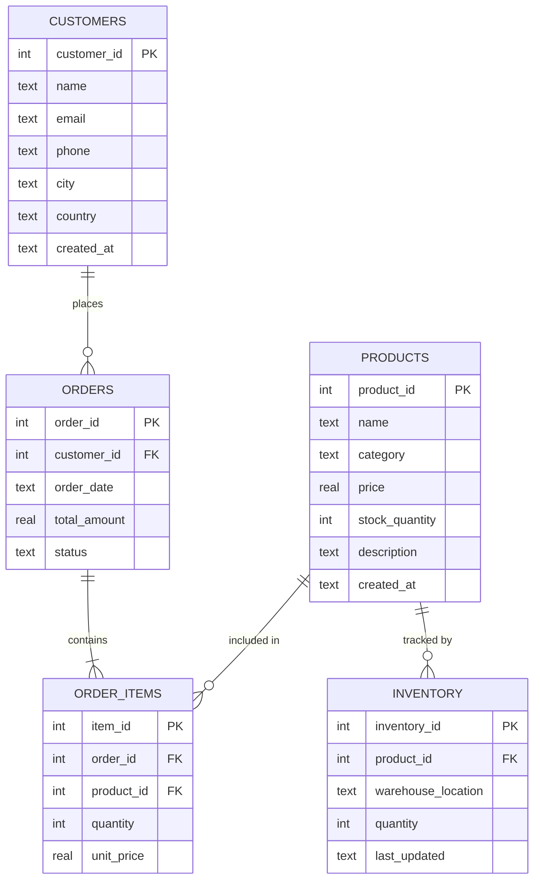

# 04 — Database Design
## iTech AI Innovation Hackathon 2026

---

## 1. Database Selection

**Chosen:** SQLite (provided e-commerce sample database)

**Rationale:**
- Provided by hackathon organizers — zero setup time
- File-based — no server process, no connection failures during demo
- Python `sqlite3` stdlib + `aiosqlite` for async FastAPI integration
- Supports full SQL SELECT queries — adequate for all demo use cases

**File path:** `database/ecommerce.sqlite`

---

## 2. Schema Overview

The provided e-commerce database contains 4 core tables:

| Table | Purpose | Key Fields |
|-------|---------|-----------|
| `customers` | Customer registry | customer_id, name, email, city, country |
| `products` | Product catalog | product_id, name, category, price, stock_quantity |
| `orders` | Order transactions | order_id, customer_id, order_date, total_amount, status |
| `order_items` | Order line items | item_id, order_id, product_id, quantity, unit_price |
| `inventory` | Stock levels | inventory_id, product_id, warehouse_location, quantity, last_updated |

*(Note: Exact column names may vary from provided DB. The `get_schema` tool auto-discovers the real schema at runtime.)*

---

## 3. Table Definitions (Expected Schema)

### 3.1 `customers`
```sql
CREATE TABLE customers (
    customer_id   INTEGER PRIMARY KEY AUTOINCREMENT,
    name          TEXT    NOT NULL,
    email         TEXT    UNIQUE NOT NULL,
    phone         TEXT,
    city          TEXT,
    country       TEXT    DEFAULT 'India',
    created_at    TEXT    DEFAULT (datetime('now'))
);
```

### 3.2 `products`
```sql
CREATE TABLE products (
    product_id    INTEGER PRIMARY KEY AUTOINCREMENT,
    name          TEXT    NOT NULL,
    category      TEXT    NOT NULL,
    price         REAL    NOT NULL,
    stock_quantity INTEGER DEFAULT 0,
    description   TEXT,
    created_at    TEXT    DEFAULT (datetime('now'))
);
```

### 3.3 `orders`
```sql
CREATE TABLE orders (
    order_id      INTEGER PRIMARY KEY AUTOINCREMENT,
    customer_id   INTEGER NOT NULL,
    order_date    TEXT    NOT NULL,
    total_amount  REAL    NOT NULL,
    status        TEXT    CHECK(status IN ('pending','processing','shipped','delivered','cancelled')),
    FOREIGN KEY (customer_id) REFERENCES customers(customer_id)
);
```

### 3.4 `order_items`
```sql
CREATE TABLE order_items (
    item_id       INTEGER PRIMARY KEY AUTOINCREMENT,
    order_id      INTEGER NOT NULL,
    product_id    INTEGER NOT NULL,
    quantity      INTEGER NOT NULL,
    unit_price    REAL    NOT NULL,
    FOREIGN KEY (order_id)   REFERENCES orders(order_id),
    FOREIGN KEY (product_id) REFERENCES products(product_id)
);
```

### 3.5 `inventory`
```sql
CREATE TABLE inventory (
    inventory_id       INTEGER PRIMARY KEY AUTOINCREMENT,
    product_id         INTEGER NOT NULL,
    warehouse_location TEXT,
    quantity           INTEGER DEFAULT 0,
    last_updated       TEXT    DEFAULT (datetime('now')),
    FOREIGN KEY (product_id) REFERENCES products(product_id)
);
```

---

## 4. Entity-Relationship Diagram



---

## 5. Relationships

| Relationship | Type | Description |
|-------------|------|-------------|
| customers → orders | One-to-Many | A customer can place many orders |
| orders → order_items | One-to-Many | An order contains multiple line items |
| products → order_items | One-to-Many | A product can appear in many order lines |
| products → inventory | One-to-Many | A product can be in multiple warehouses |

---

## 6. Required Demo Queries

These queries must be tested and confirmed working before demo day:

### Q1: Top 5 Products by Revenue
```sql
SELECT 
    p.name AS product_name,
    SUM(oi.quantity * oi.unit_price) AS total_revenue
FROM order_items oi
JOIN products p ON oi.product_id = p.product_id
GROUP BY p.product_id, p.name
ORDER BY total_revenue DESC
LIMIT 5;
```

### Q2: Monthly Revenue Trend (Last 12 Months)
```sql
SELECT 
    strftime('%Y-%m', order_date) AS month,
    SUM(total_amount) AS revenue
FROM orders
WHERE order_date >= date('now', '-12 months')
  AND status != 'cancelled'
GROUP BY month
ORDER BY month ASC;
```

### Q3: Order Status Distribution (Pie Chart)
```sql
SELECT 
    status,
    COUNT(*) AS count
FROM orders
GROUP BY status
ORDER BY count DESC;
```

### Q4: Revenue by Product Category (Bar Chart)
```sql
SELECT 
    p.category,
    SUM(oi.quantity * oi.unit_price) AS revenue
FROM order_items oi
JOIN products p ON oi.product_id = p.product_id
GROUP BY p.category
ORDER BY revenue DESC;
```

### Q5: Low Stock Products
```sql
SELECT 
    p.name,
    p.stock_quantity,
    i.warehouse_location
FROM products p
JOIN inventory i ON p.product_id = i.product_id
WHERE p.stock_quantity < 20
ORDER BY p.stock_quantity ASC;
```

### Q6: Top Customers by Spend
```sql
SELECT 
    c.name,
    COUNT(o.order_id) AS total_orders,
    SUM(o.total_amount) AS total_spent
FROM customers c
JOIN orders o ON c.customer_id = o.customer_id
GROUP BY c.customer_id, c.name
ORDER BY total_spent DESC
LIMIT 10;
```

---

## 7. DB Connection Manager Design

```python
# db/connection.py
import aiosqlite
import os

DB_PATH = os.getenv("DATABASE_PATH", "../database/ecommerce.sqlite")

async def get_connection():
    """Return an async SQLite connection."""
    return await aiosqlite.connect(DB_PATH)

async def execute_safe_query(sql: str) -> dict:
    """Execute a validated SELECT query and return JSON-serializable result."""
    async with aiosqlite.connect(DB_PATH) as db:
        db.row_factory = aiosqlite.Row
        async with db.execute(sql) as cursor:
            rows = await cursor.fetchall()
            columns = [desc[0] for desc in cursor.description]
            return {
                "columns": columns,
                "rows": [dict(row) for row in rows],
                "row_count": len(rows)
            }
```

---

## 8. SQL Validator Design

```python
# db/validator.py
import re

FORBIDDEN_KEYWORDS = ['INSERT', 'UPDATE', 'DELETE', 'DROP', 'CREATE', 
                       'ALTER', 'TRUNCATE', 'EXEC', 'EXECUTE']

def validate_sql(sql: str) -> tuple[bool, str]:
    """
    Validates that SQL is a safe SELECT statement.
    Returns (is_valid, error_message).
    """
    sql_upper = sql.upper().strip()
    
    if not sql_upper.startswith('SELECT'):
        return False, "Only SELECT queries are allowed."
    
    for keyword in FORBIDDEN_KEYWORDS:
        if re.search(r'\b' + keyword + r'\b', sql_upper):
            return False, f"Forbidden keyword detected: {keyword}"
    
    return True, ""
```

---

## 9. Index Suggestions

For optimal query performance during demo:

```sql
CREATE INDEX IF NOT EXISTS idx_orders_customer   ON orders(customer_id);
CREATE INDEX IF NOT EXISTS idx_orders_date        ON orders(order_date);
CREATE INDEX IF NOT EXISTS idx_order_items_order  ON order_items(order_id);
CREATE INDEX IF NOT EXISTS idx_order_items_product ON order_items(product_id);
CREATE INDEX IF NOT EXISTS idx_inventory_product  ON inventory(product_id);
```
