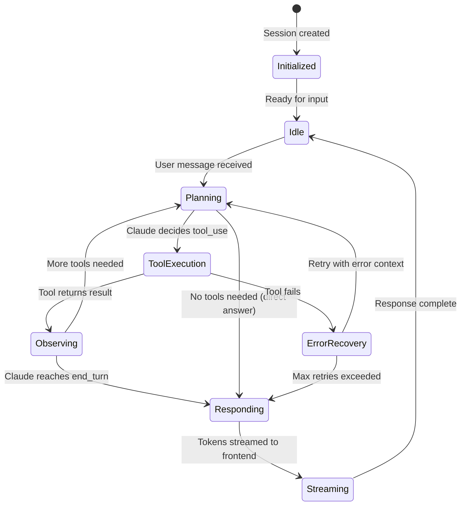
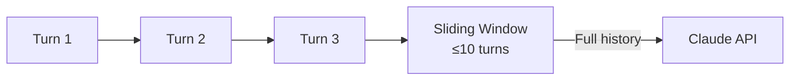
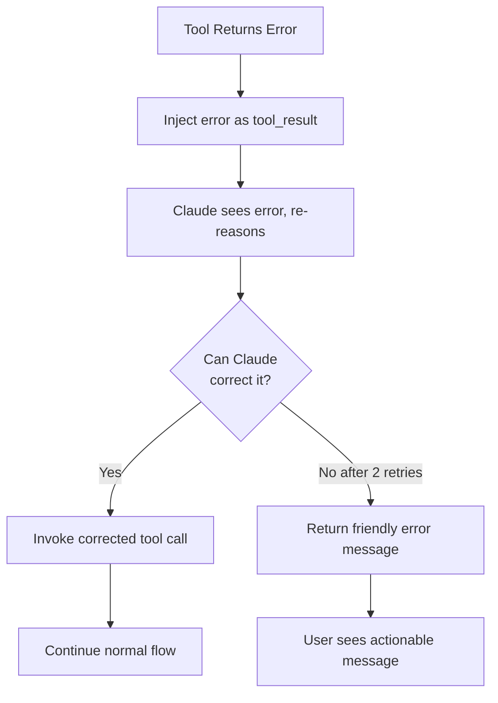
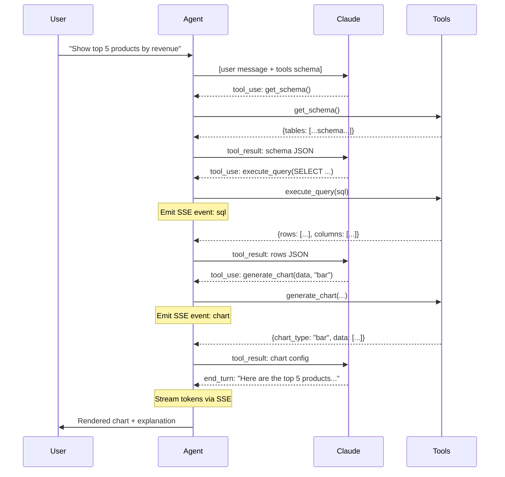

# 06 — Agent Architecture
## iTech AI Innovation Hackathon 2026

---

## 1. Agent Overview

The LLM Agent is the brain of the system. It uses **Anthropic Claude's native tool_use (function calling)** capability to iteratively reason, invoke tools, observe results, and produce a final response — all within a single user turn.

**Agent Type:** ReAct-style (Reason + Act) loop using Claude's built-in tool_use protocol  
**Framework:** Custom implementation (no LangChain overhead — faster, more controllable)  
**LLM:** `claude-sonnet-4-6` via Anthropic Python SDK  

---

## 2. Agent Lifecycle



---

## 3. Prompt Flow

### 3.1 System Prompt

```
You are DataFlow AI, an expert data analyst assistant. You help users explore 
and visualize database data through natural conversation.

You have access to these tools:
- get_schema: Discover database tables and column structures
- execute_query: Run SELECT SQL queries against the database
- generate_chart: Create data visualizations (bar, line, pie, scatter)
- generate_flowchart: Create ER diagrams and process flow diagrams
- explain_data: Produce natural language insights from query results

RULES:
1. Always call get_schema first if you don't know the table structure.
2. Always show the SQL you're using (include it in your response before results).
3. Generate a chart when presenting numerical data comparisons or trends.
4. Generate an ER diagram when asked about database structure.
5. If a query fails, explain what went wrong and try a corrected version.
6. Keep explanations concise and business-focused.
7. Only use SELECT statements — never modify data.

Current database: E-commerce dataset (orders, products, customers, inventory)
```

### 3.2 Message Construction Per Turn

```python
def build_messages(session: Session, user_message: str) -> list:
    messages = []
    
    # Include conversation history (last N turns for context window management)
    for msg in session.get_recent_history(max_turns=10):
        messages.append({
            "role": msg.role,
            "content": msg.content
        })
    
    # Append current user message
    messages.append({
        "role": "user",
        "content": user_message
    })
    
    return messages
```

---

## 4. Memory Strategy

### 4.1 In-Session Memory (Conversation History)



- Stored in-memory on the backend (`session.py` → Python dict keyed by `session_id`)
- Sliding window: last **10 user+assistant turns** included in each API call
- Tool results are included as `tool_result` blocks within the history
- No database persistence (hackathon scope — session dies when server restarts)

### 4.2 Schema Cache

- `get_schema` result cached per session after first call
- Avoids redundant DB introspection on every turn
- Invalidated when session is cleared

### 4.3 Context Window Budget

| Component | Tokens (estimate) |
|-----------|------------------|
| System prompt | ~300 |
| Conversation history (10 turns) | ~8,000 |
| Tool schemas | ~1,500 |
| Current user message | ~100 |
| Claude response + tool calls | up to 4,096 |
| **Total** | ~14,000 of 200K limit ✅ |

---

## 5. Context Handling

### 5.1 Tool Result Injection

When a tool executes, its result is injected back into the message array as a `tool_result` block, which Claude reads before deciding the next step:

```python
# After tool execution
messages.append({
    "role": "assistant",
    "content": [
        {
            "type": "tool_use",
            "id": tool_call.id,
            "name": tool_call.name,
            "input": tool_call.input
        }
    ]
})

messages.append({
    "role": "user",
    "content": [
        {
            "type": "tool_result",
            "tool_use_id": tool_call.id,
            "content": json.dumps(tool_result)
        }
    ]
})
```

### 5.2 Schema Injection into System Prompt (Optional)

For complex queries, the schema JSON can be appended to the system prompt:
```
...
Available Tables:
customers(customer_id, name, email, city, country)
products(product_id, name, category, price, stock_quantity)
orders(order_id, customer_id, order_date, total_amount, status)
order_items(item_id, order_id, product_id, quantity, unit_price)
inventory(inventory_id, product_id, warehouse_location, quantity)
```

---

## 6. Tool Calling Protocol

### 6.1 Tool Schema Registration

All tools are registered with Claude using the Anthropic `tools` parameter:

```python
TOOLS = [
    {
        "name": "get_schema",
        "description": "Retrieve the database schema including tables, columns, and types.",
        "input_schema": {
            "type": "object",
            "properties": {
                "table_filter": {
                    "type": "string",
                    "description": "Optional: filter to a specific table name. Leave empty for full schema."
                }
            },
            "required": []
        }
    },
    # ... other tools
]
```

### 6.2 Agent Loop (Core Logic)

```python
async def run_agent(session_id: str, user_message: str, stream_callback):
    session = session_manager.get_or_create(session_id)
    messages = build_messages(session, user_message)
    
    max_tool_iterations = 8  # Prevent infinite loops
    iteration = 0
    
    while iteration < max_tool_iterations:
        response = await anthropic_client.messages.create(
            model=MODEL,
            max_tokens=4096,
            system=SYSTEM_PROMPT,
            tools=TOOLS,
            messages=messages
        )
        
        if response.stop_reason == "end_turn":
            # Stream final text to frontend
            for block in response.content:
                if block.type == "text":
                    await stream_callback("token", {"content": block.text})
            break
        
        elif response.stop_reason == "tool_use":
            for block in response.content:
                if block.type == "tool_use":
                    await stream_callback("tool_start", {"tool": block.name})
                    
                    # Execute tool
                    result = await tool_registry.execute(block.name, block.input)
                    
                    await stream_callback("tool_end", {
                        "tool": block.name, 
                        "success": result.get("success", True)
                    })
                    
                    # Emit chart/diagram events to frontend
                    if block.name == "generate_chart":
                        await stream_callback("chart", result)
                    elif block.name == "generate_flowchart":
                        await stream_callback("diagram", result)
                    elif block.name == "execute_query" and session.options.show_sql:
                        await stream_callback("sql", {"content": block.input.get("sql")})
                    
                    # Inject tool result back into conversation
                    messages = inject_tool_result(messages, response, block.id, result)
        
        iteration += 1
    
    # Save to session history
    session.add_turn(user_message, final_text)
    await stream_callback("done", {"message_id": generate_id()})
```

---

## 7. Error Recovery Strategy



**Error messages injected to Claude look like:**
```json
{
  "success": false,
  "error": "SQL syntax error near 'FORM': expected FROM",
  "hint": "Check table name spelling. Available tables: customers, products, orders, order_items, inventory"
}
```

---

## 8. Conversation Flow (Sample)



---

## 9. Agent Configuration

```python
# agent/orchestrator.py — Configuration constants

MODEL = os.getenv("MODEL", "claude-sonnet-4-6")
MAX_TOKENS = int(os.getenv("MAX_TOKENS", "4096"))
MAX_TOOL_ITERATIONS = 8
MAX_HISTORY_TURNS = 10
TOOL_TIMEOUT_SECONDS = 30

SYSTEM_PROMPT = """..."""  # See section 3.1
```
