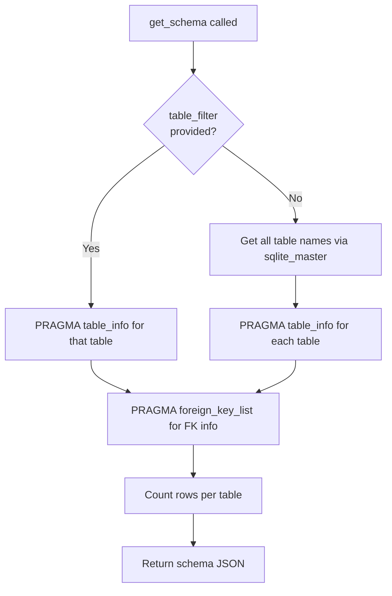
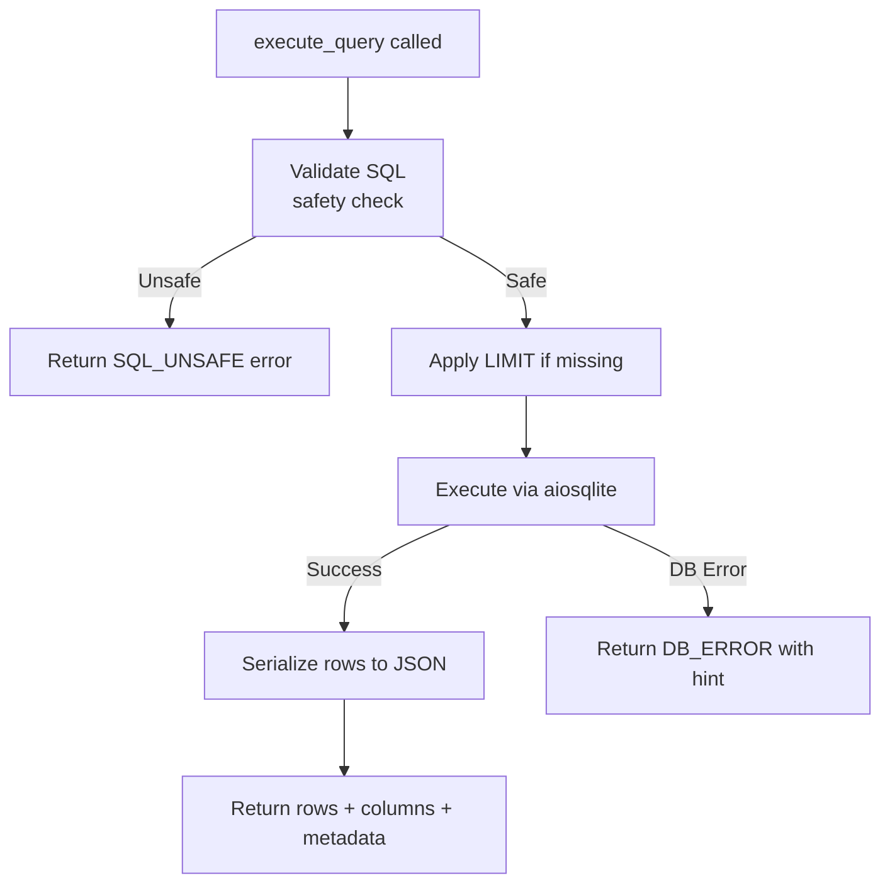
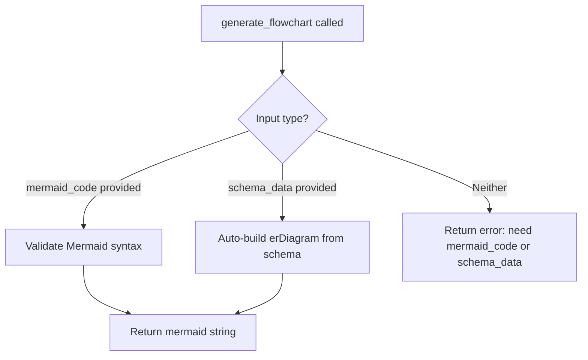

# 07 — Tool Specifications
## iTech AI Innovation Hackathon 2026

---

## Overview

Five tools are required by the hackathon spec. Each tool is a Python async function registered with Claude via the `tools` parameter. This document specifies every tool's purpose, inputs, outputs, JSON schema, error handling, execution flow, dependencies, validation rules, and return format.

---

## Tool 1: `get_schema`

### Purpose
Retrieve the complete database schema including all tables, columns, data types, primary keys, and foreign key relationships. This is typically the **first tool Claude calls** to understand what data is available.

### Inputs
| Parameter | Type | Required | Description |
|-----------|------|----------|-------------|
| `table_filter` | string | ❌ | Filter to a specific table name. Omit for full schema. |

### JSON Schema (for Claude tool registration)
```json
{
  "name": "get_schema",
  "description": "Retrieve the database schema — all tables, columns, types, primary keys, and foreign keys. Call this first before writing any SQL.",
  "input_schema": {
    "type": "object",
    "properties": {
      "table_filter": {
        "type": "string",
        "description": "Optional table name to get schema for a single table. Leave empty for all tables."
      }
    },
    "required": []
  }
}
```

### Execution Flow


### Return Format (Success)
```json
{
  "success": true,
  "tables": [
    {
      "name": "products",
      "columns": [
        {"name": "product_id", "type": "INTEGER", "pk": true, "nullable": false},
        {"name": "name", "type": "TEXT", "pk": false, "nullable": false},
        {"name": "category", "type": "TEXT", "pk": false, "nullable": false},
        {"name": "price", "type": "REAL", "pk": false, "nullable": false},
        {"name": "stock_quantity", "type": "INTEGER", "pk": false, "nullable": true}
      ],
      "row_count": 150,
      "foreign_keys": []
    }
  ],
  "total_tables": 5
}
```

### Error Handling
```json
{
  "success": false,
  "error": "Table 'xyz' not found in database.",
  "available_tables": ["customers", "products", "orders", "order_items", "inventory"]
}
```

### Dependencies
- `aiosqlite`
- `db/connection.py`

### Validation Rules
- If `table_filter` is provided and doesn't exist, return error with available table names

### Implementation Skeleton
```python
# tools/get_schema.py
import aiosqlite
from db.connection import DB_PATH

async def get_schema(table_filter: str = "") -> dict:
    async with aiosqlite.connect(DB_PATH) as db:
        if table_filter:
            tables_to_inspect = [table_filter]
        else:
            async with db.execute(
                "SELECT name FROM sqlite_master WHERE type='table' ORDER BY name"
            ) as cur:
                tables_to_inspect = [row[0] for row in await cur.fetchall()]
        
        tables = []
        for table_name in tables_to_inspect:
            # Get columns
            async with db.execute(f"PRAGMA table_info({table_name})") as cur:
                cols = await cur.fetchall()
            # Get FK info
            async with db.execute(f"PRAGMA foreign_key_list({table_name})") as cur:
                fks = await cur.fetchall()
            # Get row count
            async with db.execute(f"SELECT COUNT(*) FROM {table_name}") as cur:
                count = (await cur.fetchone())[0]
            
            tables.append({
                "name": table_name,
                "columns": [
                    {"name": c[1], "type": c[2], "pk": bool(c[5]), "nullable": not c[3]}
                    for c in cols
                ],
                "row_count": count,
                "foreign_keys": [{"from": fk[3], "table": fk[2], "to": fk[4]} for fk in fks]
            })
        
        return {"success": True, "tables": tables, "total_tables": len(tables)}
```

---

## Tool 2: `execute_query`

### Purpose
Execute a safe SQL SELECT query against the database and return results as structured JSON. This is the core data retrieval tool — Claude generates the SQL, this tool runs it.

### Inputs
| Parameter | Type | Required | Description |
|-----------|------|----------|-------------|
| `sql` | string | ✅ | The SELECT SQL query to execute |
| `limit` | integer | ❌ | Max rows to return (default: 100, max: 1000) |

### JSON Schema
```json
{
  "name": "execute_query",
  "description": "Execute a SQL SELECT query against the e-commerce database. Only SELECT is allowed — no INSERT, UPDATE, DELETE, or DDL. Returns rows as JSON.",
  "input_schema": {
    "type": "object",
    "properties": {
      "sql": {
        "type": "string",
        "description": "The complete SQL SELECT statement to execute."
      },
      "limit": {
        "type": "integer",
        "description": "Maximum number of rows to return. Default 100.",
        "default": 100
      }
    },
    "required": ["sql"]
  }
}
```

### Execution Flow


### Return Format (Success)
```json
{
  "success": true,
  "sql_executed": "SELECT p.name, SUM(oi.quantity * oi.unit_price) AS revenue FROM ...",
  "columns": ["name", "revenue"],
  "rows": [
    {"name": "Product A", "revenue": 45200.00},
    {"name": "Product B", "revenue": 38100.50}
  ],
  "row_count": 5,
  "truncated": false
}
```

### Error Handling
```json
{
  "success": false,
  "error": "no such table: prodcts",
  "hint": "Did you mean 'products'? Available tables: customers, products, orders, order_items, inventory",
  "sql_attempted": "SELECT * FROM prodcts"
}
```

### Dependencies
- `aiosqlite`, `db/connection.py`, `db/validator.py`

### Validation Rules
- SQL must start with `SELECT`
- Forbidden keywords: `INSERT`, `UPDATE`, `DELETE`, `DROP`, `CREATE`, `ALTER`, `TRUNCATE`
- Auto-append `LIMIT {limit}` if not present in query
- Max rows cap: 1000

---

## Tool 3: `generate_chart`

### Purpose
Given query result data, generate a chart configuration object that the React frontend renders using Recharts. This tool **does not render** — it produces a JSON config that tells the frontend what to draw.

### Inputs
| Parameter | Type | Required | Description |
|-----------|------|----------|-------------|
| `chart_type` | string | ✅ | `"bar"`, `"line"`, `"pie"`, `"scatter"` |
| `data` | array | ✅ | Array of row objects from `execute_query` |
| `x_key` | string | ✅ | Column name for X-axis (or pie label) |
| `y_key` | string | ✅ | Column name for Y-axis (or pie value) |
| `title` | string | ❌ | Chart title |
| `x_label` | string | ❌ | X-axis label |
| `y_label` | string | ❌ | Y-axis label |
| `color` | string | ❌ | Hex color for bars/lines (default: `#6366f1`) |

### JSON Schema
```json
{
  "name": "generate_chart",
  "description": "Generate a chart configuration for the frontend to render using Recharts. Use for numerical data comparisons, trends, and distributions.",
  "input_schema": {
    "type": "object",
    "properties": {
      "chart_type": {
        "type": "string",
        "enum": ["bar", "line", "pie", "scatter"],
        "description": "Type of chart. Use 'bar' for categories, 'line' for time trends, 'pie' for proportions, 'scatter' for correlations."
      },
      "data": {
        "type": "array",
        "description": "Array of data objects. Each object is a row from execute_query.",
        "items": {"type": "object"}
      },
      "x_key": {"type": "string", "description": "The column name to use for X-axis or pie labels."},
      "y_key": {"type": "string", "description": "The column name to use for Y-axis or pie values."},
      "title": {"type": "string", "description": "Chart title shown above the chart."},
      "x_label": {"type": "string", "description": "Label for the X-axis."},
      "y_label": {"type": "string", "description": "Label for the Y-axis."},
      "color": {"type": "string", "description": "Hex color code for chart elements."}
    },
    "required": ["chart_type", "data", "x_key", "y_key"]
  }
}
```

### Return Format
```json
{
  "success": true,
  "chart_type": "bar",
  "title": "Top 5 Products by Revenue",
  "data": [
    {"name": "Product A", "revenue": 45200},
    {"name": "Product B", "revenue": 38100}
  ],
  "config": {
    "x_key": "name",
    "y_key": "revenue",
    "x_label": "Product Name",
    "y_label": "Revenue (₹)",
    "color": "#6366f1"
  }
}
```

### Validation Rules
- `chart_type` must be one of: `bar`, `line`, `pie`, `scatter`
- `data` must be non-empty array
- `x_key` and `y_key` must exist in the data object keys

### Error Handling
```json
{
  "success": false,
  "error": "Column 'revnue' not found in data. Available columns: name, revenue, category"
}
```

---

## Tool 4: `generate_flowchart`

### Purpose
Generate a Mermaid.js diagram string for ER diagrams, process flows, or decision trees. The frontend renders the Mermaid string using `@mermaid-js/mermaid-react`.

### Inputs
| Parameter | Type | Required | Description |
|-----------|------|----------|-------------|
| `diagram_type` | string | ✅ | `"er"`, `"flowchart"`, `"sequence"` |
| `mermaid_code` | string | ❌ | Pre-written Mermaid code (if Claude generates it directly) |
| `schema_data` | object | ❌ | Schema JSON from `get_schema` to auto-generate ER diagram |
| `title` | string | ❌ | Optional diagram title |

### JSON Schema
```json
{
  "name": "generate_flowchart",
  "description": "Generate a Mermaid.js diagram for ER diagrams, process flows, or decision trees. For ER diagrams, pass schema_data from get_schema. For flowcharts, write mermaid_code directly.",
  "input_schema": {
    "type": "object",
    "properties": {
      "diagram_type": {
        "type": "string",
        "enum": ["er", "flowchart", "sequence"],
        "description": "Type of diagram. 'er' for entity relationships, 'flowchart' for process flows."
      },
      "mermaid_code": {
        "type": "string",
        "description": "Complete Mermaid.js diagram code. Provide this OR schema_data."
      },
      "schema_data": {
        "type": "object",
        "description": "Schema JSON from get_schema tool, used to auto-generate ER diagram."
      },
      "title": {
        "type": "string",
        "description": "Optional title to display above the diagram."
      }
    },
    "required": ["diagram_type"]
  }
}
```

### Execution Flow


### Return Format
```json
{
  "success": true,
  "diagram_type": "er",
  "title": "E-Commerce Database Schema",
  "mermaid": "erDiagram\n    CUSTOMERS ||--o{ ORDERS : places\n    ORDERS ||--|{ ORDER_ITEMS : contains\n    PRODUCTS ||--o{ ORDER_ITEMS : included_in\n    PRODUCTS ||--o{ INVENTORY : tracked_by\n    CUSTOMERS {\n        int customer_id PK\n        text name\n        text email\n    }\n"
}
```

### Error Handling
```json
{
  "success": false,
  "error": "diagram_type 'tree' is not supported. Use: er, flowchart, sequence"
}
```

---

## Tool 5: `explain_data`

### Purpose
Given query results and optional context, generate a concise, business-friendly natural language summary of the data insights. This provides the conversational explanation that wraps every chart.

### Inputs
| Parameter | Type | Required | Description |
|-----------|------|----------|-------------|
| `data` | array | ✅ | Rows from `execute_query` |
| `columns` | array | ✅ | Column names |
| `context` | string | ❌ | What the user was asking (for framing) |
| `insight_type` | string | ❌ | `"summary"`, `"trend"`, `"comparison"`, `"anomaly"` |

### JSON Schema
```json
{
  "name": "explain_data",
  "description": "Generate a business-friendly natural language explanation of query results. Use after execute_query to provide insight context alongside charts.",
  "input_schema": {
    "type": "object",
    "properties": {
      "data": {
        "type": "array",
        "description": "Array of row objects from execute_query.",
        "items": {"type": "object"}
      },
      "columns": {
        "type": "array",
        "description": "Column names from the query result.",
        "items": {"type": "string"}
      },
      "context": {
        "type": "string",
        "description": "The user's original question or the business context for this data."
      },
      "insight_type": {
        "type": "string",
        "enum": ["summary", "trend", "comparison", "anomaly"],
        "description": "Type of insight to generate.",
        "default": "summary"
      }
    },
    "required": ["data", "columns"]
  }
}
```

### Return Format
```json
{
  "success": true,
  "insight_type": "comparison",
  "summary": "**Product A** leads revenue at ₹45,200 — 18% ahead of second-place **Product B** (₹38,100). Together, the top 5 products account for 62% of total quarterly revenue. Consider investigating Product A's success factors for replication across the catalog.",
  "key_metrics": {
    "top_value": 45200,
    "bottom_value": 12300,
    "total": 163400,
    "average": 32680
  }
}
```

### Implementation Note
This tool performs **local computation** (no extra LLM call needed — Claude itself generates the explanation as part of its response text). The tool primarily handles **data aggregation and metric extraction** that gets passed back to Claude for phrasing.

### Error Handling
```json
{
  "success": false,
  "error": "data array is empty — no rows to explain."
}
```

---

## Tool Registry

```python
# agent/tool_registry.py

from tools.get_schema import get_schema
from tools.execute_query import execute_query
from tools.generate_chart import generate_chart
from tools.generate_flowchart import generate_flowchart
from tools.explain_data import explain_data

TOOL_MAP = {
    "get_schema": get_schema,
    "execute_query": execute_query,
    "generate_chart": generate_chart,
    "generate_flowchart": generate_flowchart,
    "explain_data": explain_data,
}

async def execute_tool(name: str, inputs: dict) -> dict:
    if name not in TOOL_MAP:
        return {"success": False, "error": f"Unknown tool: {name}"}
    try:
        return await TOOL_MAP[name](**inputs)
    except Exception as e:
        return {"success": False, "error": str(e)}
```
