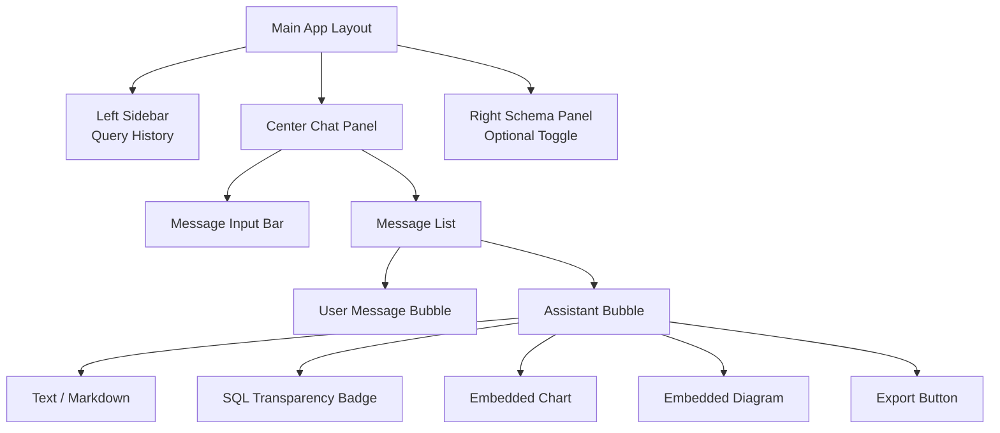
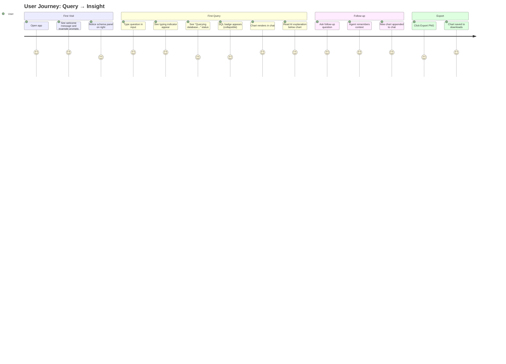

# 08 — UI/UX Plan
## iTech AI Innovation Hackathon 2026

---

## 1. Design Philosophy

The UI must feel like a polished, production-grade product — not a hackathon prototype. Judges evaluate UX at 15% weight. Key principles:

- **Familiar:** Users recognize a ChatGPT-like interface instantly — no learning curve
- **Streaming-first:** Every response streams token-by-token (no waiting for full response)
- **Visualization-native:** Charts and diagrams live inside chat bubbles, not in a separate panel
- **Dark theme:** Professional look; matches developer tools and data dashboards

**Color System:**
```
Background:    #0f0f13 (near black)
Surface:       #1a1a24 (dark card)
Border:        #2a2a3a
Primary:       #6366f1 (indigo)
Text Primary:  #f1f0ff
Text Muted:    #8b8ba7
Success:       #22c55e
Error:         #ef4444
Chart Palette: #6366f1 #8b5cf6 #06b6d4 #10b981 #f59e0b
```

---

## 2. Screen Map



---

## 3. Every Screen

### 3.1 Main Layout (Desktop)

```
┌─────────────────────────────────────────────────────────────────┐
│  ┌──────────────┐  ┌──────────────────────────────┐  ┌────────┐│
│  │   SIDEBAR    │  │        CHAT PANEL            │  │SCHEMA  ││
│  │              │  │                              │  │PANEL   ││
│  │ DataFlow AI  │  │  ┌─────────────────────────┐ │  │        ││
│  │ ──────────── │  │  │   Welcome Message       │ │  │tables: ││
│  │ 📋 History   │  │  └─────────────────────────┘ │  │ orders ││
│  │              │  │                              │  │ prod.. ││
│  │ > Top 5 prod │  │  ┌──────────────────────── ┐ │  │ cust.. ││
│  │ > ER Diagram │  │  │  [User] Show me top 5   │ │  │        ││
│  │ > Revenue Q3 │  │  └─────────────────────────┘ │  └────────┘│
│  │              │  │  ┌─────────────────────────┐ │            │
│  │              │  │  │  [AI] Here are the top  │ │            │
│  │              │  │  │  ┌─────────────────────┐│ │            │
│  │              │  │  │  │ 💾 SQL: SELECT ...  ││ │            │
│  │              │  │  │  └─────────────────────┘│ │            │
│  │              │  │  │  ┌─────────────────────┐│ │            │
│  │              │  │  │  │   [BAR CHART]       ││ │            │
│  │              │  │  │  └─────────────────────┘│ │            │
│  │              │  │  │  Revenue led by Prod A  │ │            │
│  │              │  │  │  ⬇ Export PNG  📋 CSV  │ │            │
│  │              │  │  └─────────────────────────┘ │            │
│  │              │  │                              │            │
│  │              │  │  ┌─────────────────────────────────────┐  │
│  │              │  │  │  Ask anything about your data...    │  │
│  │              │  │  │                          [Send ▶]   │  │
│  │              │  │  └─────────────────────────────────────┘  │
│  └──────────────┘  └──────────────────────────────┘            │
└─────────────────────────────────────────────────────────────────┘
```

---

## 4. Every Component

### 4.1 `ChatContainer.tsx`
- Full height flex column
- Overflow-y scroll on message list
- Auto-scrolls to bottom on new message
- Keyboard shortcut: `Enter` sends, `Shift+Enter` newline

### 4.2 `MessageBubble.tsx`
Two variants:
- **User:** Right-aligned, indigo background, white text, no avatar
- **Assistant:** Left-aligned, dark surface card, avatar icon (sparkle emoji), markdown rendered

Props:
```typescript
interface IMessage {
  id: string;
  role: "user" | "assistant";
  content: string;           // Markdown text
  charts?: IChartPayload[];  // Embedded charts
  diagrams?: IDiagramPayload[];
  sql?: string;              // SQL transparency
  timestamp: Date;
  isStreaming?: boolean;     // Show blinking cursor
}
```

### 4.3 `MessageInput.tsx`
- Auto-resize textarea (min 1 row, max 5 rows)
- Send button with arrow icon
- Disabled + spinner while agent is processing
- Placeholder: "Ask anything about your data..."
- Character counter at 500+ chars

### 4.4 `TypingIndicator.tsx`
- Three animated dots (pulsing)
- Shows tool name: "🔍 Querying database..." | "📊 Generating chart..."
- Appears immediately when user sends message
- Disappears when first token arrives

### 4.5 `SQLBadge.tsx` (Bonus Feature)
- Collapsible panel inside assistant bubble
- Toggle: `💾 Show SQL` / `Hide SQL`
- Syntax-highlighted SQL code block (`highlight.js` or `prism`)
- Copy button top-right corner

### 4.6 `ChartRenderer.tsx`
- Detects `chart_type` from payload and renders correct Recharts component
- Responsive container wrapper (100% width, 300px height)
- Tooltip on hover
- Legend below chart

### 4.7 `DiagramRenderer.tsx`
- Renders Mermaid string via `@mermaid-js/mermaid-react`
- Error boundary: if Mermaid fails to parse, show raw code in monospace
- Zoom-in button for large diagrams

### 4.8 `QueryHistory.tsx` (Sidebar)
- List of previous queries (stored in `localStorage`)
- Click to re-run query
- Delete icon per item
- "Clear All" button at bottom

### 4.9 `ExportButton.tsx` (Bonus)
- Two actions: "Export PNG" | "Export CSV"
- PNG: uses `html2canvas` on chart div
- CSV: triggers download from `/api/export/csv`

---

## 5. User Flow



---

## 6. Wireframe Descriptions

### 6.1 Welcome State
- Center of chat: large sparkle icon + "DataFlow AI" heading
- Subtitle: "Ask questions about your data in plain English"
- 3 example prompt chips:
  - "Show top 5 products by revenue 📊"
  - "Draw the database ER diagram 🗂"
  - "What's this quarter's revenue trend? 📈"

### 6.2 Loading State
- Input disabled
- Send button shows spinner
- TypingIndicator shows current tool: "🔍 Reading schema..." → "⚡ Running query..." → "📊 Building chart..."

### 6.3 Chart Message State
- SQL Badge (collapsed by default) at top of assistant bubble
- Chart (300px tall) centered in bubble
- Text explanation below chart in markdown
- Export row at bottom: `⬇ PNG` | `📋 CSV`

### 6.4 Error State
- Red-bordered bubble
- Error icon (⚠️) + friendly message: "I couldn't find a table called 'prodcts'. Did you mean 'products'?"
- Retry button if applicable

### 6.5 Diagram State
- Mermaid diagram rendered in a bordered card
- "Full Screen" icon top-right for large ER diagrams
- Download as SVG button

---

## 7. Responsive Design

| Breakpoint | Layout |
|-----------|--------|
| Desktop (>1024px) | 3-column: sidebar + chat + schema |
| Tablet (768–1024px) | 2-column: chat + schema (sidebar hidden, accessible via hamburger) |
| Mobile (<768px) | 1-column: chat only (sidebar + schema in bottom sheet) |

---

## 8. Accessibility
- All interactive elements have `aria-label`
- Color contrast ratio ≥ 4.5:1 for all text
- Keyboard navigable (Tab through input → send → history)
- Screen reader: assistant messages have `role="article"` + `aria-live="polite"` for streaming
- Focus trap in modal dialogs

---

## 9. Loading States per Component

| Component | Loading State |
|-----------|--------------|
| MessageInput | Disabled + spinner icon |
| TypingIndicator | Animated 3 dots + tool name label |
| ChartRenderer | Skeleton placeholder (grey animated bar) |
| DiagramRenderer | "Rendering diagram..." text |
| QueryHistory | Skeleton list items |
| ExportButton | "Exporting..." text + spinner |
