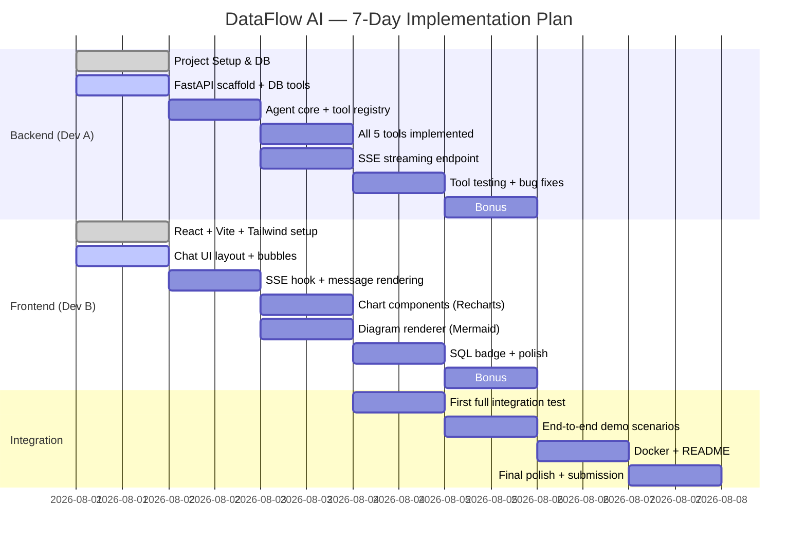

# 09 — Implementation Plan
## iTech AI Innovation Hackathon 2026

---

## 1. Timeline Overview

**Duration:** 7 days (Aug 1–7, 2026)  
**Team:** Developer A (Backend/Agent) + Developer B (Frontend/UI)  
**Goal:** Shippable, demo-ready product by Day 6 EOD; Day 7 = buffer + submission



---

## 2. Module Priorities

| Priority | Module | Owner | Reason |
|----------|--------|-------|--------|
| P0 | FastAPI server + `/api/chat` endpoint | Dev A | Everything depends on this |
| P0 | React chat UI + SSE hook | Dev B | Core demo interface |
| P1 | `get_schema` tool | Dev A | First tool Claude always calls |
| P1 | `execute_query` tool | Dev A | Core data retrieval |
| P1 | Chart components (Bar, Line, Pie) | Dev B | Required by judging criteria |
| P2 | `generate_chart` tool | Dev A | Bridges DB data to frontend charts |
| P2 | `generate_flowchart` tool | Dev A | Required diagram generation |
| P2 | Mermaid diagram renderer | Dev B | Required diagram display |
| P2 | `explain_data` tool | Dev A | Completes tool suite |
| P3 | SQL Transparency badge | Dev B | Bonus + architecture score |
| P3 | Query history panel | Dev B | Bonus feature |
| P3 | Export (PNG/CSV) | Dev A + B | Bonus feature |
| P4 | Docker + docker-compose | Dev A | Submission requirement |
| P4 | README | Both | Submission requirement |

---

## 3. Day-by-Day Milestones

### Day 1 (Aug 1) — Foundation
**Dev A:**
- [ ] Initialize backend repo (`fastapi`, `aiosqlite`, `anthropic`, `python-dotenv`)
- [ ] Connect to provided SQLite DB — verify schema
- [ ] Implement `get_schema` tool (complete + tested)
- [ ] Implement `execute_query` tool (complete + tested with validator)
- [ ] Stub `/api/chat` endpoint (returns hardcoded SSE)

**Dev B:**
- [ ] Initialize frontend (`npm create vite@latest` with React + TypeScript)
- [ ] Install Tailwind CSS, Recharts, Mermaid
- [ ] Build `ChatContainer` + `MessageBubble` layout
- [ ] Build `MessageInput` component
- [ ] Wire SSE hook (`useChat.ts`) to `/api/chat`

**Day 1 Milestone:** Backend returns schema from real DB. Frontend chat layout renders with mock messages.

---

### Day 2 (Aug 2) — Agent Core
**Dev A:**
- [ ] Implement `AgentOrchestrator` with Claude API integration
- [ ] Tool registry (`TOOL_MAP` + `execute_tool`)
- [ ] Multi-turn message history management (`session.py`)
- [ ] System prompt finalized
- [ ] Claude correctly calls `get_schema` → `execute_query` for simple queries

**Dev B:**
- [ ] SSE parsing logic: handle `token`, `chart`, `diagram`, `sql`, `done` event types
- [ ] `TypingIndicator` with tool-name display
- [ ] Markdown rendering in `MessageBubble` (use `react-markdown`)
- [ ] Auto-scroll behavior

**Day 2 Milestone:** End-to-end: user types "Show me all products" → backend streams → frontend shows text response.

---

### Day 3 (Aug 3) — Tools + Visualization
**Dev A:**
- [ ] Implement `generate_chart` tool
- [ ] Implement `generate_flowchart` tool (ER + flowchart)
- [ ] Implement `explain_data` tool
- [ ] SSE streaming emits `chart` and `diagram` events correctly

**Dev B:**
- [ ] `ChartRenderer.tsx` — detects chart type, renders correct Recharts component
- [ ] `BarChart.tsx`, `LineChart.tsx`, `PieChart.tsx`, `ScatterChart.tsx`
- [ ] `DiagramRenderer.tsx` — renders Mermaid strings
- [ ] Charts embed inside `MessageBubble`

**Day 3 Milestone:** Agent generates a bar chart from a revenue query. ER diagram renders from schema.

---

### Day 4 (Aug 4) — Integration + Polish
**Dev A + Dev B:**
- [ ] Full integration test: 3 demo scenarios from problem statement
  - Use Case 1: Top 5 products + trend line
  - Use Case 2: ER diagram + "which tables relate to customers?"
  - Use Case 3: Order flow flowchart
- [ ] Fix all integration bugs
- [ ] Dev A: Error handling in all tools; graceful LLM recovery prompts
- [ ] Dev B: Error bubble UI; loading skeleton for charts; SQL badge (collapsible)

**Day 4 Milestone:** All 3 demo scenarios work end-to-end without errors.

---

### Day 5 (Aug 5) — Bonus Features
**Dev A:**
- [ ] `/api/export/csv` endpoint
- [ ] Query history API or frontend-only localStorage
- [ ] Scatter plot support in `generate_chart`

**Dev B:**
- [ ] `QueryHistory.tsx` sidebar (localStorage)
- [ ] `ExportButton.tsx` — PNG (html2canvas) + CSV
- [ ] `SQLBadge.tsx` — collapsible with syntax highlight
- [ ] Welcome screen with example prompt chips

**Day 5 Milestone:** SQL transparency, export, and query history all functional.

---

### Day 6 (Aug 6) — Docker + README + Demo Prep
**Dev A:**
- [ ] `backend/Dockerfile`
- [ ] `docker-compose.yml` (backend + frontend)
- [ ] `.env.example` with all required variables
- [ ] README.md: setup instructions, architecture summary, tool docs

**Dev B:**
- [ ] `frontend/Dockerfile`
- [ ] Final UI polish: fonts, spacing, color consistency
- [ ] Demo scenario rehearsal — scripted conversation flows
- [ ] Record 3–5 minute demo video walkthrough

**Day 6 Milestone:** `docker-compose up` brings full stack. README passes "5-minute setup test."

---

### Day 7 (Aug 7) — Buffer + Submission
- [ ] Final bug fixes only
- [ ] Push to Git repository (clean commit history)
- [ ] Submit: source code link + demo video + README
- [ ] Local demo environment ready for judging

---

## 4. Dependencies

```mermaid
flowchart TD
    DB_SETUP[DB Connected] --> SCHEMA_TOOL[get_schema Tool]
    DB_SETUP --> QUERY_TOOL[execute_query Tool]
    SCHEMA_TOOL & QUERY_TOOL --> AGENT_CORE[Agent Orchestrator]
    AGENT_CORE --> CHART_TOOL[generate_chart Tool]
    AGENT_CORE --> FLOW_TOOL[generate_flowchart Tool]
    AGENT_CORE --> EXPLAIN_TOOL[explain_data Tool]
    AGENT_CORE --> SSE_ENDPOINT[/api/chat SSE]
    
    REACT_SETUP[React + Vite] --> CHAT_UI[Chat Layout]
    CHAT_UI --> SSE_HOOK[useChat SSE Hook]
    SSE_HOOK --> SSE_ENDPOINT
    
    SSE_HOOK --> CHART_RENDER[ChartRenderer]
    SSE_HOOK --> DIAG_RENDER[DiagramRenderer]
    CHART_TOOL --> CHART_RENDER
    FLOW_TOOL --> DIAG_RENDER
```

---

## 5. Risk Analysis

| Risk | Probability | Impact | Mitigation |
|------|------------|--------|-----------|
| Claude API rate limiting | Medium | High | Cache `get_schema` results; batch tool calls |
| SQLite schema differs from expected | Low | High | `get_schema` auto-discovers — not hardcoded |
| Mermaid rendering fails for complex diagrams | Medium | Medium | Error boundary; fallback to raw code |
| SSE streaming not working in browser | Low | High | Test Day 2 milestone early; fallback to polling |
| Tool loop infinite recursion | Low | High | `MAX_TOOL_ITERATIONS = 8` hard cap |
| CORS issues between frontend/backend | Low | Medium | Configured from Day 1; test on Day 2 |
| Demo DB not provided on time | Low | High | Create sample SQLite DB from schema in 04_DatabaseDesign.md |
| Docker build fails during submission | Medium | Medium | Test `docker-compose up` on Day 6 |

---

## 6. Estimated Completion Times

| Module | Dev | Estimate |
|--------|-----|----------|
| `get_schema` tool | A | 2 hours |
| `execute_query` tool | A | 3 hours |
| `generate_chart` tool | A | 2 hours |
| `generate_flowchart` tool | A | 3 hours |
| `explain_data` tool | A | 1 hour |
| Agent orchestrator | A | 6 hours |
| SSE endpoint | A | 2 hours |
| Chat UI layout | B | 4 hours |
| SSE hook + parsing | B | 3 hours |
| Chart components | B | 5 hours |
| Diagram renderer | B | 2 hours |
| SQL badge + polish | B | 2 hours |
| Bonus features | A+B | 6 hours |
| Docker + README | A | 3 hours |
| **Total** | | **~44 hours across 2 devs** |

---

## 7. Critical Path

```
Day 1: DB + FastAPI scaffold → get_schema + execute_query
       ↓
Day 2: Agent orchestrator → Claude integration → SSE streaming
       ↓
Day 3: generate_chart + generate_flowchart → Frontend chart rendering
       ↓
Day 4: Full integration test → All 3 demo scenarios working
       ↓
Day 5: Bonus features (SQL transparency is highest priority)
       ↓
Day 6: Docker + README + Demo video
       ↓
Day 7: Submission
```

**If behind schedule:** Cut bonus features on Day 5. Core functionality (Days 1–4) is non-negotiable for the 30% functionality score.
